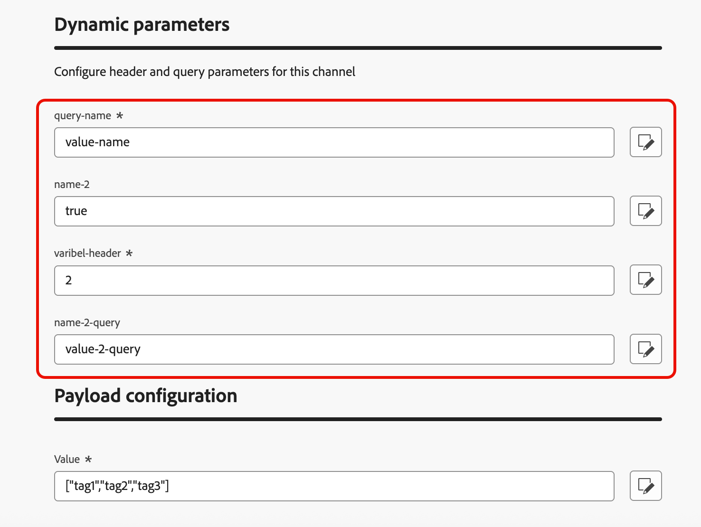

# Creare una configurazione dei canali {#create-channel-config}

Una configurazione di canale collega il canale personalizzato a un predefinito riutilizzabile denominato selezionato dagli addetti al marketing durante la creazione di campagne e percorsi.

Per creare una configurazione di canale per un canale personalizzato, segui la procedura riportata di seguito.

1. Vai a **[!UICONTROL Amministrazione]** > **[!UICONTROL Canali]** > **[!UICONTROL Configurazioni canale]** e fai clic su **[!UICONTROL Crea configurazione canale]**. Ulteriori informazioni sulla [creazione di una configurazione di canale](../configuration/channel-surfaces.md).

1. Dall&#39;elenco a discesa **[!UICONTROL Seleziona canale]**, seleziona uno dei canali personalizzati attivati.

   {width="100%"}

1. Se il canale selezionato utilizza l&#39;autenticazione (il tipo non è **None**), viene visualizzato il campo **[!UICONTROL Credenziali API]**. Seleziona le credenziali da utilizzare per questa configurazione. [Ulteriori informazioni sulle credenziali API](custom-channel-api-credentials.md)

   {width="100%"}

1. Se hai impostato i sottodomini per i canali personalizzati in [!DNL Journey Optimizer], puoi selezionare un sottodominio delegato da utilizzare per il tracciamento dei collegamenti presenti nel payload per questa configurazione. [Scopri come delegare un sottodominio](custom-channel-subdomains.md)

1. Se il canale selezionato contiene intestazioni o parametri di query [definiti come variabile](create-custom-channel.md#endpoint-configuration) per l&#39;URL dell&#39;endpoint, viene visualizzata la sezione **[!UICONTROL Parametri dinamici]**.

   Immettete il valore di ciascun parametro. Puoi utilizzare l’editor di personalizzazione per inserire valori dinamici (ad esempio, un identificatore utente risolto dal profilo). Questo ti consente di personalizzare la richiesta per ogni destinatario in base ai suoi dati di profilo.

   {width="100%"}

1. Se nel canale personalizzato sono presenti campi di payload con la casella di controllo **[!UICONTROL Configurazione canale]** abilitata, tali campi vengono visualizzati nella sezione **[!UICONTROL Configurazione payload]**. [Ulteriori informazioni](create-custom-channel.md#payload-configuration)

   {width="100%"}

   Configura un valore per ogni campo appropriato per questa configurazione. Ciò è utile per i campi che possono variare in base al contesto della campagna o del percorso, ad esempio le informazioni sul mittente o i modelli di messaggio.

1. Per le campagne orchestrate, completa la sezione **[!UICONTROL Dettagli di esecuzione]** per mappare le dimensioni del profilo e specificare l&#39;indirizzo di esecuzione.

   {width="80%"}

1. Fai clic su **[!UICONTROL Invia]** per salvare e attivare la configurazione del canale.

<!--
>[!CAUTION]
>
>If your organization uses approval policies, you may need to request approval before activating journeys or campaigns that use this channel configuration. [Learn more](../test-approve/gs-approval.md)
-->

## Passaggi successivi {#next-steps}

Il canale personalizzato è ora completamente configurato. Gli addetti al marketing possono iniziare a utilizzarlo per creare esperienze cliente:

* [Creare esperienze di canale personalizzate](create-custom-experience.md)
* [Verifica il tuo canale personalizzato](test-custom-channel.md)
* [Monitorare i canali personalizzati](configure-custom-channel.md)
