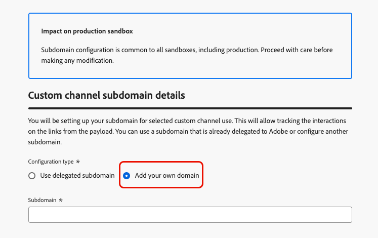

# Configurare i sottodomini del canale personalizzati {#custom-channel-subdomains}

>[!BEGINSHADEBOX]

**In questa pagina:** scopri come impostare sottodomini di canale personalizzati in Adobe Journey Optimizer per abilitare il tracciamento dei collegamenti nei messaggi, utilizzando un sottodominio delegato esistente o configurandone uno nuovo con un record DNS.

>[!ENDSHADEBOX]

>[!CONTEXTUALHELP]
>id="ajo_admin_subdomain_custom_channel"
>title="Delega un sottodominio del canale personalizzato"
>abstract="Devi configurare un sottodominio da utilizzare per i messaggi del canale personalizzati, in quanto è necessario questo sottodominio per creare una configurazione del canale personalizzata. Puoi utilizzare un sottodominio già delegato ad Adobe o configurarne uno nuovo."
>additional-url="https://experienceleague.adobe.com/en/docs/journey-optimizer/using/custom-channel/custom-channel-configuration" text="Configurare un canale personalizzato"

>[!CONTEXTUALHELP]
>id="ajo_admin_config_custom_channel_subdomain"
>title="Seleziona un sottodominio del canale personalizzato"
>abstract="Per poter creare una configurazione di canale personalizzata, accertati di aver configurato in precedenza almeno un sottodominio di canale personalizzato da scegliere dall’elenco Nome sottodominio."
>additional-url="https://experienceleague.adobe.com/en/docs/journey-optimizer/using/custom-channel/custom-channel-configuration" text="Configurare un canale personalizzato"

## Introduzione ai sottodomini di canale personalizzati {#gs-custom-channel-subdomains}

Per abilitare il tracciamento dei collegamenti nei messaggi di canale personalizzati, devi impostare il sottodominio che selezionerai quando [creerai una configurazione di canale personalizzata](custom-channel-configuration.md#subdomain-delegation).

Puoi utilizzare un sottodominio già delegato ad Adobe oppure configurare un altro sottodominio. Ulteriori informazioni sulla delega dei sottodomini ad Adobe sono disponibili in [questa sezione](../configuration/delegate-subdomain.md).

La configurazione del sottodominio del canale personalizzato è condivisa tra tutti gli ambienti. Pertanto, qualsiasi modifica a un sottodominio del canale personalizzato influisce anche su altre sandbox di produzione.

<!--
TBC
>[!NOTE]
>
>To access and edit custom channel subdomains, you must have the **[!UICONTROL Manage Custom Channel Subdomains]** permission on the production sandbox. Learn more about permissions in [this section](../administration/high-low-permissions.md).
-->
## Usa un sottodominio esistente {#custom-channel-use-existing-subdomain}

Per utilizzare un sottodominio già delegato ad Adobe, segui i passaggi seguenti.

1. Passa al menu **[!UICONTROL Amministrazione]** > **[!UICONTROL Canali]** e seleziona **[!UICONTROL Generatore canali]** > **[!UICONTROL Sottodomini]**.

   {width="100%"}

1. Fai clic su **[!UICONTROL Crea sottodominio del canale personalizzato]**.

1. Selezionare **[!UICONTROL Usa sottodominio delegato]** dalla sezione **[!UICONTROL Tipo di configurazione]**.

   {width="100%"}

1. Inserisci il prefisso che verrà visualizzato nell’URL del canale personalizzato. Sono consentiti solo caratteri alfanumerici e trattini.

   Il prefisso viene utilizzato per creare un sottodominio univoco per questo canale personalizzato. Ad esempio, se si immette `promo` e si seleziona il sottodominio `luma.com`, il sottodominio risultante sarà `promo.luma.com`.

   >[!CAUTION]
   >
   >Non utilizzare i prefissi `cdn` o `data` perché sono riservati per uso interno. È inoltre necessario evitare altri prefissi limitati o riservati come `dmarc` o `spf`.

1. Seleziona un sottodominio delegato dall’elenco.

   Non puoi selezionare un sottodominio già utilizzato come sottodominio del canale personalizzato.

   >[!CAUTION]
   >
   >Se si seleziona un dominio delegato ad Adobe utilizzando il metodo [CNAME](../configuration/delegate-subdomain.md#cname-subdomain-setup), è necessario creare il record DNS nella piattaforma di hosting. Per generare il record DNS, il processo è lo stesso di quando si configura un nuovo sottodominio del canale personalizzato. Scopri come in [questa sezione](#custom-channel-configure-new-subdomain).

1. Fai clic su **[!UICONTROL Invia]**.

1. Dopo l&#39;invio, il sottodominio viene visualizzato nell&#39;elenco con lo stato **[!UICONTROL Elaborazione]**. Per ulteriori informazioni sugli stati dei sottodomini, consulta [questa sezione](../configuration/delegate-subdomain.md#access-delegated-subdomains).

   Prima di poter utilizzare il sottodominio per l&#39;invio di messaggi, è necessario attendere che Adobe esegua i controlli richiesti, che possono richiedere **fino a 4 ore**.

1. Una volta completati i controlli, il sottodominio ottiene lo stato **[!UICONTROL Completato]**. È pronto per essere utilizzato per creare configurazioni di canale personalizzate.

## Configurare un nuovo sottodominio {#custom-channel-configure-new-subdomain}

>[!CONTEXTUALHELP]
>id="ajo_admin_custom_channel_subdomain_dns"
>title="Generare il record DNS corrispondente"
>abstract="Per configurare un nuovo sottodominio del canale personalizzato, è necessario copiare le informazioni del server dei nomi Adobe visualizzate nell’interfaccia di Journey Optimizer e incollarle nella soluzione di hosting del dominio per generare il record DNS corrispondente. Una volta che i controlli hanno avuto esito positivo, il sottodominio è pronto per essere utilizzato per creare configurazioni di canale personalizzate."

Per configurare un nuovo sottodominio, segui i passaggi indicati di seguito.

1. Passa al menu **[!UICONTROL Amministrazione]** > **[!UICONTROL Canali]**, quindi seleziona **[!UICONTROL Generatore canali]** > **[!UICONTROL Sottodomini]**.

1. Fai clic su **[!UICONTROL Crea sottodominio del canale personalizzato]**.

1. Seleziona **[!UICONTROL Aggiungi il tuo dominio]** dalla sezione **[!UICONTROL Tipo di configurazione]**.

   {width="70%"}

1. Specifica il sottodominio da delegare.

   >[!CAUTION]
   >
   >* Non puoi utilizzare un sottodominio del canale personalizzato esistente.
   >
   >* Nei sottodomini non sono consentite lettere maiuscole.

   Non è consentito delegare un sottodominio non valido ad Adobe. Assicurati di immettere un sottodominio valido di proprietà della tua organizzazione, ad esempio marketing.yourcompany.com.

   Sono supportati i sottodomini a più livelli (dello stesso dominio padre). Ad esempio, puoi utilizzare &quot;custom.marketing.yourcompany.com&quot;.

1. Viene visualizzato il record da inserire nei server DNS. Copia questo record o scarica un file CSV, quindi accedi alla soluzione di hosting del tuo dominio per generare il record DNS corrispondente.

1. Assicurati che il record DNS sia stato generato nella soluzione di hosting del dominio. Se tutto è configurato correttamente, seleziona la casella &quot;Confermo...&quot;, quindi fai clic su **[!UICONTROL Invia]**.

   

   Quando configuri un nuovo sottodominio del canale personalizzato, questo punta sempre a un record CNAME.

1. Una volta inviata la delega del sottodominio, il sottodominio viene visualizzato nell&#39;elenco con lo stato **[!UICONTROL Elaborazione]**. Per ulteriori informazioni sugli stati dei sottodomini, consulta [questa sezione](../configuration/delegate-subdomain.md#access-delegated-subdomains).

Prima di utilizzare un sottodominio per inviare messaggi del canale personalizzati, devi attendere che Adobe esegua i controlli richiesti, che possono richiedere fino a 4 ore. Una volta completati i controlli, il sottodominio ottiene lo stato **[!UICONTROL Completato]**. È pronto per essere utilizzato per creare configurazioni di canale personalizzate.

Se non riesci a creare il record di convalida nella soluzione di hosting, il sottodominio verrà contrassegnato come **[!UICONTROL Non riuscito]**.

<!--

Any specific guardrails to add? If so, can we link to email subdomain guardrails? journey-optimizer.en/help/using/configuration/delegate-subdomain.md#guardrails

Otherwise use the following from SMS subdomains?

## Guardrails {#guardrails}

Currently, the [!DNL Journey Optimizer] user interface does not support the deletion or undelegation of custom channel subdomains once they have been set up.

However, when testing features within [!DNL Journey Optimizer], it may be necessary to create a custom channel subdomain. Once the testing is complete, this can lead to cluttered environments with unnecessary configurations as the UI does not allow for removing or undelegating custom channel subdomains.

Here are some recommended steps and considerations:

* As a best practice, maintain a tidy environment by only creating necessary components and configurations.
* In situations where there is a business impact, contact your Adobe representative who may be able to assist with the removal/undelegation of the custom channel subdomain. [Learn more](#undelegate-subdomain)
* If further assistance is required, reach out to Adobe for guidance on managing your instance effectively.

## Undelegate a subdomain {#undelegate-subdomain}

If you wish to undelegate a custom channel subdomain, reach out to your Adobe representative with the subdomain you want to undelegate.

If the custom channel subdomain points to a CNAME record, you can delete the CNAME DNS record that you created for the custom channel subdomain from your hosting solution (but do not delete the original email subdomain if any).

>[!NOTE]
>
>A custom channel subdomain can point to a CNAME record because it was either an [existing subdomain](#custom-channel-use-existing-subdomain) delegated to Adobe using the [CNAME method](../configuration/delegate-subdomain.md#cname-subdomain-setup), or a [new custom channel subdomain](#custom-channel-configure-new-subdomain) that you configured.

After your request is handled by Adobe, the undelegated domain is no longer displayed on the subdomain inventory page.
-->

## Passaggi successivi {#next-steps}

* [Crea una configurazione di canale](custom-channel-configuration.md) per collegare il tuo canale personalizzato a un sottodominio, alle credenziali e ai valori predefiniti di payload che gli addetti al marketing selezioneranno nelle campagne e nei percorsi.
