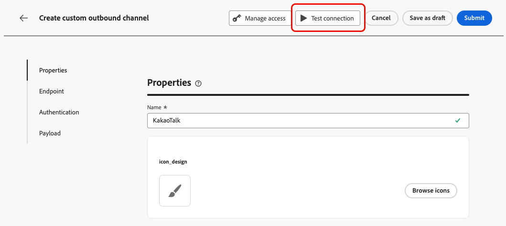
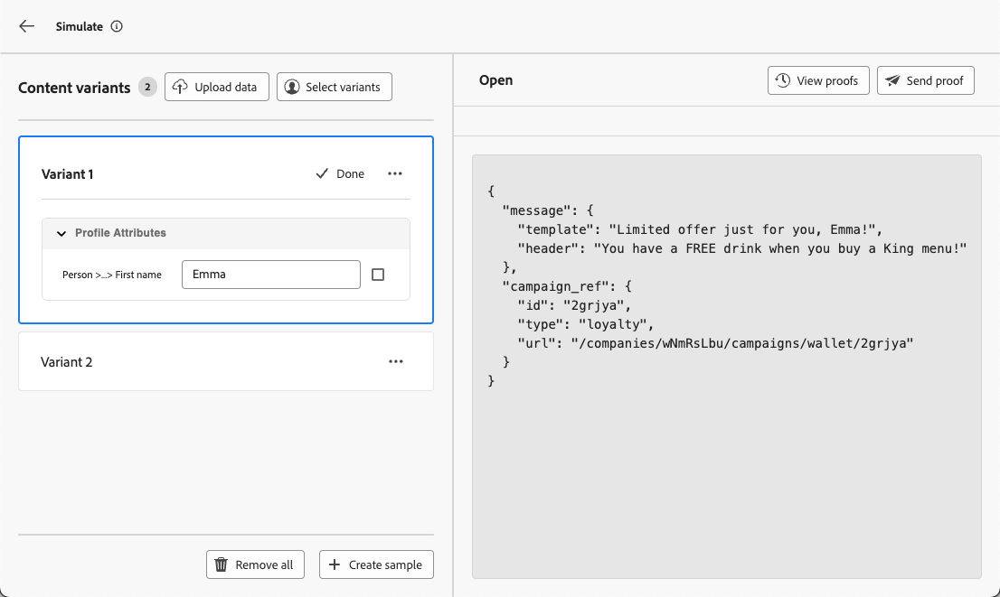

# Verifica il tuo canale personalizzato {#test-custom-channel}

>[!BEGINSHADEBOX]

**In questa pagina:** scopri come convalidare il tuo canale personalizzato prima della pubblicazione testando la connessione dell&#39;endpoint dal Channel Builder, simulando contenuti con profili di test e inviando bozze.

>[!ENDSHADEBOX]

Prima di attivare un percorso o una campagna che utilizza un canale personalizzato, verifica che l’endpoint sia raggiungibile, che l’autenticazione funzioni e che i token di personalizzazione vengano risolti correttamente per i profili di destinazione.

## Verificare la connessione dal Channel Builder {#test-connection}

Mentre un canale personalizzato si trova nello stato **[!UICONTROL Bozza]**, utilizza il pulsante **[!UICONTROL Prova]** nel Generatore canali per inviare una richiesta di test all&#39;endpoint e convalidare la connessione end-to-end prima dell&#39;attivazione. [Ulteriori informazioni](create-custom-channel.md#test-connection)

{width="70%"}

Questo test conferma:

* L&#39;endpoint è raggiungibile dagli IP in uscita di [!DNL Journey Optimizer].
* Le credenziali di autenticazione configurate sono valide.
* L’endpoint restituisce una risposta HTTP 2xx.

Controlla i registri del sistema esterno per verificare che la richiesta di test sia stata ricevuta con le intestazioni e la struttura del payload previste.

## Anteprima e test della tua esperienza di canale personalizzata {#preview-test}

Dopo aver creato un’esperienza di canale personalizzata, puoi convalidare la consegna end-to-end di contenuti personalizzati prima di attivare un percorso o una campagna.

Utilizza le seguenti funzioni per visualizzare in anteprima e testare il payload del canale personalizzato e verificare l’esperienza end-to-end.

### Simulare il contenuto con profili di test {#simulate-content}

La funzione **[!UICONTROL Simula contenuto]** risolve le espressioni di personalizzazione rispetto ai profili di test, in modo da poter verificare l&#39;esatto payload che verrebbe inviato prima che venga recapitato qualsiasi messaggio reale.

1. Dalla schermata Azione di percorso o Modifica campagna, fai clic su **[!UICONTROL Simula contenuto]**.

1. Fare clic su **[!UICONTROL Aggiungi profilo di test]** e selezionare uno o più profili. [Scopri come creare i profili di test](../audience/creating-test-profiles.md)

1. Rivedi il payload risolto nel pannello di anteprima. Per ciascun profilo di test, verifica:

   * Tutti i token di personalizzazione (ad esempio, `{{profile.person.name.firstName}}`) sono stati sostituiti con i valori previsti dal profilo.
   * Non rimangono token non risolti (visualizzati come stringhe vuote o sintassi letterale `{{...}}`).
   * I campi payload richiesti vengono compilati.
   * Le funzioni helper producono l’output formattato previsto.

   {width="70%"}

>[!TIP]
>
>Per rilevare i casi limite, testa con più profili che rappresentano diversi segmenti di pubblico, ad esempio profili con attributi opzionali mancanti, set di caratteri non latini o valori nulli nei campi personalizzati.

Ulteriori informazioni sull&#39;anteprima e sulla verifica del contenuto in [questa sezione](../content-management/preview-test.md).

### Inviare una bozza {#send-proof}

Per convalidare la consegna end-to-end prima dell’attivazione, invia una bozza a un set di destinatari del test:

1. Nel pannello **[!UICONTROL Simula contenuto]**, passa alla scheda **[!UICONTROL Invia bozza]**.

1. Aggiungi i profili da utilizzare. È possibile caricare un file CSV con profili non definiti come profili di test in [!DNL Journey Optimizer]. Ulteriori informazioni sulla [creazione di profili di test](../audience/creating-test-profiles.md)

   {width="70%"}

1. Fai clic su **[!UICONTROL Invia bozza]**. [!DNL Journey Optimizer] chiama l&#39;endpoint esterno con il payload personalizzato per ciascun profilo selezionato.

1. Controlla il sistema esterno per verificare che siano stati ricevuti i payload della bozza. Per i canali di messaggistica (ad esempio, WeChat o Kakao Talk), verifica che il messaggio venga visualizzato sul dispositivo di destinazione o sull’app di messaggistica.

Il risultato della bozza viene visualizzato utilizzando gli stessi modelli di convalida della bozza e-mail: prima di inviare la bozza vengono visualizzati i campi obbligatori, le mancate corrispondenze dei tipi e gli errori di convalida dello schema.

Ulteriori informazioni sull&#39;invio di bozze in [questa sezione](../content-management/proofs.md)

### Prova in modalità di prova percorso {#test-journey}

Per la convalida end-to-end del percorso, attivare il percorso in **[!UICONTROL Modalità test]**:

1. Nell&#39;area di lavoro del percorso fare clic su **[!UICONTROL Test]** nell&#39;area in alto a destra.

1. Configura l’evento trigger o seleziona un profilo di test per un percorso attivato dal pubblico.

1. Fai clic su **[!UICONTROL Attiva un evento]** o consenti al profilo di entrare tramite un&#39;attività **[!UICONTROL Read Audience]**.

1. Osserva il flusso nell’area di lavoro. Quando un profilo raggiunge il nodo di azione del canale personalizzato, [!DNL Journey Optimizer] chiama l&#39;endpoint esterno con il payload personalizzato.

1. Controlla i registri del sistema esterno per verificare che la richiesta sia stata ricevuta correttamente.

1. Al termine, fai clic su **[!UICONTROL Interrompi test]**.

Ulteriori informazioni sui percorsi di test in modalità di test in [questa sezione](../building-journeys/testing-the-journey.md).

### Simulare un percorso {#simulate-journey}

La modalità **Simulazione** di [!DNL Journey Optimizer] consente di convalidare il percorso end-to-end utilizzando utenti simulati, entità temporanee simili a profili che non persistono in Adobe Experience Platform, senza richiedere profili di test predefiniti.

Per i canali personalizzati, la simulazione risolve le espressioni di personalizzazione ed esegue il rendering dell’anteprima del payload per ogni utente simulato, in modo da poter verificare che il contenuto corretto venga distribuito prima della pubblicazione.

Per simulare un percorso utilizzando un canale personalizzato:

1. Nell&#39;area di lavoro del percorso, fare clic su **[!UICONTROL Simula]** nell&#39;area in alto a destra.

1. Aggiungi gli utenti simulati manualmente o generali utilizzando l&#39;opzione **[!UICONTROL Simulazione rapida]** basata su IA.

1. Configura tutti gli eventi di ingresso richiesti, quindi attiva gli utenti simulati attraverso il percorso.

1. Quando un utente simulato raggiunge il nodo di azione del canale personalizzato, controlla il payload risolto nel pannello di anteprima per verificare che i token di personalizzazione e la struttura del payload siano corretti.

>[!NOTE]
>
>La simulazione è disponibile sia per i percorsi in bozza che per quelli live e utilizza utenti simulati temporanei che non vengono conteggiati per le quote di profilo o le chiamate endpoint reali.

Ulteriori informazioni sulla simulazione di percorso in [questa sezione](../building-journeys/simulate-journey-gs.md).

### Elenco di controllo per la preattivazione {#checklist}

Prima di attivare il percorso o la campagna, verifica quanto segue:

* Il test di connessione dal Generatore di canali è riuscito (endpoint raggiungibile, autenticazione valida).
* I payload simulati mostrano i valori previsti per tutti i profili di test.
* Nel payload non rimangono token di personalizzazione non risolti.
* Tutti i campi payload obbligatori sono compilati.
* Una bozza è stata inviata e ricevuta correttamente dal sistema esterno.
* I percorsi di errore nell’attività di azione del percorso (se configurati) gestiscono gli scenari di errore come previsto.

Una volta completato il test, procedi all’attivazione. [Scopri come](create-custom-experience.md#activate)
