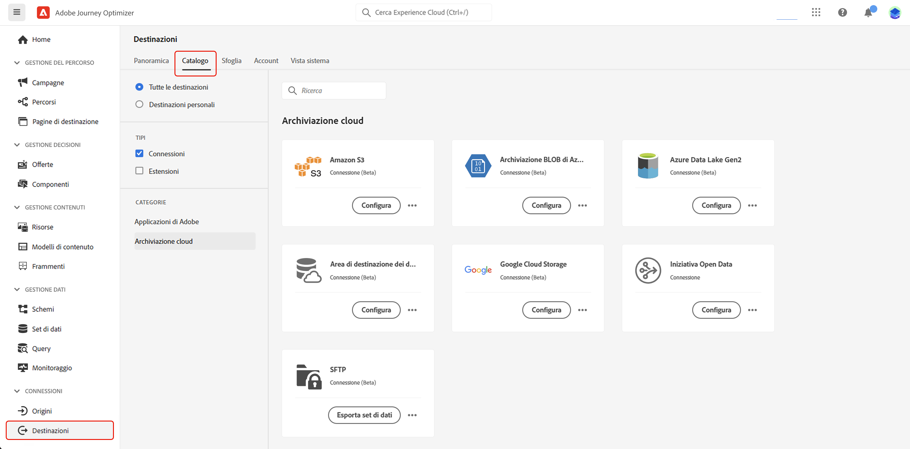
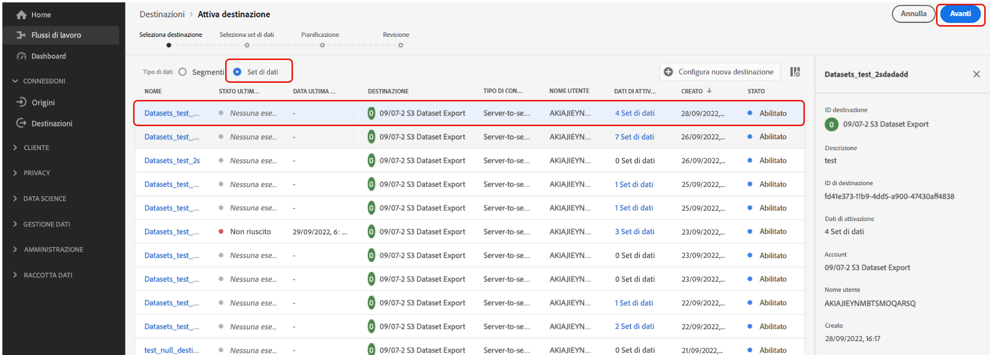
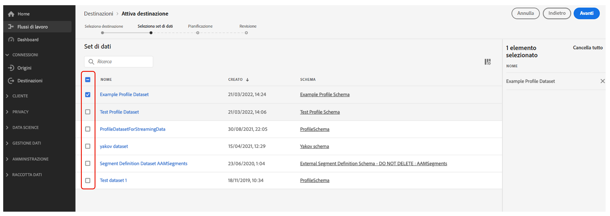
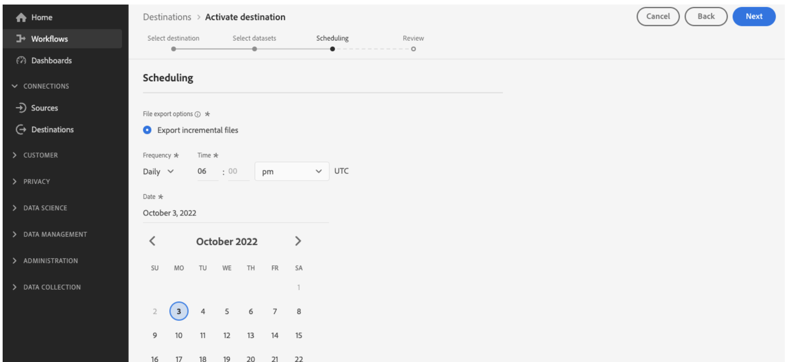

# Esportare i set di dati in posizioni di archiviazione cloud {#export-datasets}

Journey Optimizer consente di stabilire una connessione live con le posizioni di archiviazione cloud per esportare il contenuto dei set di dati.

Esportando periodicamente i dati, è possibile assicurarsi di disporre di un record completo e aggiornato delle interazioni con i clienti, rendendolo facilmente disponibile per scopi di reporting, archiviazione o analisi dei dati.

## Destinazioni di archiviazione cloud disponibili {#destinations}

Puoi esportare i set di dati in 6 destinazioni di archiviazione cloud accessibili dal menu **[!UICONTROL Destinazioni]**, nella scheda **[!UICONTROL Catalogo]**.

Informazioni dettagliate su ciascuna destinazione sono disponibili nella documentazione di Adobe Experience Platform:

* [Amazon S3](https://experienceleague.adobe.com/docs/experience-platform/destinations/catalog/cloud-storage/amazon-s3.html){target="_blank"}
* [Blob Azure](https://experienceleague.adobe.com/docs/experience-platform/destinations/catalog/cloud-storage/azure-blob.html){target="_blank"}
* [Azure Data Lake Gen 2](https://experienceleague.adobe.com/docs/experience-platform/destinations/catalog/cloud-storage/adls-gen2.html){target="_blank"}
* [Data Landing Zone](https://experienceleague.adobe.com/docs/experience-platform/destinations/catalog/cloud-storage/data-landing-zone.html){target="_blank"}
* [Google Cloud Storage](https://experienceleague.adobe.com/docs/experience-platform/destinations/catalog/cloud-storage/google-cloud-storage.html){target="_blank"}
* [SFTP](https://experienceleague.adobe.com/docs/experience-platform/destinations/catalog/cloud-storage/sftp.html){target="_blank"}.

## Prerequisiti {#prerequisites}

Per esportare i set di dati, è necessario disporre delle [autorizzazioni di controllo dell&#39;accesso](https://experienceleague.adobe.com/docs/experience-platform/access-control/home.html#permissions){target="_blank"} elencate di seguito. Leggi la [panoramica sul controllo degli accessi](https://experienceleague.adobe.com/docs/experience-platform/access-control/ui/overview.html){target="_blank"} o contatta l&#39;amministratore del prodotto per ottenere le autorizzazioni necessarie.

| Categoria | Autorizzazione |
|--|--|
| Destinazioni | Gestire e attivare le destinazioni dei set di dati |
| Gestione dati | Visualizzare i set di dati |
| Destinazioni | Visualizza destinazioni |

## Passaggi chiave per esportare i set di dati {#main-steps}

I passaggi principali per esportare un set di dati in una posizione di archiviazione cloud sono i seguenti:

Informazioni dettagliate su ciascun passaggio sono disponibili nella [documentazione di Adobe Experience Platform](https://experienceleague.adobe.com/docs/experience-platform/destinations/ui/activate/export-datasets.html){target="_blank"}.

1. **Imposta la destinazione dell&#39;archiviazione cloud**. Se non lo hai già fatto, connettiti a una destinazione di archiviazione cloud dal catalogo delle destinazioni. Scopri come creare una nuova connessione di destinazione nella [documentazione di Adobe Experience Platform](https://experienceleague.adobe.com/docs/experience-platform/destinations/ui/connect-destination.html#setup){target="_blank"}.

   <!---->

1. **Selezionare la destinazione dell&#39;archiviazione cloud** in cui esportare i set di dati. Nel catalogo delle destinazioni, fai clic sul pulsante **[!UICONTROL Esporta set di dati]** sulla scheda desiderata e seleziona la connessione da utilizzare.

   <!---->

   >[!NOTE]
   >
   >Se utilizzi Adobe Journey Optimizer insieme ai profili cliente in tempo reale, nelle schede di destinazione verrà visualizzato un pulsante **Attiva**, che consente di esportare i set di dati e attivare i tipi di pubblico per questa destinazione, a seconda delle autorizzazioni abilitate.

1. **Selezionare i set di dati** che si desidera esportare nella destinazione selezionata. [Ulteriori informazioni sui set di dati di Journey Optimizer disponibili per l&#39;esportazione](#datasets)

   <!---->

1. **Pianifica l&#39;esportazione** del set di dati. Specifica quando deve iniziare l’esportazione e con quale frequenza.

   <!---->

1. **Rivedi e conferma l&#39;esportazione** controllando il riepilogo visualizzato alla fine della configurazione.

   <!---->

Una volta completata l’esportazione, il contenuto del set di dati viene depositato nella posizione di archiviazione cloud in base alla pianificazione configurata. [Scopri come verificare l&#39;esportazione del set di dati](https://experienceleague.adobe.com/docs/experience-platform/destinations/ui/activate/export-datasets.html#verify){target="_blank"}.

## Set di dati disponibili per l’esportazione {#datasets}

Scopri dalla tabella seguente quali set di dati Journey Optimizer puoi esportare.

| Set di dati | Descrizione |
| ------- | ------- |
| Set di dati di classificazione AJO | Set di dati per l’acquisizione di eventi di feedback di applicazioni e-mail e push da Journey Optimizer. Creato tramite SDK. |
| Set di dati del servizio di consenso di AJO | Memorizza le informazioni sul consenso di un profilo. |
| Set di dati sull’evento di tracciamento e-mail di AJO | Registri di interazione per il canale e-mail utilizzato a scopo di reporting e creazione di tipi di pubblico.  |
| Set di dati di entità AJO | Set di dati per memorizzare i metadati di entità per i messaggi inviati all’utente finale.  |
| Set di dati evento attività in entrata AJO | Set di dati per canali web e inApp Journey Optimizer per eventi di consegna e interazione. |
| Set di dati profilo messaggistica interattiva AJO | Memorizza i profili creati per supportare campagne attivate da API |
| Set di dati evento feedback messaggi di AJO | Registri di consegna dei messaggi. Informazioni su tutte le consegne di messaggi da Journey Optimizer a scopo di generazione rapporti e creazione di pubblico. Anche il feedback dagli ISP dell’e-mail sui mancati recapiti viene registrato in questo set di dati. Questo set di dati include eventi per tutti i canali: e-mail, SMS/MMS, direct mailing, ecc. |
| Set di dati esportazione messaggi di AJO | Memorizza il contenuto dei messaggi e-mail e SMS inviati contrassegnati per l’esportazione. I dati vengono conservati per sette giorni di calendario dall’acquisizione. |
| Estensione dei contatori di profilo di AJO | Contiene una mappa di oggetti contenente counter_value e expiryDate, con chiave counter_id |
| Set di dati profilo push AJO | Memorizza i token di push di un profilo. |
| Set di dati evento di tracciamento push di AJO | Registri di interazione per il canale push, utilizzato a scopo di reporting e creazione di tipi di pubblico.  |
| Set di dati evento feedback destinatario secondario AJO | Inviare eventi CCN (destinatario secondario) tramite e-mail quando l’archiviazione CCN è abilitata. Per query e riconciliazione con l’e-mail inviata. |
| Set di dati superfici AJO | Set di dati vuoto relativo allo schema delle superfici in entrata di Journey Optimizer |
| AOOutputForUPSDataset | Contiene tutte le appartenenze al pubblico AO da riscrivere nel servizio Unified Profile |
| Set di dati profilo di orchestrazione pubblico | Generato dalla composizione del pubblico per i tipi di pubblico di composizione del pubblico. Contiene tutti i tipi di pubblico di composizione del pubblico, i loro attributi e i dati di arricchimento |
| Archivio oggetti decisione - Attività | noto anche come Decisioni nell’interfaccia utente di. Ma questi sono gli oggetti che un utente crea che mettono insieme tutti i blocchi predefiniti, inclusa la logica decisionale. Ad esempio, per un particolare posizionamento (posizione), quali offerte devono essere considerate (raccolta di offerte) e quale metodo di classificazione utilizzare su tali offerte. |
| Archivio oggetti decisione - Offerte di fallback | questo è l’archivio per l’altro tipo di offerta creato da un utente. In particolare, se non sono idonei a visualizzare un’offerta personalizzata e hanno bisogno di vedere qualcosa, vedranno almeno l’offerta di fallback. Questo set di dati contiene gli attributi per questo tipo di offerta |
| Archivio di oggetti decisionali - Offerte personalizzate | Archivio per un tipo di offerta creato da un utente. Questo set di dati contiene quindi gli attributi di questo tipo di offerta. |
| Archivio oggetti decisione - Posizionamenti | Archivio di oggetti che definiscono la posizione in cui deve essere visualizzata un’offerta. |
| Archivio di oggetti Experience Decisioning - Elementi di offerta personalizzati | Memorizza tutti gli elementi dell’offerta, inclusi tutti gli attributi e lo stato del ciclo di vita, per supportare la personalizzazione e il reporting tra canali diversi.   Dopo l’aggiunta di nuovi campi di attributi personalizzati allo schema dell’elemento dell’offerta, potrebbe trascorrere un’ora prima che questi nuovi attributi diventino visibili nel set di dati. Per evitare potenziali perdite di dati o incoerenze, si consiglia di attendere almeno un’ora prima di apportare modifiche o aggiornamenti che si basano sui nuovi attributi aggiunti. |
| Eventi passaggio percorso | Acquisisce tutti gli eventi di esperienza delle fasi del Percorso generati da Journey Optimizer e destinati a essere utilizzati da servizi come Reporting. |
| Percorsi | Set di dati di metadati che contiene le informazioni di ogni passaggio di un percorso |
| ODE DecisionEvents - Prod Decisioning | Ogni volta che prendiamo una decisione in base a una richiesta, la consideriamo un evento decisionale |