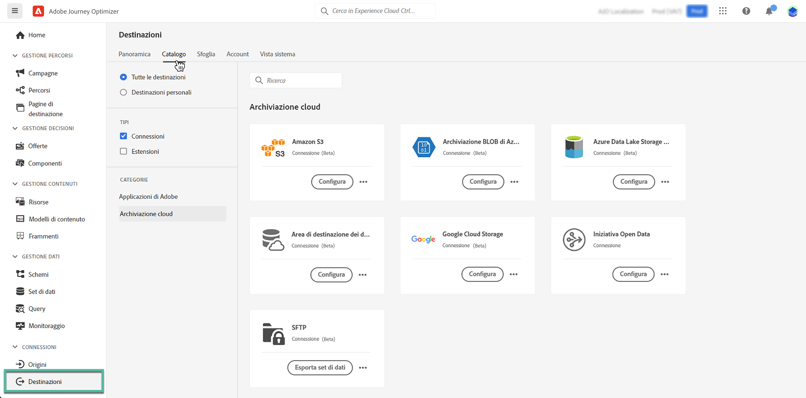

# Esporta i set di dati nelle posizioni di archiviazione cloud {#export-datasets}

Journey Optimizer consente di stabilire una connessione live con le posizioni di archiviazione cloud per esportare il contenuto dei set di dati.

Esportando periodicamente i dati, è possibile assicurarsi di disporre di un record completo e aggiornato delle interazioni con i clienti, rendendolo facilmente disponibile per scopi di reporting, archiviazione o analisi dei dati.

## Destinazioni di archiviazione cloud disponibili {#destinations}

Puoi esportare i set di dati in 6 destinazioni di archiviazione cloud accessibili dall’ **[!UICONTROL Destinazioni]** nel menu **[!UICONTROL Catalogo]** scheda.

Informazioni dettagliate su ciascuna destinazione sono disponibili nella documentazione di Adobe Experience Platform:

* [Amazon S3](https://experienceleague.adobe.com/docs/experience-platform/destinations/catalog/cloud-storage/amazon-s3.html)
* [BLOB di Azure](https://experienceleague.adobe.com/docs/experience-platform/destinations/catalog/cloud-storage/azure-blob.html)
* [Azure Data Lake Gen 2](https://experienceleague.adobe.com/docs/experience-platform/destinations/catalog/cloud-storage/adls-gen2.html)
* [Data Landing Zone](https://experienceleague.adobe.com/docs/experience-platform/destinations/catalog/cloud-storage/data-landing-zone.html)
* [Archiviazione cloud Google](https://experienceleague.adobe.com/docs/experience-platform/destinations/catalog/cloud-storage/google-cloud-storage.html)
* [SFTP](https://experienceleague.adobe.com/docs/experience-platform/destinations/catalog/cloud-storage/sftp.html)

## Set di dati disponibili per l’esportazione {#datasets}

Scopri dalla tabella seguente quali set di dati Journey Optimizer puoi esportare.

| Set di dati | Descrizione |
| ------- | ------- | 
| Set di dati evento feedback Ccn AJO | Set di dati evento feedback Ccn AJO |
| Set di dati di classificazione AJO | Set di dati per l’acquisizione di eventi di feedback di applicazioni e-mail e push da Journey Optimizer. Creato tramite SDK. |
| Set di dati del servizio di consenso AJO | Memorizza le informazioni sul consenso di un profilo. |
| Set di dati evento esperienza di tracciamento e-mail AJO | Registri di interazione per il canale e-mail utilizzato a scopo di reporting e creazione di tipi di pubblico.  |
| Set di dati di entità AJO | Set di dati per memorizzare i metadati di entità per i messaggi inviati all’utente finale.  |
| Set di dati evento attività in entrata AJO | Set di dati per canali web e inApp Journey Optimizer per eventi di consegna e interazione. |
| Set di dati profilo messaggistica interattiva AJO | Memorizza i profili creati per supportare le campagne attivate da API |
| Set di dati evento feedback messaggio AJO | Registri di consegna dei messaggi. Informazioni su tutte le consegne di messaggi da Journey Optimizer a scopo di generazione rapporti e creazione di pubblico. Anche il feedback dagli ISP dell’e-mail sui mancati recapiti viene registrato in questo set di dati. |
| Estensione contatori profilo AJO | Contiene una mappa di oggetti contenente counter_value e expiryDate, con chiave counter_id |
| Set di dati profilo push AJO | Memorizza i token di push di un profilo. |
| Set di dati evento di tracciamento push AJO | Registri di interazione per il canale push, utilizzato a scopo di reporting e creazione di tipi di pubblico.  |
| Set di dati superfici AJO | Set di dati vuoto relativo allo schema delle superfici in entrata di Journey Optimizer |
| AOOutputForUPSDataset | Contiene tutte le appartenenze al pubblico AO da riscrivere su UPS |
| Set di dati profilo di orchestrazione pubblico | Generato dalla composizione del pubblico per i tipi di pubblico di Composizione del pubblico. Contiene tutti i tipi di pubblico di Composizione del pubblico, i loro attributi e i dati di arricchimento |
| Archivio oggetti decisione - Attività | noto anche come Decisioni nell’interfaccia utente di. Ma questi sono gli oggetti che un utente crea che mettono insieme tutti i blocchi predefiniti, inclusa la logica decisionale. Ad esempio, per un particolare posizionamento (posizione), quali offerte devono essere considerate (raccolta di offerte) e quale metodo di classificazione utilizzare su tali offerte. |
| Archivio oggetti decisione - Offerte di fallback | questo è l’archivio per l’altro tipo di offerta creato da un utente. In particolare, se non sono idonei a visualizzare un’offerta personalizzata e hanno bisogno di vedere qualcosa, vedranno almeno l’offerta di fallback. Questo set di dati contiene gli attributi per questo tipo di offerta |
| Archivio di oggetti decisionali - Offerte personalizzate | questo è l’archivio per un tipo di offerta creato da un utente. Questo set di dati contiene gli attributi di questo tipo di offerta | Ultimate |
| Archivio oggetti decisione - Posizionamenti | questo è l’archivio degli oggetti che definiscono la posizione in cui deve essere visualizzata un’offerta. |
| Eventi passaggio percorso | Acquisisce tutti gli eventi di esperienza delle fasi del Percorso generati da Journey Optimizer e destinati a essere utilizzati da servizi come Reporting. |
| Percorsi | Set di dati di metadati che contiene le informazioni di ogni passaggio di un percorso |
| ODE DecisionEvents - Prod Decisioning | Ogni volta che prendiamo una decisione in base a una richiesta, la consideriamo un evento decisionale |

## Prerequisiti {#prerequisites}

Per esportare i set di dati, è necessario [autorizzazioni di controllo degli accessi](https://experienceleague.adobe.com/docs/experience-platform/access-control/home.html#permissions){target="_blank"} listed below. Read the [access control overview](https://experienceleague.adobe.com/docs/experience-platform/access-control/ui/overview.html){target="_blank"} oppure contatta l’amministratore del prodotto per ottenere le autorizzazioni necessarie.

| Categoria | Autorizzazione |
|--|--|
| Destinazioni | Gestire e attivare le destinazioni dei set di dati |
| Gestione dati | Visualizzare i set di dati |
| Destinazioni | Visualizza destinazioni |

## Passaggi chiave per esportare i set di dati {#main-steps}

I passaggi principali per esportare un set di dati in una posizione di archiviazione cloud sono i seguenti:

Informazioni dettagliate su ciascuna fase sono disponibili in [Documentazione di Adobe Experience Platform](https://experienceleague.adobe.com/docs/experience-platform/destinations/ui/activate/export-datasets.html?lang=it){target="_blank"}.

1. **Configurare la destinazione dell’archiviazione cloud**. Se non lo hai già fatto, connettiti a una destinazione di archiviazione cloud dal catalogo delle destinazioni. Scopri come creare una nuova connessione di destinazione in [Documentazione di Adobe Experience Platform](https://experienceleague.adobe.com/docs/experience-platform/destinations/ui/connect-destination.html#setup){target="_blank"}.

   <!---->

1. **Seleziona la destinazione dell’archiviazione cloud** dove desideri esportare i set di dati. Nel catalogo delle destinazioni, fai clic su **[!UICONTROL Esportare i set di dati]** sulla scheda desiderata e selezionare la connessione da utilizzare.

   <!---->

   >[!NOTE]
   >
   >Se utilizzi Adobe Journey Optimizer insieme ai profili cliente in tempo reale, le schede di destinazione visualizzeranno un **Attiva** , che consente di esportare set di dati e attivare tipi di pubblico per questa destinazione, a seconda delle autorizzazioni abilitate.

1. **Seleziona i set di dati** che desideri esportare nella destinazione selezionata. [Ulteriori informazioni sui set di dati di Journey Optimizer disponibili per l’esportazione](#datasets)

   <!---->

1. **Pianificare l’esportazione** del set di dati. Specifica quando deve iniziare l’esportazione e con quale frequenza.

   <!---->

1. **Rivedi e conferma l’esportazione** controllando il riepilogo visualizzato alla fine della configurazione.

   <!---->

Una volta completata l’esportazione, il contenuto del set di dati viene depositato nella posizione di archiviazione cloud in base alla pianificazione configurata. [Scopri come verificare l’esportazione corretta del set di dati](https://experienceleague.adobe.com/docs/experience-platform/destinations/ui/activate/export-datasets.html#verify){target="_blank"}.
