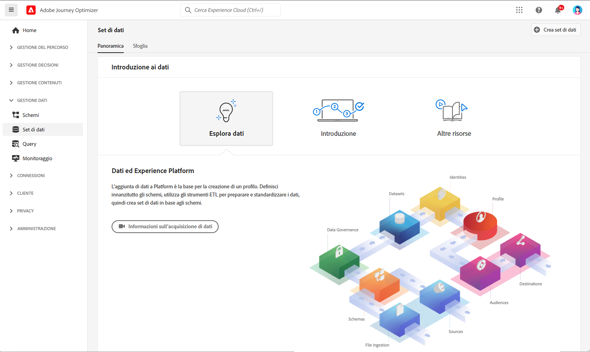
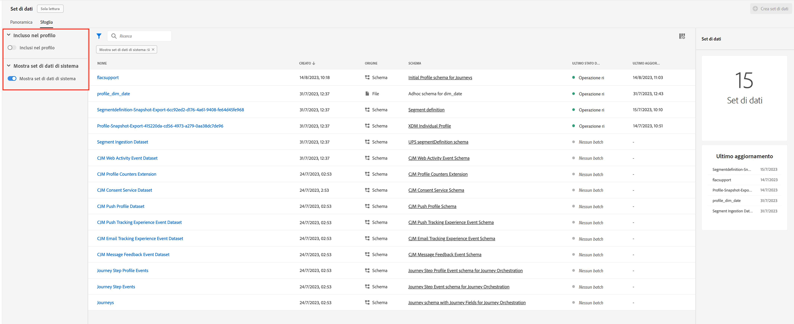
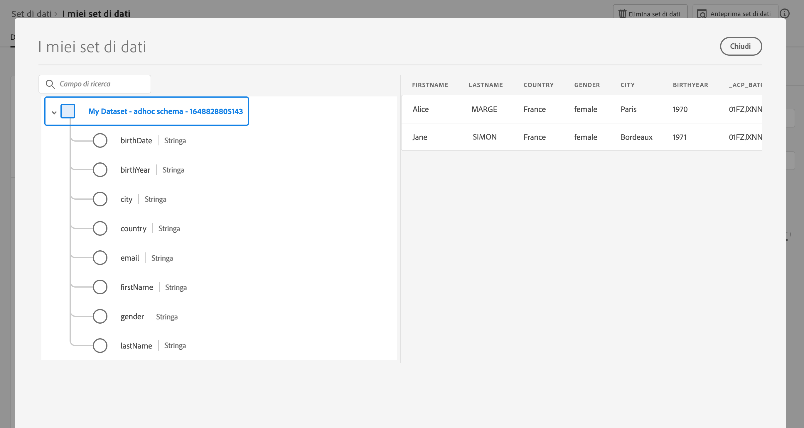

# Introduzione ai set di dati {#datasets-gs}

Tutti i dati acquisiti in Adobe Experience Platform vengono mantenuti all’interno del Data Lake come set di dati. Un set di dati è un costrutto di archiviazione e gestione per una raccolta di dati, in genere una tabella, che contiene uno schema (colonne) e dei campi (righe).

## Accedere ai set di dati{#access-datasets}

L’area di lavoro del **Set di dati** nell’[!DNL Adobe Journey Optimizer]interfaccia utente ti consente di esplorare i dati e creare set di dati.

Seleziona **Set di dati** nella navigazione a sinistra per aprire la dashboard del set di dati.

L’aggiunta di dati a [!DNL Adobe Experience Platform] è la base per la creazione di un profilo. Potrai quindi sfruttare i profili in [!DNL Adobe Journey Optimizer]. Definisci innanzitutto gli schemi, utilizza gli strumenti ETL per preparare e standardizzare i dati, quindi crea i set di dati in base agli schemi.

Seleziona la scheda **Sfoglia** per visualizzare l’elenco di tutti i set di dati disponibili per la tua organizzazione. Vengono visualizzati i dettagli di ciascun set di dati elencato, compreso il nome, lo schema a cui il set di dati aderisce e lo stato dell’esecuzione di acquisizione più recente.

Per impostazione predefinita, vengono visualizzati solo i set di dati che hai acquisito. Se desideri visualizzare i set di dati generati dal sistema, abilita il pulsante di attivazione/disattivazione **Mostra set di dati di sistema** dal filtro.

>[!NOTE]
>
>A partire dal 1° novembre 2024, la segmentazione in streaming non supporterà più l’utilizzo di eventi di invio e apertura dai set di dati di feedback e tracciamento di [!DNL Journey Optimizer]. Per implementare la quota limite o la gestione dell’affaticamento, utilizza le regole di business Ulteriori dettagli sono disponibili in [questa sezione](../conflict-prioritization/rule-sets.md), inclusa una spiegazione del caso d’uso per la limitazione giornaliera [qui](https://experienceleaguecommunities.adobe.com/t5/journey-optimizer-blogs/elevate-customer-experience-with-daily-frequency-capping-in-ajo/ba-p/761510){target="_blank"}.
>
>Inoltre, a partire da febbraio 2025, verrà introdotto un guardrail time-to-live (TTL) nei set di dati di Journey Optimizer generati dal sistema. [Ulteriori informazioni](datasets-ttl.md)

Seleziona il nome di un set di dati per accedere alla relativa schermata di attività set di dati e vedi i dettagli del set di dati selezionato. La scheda attività include un grafico che mostra il tasso di utilizzo dei messaggi e un elenco di batch con esito positivo o negativo.

I set di dati di sistema per Adobe Journey Optimizer sono elencati di seguito.

>[!CAUTION]
>
> I set di dati di sistema **non devono essere modificati**. Qualsiasi modifica viene ripristinata automaticamente ad ogni aggiornamento del prodotto.

**Generazione rapporti**

* _Generazione rapporti - Set di dati evento del feedback dei messaggi_: log di consegna dei messaggi. Informazioni su tutte le consegne di messaggi da Journey Optimizer a scopo di generazione rapporti e creazione di pubblico. Anche il feedback dagli ISP dell’e-mail sui mancati recapiti viene registrato in questo set di dati.
* _Generazione rapporti - Set di dati evento esperienza di tracciamento e-mail_: registri di interazione per il canale e-mail utilizzato a scopo di generazione rapporti e creazione di pubblico. Le informazioni memorizzate notificano le azioni eseguite dall’utente finale tramite e-mail (aperture, clic, ecc.).
* _Generazione rapporti - Set di dati evento esperienza di tracciamento push_: registri di interazione per il canale push, utilizzato a scopo di generazione rapporti e creazione di pubblico. Le informazioni memorizzate notificano le azioni eseguite dall’utente finale sulle notifiche push.
* _Generazione rapporti - Evento passaggio percorso_: acquisisce tutti gli eventi esperienza per i passaggi dei percorsi generati da Journey Optimizer per essere utilizzati da servizi come il reporting. È fondamentale anche per la creazione di rapporti in Customer Journey Analytics per l’analisi YoY. Collegato a metadati percorso.
* _Generazione rapporti - Percorsi_: set di dati di metadati che raccoglie informazioni di ogni passaggio in un percorso.
* _Generazione rapporti - Ccn_: set di dati evento di feedback che memorizza i log di consegna per le e-mail Ccn. Da utilizzare a scopo di generazione rapporti.

**Consenso**

* _Set di dati del servizio di consenso_: memorizza le informazioni sul consenso di un profilo.

**Intelligent Services**

* _Punteggi di ottimizzazione dei tempi di invio/Punteggi di coinvolgimento_: punteggi di output dell’IA per la gestione dei percorsi cliente.

Per visualizzare l’elenco completo dei campi e degli attributi di ogni schema, consulta il [dizionario dello schema di Journey Optimizer](https://experienceleague.adobe.com/tools/ajo-schemas/schema-dictionary.html?lang=it){target="_blank"}.

## Anteprima dei set di dati{#preview-datasets}

Nella schermata Attività del set di dati, seleziona **Anteprima set di dati** nell’angolo in alto a destra per visualizzare in anteprima il batch di successo più recente in questo set di dati. Quando un set di dati è vuoto, il collegamento di anteprima viene disattivato.

## Creare set di dati{#create-datasets}

Per creare un nuovo set di dati, inizia selezionando **Creare un set di dati** nella dashboard del set di dati.

Puoi eseguire le seguenti operazioni:

* Creare un set di dati da uno schema. [Ulteriori informazioni](https://experienceleague.adobe.com/docs/experience-platform/catalog/datasets/user-guide.html?lang=it#schema){target="_blank"}
* Creare un set di dati da file CSV. [Ulteriori informazioni](https://experienceleague.adobe.com/docs/experience-platform/ingestion/tutorials/map-a-csv-file.html?lang=it){target="_blank"}

In questo video, scopri come creare un set di dati, mapparlo su uno schema, aggiungervi dati e confermare che i dati sono stati acquisiti.

>[!VIDEO](https://video.tv.adobe.com/v/3416650?captions=ita&quality=12)

## Governance dei dati

In un set di dati, sfoglia la scheda **Governance dei dati** per controllare le etichette a livello di set di dati e di campo. La governance dei dati classifica i dati in base al tipo di criteri applicabili.

Una delle funzionalità principali di [!DNL Adobe Experience Platform] è quella di unire i dati provenienti da più sistemi aziendali per consentire agli addetti al marketing di identificare, comprendere e coinvolgere meglio i clienti. Questi dati possono essere soggetti a restrizioni di utilizzo definite dalla tua organizzazione o da normative legali. È quindi importante assicurarsi che le operazioni sui dati siano conformi ai criteri di utilizzo dei dati.

[!DNL Adobe Experience Platform Data Governance] consente di gestire i dati dei clienti e di garantire la conformità a normative, restrizioni e criteri applicabili all’utilizzo dei dati. Svolge un ruolo chiave all’interno di Experience Platform a vari livelli, tra cui catalogazione, derivazione dei dati, etichettatura dell’utilizzo dei dati, criteri di utilizzo dei dati e controllo dell’utilizzo dei dati per le azioni di marketing.

Ulteriori informazioni sulla governance dei dati e sulle etichette per l’utilizzo dei dati sono disponibili nella [documentazione sulla governance dei dati](https://experienceleague.adobe.com/docs/experience-platform/data-governance/labels/user-guide.html?lang=it){target="_blank"}

## Esempi e casi d’uso{#uc-datasets}

Scopri come creare uno schema, un set di dati e acquisire dati per aggiungere profili di test in Adobe Journey Optimizer con [questo campione end-to-end](../audience/creating-test-profiles.md)

Ulteriori informazioni sulla creazione di set di dati sono disponibili nella [documentazione di Adobe Experience Platform](https://experienceleague.adobe.com/docs/experience-platform/catalog/datasets/overview.html?lang=it){target="_blank"}.

Scopri come utilizzare l’interfaccia utente dei set di dati nella [documentazione sulla panoramica dell’acquisizione dei dati](https://experienceleague.adobe.com/docs/experience-platform/ingestion/home.html?lang=it){target="_blank"}.

È disponibile un elenco di casi d’uso con esempi di query [qui](../data/datasets-query-examples.md).

>[!MORELIKETHIS]
>
>* [Panoramica sull’acquisizione in streaming](https://experienceleague.adobe.com/docs/experience-platform/ingestion/streaming/overview.html?lang=it){target="_blank"}
>* [Acquisire dati in Adobe Experience Platform](https://experienceleague.adobe.com/docs/experience-platform/ingestion/tutorials/ingest-batch-data.html?lang=it){target="_blank"}
