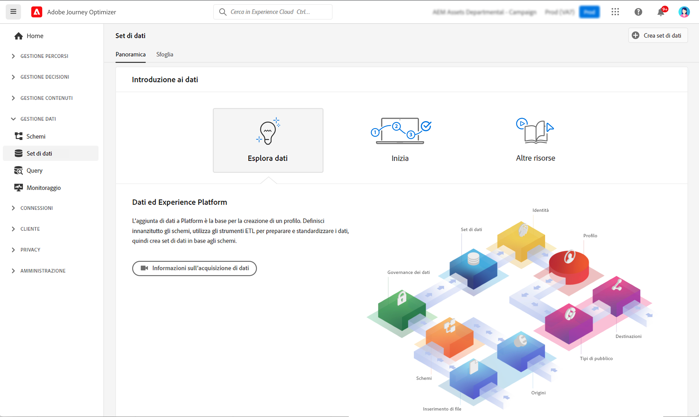

# Guida introduttiva ai set di dati {#datasets-gs}

Tutti i dati acquisiti in Adobe Experience Platform vengono memorizzati all’interno del Data Lake come set di dati. Un set di dati è un costrutto di archiviazione e gestione per una raccolta di dati, in genere una tabella, che contiene uno schema (colonne) e campi (righe).

## Accedere ai set di dati{#access-datasets}

La **Set di dati** area di lavoro [!DNL Adobe Journey Optimizer] l’interfaccia utente ti consente di esplorare i dati e creare set di dati.

Seleziona **Set di dati** nella navigazione a sinistra per aprire il dashboard Set di dati.

Aggiunta di dati a [!DNL Adobe Experience Platform] è la base per la creazione di un profilo. Potrai quindi sfruttare i profili in [!DNL Adobe Journey Optimizer]. Definisci innanzitutto gli schemi, utilizza gli strumenti ETL per preparare e standardizzare i dati, quindi crea i set di dati in base agli schemi.

Seleziona la **Sfoglia** per visualizzare l’elenco di tutti i set di dati disponibili per la tua organizzazione. Vengono visualizzati i dettagli di ciascun set di dati elencato, compreso il nome, lo schema a cui il set di dati aderisce e lo stato dell’esecuzione di acquisizione più recente.

Per impostazione predefinita, vengono visualizzati solo i set di dati in cui sono stati acquisiti. Se desideri visualizzare i set di dati generati dal sistema, abilita la **Mostra set di dati di sistema** attiva/disattiva il filtro.

Seleziona il nome di un set di dati per accedere alla relativa schermata di attività Set di dati e vedi i dettagli del set di dati selezionato. La scheda Attività include un grafico che mostra il tasso di utilizzo dei messaggi e un elenco di batch con esito positivo o negativo.

Sono disponibili diversi set di dati:

**Reporting**

* _Reporting - Set di dati evento del feedback dei messaggi_: Log di consegna dei messaggi. Informazioni su tutta la consegna dei messaggi da Journey Optimizer a scopo di reporting e creazione di segmenti. Anche il feedback dagli ISP dell’e-mail sui mancati recapiti viene registrato in questo set di dati.
* _Reporting - Set di dati evento esperienza di tracciamento e-mail_: Registri di interazione per il canale e-mail utilizzato a scopo di reporting e creazione di segmenti. Informazioni memorizzate informazioni sulle azioni eseguite dall’utente finale tramite e-mail (aperture, clic, ecc.).
* _Reporting - Dataset evento esperienza di tracciamento push_: Registri di interazione per il canale push, utilizzato a scopo di reporting e creazione di segmenti. Informazioni memorizzate informazioni sulle azioni eseguite dall&#39;utente finale sulle notifiche push.
* _Reporting - Evento passaggio del percorso_: Acquisisce tutti gli eventi esperienza del passaggio del percorso generati da Journey Optimizer per essere utilizzati da servizi come il reporting. È fondamentale anche per la creazione di rapporti in Customer Journey Analytics per l’analisi YoY. Collegato a metadati del percorso.
* _Reporting - Percorsi_: Set di dati di metadati che raccoglie informazioni di ogni passaggio di un percorso.
* _Generazione rapporti - CCN_: Set di dati evento di feedback che memorizza i registri di consegna per le e-mail CCN. Da utilizzare a scopo di reporting.

**Consenso**

* _Set di dati del servizio di consenso_: memorizza le informazioni sul consenso di un profilo.

**Intelligent Services**

* _Punteggi di ottimizzazione dei tempi di invio/Punteggi di coinvolgimento_: Punteggi di output di Journey AI.

## Anteprima dei set di dati{#preview-datasets}

Dalla schermata Attività del set di dati, seleziona **Anteprima set di dati** nell’angolo in alto a destra dello schermo per visualizzare in anteprima il batch di successo più recente in questo set di dati. Quando un set di dati è vuoto, il collegamento di anteprima viene disattivato.

## Creare set di dati{#create-datasets}

Per creare un nuovo set di dati, inizia selezionando **Creare un set di dati** nel dashboard Set di dati.

Puoi:

* Crea set di dati dallo schema. [Ulteriori informazioni in questa documentazione](https://experienceleague.adobe.com/docs/experience-platform/catalog/datasets/user-guide.html?lang=en#schema){target=&quot;_blank&quot;}
* Crea set di dati da file CSV. [Ulteriori informazioni in questa documentazione](https://experienceleague.adobe.com/docs/experience-platform/ingestion/tutorials/map-a-csv-file.html){target=&quot;_blank&quot;}

Guarda questo video per scoprire come creare un set di dati, mapparlo su uno schema, aggiungervi dati e confermare che i dati sono stati acquisiti.

>[!VIDEO](https://video.tv.adobe.com/v/334293?quality=12)

## Governance dei dati

In un set di dati, sfoglia **Governance dei dati** per controllare le etichette a livello di set di dati e di campo. Governance dei dati classifica i dati in base al tipo di criteri applicabili.

Una delle funzionalità principali di [!DNL Adobe Experience Platform] è quello di unire i dati provenienti da più sistemi aziendali per consentire agli addetti al marketing di identificare, comprendere e coinvolgere meglio i clienti. Questi dati possono essere soggetti a restrizioni di utilizzo definite dalla tua organizzazione o da normative legali. È quindi importante assicurarsi che le operazioni sui dati siano conformi ai criteri di utilizzo dei dati.

[!DNL Adobe Experience Platform Data Governance] consente di gestire i dati dei clienti e di garantire la conformità a normative, restrizioni e criteri applicabili all’utilizzo dei dati. Questa funzione svolge un ruolo chiave all’interno di Experience Platform a vari livelli, tra cui la catalogazione, la derivazione dei dati, l’etichettatura dell’utilizzo dei dati, le policy di utilizzo dei dati e il controllo dell’utilizzo dei dati per le azioni di marketing.

Ulteriori informazioni sulla governance dei dati e sulle etichette per l’utilizzo dei dati in [Documentazione sulla governance dei dati](https://experienceleague.adobe.com/docs/experience-platform/data-governance/labels/user-guide.html){target=&quot;_blank&quot;}

## Esempi e casi d’uso{#uc-datasets}

Scopri come creare uno schema, un set di dati e acquisire dati per aggiungere profili di test in Adobe Journey Optimizer in [questo campione end-to-end](../segment/creating-test-profiles.md)

Ulteriori informazioni sulla creazione di set di dati in [Documentazione di Adobe Experience Platform](https://experienceleague.adobe.com/docs/experience-platform/catalog/datasets/overview.html){target=&quot;_blank&quot;}.

Scopri come utilizzare l’interfaccia utente dei set di dati in [Panoramica sull’acquisizione dei dati](https://experienceleague.adobe.com/docs/experience-platform/ingestion/home.html){target=&quot;_blank&quot;}.

È disponibile un elenco di casi d’uso con esempi di query [qui](../data/datasets-query-examples.md).

**Vedi anche**

* [Panoramica sull’acquisizione in streaming](https://experienceleague.adobe.com/docs/experience-platform/ingestion/streaming/overview.html){target=&quot;_blank&quot;}
* [Inserire dati in Adobe Experience Platform](https://experienceleague.adobe.com/docs/experience-platform/ingestion/tutorials/ingest-batch-data.html){target=&quot;_blank&quot;}
