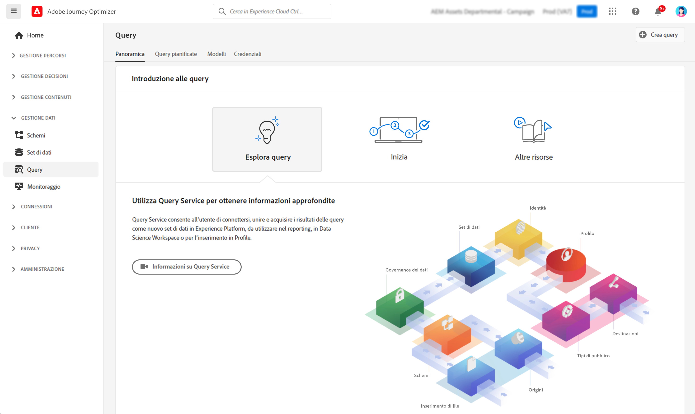

# Introduzione alle query {#queries-gs}

Query Editor è uno strumento interattivo fornito dal servizio query di Adobe Experience Platform che consente di scrivere, convalidare ed eseguire query per i dati sulla customer experience nell’interfaccia utente di [!DNL Adobe Journey Optimizer].

Query Editor supporta lo sviluppo di query per l’analisi e l’esplorazione dei dati e consente di eseguire query interattive a scopo di sviluppo e query non interattive per la compilazione di [set di dati](get-started-datasets.md).

Scopri come utilizzare Query Editor in [questa documentazione](https://experienceleague.adobe.com/docs/experience-platform/query/ui/user-guide.html?lang=it){target="_blank"}.

**Consulta anche**

* [Documentazione del servizio query](https://experienceleague.adobe.com/docs/experience-platform/query/home.html?lang=it){target="_blank"}
* [Video panoramica del servizio query](https://experienceleague.adobe.com/docs/platform-learn/tutorials/queries/understanding-query-service.html?lang=it){target="_blank"}
