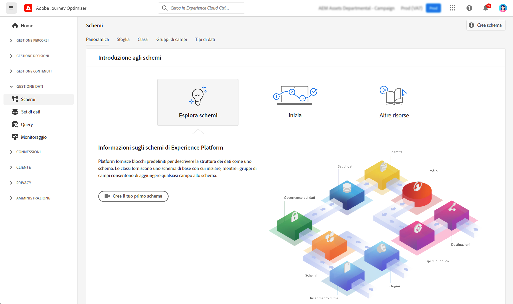

# Introduzione agli schemi {#schemas-gs}

Gli schemi sono il metodo standard per descrivere i dati in Experience Platform che consentono il riutilizzo di tutti i dati conformi agli schemi in un’organizzazione senza conflitti o anche la condivisione tra più organizzazioni.

➡️ [Scopri come creare e configurare uno schema in questo video](#video-schema) (video)

Uno schema è un set di regole che rappresentano e convalidano la struttura e il formato dei dati. A un livello avanzato, gli schemi forniscono una definizione astratta di un oggetto reale (ad esempio una persona) e delineano quali dati includere in ogni istanza di tale oggetto (ad esempio nome, cognome, compleanno e così via).

Scopri come creare gli schemi in [questa documentazione](https://experienceleague.adobe.com/docs/experience-platform/xdm/schema/composition.html?lang=it){target="_blank"}.

L’area di lavoro **Schemi** nell’interfaccia utente [!DNL Adobe Journey Optimizer] consente di gestire le risorse Experience Data Model (XDM), tra cui schemi, classi, gruppi di campi dello schema e tipi di dati. Puoi visualizzare ed esplorare le risorse di base fornite da Adobe e creare risorse e schemi personalizzati per la tua organizzazione.

Scopri come utilizzare l&#39;interfaccia utente Schemi in [questa documentazione](https://experienceleague.adobe.com/docs/experience-platform/xdm/ui/overview.html?lang=it){target="_blank"}

La documentazione dettagliata per la creazione di uno schema tramite l&#39;Editor di schema è disponibile in [documentazione di Adobe Experience Platform](https://experienceleague.adobe.com/docs/experience-platform/xdm/tutorials/create-schema-ui.html?lang=it){target="_blank"}.

Consulta il [dizionario schema Journey Optimizer](https://experienceleague.adobe.com/tools/ajo-schemas/schema-dictionary.html?lang=it){target="_blank"} per visualizzare l&#39;elenco completo dei campi e degli attributi per ogni schema.

## Video introduttivo{#video-schema}

Scopri come creare uno schema, aggiungere gruppi di campi, creare e configurare gruppi di campi personalizzati.

>[!VIDEO](https://video.tv.adobe.com/v/334461?quality=12)

>[!MORELIKETHIS]
>
>* [Creare uno schema, un set di dati e acquisire dati per aggiungere profili di test in Journey Optimizer](../audience/creating-test-profiles.md)
>* [Panoramica del sistema XDM](https://experienceleague.adobe.com/docs/experience-platform/xdm/home.html?lang=it){target="_blank"}
>* [Best practice per la modellazione dei dati](https://experienceleague.adobe.com/docs/experience-platform/xdm/schema/best-practices.html?lang=it){target="_blank"}
>* [Creare uno schema utilizzando l&#39;API Schema Registry](https://experienceleague.adobe.com/docs/experience-platform/xdm/tutorials/create-schema-api.html?lang=it){target="_blank"}
>* [Definire una relazione tra due schemi utilizzando l&#39;Editor schema](https://experienceleague.adobe.com/docs/experience-platform/xdm/tutorials/relationship-ui.html?lang=it){target="_blank"}
