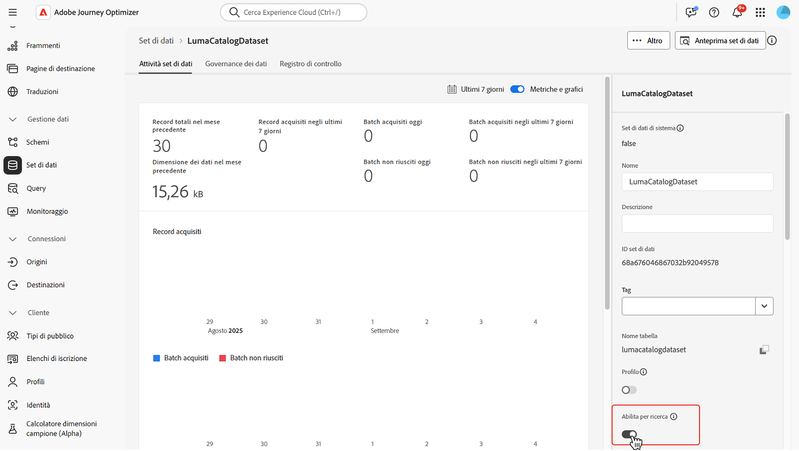
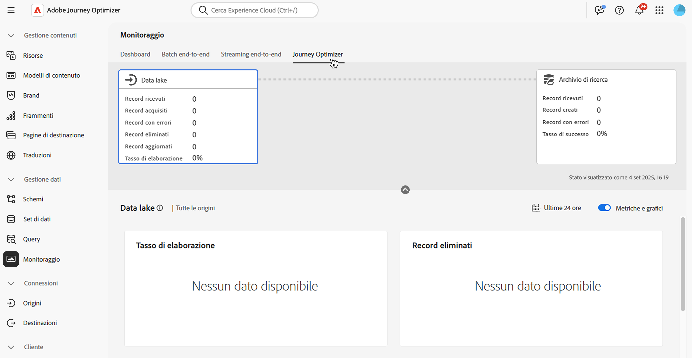

# Utilizzare i dati di Adobe Experience Platform {#aep-data}

>[!CONTEXTUALHELP]
>id="lookup-aep-data"
>title="Abilitare per la ricerca"
>abstract="L’abilitazione di un set di dati per la ricerca consente di sfruttarne i dati nelle funzionalità di personalizzazione, decisioning e orchestrazione del percorso di Journey Optimizer."

Journey Optimizer consente di sfruttare i dati provenienti dai dati di Adobe Experience Platform con funzionalità di personalizzazione, decisioning e orchestrazione del percorso. A questo scopo, i set di dati basati su record necessari per la personalizzazione della ricerca devono prima essere abilitati per il servizio di ricerca come descritto di seguito.

## Da leggere

### Guardrail e linee guida {#guidelines}

Prima di iniziare, rivedi le seguenti restrizioni e linee guida:

* **Nessun PII nei set di dati** - I set di dati abilitati per la ricerca non devono contenere informazioni personali (PII, Personally Identifiable Information).

* 
   * **Rischio di eliminazione** - I set di dati utilizzati nella personalizzazione non sono protetti dall&#39;eliminazione. È necessario tenere traccia dei set di dati utilizzati per assicurarsi che non vengano rimossi.

* **Tipo di schema** - I set di dati devono essere associati a uno schema di tipo **NOT** Profilo o Evento.

* **Mantieni attiva la ricerca** - Evita di attivare e disattivare ripetutamente i set di dati. Procedendo in questo modo si potrebbe verificare un comportamento di indicizzazione imprevisto. La best practice prevede di lasciare abilitato il set di dati per tutto il tempo in cui intendi utilizzarlo per le ricerche.

* **Batch di eliminazione dati** - La rimozione di un batch di dati dal set di dati comporta la rimozione completa di tutte le chiavi corrispondenti dal servizio di ricerca. Ad esempio:

  **Batch 1**: Sku1, Sku2, Sku3\
  **Batch 2**: Sku1, Sku2, Sku3, Sku4, Sku5, Sku6\
  **Batch 3**: Sku7, Sku8, Sku9, Sku10

  Se si elimina **Batch 1**, Sku1, Sku2 e Sku3 verranno rimossi dall&#39;archivio di ricerca. I dati di ricerca risultanti conterranno quindi: Sku4, Sku5, Sku6, Sku7, Sku8, Sku9, Sku10.

* **Nessuna ricerca concatenata** - Le ricerche dei set di dati non possono essere concatenate. In altre parole, non è possibile utilizzare il risultato di una ricerca come variabile per poi diventare la chiave per eseguire una seconda ricerca.

### Diritto per il servizio di ricerca

| Componente funzione | Limiti | Note |
| ------- | ------- | ------- |
| Set di dati di ricerca abilitati | Massimo 10 per organizzazione | Numero massimo di set di dati che possono essere configurati per la ricerca in un dato momento. Questo limite si applica al numero totale combinato di set di dati di ricerca nelle sandbox di produzione e di sviluppo all’interno dell’istanza del cliente. |
| Conteggio record set di dati | Fino a 2 milioni di record per set di dati | Numero massimo di record consentiti in un singolo set di dati, calcolato come conteggio totale in tutti i batch all’interno di tale set di dati. |
| Dimensione record | Fino a 2 KB per record | Dimensione massima del record predefinita supportata. |
| Dimensione set di dati | Fino a 4 GB | Dimensione massima di un singolo set di dati, non la dimensione combinata in tutti i set di dati in una sandbox. I limiti di conteggio dei record e dimensione del set di dati sono guardrail indipendenti, entrambi devono essere soddisfatti. |
| Aggiornamenti della frequenza del set di dati | Fino a 5 aggiornamenti al giorno per set di dati | Frequenza massima consentita per le operazioni di aggiornamento per un singolo set di dati al giorno. |

>[!NOTE]
>
>Se sono necessari volumi aggiuntivi oltre ai guardrail elencati sopra, contatta il tuo rappresentante Adobe.

## Abilitare un set di dati per la ricerca di dati {#enable}

Per sfruttare i dati del set di dati per la personalizzazione, devi abilitare il set di dati per la ricerca.

### Prerequisiti {#prerequisites-enable}

Lo schema associato al set di dati che desideri abilitare per la ricerca deve essere di tipo record. Lo schema NON deve essere di profilo o classe di evento.

+++Esempio


+++

Lo schema deve avere un’identità primaria definita.

+++Esempio


+++

Se non è ancora stato definito uno spazio dei nomi personalizzato, assicurati che l’identità sia un identificatore non di persona.

+++Esempio


+++

### Abilitare il set di dati per la ricerca nell’interfaccia di gestione del set di dati

Nell’interfaccia utente per la gestione dei set di dati, utilizza l’interruttore per abilitare il set di dati per la ricerca.



>[!NOTE]
>
>Si consiglia di NON abilitare il set di dati anche per il profilo, in quanto ciò può portare a un aumento della ricchezza del profilo e non è necessario per eseguire le ricerche.

### Metodo API

Segui le istruzioni descritte in [questa documentazione](https://developer.adobe.com/journey-optimizer-apis/references/authentication/) per configurare l&#39;ambiente per l&#39;invio di comandi API.

#### Prerequisiti

* Il progetto dello sviluppatore deve includere le API Adobe Journey Optimizer e Adobe Experience Platform aggiunte al progetto.

  

* Come parte del tuo ruolo, devi disporre dell’autorizzazione Gestione set di dati.

* Lo schema su cui si basa il set di dati deve contenere un’identità primaria che possa fungere da chiave di ricerca.

#### Struttura delle chiamate API

```shell
curl -s -XPATCH "https://platform.adobe.io/data/core/entity/lookup/dataSets/${DATASET_ID}/${ACTION}" \ -H "Authorization: Bearer ${ACCESS_TOKEN}" \ -H "x-api-key: ${API_KEY}" \ -H "x-gw-ims-org-id: ${IMS_ORG}" \ -H "x-sandbox-name: ${SANDBOX_NAME}" 
```

Dove:

* URL: `https://platform.adobe.io/data/core/entity/lookup/dataSets/${DATASET_ID}/${ACTION}`
* L’ID del set di dati è il set di dati per il quale desideri abilitare.
* L&#39;azione è enable OR disable.
* Il token di accesso può essere recuperato dalla console per sviluppatori.
* La chiave API può essere recuperata dalla console per sviluppatori.
* L’ID dell’organizzazione IMS è l’organizzazione Adobe.
* Nome sandbox: il nome della sandbox in cui si trova il set di dati (ad esempio, produzione, sviluppo, ecc.).

>[!NOTE]
>
>Se si verifica l’errore seguente durante il tentativo di una chiamata API per abilitare i set di dati, prova a rimuovere le API Adobe Journey Optimizer dal progetto della console per sviluppatori e quindi a aggiungerle di nuovo:
>
>`"error_code": "403003",`
>`"message": "Api Key is invalid"`

## Monitoraggio dei set di dati

Dopo aver abilitato un set di dati per la ricerca, puoi controllare lo stato di acquisizione nel servizio di ricerca dal menu **[!UICONTROL Monitoraggio]** e selezionando la scheda **[!UICONTROL Journey Optimizer]**.

Questo indicatore di processo aiuta a capire quando sono disponibili nuovi batch di dati nel servizio di ricerca.



## Passaggi successivi

Dopo aver abilitato un set di dati per la ricerca tramite una chiamata API, puoi utilizzare i dati con le funzionalità di personalizzazione e decisioning di [!DNL Journey Optimizer]. Per ulteriori informazioni, consulta queste sezioni:

* [Utilizzare i dati di Adobe Experience Platform per la personalizzazione](../personalization/aep-data-perso.md)
* [Utilizzare i dati di Adobe Experience Platform per la funzione Decisioni](../experience-decisioning/aep-data-exd.md)
* [Utilizzare i dati di Adobe Experience Platform per l&#39;orchestrazione del percorso](../building-journeys/dataset-lookup.md)
