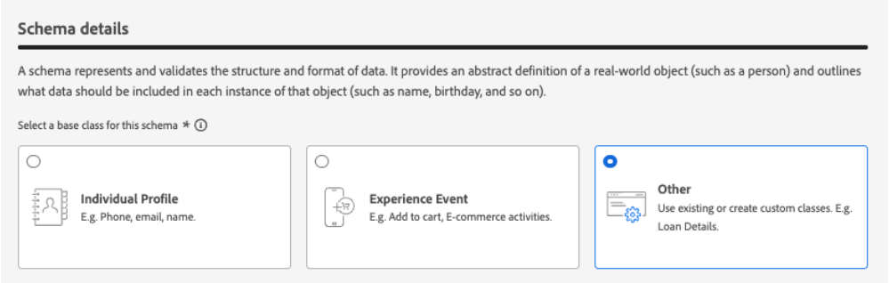
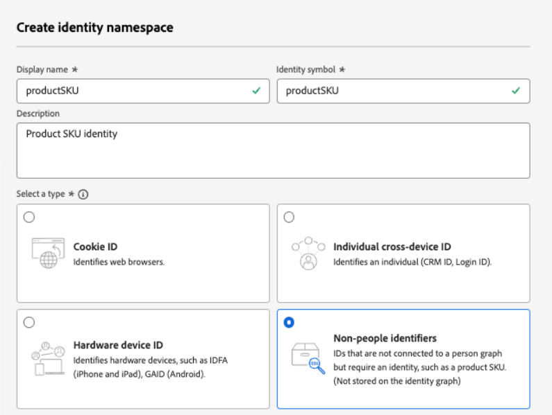
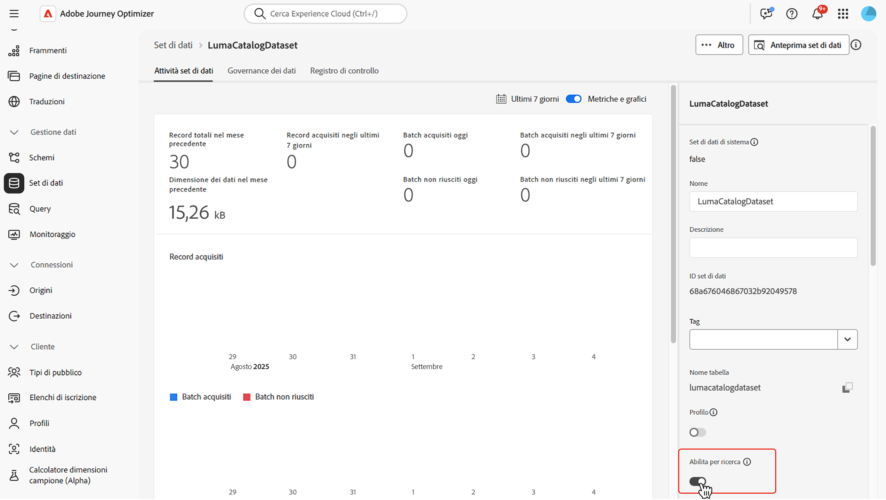
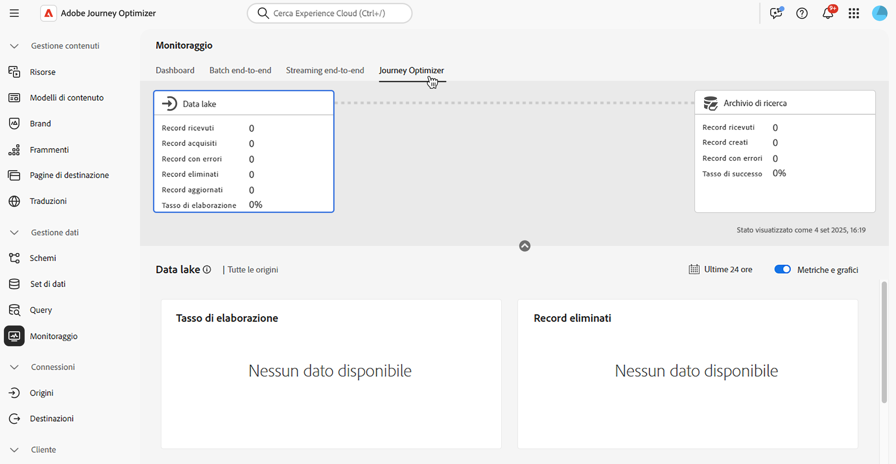

# Utilizzare i dati di Adobe Experience Platform {#aep-data}

>[!CONTEXTUALHELP]
>id="lookup-aep-data"
>title="Abilitare per la ricerca"
>abstract="Quando si abilita un set di dati per la ricerca, è possibile sfruttarne i dati nelle funzionalità di personalizzazione, decisioning e orchestrazione del percorso di Journey Optimizer."

[!DNL Journey Optimizer] consente di sfruttare i dati di [!DNL Adobe Experience Platform] con funzionalità di personalizzazione, decisioning e orchestrazione di percorso. A questo scopo, i set di dati basati su record necessari per la personalizzazione della ricerca devono prima essere abilitati per il servizio di ricerca come descritto di seguito.

>[!NOTE]
>
>La funzionalità di ricerca dati è disponibile solo per un set di organizzazioni (disponibilità limitata). Per potervi accedere, contatta il tuo rappresentante Adobe. Per informazioni dettagliate sul ciclo di rilascio e sulle fasi di disponibilità, consulta [Ciclo di rilascio di Journey Optimizer](../rn/releases.md).

Per ulteriori informazioni su come accedere e utilizzare i set di dati, consulta questa sezione: [Introduzione ai set di dati](../data/get-started-datasets.md)

## Da leggere

### Guardrail e linee guida {#guidelines}

Prima di iniziare, rivedi le seguenti restrizioni e linee guida:

* **Nessun PII nei set di dati** - I set di dati abilitati per la ricerca non devono contenere informazioni personali (PII, Personally Identifiable Information).

* **Rischio di eliminazione** - I set di dati utilizzati nella personalizzazione non sono protetti dall&#39;eliminazione. È necessario tenere traccia dei set di dati utilizzati per assicurarsi che non vengano rimossi.

* **Tipo di schema** - I set di dati devono essere associati a uno schema di tipo **NOT** Profilo o Evento.

* **Mantieni attiva la ricerca** - Evita di attivare e disattivare ripetutamente i set di dati. Procedendo in questo modo si potrebbe verificare un comportamento di indicizzazione imprevisto. La best practice prevede di lasciare abilitato il set di dati per tutto il tempo in cui intendi utilizzarlo per le ricerche.

* **Area di attivazione di Edge** - I set di dati abilitati per la ricerca sono disponibili per l&#39;attivazione in entrata basata su Edge solo nell&#39;area in cui risiede la sandbox del set di dati (ad esempio, NLD2 o VA7). Puoi visualizzare l’area sandbox nell’interfaccia utente accanto al nome della sandbox.

* **Batch di eliminazione dati** - La rimozione di un batch di dati dal set di dati comporta la rimozione completa di tutte le chiavi corrispondenti dal servizio di ricerca. Ad esempio:

  **Batch 1**: Sku1, Sku2, Sku3\
  **Batch 2**: Sku1, Sku2, Sku3, Sku4, Sku5, Sku6\
  **Batch 3**: Sku7, Sku8, Sku9, Sku10

  Se si elimina **Batch 1**, Sku1, Sku2 e Sku3 verranno rimossi dall&#39;archivio di ricerca. I dati di ricerca risultanti conterranno quindi: Sku4, Sku5, Sku6, Sku7, Sku8, Sku9, Sku10.

### Diritto per il servizio di ricerca

| Componente funzione | Limiti | Note |
| ------- | ------- | ------- |
| Set di dati di ricerca abilitati | Massimo 10 per organizzazione | Numero massimo di set di dati che possono essere configurati per la ricerca in un dato momento. Questo limite si applica al numero totale combinato di set di dati di ricerca nelle sandbox di produzione e di sviluppo all’interno dell’istanza del cliente. |
| Conteggio record set di dati | Fino a 2 milioni di record per set di dati | Numero massimo di record consentiti in un singolo set di dati, calcolato come conteggio totale in tutti i batch all’interno di tale set di dati. |
| Dimensione record | Fino a 2 KB per record | Dimensione massima del record predefinita supportata. |
| Dimensione set di dati | Fino a 4 GB | Dimensione massima di un singolo set di dati, non la dimensione combinata in tutti i set di dati in una sandbox. I limiti di conteggio dei record e dimensione del set di dati sono guardrail indipendenti, entrambi devono essere soddisfatti. |
| Aggiornamenti della frequenza del set di dati | Fino a 5 aggiornamenti al giorno per set di dati | Frequenza massima consentita per le operazioni di aggiornamento per un singolo set di dati al giorno. |

>[!NOTE]
>
>Se sono necessari volumi aggiuntivi oltre ai guardrail elencati sopra, contatta il tuo rappresentante Adobe.

## Abilitare un set di dati per la ricerca di dati {#enable}

Per sfruttare i dati del set di dati per la personalizzazione, devi abilitare il set di dati per la ricerca.

### Prerequisiti {#prerequisites-enable}

Lo schema associato al set di dati che desideri abilitare per la ricerca deve essere di tipo record. Lo schema NON deve essere di profilo o classe di evento.

+++Esempio



+++

Lo schema deve avere un’identità primaria definita.

+++Esempio


+++

Se non è ancora stato definito uno spazio dei nomi personalizzato, assicurati che l’identità sia un identificatore non di persona.

+++Esempio



+++

### Enable the dataset for lookup in the dataset management interface

In the dataset management user interface, use the toggle to enable the dataset for lookup.



### API Method

Follow the directions detailed in [this documentation](https://developer.adobe.com/journey-optimizer-apis/references/authentication) to configure your environment to send API commands.

#### Prerequisiti

* The developer project must have the Adobe Journey Optimizer and Adobe Experience Platform APIs added to their project.

  

* You must have manage datasets permission as part of your role.

* The schema for which the dataset is based on must contain a primary identity that can act as the lookup key.

#### API call structure

```shell
curl -s -XPATCH "https://platform.adobe.io/data/core/entity/lookup/dataSets/${DATASET_ID}/${ACTION}" \ -H "Authorization: Bearer ${ACCESS_TOKEN}" \ -H "x-api-key: ${API_KEY}" \ -H "x-gw-ims-org-id: ${IMS_ORG}" \ -H "x-sandbox-name: ${SANDBOX_NAME}" 
```

Dove:

* URL is `https://platform.adobe.io/data/core/entity/lookup/dataSets/${DATASET_ID}/${ACTION}`
* Dataset ID is the dataset for which you wish to enable.
* Action is enable OR disable.
* Access token can be retrieved from the developer console.
* API key can be retrieved from the developer console.
* IMS Org ID is your Adobe organization.
* Sandbox Name is the sandbox name the dataset is in (i.e. prod, dev etc.).

>[!NOTE]
>
>If you encounter the error below when attempting an API call to enable datasets, try removing the Adobe Journey Optimizer APIs from your developer console project and then re-adding them:
>
>`"error_code": "403003",`
>`"message": "Api Key is invalid"`

## Dataset monitoring

Once a dataset has been enabled for lookup, you can review the status of ingestion into the lookup service by going to the **[!UICONTROL Monitoring]** menu and selecting the **[!UICONTROL Journey Optimizer]** tab.

This process indicator helps in understanding when new batches of data are available in the lookup service.



## Passaggi successivi

After a dataset has been enabled for lookup using an API call, you can use the data with [!DNL Journey Optimizer] personalization and Decisioning capabilities. Per ulteriori informazioni, consulta queste sezioni:

* [Utilizzare i dati di Adobe Experience Platform per la personalizzazione](../personalization/aep-data-perso.md)
* [Utilizzare i dati di Adobe Experience Platform per la funzione Decisioni](../experience-decisioning/aep-data-exd.md)
* [Use Adobe Experience Platform data for journey orchestration](../building-journeys/dataset-lookup.md)
