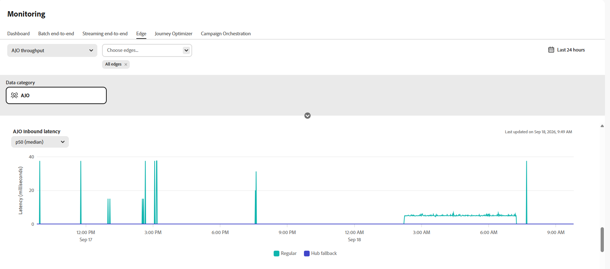

# Monitorare i dati in entrata{#monitoring-edge}

>[!BEGINSHADEBOX]

**In questa pagina:** monitorare l&#39;integrità dei dati in entrata in [!DNL Adobe Journey Optimizer] con i grafici disponibili in **[!UICONTROL Gestione dati]** > **[!UICONTROL Monitoraggio]** > **[!UICONTROL Edge]**.

>[!ENDSHADEBOX]

L&#39;area di lavoro **[!UICONTROL Monitoraggio]** include le schede seguenti:

| Scheda | Descrizione | Documentazione |
|---|---|---|
| **[!UICONTROL Dashboard]** | Esamina l’attività e lo stato del flusso di dati nei flussi di dati. | [Dashboard di monitoraggio del flusso di dati](https://experienceleague.adobe.com/en/docs/experience-platform/dataflows/ui/monitor){target="_blank"} |
| **[!UICONTROL Batch end-to-end]** | Monitora il flusso end-to-end e la qualità dei dati acquisiti in batch. | [Acquisizione di dati batch end-to-end](https://experienceleague.adobe.com/en/docs/experience-platform/ingestion/quality/monitor-data-ingestion#monitor-batch-end-to-end-data-ingestion){target="_blank"} |
| **[!UICONTROL Streaming end-to-end]** | Monitora il flusso end-to-end e la qualità dei dati acquisiti in streaming. | [Acquisizione di dati end-to-end in streaming](https://experienceleague.adobe.com/en/docs/experience-platform/ingestion/quality/monitor-data-ingestion#monitor-streaming-end-to-end-data-ingestion){target="_blank"} |
| **[!UICONTROL Edge]** | Monitora i dati inviati ad Edge Network. In questa pagina sono documentati i grafici specifici di Journey Optimizer disponibili in questa scheda. | [Monitorare i flussi di dati di Edge](https://experienceleague.adobe.com/en/docs/experience-platform/dataflows/ui/monitor-edge){target="_blank"} |

## Monitorare i dati Journey Optimizer in Edge

I seguenti grafici sono disponibili in **[!UICONTROL Gestione dati]** > **[!UICONTROL Monitoraggio]** > **[!UICONTROL Edge]**.

Dal menu a discesa, seleziona **[!UICONTROL Throughput AJO]**.

### Throughput del gateway di AJO {#gateway-throughput}

Il grafico **[!UICONTROL Throughput gateway di AJO]** mostra il numero totale di record elaborati dal gateway di Journey Optimizer al secondo nel tempo. Utilizza questa metrica per monitorare il volume complessivo delle richieste in entrata gestite dal gateway.

### Throughput in entrata di AJO {#inbound-throughput}

Il grafico **[!UICONTROL Throughput in entrata di AJO]** mostra il numero complessivo di record in entrata ricevuti al secondo nel tempo. Questa metrica misura la velocità con cui i record in entrata raggiungono il servizio Edge. Utilizza questo grafico per rivedere il volume di dati in entrata e identificare le modifiche nei livelli di traffico.

### Suddivisione velocità effettiva in entrata di AJO {#inbound-throughput-breakdown}

Il grafico **[!UICONTROL Analisi del throughput in entrata di AJO]** mostra i record in entrata ricevuti al secondo nel tempo, suddivisi per posizione. Questa metrica misura il tasso di record in entrata per ogni posizione. Usa questo grafico per confrontare il traffico in entrata tra le posizioni e identificare una posizione con un aumento o una diminuzione inusuale del volume.

### Latenza in entrata AJO {#inbound-latency}

Il grafico **[!UICONTROL Latenza in entrata AJO]** mostra il tempo necessario per elaborare le richieste in entrata, misurato in millisecondi. Questa metrica viene presentata come una distribuzione dei valori di latenza, inclusi percentili come P50 e P90. Utilizza questi valori per comprendere la latenza tipica delle richieste e identificare le richieste con latenza più elevata.

### Throughput degli eventi delle proposte in entrata di AJO {#inbound-proposition-events-throughput}

Il grafico **[!UICONTROL Throughput eventi delle proposte in entrata di AJO]** mostra la velocità effettiva degli eventi delle proposte nel tempo. Questa metrica misura i segnali di tracciamento generati quando un utente interagisce con, visualizza o attiva un’offerta personalizzata.

### Throughput degli eventi delle proposte in entrata di AJO per canale {#inbound-proposition-events-throughput-channel}

Il grafico **[!UICONTROL Throughput eventi proposte in entrata AJO per canale]** mostra la velocità effettiva degli eventi proposte per canale in entrata. Questa metrica misura l’attività dell’evento proposta raggruppata per canale. I canali disponibili includono CBE, in-app e schede di contenuto. Usa questo grafico per confrontare l’attività tra i canali in entrata.

### Throughput degli eventi delle proposte in entrata di AJO per tipo di evento {#inbound-proposition-events-throughput-event-type}

Il grafico **[!UICONTROL Throughput eventi proposte in entrata AJO per tipo di evento]** mostra la velocità effettiva degli eventi proposte per tipo di evento. Questa metrica misura l’attività dell’evento di proposta raggruppata per risultato. I tipi di evento disponibili includono ignorato, soppresso, visualizzato, attivato, interagito e inviato. Utilizza questo grafico per identificare quali risultati di proposte ed eventi contribuiscono all’attività complessiva.

{{$include /help/_includes/do-not-localize/data/ai-augmented-monitoring.md}}