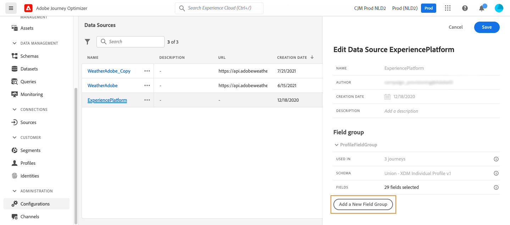

# Origine dati Adobe Experience Platform {#adobe-experience-platform-data-source}

>[!CONTEXTUALHELP]
>id="ajo_journey_data_source_built_in"
>title="Origine dati Adobe Experience Platform"
>abstract="L’origine dati di Adobe Experience Platform definisce la connessione ad Adobe Real-Time Customer Profile. Questa origine dati è incorporata e preconfigurata e non può essere eliminata. È progettata per recuperare e utilizzare i dati dal servizio Profilo cliente in tempo reale (ad esempio, controlla se la persona che ha effettuato l’accesso in un percorso è una donna)."

L’origine dati di Adobe Experience Platform definisce la connessione ad Adobe Real-Time Customer Profile. Questa origine dati è incorporata e preconfigurata e non può essere eliminata. Questa origine dati è progettata per recuperare e utilizzare i dati del servizio Profilo cliente in tempo reale (ad esempio, verificare se la persona che ha inserito un percorso è una donna). Per ulteriori informazioni su Adobe Real-time Customer Profile, consulta la [documentazione di Adobe Experience Platform](https://experienceleague.adobe.com/docs/experience-platform/profile/home.html?lang=it){target="_blank"}.

Per consentire la connessione al servizio Profilo cliente in tempo reale, è necessario utilizzare una chiave per identificare una persona e uno spazio dei nomi che la contestualizza. Di conseguenza, puoi utilizzare questa origine dati solo se i tuoi percorsi iniziano con un evento contenente una chiave e uno spazio dei nomi. [Ulteriori informazioni](../building-journeys/journey.md).

Puoi modificare il gruppo di campi preconfigurato denominato &quot;ProfileFieldGroup&quot;, aggiungerne di nuovi e rimuovere quelli che non sono utilizzati in alcun percorso in bozza o live. [Ulteriori informazioni](../datasource/configure-data-sources.md#define-field-groups).

>[!CAUTION]
>
>L’utilizzo di eventi di esperienza nelle espressioni/condizioni di percorso non è supportato. Se il caso d’uso richiede l’utilizzo di eventi esperienza, considera metodi alternativi. [Ulteriori informazioni](../building-journeys/exp-event-lookup.md)

Di seguito sono riportati i passaggi principali per aggiungere gruppi di campi all’origine dati incorporata:

1. Dall&#39;elenco delle origini dati, selezionare l&#39;origine dati predefinita **Adobe Experience Platform**.

   Sul lato destro dello schermo si apre il riquadro di configurazione dell’origine dati .

   

1. Selezionare **[!UICONTROL Aggiungi un nuovo gruppo di campi]** per definire una [nuova serie di campi da recuperare](../datasource/configure-data-sources.md#define-field-groups).

   

1. Selezionare uno schema dal menu a discesa **[!UICONTROL Schema]**. La creazione dello schema viene eseguita in Adobe Experience Platform, non in Adobe Journey Optimizer.
1. Seleziona i campi da utilizzare e salva le modifiche.

>[!TIP]
>
>Passa il puntatore del mouse sul nome di un gruppo di campi per visualizzare due icone a destra. Utilizzali per **duplicare** o **eliminare** il gruppo di campi. L&#39;icona **[!UICONTROL Elimina]** è disponibile solo se il gruppo di campi non è utilizzato in alcun percorso **Live**, **Bozza** o **Finished**. Fai riferimento al campo **[!UICONTROL Usato in]** per verificare se è così.
