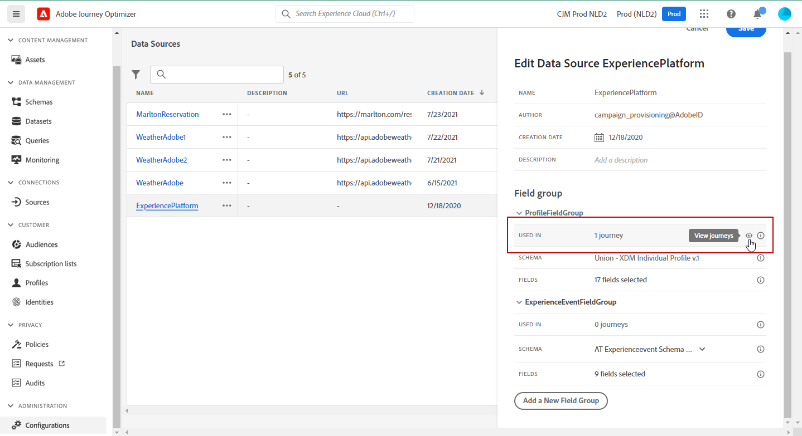

# Configurare un’origine dati {#configure-data-source}

>[!NOTE]
>
>La configurazione dell’origine dati viene sempre eseguita da un **utente tecnico**.

Per configurare un’origine dati, effettua le seguenti operazioni:

1. Nella sezione del menu AMMINISTRAZIONE, selezionare **[!UICONTROL Configurazioni]**. Nella sezione **[!UICONTROL Origini dati]** fare clic su **[!UICONTROL Gestisci]**. Viene visualizzato l’elenco delle origini dati. Per ulteriori informazioni sull&#39;interfaccia, vedere [questa pagina](../start/user-interface.md).

   

1. Quindi puoi aggiungere gruppi di campi all&#39;origine dati incorporata (vedi [questa pagina](../datasource/adobe-experience-platform-data-source.md)) o creare una nuova origine dati esterna (vedi [questa pagina](../datasource/external-data-sources.md)) e i gruppi di campi associati (vedi [questa pagina](../datasource/configure-data-sources.md#define-field-groups)).

   

1. Fai clic su **[!UICONTROL Salva]**.

   Adesso l’origine dati è configurata ed è pronta per essere utilizzata nei percorsi.

## Definire i gruppi di campi {#define-field-groups}

I gruppi di campi sono insiemi di campi che è possibile recuperare da un&#39;origine dati e utilizzare in un percorso.

Per ogni origine dati è possibile definire più gruppi di campi.

Ad esempio, puoi creare un gruppo di campi con il numero di telefono, l’e-mail, il nome e l’indirizzo del profilo. Potrai quindi utilizzare questi dati nel tuo percorso per creare condizioni. Ad esempio, puoi decidere di inviare una notifica push solo se il cliente ha installato l’app mobile. Se è vuoto, puoi inviare un’e-mail.

Anche se viene aggiunto automaticamente un nome predefinito, è consigliabile assegnare un nome al gruppo di campi. In effetti, il nome del gruppo di campi sarà visibile ad altri utenti in [!DNL Journey Optimizer]. Assegnare un nome pertinente ai gruppi di campi è una best practice.

Quando un campo origine dati viene utilizzato in un percorso, vengono recuperati tutti i campi definiti per tale gruppo di campi. Pertanto, è consigliabile selezionare solo i campi necessari per i percorsi. Questo ridurrà la latenza delle richieste nei percorsi, aumentando così le prestazioni. In seguito è possibile aggiungere facilmente altri campi nei gruppi di campi.

Il numero di percorsi che utilizzano un gruppo di campi viene visualizzato nel campo **[!UICONTROL Usato in]**. È possibile fare clic sul pulsante **[!UICONTROL Visualizza percorsi]** per visualizzare l&#39;elenco dei percorsi che utilizzano questo gruppo di campi.

>[!NOTE]
>
>Tieni presente che se un gruppo di campi non ha alcun campo, non viene visualizzato nell’editor di espressioni.

## Ciclo di vita del gruppo di campi {#field-group-lifecycle}

Puoi aggiungere o rimuovere campi da un gruppo di campi che non è utilizzato in alcun percorso in bozza o live.

Se il gruppo di campi viene utilizzato in uno o più percorsi in bozza o live, puoi aggiungere in modo incrementale nuovi campi dallo schema selezionato, ma non puoi deselezionare, rimuovere o modificare campi già selezionati. Gli aggiornamenti a un gruppo di campi non sono consentiti se vengono modificati i campi dello schema esistenti già in uso dai percorsi in bozza o live, ad esempio se si modifica il tipo di dati di un campo. In questo modo si evitano percorsi

Per eliminare un campo da un gruppo di campi utilizzato in uno o più percorsi, eseguire la procedura seguente. Utilizziamo un esempio di gruppo di campi denominato &quot;Gruppo di campi A&quot;.

1. Nell&#39;elenco dei gruppi di campi, posizionare il cursore su &quot;Gruppo di campi A&quot; e fare clic sull&#39;icona **[!UICONTROL Duplica]** situata a destra. Ad esempio, assegna al gruppo di campi duplicato il nome &quot;Gruppo di campi B&quot;.
1. In &quot;Gruppo di campi B&quot;, rimuovere i campi non più desiderati.
1. In &quot;Gruppo di campi A&quot;, verificare dove viene utilizzato questo gruppo di campi. Queste informazioni sono visualizzate nel campo **[!UICONTROL Usato in]**.
1. Aprire tutti i percorsi che utilizzano &quot;Gruppo di campi A&quot;.
1. Crea nuove versioni di ciascuno di questi percorsi. Modificare tutte le attività utilizzando &quot;Gruppo di campi A&quot; e selezionare &quot;Gruppo di campi B&quot;.
1. Interrompere le versioni precedenti dei percorsi che utilizzano &quot;Gruppo di campi A&quot;. In questo caso non dovrebbe esistere alcun percorso che utilizzi &quot;Gruppo di campi A&quot;.
1. Rimuovere il &quot;Gruppo di campi A&quot; perché non è più utilizzato.
