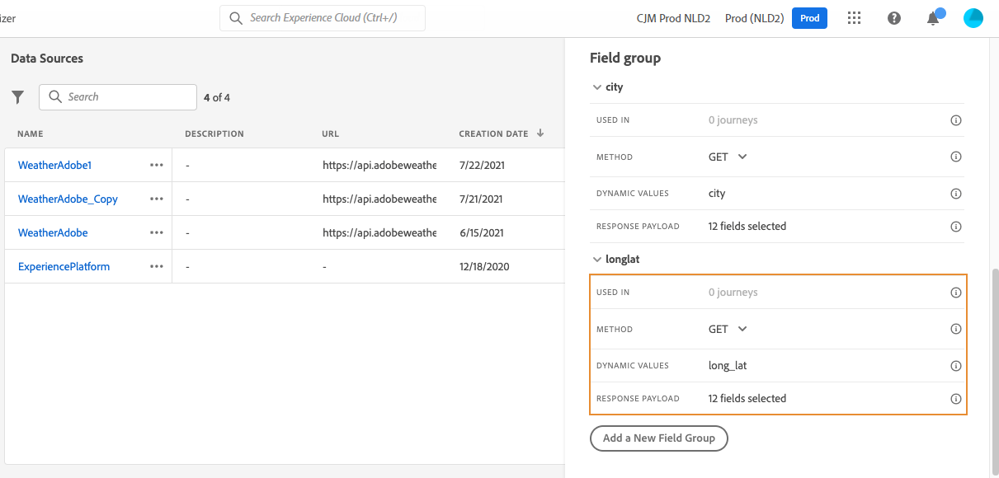

# Origini dati esterne {#external-data-sources}

>[!CONTEXTUALHELP]
>id="ajo_journey_data_source_custom"
>title="Origini dati esterne"
>abstract="Le origini dati esterne consentono di definire una connessione a sistemi di terze parti, ad esempio se si utilizza un sistema di prenotazione alberghiera per verificare se un cliente ha registrato una stanza. Al posto dell&#39;origine dati integrata di Adobe Experience Platform, è possibile creare un numero illimitato di origini dati esterne."

## Utilizzare origini dati esterne {#gs-ext-data-sources}

Le origini dati esterne consentono di definire una connessione a sistemi di terze parti, ad esempio se si utilizza un sistema di prenotazione alberghiera per verificare se un cliente ha registrato una stanza. Al posto dell&#39;origine dati integrata di Adobe Experience Platform, è possibile creare un numero illimitato di origini dati esterne.

>[!NOTE]
>
>* I guardrail quando si lavora con sistemi esterni sono elencati in [questa pagina](../configuration/external-systems.md).
>
>* Poiché le risposte sono ora supportate, per i casi d’uso relativi a origini dati esterne devi utilizzare azioni personalizzate anziché origini dati. Per ulteriori informazioni sulle risposte, consulta questa [sezione](../action/action-response.md)

Sono supportate le API REST basate su POST o GET e che restituiscono JSON. Sono supportate le modalità chiave API, sia l’autenticazione di base che personalizzata.

Prendiamo l’esempio di un servizio API meteorologico che intendo sfruttare per personalizzare i comportamenti del mio percorso secondo i dati meteo in tempo reale.

Di seguito sono riportati due esempi della chiamata API:

* _https://api.adobeweather.org/weather?city=London,uk&amp;appid=1234_
* _https://api.adobeweather.org/weather?lat=35&amp;lon=139&amp;appid=1234_

La chiamata è composta da un URL principale, _https://api.adobeweather.org/weather_, due set di parametri (&quot;city&quot; per la città e &quot;lat/long&quot; per la latitudine e la longitudine) e la chiave API (appid).

>[!TIP]
>
>È consigliabile lasciare un buffer di almeno un minuto tra il periodo di scadenza del token dell&#39;API esterna e l&#39;impostazione [`cacheDuration` di Journey Optimizer ](#custom-authentication-access-token), soprattutto in caso di carichi di lavoro pesanti, per evitare incongruenze di scadenza ed errori 401.

## Creare e configurare un’origine dati esterna {#create-ext-data-sources}

Di seguito sono riportati i passaggi principali per creare e configurare una nuova origine dati esterna:

1. Nell&#39;elenco delle origini dati fare clic su **[!UICONTROL Crea Source dati]** per creare una nuova origine dati esterna.

   

   Sul lato destro dello schermo si apre il riquadro di configurazione dell’origine dati .

   

1. Inserisci un nome per l’origine dati.

Sono consentiti solo caratteri alfanumerici e trattini bassi. La lunghezza massima è di 30 caratteri.

1. Aggiungi una descrizione all’origine dati. Questo passaggio è facoltativo.
1. Aggiungi l’URL del servizio esterno. Nel nostro esempio: _https://api.adobeweather.org/weather_.

   >[!CAUTION]
   >
   >Per motivi di sicurezza, è consigliabile utilizzare HTTPS. Inoltre, non consentiamo l’uso di indirizzi Adobe che non sono disponibili al pubblico, né di indirizzi IP.

   

1. Configura l&#39;autenticazione in base alla configurazione del servizio esterno: **[!UICONTROL Nessuna autenticazione]**, **[!UICONTROL Base]**, **[!UICONTROL Personalizzata]** o **[!UICONTROL Chiave API]**.

   Per la modalità di autenticazione di base, devi inserire un nome utente e una password.

   >[!NOTE]
   >
   >* Quando viene eseguita la chiamata di autenticazione, la stringa `<username>:<password>`, codificata in base64, viene aggiunta nell&#39;intestazione Autenticazione.
   >
   >* Adobe Journey Optimizer crittografa automaticamente i segreti definiti nelle azioni personalizzate. Le chiavi di crittografia di ogni organizzazione vengono gestite in modo sicuro in un archivio dedicato associato alla propria organizzazione. Quando le credenziali vengono visualizzate nell’interfaccia, vengono nascoste per impostazione predefinita per evitare esposizioni accidentali.


   Per ulteriori informazioni sulla modalità di autenticazione personalizzata, vedere [questa sezione](../datasource/external-data-sources.md#custom-authentication-mode). Nel nostro esempio, scegliamo la modalità di autenticazione della chiave API, come segue:

   * **[!UICONTROL Tipo]**: &quot;Chiave API&quot;
   * **[!UICONTROL Nome]**: &quot;appid&quot; (nome del parametro della chiave API)
   * **[!UICONTROL Valore]**: &quot;1234&quot; (questo è il valore della nostra chiave API)
   * **[!UICONTROL Posizione]**: &quot;Parametro query&quot; (la chiave API si trova nell&#39;URL)

     

1. Aggiungere un nuovo gruppo di campi per ogni set di parametri API facendo clic su **[!UICONTROL Aggiungi un nuovo gruppo di campi]**. Nel nome del gruppo di campi sono consentiti solo caratteri alfanumerici e trattini bassi. La lunghezza massima è di 30 caratteri. Nel nostro esempio, dobbiamo creare due gruppi di campi, uno per ciascun insieme di parametri (city e long/lat).

Per il set di parametri &quot;long/lat&quot;, viene creato un gruppo di campi con le seguenti informazioni:

* **[!UICONTROL Utilizzato in]**: visualizza il numero di percorsi che utilizzano un gruppo di campi. È possibile fare clic sull&#39;icona **[!UICONTROL Visualizza percorsi]** per visualizzare l&#39;elenco dei percorsi che utilizzano questo gruppo di campi.
* **[!UICONTROL Metodo]**: selezionare il metodo POST o GET. Nel nostro caso, scegliamo il metodo GET.
* **[!UICONTROL Valori dinamici]**: inserisci i diversi parametri separati da una virgola, nel nostro esempio &quot;long,lat&quot;. Poiché i valori del parametro dipendono dal contesto di esecuzione, saranno definiti all’interno dei percorsi. [Ulteriori informazioni](../building-journeys/expression/expressionadvanced.md)
* **[!UICONTROL Payload di risposta]**: fare clic all&#39;interno del campo **[!UICONTROL Payload]** e incollare un esempio del payload restituito dalla chiamata. Per il nostro esempio, abbiamo utilizzato un payload trovato su un sito web API per il meteo. Verifica la correttezza dei tipi di campi. Ogni volta che viene chiamata l’API, il sistema recupera tutti i campi inclusi nell’esempio di payload. Puoi fare clic su **[!UICONTROL Incolla un nuovo payload]** se desideri modificare il payload attualmente trasmesso.
* **[!UICONTROL Payload inviato]**: questo campo non viene visualizzato nel nostro esempio. È disponibile solo se si seleziona il metodo POST. Incolla il payload che verrà inviato al sistema di terze parti.

In caso di una chiamata GET che richieda i parametri, inseriscili nel campo **[!UICONTROL Valori dinamici]** e verranno aggiunti automaticamente alla fine della chiamata. Nel caso di una chiamata POST, è necessario:

* Elencare i parametri da passare al momento della chiamata nel campo **[!UICONTROL Valori dinamici]** (nell&#39;esempio seguente: &quot;identifier&quot;).
* Specificare i parametri anche utilizzando la medesima sintassi nel corpo del payload inviato. A questo scopo, devi aggiungere: &quot;param&quot;: &quot;nome del tuo parametro&quot; (nell’esempio seguente: &quot;identifier&quot;). Attieniti alla sintassi seguente:

```json
{"id":{"param":"identifier"}}
```




Una volta salvate le modifiche, l’origine dati è configurata ed è pronta per essere utilizzata nei percorsi, ad esempio nelle tue condizioni o per personalizzare un’e-mail. Se la temperatura è superiore a 30°C, puoi decidere di inviare una comunicazione specifica.

## Modalità di autenticazione personalizzata {#custom-authentication-mode}

>[!CONTEXTUALHELP]
>id="jo_authentication_payload"
>title="Informazioni sull’autenticazione personalizzata"
>abstract="La modalità di autenticazione personalizzata viene utilizzata per l’autenticazione complessa destinata al richiamo dei protocolli di wrapping di API come OAuth2. L’esecuzione dell’azione è un processo suddiviso in due fasi. Innanzitutto, viene eseguita una chiamata all’endpoint per la generazione del token di accesso. Quindi, il token di accesso viene inserito nella richiesta HTTP dell’azione."

La modalità di autenticazione personalizzata viene utilizzata per l’autenticazione complessa, spesso utilizzata per chiamare protocolli di wrapping API come OAuth2 e per recuperare un token di accesso da inserire nella richiesta HTTP effettiva per l’azione.

Quando configuri l&#39;autenticazione personalizzata, utilizza il pulsante **[!UICONTROL Fai clic per controllare l&#39;autenticazione]** per controllare se il payload di autenticazione personalizzata è configurato correttamente.


Quando il test ha esito positivo, il pulsante diventa verde.


Con questa modalità di autenticazione, l’esecuzione dell’azione è un processo in due fasi:

1. Chiama l’endpoint per generare il token di accesso.
1. Chiama l’API REST inserendo il token di accesso nel modo appropriato.


>[!NOTE]
>
>**Questa autenticazione è composta da due parti.**

### Definizione dell’endpoint da chiamare per generare il token di accesso{#custom-authentication-endpoint}

* `endpoint`: URL da utilizzare per generare l&#39;endpoint
* metodo della richiesta HTTP sull&#39;endpoint (`GET` o `POST`)
* `headers`: coppie chiave-valore da inserire come intestazioni in questa chiamata, se necessario
* `body`: descrive il corpo della chiamata se il metodo è POST. Supportiamo una struttura del corpo limitata, definita in bodyParams (coppie chiave-valore). Il bodyType descrive il formato e la codifica del corpo nella chiamata:
   * `form`: il tipo di contenuto sarà application/x-www-form-urlencoded (charset UTF-8) e le coppie chiave-valore verranno serializzate così come sono: key1=value1&amp;key2=value2&amp;...
   * `json`: il tipo di contenuto sarà application/json (charset UTF-8) e le coppie chiave-valore saranno serializzate così come sono, come oggetto json: _{ &quot;key1&quot;: &quot;value1&quot;, &quot;key2&quot;: &quot;value2&quot;, ...}_

### Definizione del modo in cui il token di accesso deve essere inserito nella richiesta HTTP dell’azione{#custom-authentication-access-token}

* **authorizationType**: definisce il modo in cui il token di accesso generato deve essere inserito nella chiamata HTTP per l&#39;azione. I valori possibili sono:

   * `bearer`: indica che il token di accesso deve essere inserito nell&#39;intestazione Autorizzazione, ad esempio: _Autorizzazione: Bearer &lt;token di accesso>_
   * `header`: indica che il token di accesso deve essere inserito come intestazione, il nome dell&#39;intestazione è definito dalla proprietà `tokenTarget`. Ad esempio, se `tokenTarget` è `myHeader`, il token di accesso verrà inserito come intestazione: _myHeader: &lt;token di accesso>_
   * `queryParam`: indica che il token di accesso deve essere inserito come queryParam, il nome del parametro di query è definito dalla proprietà tokenTarget. Ad esempio, se il tokenTarget è myQueryParam, l’URL della chiamata di azione sarà: _&lt;url>?myQueryParam=&lt;token di accesso>_

* **tokenInResponse**: indica come estrarre il token di accesso dalla chiamata di autenticazione. Questa proprietà può corrispondere a:
   * `response`: indica che la risposta HTTP è il token di accesso
   * un selettore in un json (supponendo che la risposta sia un json, non sono supportati altri formati come XML). Il formato di questo selettore è _json://&lt;percorso della proprietà del token di accesso>_. Ad esempio, se la risposta della chiamata è: _{ &quot;access_token&quot;: &quot;theToken&quot;, &quot;timestamp&quot;: 12323445656}_, tokenInResponse sarà: _json: //access_token_

Il formato di questa autenticazione è:

```json
{
    "type": "customAuthorization",
    "endpoint": "<URL of the authentication endpoint>",
    "method": "<HTTP method to call the authentication endpoint, in 'GET' or 'POST'>",
    (optional) "headers": {
        "<header name>": "<header value>",
        ...
    },
    (optional, mandatory if method is 'POST') "body": {
        "bodyType": "<'form'or 'json'>,
        "bodyParams": {
            "param1": value1,
            ...
        }
    },
    "tokenInResponse": "<'response' or json selector in format 'json://<field path to access token>'",
    "cacheDuration": {
        (optional, mutually exclusive with 'duration') "expiryInResponse": "<json selector in format 'json://<field path to expiry>'",
        (optional, mutually exclusive with 'expiryInResponse') "duration": <integer value>,
        "timeUnit": "<unit in 'milliseconds', 'seconds', 'minutes', 'hours', 'days', 'months', 'years'>"
    },
    "authorizationType": "<value in 'bearer', 'header' or 'queryParam'>",
    (optional, mandatory if authorizationType is 'header' or 'queryParam') "tokenTarget": "<name of the header or queryParam if the authorizationType is 'header' or 'queryParam'>",
}
```

>[!NOTE]
>
>Encode64 è l’unica funzione disponibile nel payload di autenticazione.

Adesso puoi modificare la durata della cache del token per un’origine dati di autenticazione personalizzata. Di seguito è riportato un esempio di payload di autenticazione personalizzato. Durata della cache definita nel parametro `cacheDuration`. Tale parametro Specifica la durata di conservazione del token generato nella cache. L’unità può essere in millisecondi, secondi, minuti, ore, giorni, mesi, anni.

Ecco un esempio per il tipo di autenticazione bearer:

```json
{
    "type": "customAuthorization",
    "endpoint": "https://<your_auth_endpoint>/epsilon/oauth2/access_token",
    "method": "POST",
    "headers": {
      "Authorization": "Basic EncodeBase64(<epsilon Client Id>:<epsilon Client Secret>)"
    },
    "body": {
      "bodyType": "form",
      "bodyParams": {
        "scope": "cn mail givenname uid employeeNumber",
        "grant_type": "password",
        "username": "<epsilon User Name>",
        "password": "<epsilon User Password>"
      }
    },
    "tokenInResponse": "json://access_token",
    "cacheDuration": {
      "duration": 5,
      "timeUnit": "minutes"
    },
  },
```

>[!NOTE]
>
>* Il token di autenticazione viene memorizzato nella cache al percorso: se due percorsi utilizzano la stessa azione personalizzata, ogni percorso ha un proprio token memorizzato nella cache. Il token non è condiviso tra questi percorsi.
>
>* La durata della cache consente di evitare un numero eccessivo di chiamate agli endpoint di autenticazione. La conservazione dei token di autenticazione è memorizzata nella cache dei servizi, non vi è persistenza. Se un servizio viene riavviato, inizia con una cache pulita. Per impostazione predefinita, la durata della cache è di 1 ora. Nel payload di autenticazione personalizzata, può essere adattato specificando un’altra durata di conservazione.
>

Di seguito è riportato un esempio per il tipo di autenticazione dell’intestazione:

```json
{
  "type": "customAuthorization",
  "endpoint": "https://myapidomain.com/v2/user/login",
  "method": "POST",
  "headers": {
    "x-retailer": "any value"
  },
  "body": {
    "bodyType": "form",
    "bodyParams": {
      "secret": "any value",
      "username": "any value"
    }
  },
  "tokenInResponse": "json://token",
  "cacheDuration": {
    "expiryInResponse": "json://expiryDuration",
    "timeUnit": "minutes"
  },
  "authorizationType": "header",
  "tokenTarget": "x-auth-token"
} 
```

Ecco un esempio della risposta della chiamata API di accesso:

```json
{
  "token": "xDIUssuYE9beucIE_TFOmpdheTqwzzISNKeysjeODSHUibdzN87S",
  "expiryDuration" : 5
}
```

>[!CAUTION]
>
>Durante la configurazione dell&#39;autenticazione personalizzata per un&#39;azione personalizzata, si noti che gli oggetti JSON nidificati (ad esempio, oggetti secondari in `bodyParams`) sono **supportati**.