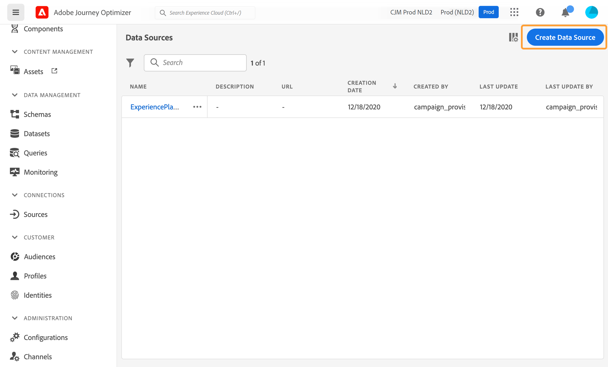

# Origini dati esterne {#external-data-sources}

>[!CONTEXTUALHELP]
>id="ajo_journey_data_source_custom"
>title="Origini dati esterne"
>abstract="Le origini dati esterne consentono di definire una connessione a sistemi di terze parti, ad esempio se si utilizza un sistema di prenotazione alberghiera per verificare se la persona ha registrato una stanza. Invece dell’origine dati integrata di Adobe Experience Platform, puoi creare un numero illimitato di origini dati esterne."

Le origini dati esterne consentono di definire una connessione a sistemi di terze parti, ad esempio se si utilizza un sistema di prenotazione alberghiera per verificare se la persona ha registrato una stanza. Invece dell’origine dati integrata di Adobe Experience Platform, puoi creare un numero illimitato di origini dati esterne.

>[!NOTE]
>
>I guardrail quando si lavora con sistemi esterni sono elencati in [questa pagina](../configuration/external-systems.md).

Sono supportate le API REST che utilizzano POST o GET e restituiscono JSON. Sono supportate le modalità chiave API, di autenticazione di base e personalizzata.

Prendiamo l’esempio di un servizio API per il meteo che voglio utilizzare per personalizzare i comportamenti del mio percorso in base ai dati meteo in tempo reale.

Di seguito sono riportati due esempi della chiamata API:

* _https://api.adobeweather.org/weather?city=London,uk&amp;appid=1234_
* _https://api.adobeweather.org/weather?lat=35&amp;lon=139&amp;appid=1234_

La chiamata è composta da un URL principale (_https://api.adobeweather.org/weather_), due set di parametri (&quot;city&quot; per la città e &quot;lat/long&quot; per la latitudine e la longitudine) e la chiave API (appid).

Di seguito sono riportati i passaggi principali per creare e configurare una nuova origine dati esterna:

1. Dall’elenco delle origini dati, fai clic su **[!UICONTROL Create Data Source]** per creare una nuova origine dati esterna.

   

   Viene aperto il riquadro di configurazione dell’origine dati sul lato destro dello schermo.

   

1. Immettere un nome per l&#39;origine dati.

   >[!NOTE]
   >
   >Non utilizzare spazi o caratteri speciali. Non utilizzare più di 30 caratteri.

1. Aggiungi una descrizione all’origine dati. Questo passaggio è facoltativo.
1. Aggiungi l’URL del servizio esterno. Nel nostro esempio: _https://api.adobeweather.org/weather_.

   >[!CAUTION]
   >
   >È consigliabile utilizzare HTTPS per motivi di sicurezza. Inoltre, non consentiamo l’uso di indirizzi Adobe che non sono disponibili al pubblico e l’uso di indirizzi IP.

   

1. Configura l’autenticazione in base alla configurazione del servizio esterno: **[!UICONTROL No authentication]**, **[!UICONTROL Basic]**, **[!UICONTROL Custom]** o **[!UICONTROL API key]**. Per ulteriori informazioni sulla modalità di autenticazione personalizzata, vedi [questa sezione](../datasource/external-data-sources.md#custom-authentication-mode). Nel nostro esempio, scegliamo:

   * **[!UICONTROL Type]**: &quot;Chiave API&quot;
   * **[!UICONTROL Name]**: &quot;appid&quot; (nome del parametro della chiave API)
   * **[!UICONTROL Value]**: &quot;1234&quot; (questo è il valore della nostra chiave API)
   * **[!UICONTROL Location]**: &quot;Query parameter&quot; (la chiave API si trova nell’URL)

   

1. Aggiungi un nuovo gruppo di campi per ciascun set di parametri API facendo clic su **[!UICONTROL Add a New Field Group]**. Non utilizzare spazi o caratteri speciali nel nome del gruppo di campi. Nel nostro esempio, dobbiamo creare due gruppi di campi, uno per ciascun set di parametri (city e long/lat).

Per il set di parametri &quot;long/lat&quot;, creiamo un gruppo di campi con le seguenti informazioni:

* **[!UICONTROL Used in]**: visualizza il numero di percorsi che utilizzano un gruppo di campi. Puoi fare clic su **[!UICONTROL View journeys]** per visualizzare l’elenco dei percorsi che utilizzano questo gruppo di campi.
* **[!UICONTROL Method]**: selezionare il metodo POST o GET. Nel nostro caso, selezioniamo il metodo GET.
* **[!UICONTROL Dynamic Values]**: inserisci i diversi parametri separati da una virgola, nel nostro esempio &quot;long,lat&quot;. Poiché i valori dei parametri dipendono dal contesto di esecuzione, saranno definiti nei percorsi. [Ulteriori informazioni](../building-journeys/expression/expressionadvanced.md)
* **[!UICONTROL Response Payload]**: fai clic all’interno del **[!UICONTROL Payload]** e incolla un esempio del payload restituito dalla chiamata . Per il nostro esempio, abbiamo utilizzato un payload trovato su un sito web API per il meteo. Verifica che i tipi di campo siano corretti. Ogni volta che viene chiamata l’API, il sistema recupererà tutti i campi inclusi nell’esempio di payload. Puoi fare clic su **[!UICONTROL Paste a new payload]** per modificare il payload attualmente trasmesso.
* **[!UICONTROL Sent Payload]**: questo campo non viene visualizzato nel nostro esempio. È disponibile solo se si seleziona il metodo POST. Incolla il payload che verrà inviato al sistema di terze parti.

Nel caso di una chiamata GET che richieda i parametri, immetti nel **[!UICONTROL Dynamic Values]** e vengono aggiunti automaticamente alla fine della chiamata . In caso di chiamata POST, devi:

* elencare i parametri da trasmettere al momento della chiamata nel **[!UICONTROL Dynamic Values]** (nell’esempio seguente: &quot;identifier&quot;).
* specificali anche con la stessa sintassi nel corpo del payload inviato. A questo scopo, devi aggiungere: &quot;param&quot;: &quot;name of your parameter&quot; (nell’esempio seguente: &quot;identifier&quot;). Segui la sintassi seguente:

   ```
   {"id":{"param":"identifier"}}
   ```


Fai clic su **[!UICONTROL Save]**.

L’origine dati è ora configurata ed è pronta per essere utilizzata nei percorsi, ad esempio nelle tue condizioni o per personalizzare un’e-mail. Se la temperatura è superiore a 30°C, puoi decidere di inviare una comunicazione specifica.

## Modalità di autenticazione personalizzata{#custom-authentication-mode}

>[!CONTEXTUALHELP]
>id="jo_authentication_payload"
>title="Informazioni sull’autenticazione personalizzata"
>abstract="La modalità di autenticazione personalizzata viene utilizzata per l’autenticazione complessa per chiamare i protocolli di wrapping API come OAuth2. L’esecuzione dell’azione è un processo in due fasi. Innanzitutto, viene eseguita una chiamata all’endpoint per generare il token di accesso. Quindi, il token di accesso viene inserito nella richiesta HTTP dell’azione."

Questa modalità di autenticazione viene utilizzata per l’autenticazione complessa, spesso utilizzata per chiamare i protocolli di wrapping API come OAuth2, per recuperare un token di accesso da inserire nella richiesta HTTP reale per l’azione.

Quando configuri l’autenticazione personalizzata, puoi fare clic sul pulsante sottostante per verificare se il payload di autenticazione personalizzata è configurato correttamente.


Se il test ha esito positivo, il pulsante diventa verde.


Con questa autenticazione, l’esecuzione dell’azione è un processo in due fasi:

1. Chiama l&#39;endpoint per generare il token di accesso.
1. Chiama l’API REST inserendo nel modo corretto il token di accesso.

Questa autenticazione ha due parti.

Definizione dell’endpoint da chiamare per la generazione del token di accesso:

* punto finale: URL da utilizzare per generare l’endpoint
* metodo della richiesta HTTP sull&#39;endpoint (GET o POST)
* intestazioni: coppie chiave-valore da inserire come intestazioni in questa chiamata, se necessario
* corpo: descrive il corpo della chiamata se il metodo è POST. Supportiamo una struttura del corpo limitata, definita in bodyParams (coppie chiave-valore). Il bodyType descrive il formato e la codifica del corpo nella chiamata :
   * &#39;form&#39;: significa che il tipo di contenuto sarà application/x-www-form-urlencoded (charset UTF-8) e che le coppie chiave-valore saranno serializzate così come sono: key1=value1&amp;key2=value2&amp;..
   * &#39;json&#39;: significa che il tipo di contenuto sarà application/json (charset UTF-8) e che le coppie chiave-valore saranno serializzate come oggetto json così come sono: _{ &quot;key1&quot;: &quot;value1&quot;, &quot;key2&quot;: &quot;value2&quot;, ...}_

Definizione della modalità di inserimento del token di accesso nella richiesta HTTP dell’azione:

* tipo di autorizzazione: definisce il modo in cui il token di accesso generato deve essere inserito nella chiamata HTTP per l’azione. I valori possibili sono:

   * portatore: indica che il token di accesso deve essere inserito nell’intestazione Autorizzazione, ad esempio: _Autorizzazione: Portatore &lt;access token=&quot;&quot;>_
   * intestazione: indica che il token di accesso deve essere inserito come intestazione, il nome dell&#39;intestazione definito dalla proprietà tokenTarget. Ad esempio, se tokenTarget è myHeader, il token di accesso verrà inserito come intestazione: _myHeader: &lt;access token=&quot;&quot;>_
   * queryParam: indica che il token di accesso deve essere inserito come queryParam, il nome del parametro di query definito dalla proprietà tokenTarget. Ad esempio, se tokenTarget è myQueryParam, l’URL della chiamata di azione sarà: _&lt;url>?myQueryParam=&lt;access token=&quot;&quot;>_

* tokenInResponse: indica come estrarre il token di accesso dalla chiamata di autenticazione. Questa proprietà può essere:
   * &#39;response&#39;: indica che la risposta HTTP è il token di accesso
   * un selettore in un json (partendo dal presupposto che la risposta sia un json, non sono supportati altri formati come XML). Il formato di questo selettore è _json://&lt;path to=&quot;&quot; the=&quot;&quot; access=&quot;&quot; token=&quot;&quot; property=&quot;&quot;>_. Ad esempio, se la risposta della chiamata è: _{ &quot;access_token&quot;: &quot;theToken&quot;, &quot;timestamp&quot;: 12323445656 }_, tokenInResponse sarà: _json: //access_token_

Il formato di questa autenticazione è:

```
{
    "type": "customAuthorization",
    "authorizationType": "<value in 'bearer', 'header' or 'queryParam'>",
    (optional, mandatory if authorizationType is 'header' or 'queryParam') "tokenTarget": "<name of the header or queryParam if the authorizationType is 'header' or 'queryParam'>",
    "endpoint": "<URL of the authentication endpoint>",
    "method": "<HTTP method to call the authentication endpoint, in 'GET' or 'POST'>",
    (optional) "headers": {
        "<header name>": "<header value>",
        ...
    },
    (optional, mandatory if method is 'POST') "body": {
        "bodyType": "<'form'or 'json'>,
        "bodyParams": {
            "param1": value1,
            ...

        }
    },
    "tokenInResponse": "<'response' or json selector in format 'json://<field path to access token>'"
}
```

Puoi modificare la durata della cache del token per un’origine dati di autenticazione personalizzata. Di seguito è riportato un esempio di payload di autenticazione personalizzato. La durata della cache è definita nel parametro &quot;cacheDuration&quot;. Specifica la durata di conservazione del token generato nella cache. L&#39;unità può essere in millisecondi, secondi, minuti, ore, giorni, mesi, anni.

```
"authentication": {
    "type":"customAuthorization",
    "authorizationType":"Bearer",
    "endpoint":"http://localhost:${port}/epsilon/oauth2/access_token",
    "method":"POST",
    "headers": {
        "Authorization":"Basic EncodeBase64(${epsilonClientId}:${epsilonClientSecret})"
        },
    "body": {
        "bodyType":"form",
        "bodyParams": {
             "scope":"cn mail givenname uid employeeNumber",
             "grant_type":"password",
             "username":"${epsilonUserName}",
             "password":"${epsilonUserPassword}"
             }
        },
    "tokenInResponse":"json://access_token",
    "cacheDuration":
             { "duration":5, "timeUnit":"seconds" }
    }
```

>[!NOTE]
>
>La durata della cache aiuta a evitare troppe chiamate agli endpoint di autenticazione. Il mantenimento del token di autenticazione è memorizzato nella cache dei servizi. Non esiste persistenza. Se un servizio viene riavviato, inizia con una cache pulita. La durata predefinita della cache è di 1 ora. Nel payload di autenticazione personalizzato, può essere adattato specificando un’altra durata di conservazione.
