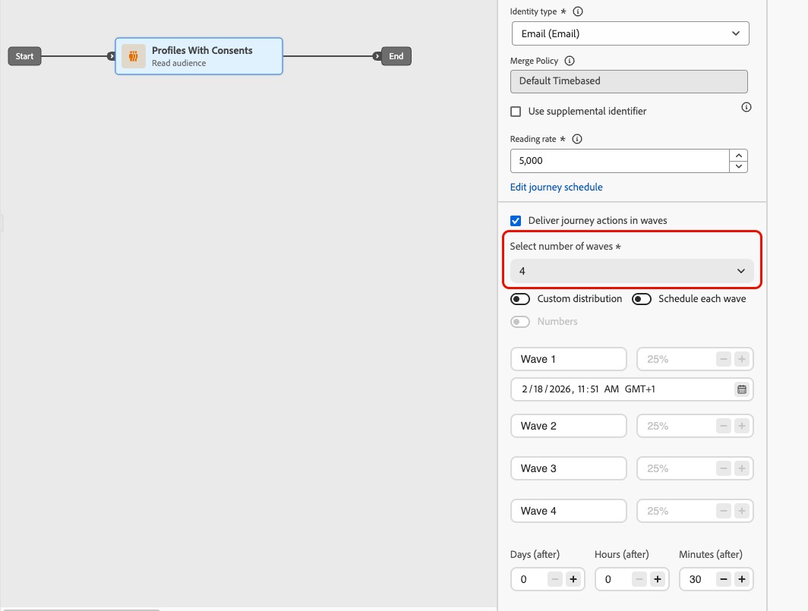
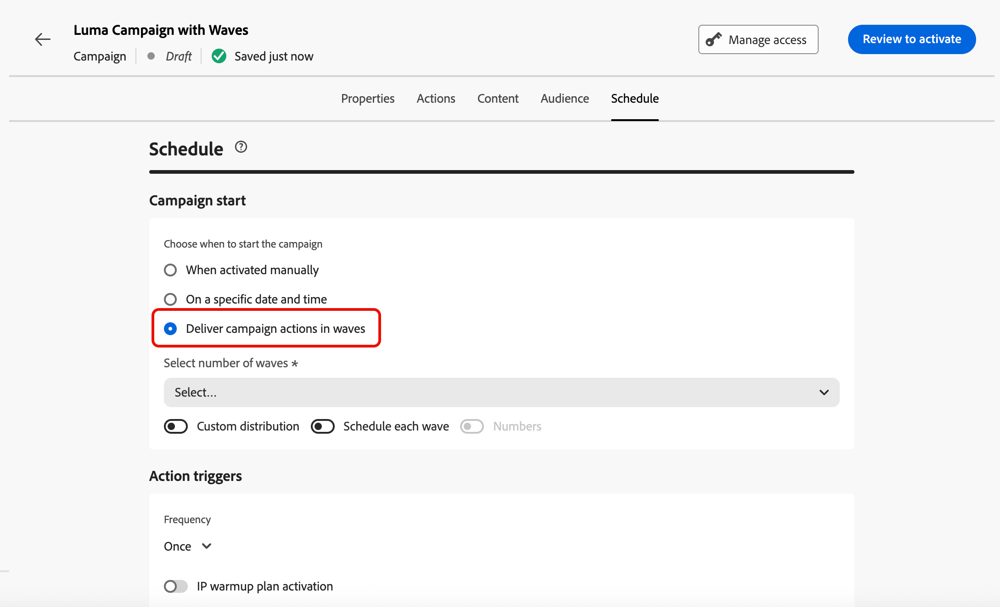
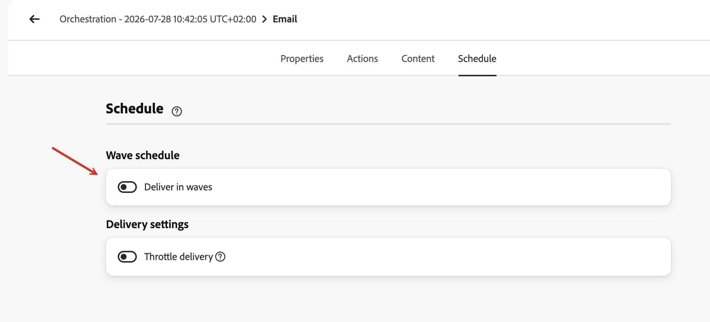
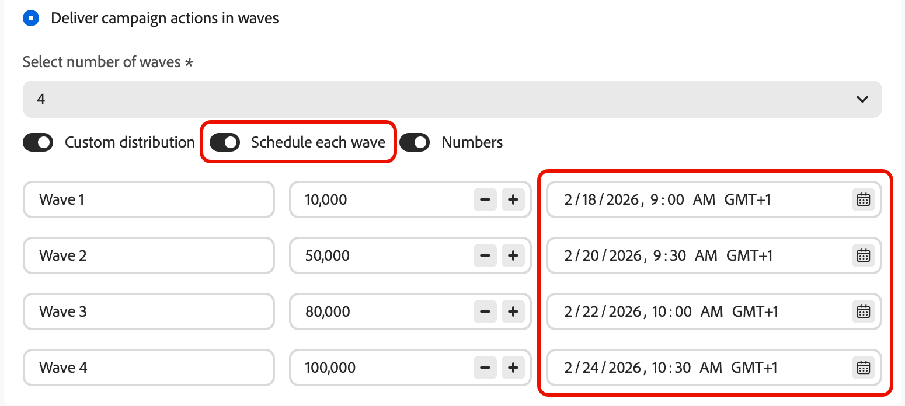

# Inviare utilizzando gli scaglioni {#send-using-waves}

>[!BEGINSHADEBOX]

**In questa pagina:** scopri come suddividere la consegna dei messaggi in uscita in batch pianificati (ondate) per bilanciare il carico, proteggere la reputazione del mittente e migliorare il recapito messaggi, disponibili in percorsi di pubblico di lettura, campagne di azione e campagne orchestrate.

>[!ENDSHADEBOX]

Invece di inviare tutti i messaggi contemporaneamente, puoi pianificare la consegna in batch controllati denominati **ondate**. L&#39;invio ondata consente di:

* Bilanciare il carico e proteggere i sistemi a valle (come i call center o le pagine di destinazione) dall’essere sopraffatti
* Supporto del recapito messaggi e della reputazione del mittente, in particolare per invii di volumi elevati
* Aumento progressivo del volume di consegna durante il riscaldamento di un nuovo IP o piattaforma

Puoi definire il numero di scaglioni, la loro dimensione (come percentuale del pubblico o come numeri assoluti) e quando viene eseguito ogni scaglione.

## Limitazioni e protezioni {#limitations-guardrails}

Le seguenti limitazioni si applicano in tutti i contesti:

* È necessario definire almeno **2 scaglioni** e aggiungere fino a **10 scaglioni**.
* L&#39;intervallo minimo tra l&#39;inizio di due scaglioni è **30 minuti**.
* Non è possibile impostare un inizio ondata nel passato.

Si applicano vincoli aggiuntivi specifici del contesto:

>[!BEGINTABS]

>[!TAB Leggi percorsi di pubblico]

* L&#39;invio ondata è disponibile solo per percorsi di pubblico di lettura con i tipi di pianificazione **[!DNL As soon as possible]** e **[!UICONTROL Once]**. [Ulteriori informazioni sulla pianificazione del percorso](../building-journeys/read-audience.md#schedule).
* L’invio ondata non è disponibile per percorsi ricorrenti, attivati da eventi, eventi di business, modalità di test o a esecuzione inattiva.
* L&#39;inizio di un&#39;ondata non può precedere l&#39;inizio del percorso.
* La suddivisione del pubblico in ondate può richiedere fino a 1 ora. I profili non possono entrare nel percorso fino al completamento della divisione.
* All&#39;interno di una singola versione del percorso, due scaglioni non vengono mai eseguiti contemporaneamente. L&#39;ondata successiva inizia solo dopo la fine dell&#39;ondata precedente. Ad esempio, se le ondate sono programmate a 1 ora di distanza ma la prima ondata viene eseguita per 2 ore, la seconda ondata inizia al termine della prima, non all&#39;ora originariamente programmata.
* L&#39;avvio delle onde può essere ritardato quando la piattaforma applica limiti di quota o quando la capacità del sistema è soggetta a un carico elevato.

>[!TAB Campagne con azioni]

* L&#39;invio ondata si applica solo alle **azioni in uscita** (e-mail, SMS, push, direct mail).
* L&#39;inizio di un&#39;ondata non può precedere l&#39;inizio della campagna.

<!--
>[!TAB Orchestrated campaigns]

* Wave sending applies to **outbound** channel activities only (Email, SMS, Push, Direct mail).
* Wave sending is configured at the **channel activity level**, independently for each channel activity in the campaign.
-->

>[!ENDTABS]

## Configurare l’invio ondata {#configure-wave-sending}

>[!CONTEXTUALHELP]
>id="ajo_wave_sending"
>title="Inviare utilizzando gli scaglioni"
>abstract="Dividi la consegna dei messaggi in batch pianificati (scaglioni) per controllare il volume nel tempo. Puoi definire fino a 10 scaglioni con dimensioni e tempistiche uguali o personalizzate."

>[!CONTEXTUALHELP]
>id="ajo_orchestration_wave_sending"
>title="Inviare utilizzando gli scaglioni"
>abstract="Dividi la consegna dei messaggi in batch pianificati (scaglioni) per controllare il volume nel tempo. Puoi definire fino a 10 scaglioni con dimensioni e tempistiche uguali o personalizzate."

I passaggi per abilitare l&#39;invio di ondate dipendono dal contesto: percorso di pubblico in lettura o campagna di azione. Seleziona la scheda pertinente di seguito, quindi fai riferimento alla sezione [Dimensione ondata e tempistica](#wave-options) per completare la configurazione.

>[!BEGINTABS]

>[!TAB Leggi percorsi di pubblico]

1. Inizia il percorso con un&#39;attività [Read Audience](../building-journeys/read-audience.md).

1. Fai doppio clic sull&#39;attività **[!UICONTROL Read Audience]** per aprirne le proprietà e seleziona l&#39;opzione **[!UICONTROL Consegna percorso a ondate]**.

   {width="100%"}

1. Imposta il **numero di scaglioni** (ad esempio, 4).

   {width="80%"}

   >[!NOTE]
   >
   >È necessario definire almeno 2 scaglioni e aggiungere fino a 10 scaglioni.

1. Scegli come definire la dimensione e la tempistica dell&#39;onda come descritto nella sezione seguente [Dimensione e tempistica dell&#39;onda](#wave-options).

>[!TAB Campagne con azioni]

1. Crea o apri una [campagna Azione](../campaigns/create-campaign.md) contenente un&#39;azione in uscita (e-mail, SMS, push o direct mail).

1. Nella scheda **[!UICONTROL Pianifica]** della campagna, seleziona **[!UICONTROL Consegna azioni campagna in modo graduale]**.

   {width="100%"}

   >[!NOTE]
   >
   >L&#39;opzione **[!UICONTROL Consegna campagne in ondate]** viene visualizzata solo quando nella scheda **[!UICONTROL Azioni]** della campagna è selezionata un&#39;azione in uscita. [Ulteriori informazioni](../campaigns/campaign-action.md)

1. Imposta il numero di scaglioni (ad esempio, 4).

   >[!NOTE]
   >
   >È necessario definire almeno 2 scaglioni e aggiungere fino a 10 scaglioni.

1. Scegli come definire la dimensione e la tempistica dell&#39;onda come descritto nella sezione seguente [Dimensione e tempistica dell&#39;onda](#wave-options).

<!--
>[!TAB Orchestrated campaigns]

1. Open a channel activity (Email, SMS, Push, or Direct mail) in your orchestrated campaign canvas.

1. Go to the **[!UICONTROL Schedule]** tab of the channel activity.

1. Under **[!UICONTROL Wave schedule]**, enable the **[!UICONTROL Deliver in waves]** toggle.

    {width="90%"}

1. Set the number of waves using the **[!UICONTROL Select number of waves]** dropdown.

   >[!NOTE]
   >
   >You must define at least 2 waves and can add up to 10 waves.

1. Choose how to define wave size and timing as detailed in the [Wave size and timing](#wave-options) section below.
-->

>[!ENDTABS]

## Dimensione d&#39;onda e tempi {#wave-options}

Una volta impostato il numero di ondate, definisci come il pubblico viene distribuito tra di esse e quando viene eseguita ogni ondata. Sono disponibili tre opzioni:

* [Onde uguali](#equal-waves) - Dividi il pubblico in porzioni di uguali dimensioni con un intervallo fisso tra l&#39;inizio dell&#39;ondata. Consigliato per invii diretti e con tempistica uniforme.
* [Distribuzione personalizzata](#custom-distribution): imposta manualmente le dimensioni di ogni ondata come percentuale o numero assoluto di profili. Ideale per incrementi progressivi o suddivisioni irregolari del pubblico.
* [Pianificazione personalizzata](#custom-schedule) — Assegna una data e un&#39;ora di inizio specifiche a ogni scaglione. Consigliato quando hai bisogno di tempistiche precise che non seguono un intervallo regolare.

### Onde uguali {#equal-waves}

Per impostazione predefinita, il pubblico è suddiviso in ondate di uguali dimensioni. Imposta un intervallo fisso tra l’inizio di ogni ondata (ad esempio, 2 ore). Il sistema pianifica quindi automaticamente le onde successive, ad esempio la prima alle 09:00, la seconda alle 01:00, la terza alle 13:00 e la quarta alle 15:00.

{width="80%"}

>[!NOTE]
>
>L&#39;intervallo minimo tra l&#39;inizio di due scaglioni è **30 minuti**.

### Distribuzione personalizzata {#custom-distribution}

Seleziona l&#39;opzione **[!UICONTROL Distribuzione personalizzata]** per definire la dimensione di ogni ondata come percentuale del pubblico totale (ad esempio, 15%, 20%, 25%, 40%).

{width="80%"}

Seleziona **[!UICONTROL Numeri]** per definire la dimensione di ogni ondata come numero assoluto di profili (ad esempio, 10.000; 50.000).

{width="80%"}

>[!NOTE]
>
>* Quando si utilizzano le percentuali, il totale di tutte le ondate deve essere 100%. In caso contrario, viene visualizzato un avviso.
>
>* Quando si utilizzano i numeri, il sistema non convalida la copertura totale e assicura che le dimensioni dell&#39;onda coprano il pubblico previsto. [Ulteriori informazioni](#faq)

### Pianificazione personalizzata {#custom-schedule}

Seleziona **[!UICONTROL Pianifica ogni scaglione]** per definire una data e un&#39;ora di inizio specifiche per ogni scaglione. Non è necessario che le onde siano equidistanti (ad esempio, 9:00 AM, 11:00 AM, 5:00 PM, 8:30 PM).

{width="80%"}

>[!NOTE]
>
>L&#39;intervallo minimo tra l&#39;inizio di due scaglioni è **30 minuti**.

## Casi d’uso {#use-cases}

L’invio ondata consente di controllare quando e quanti messaggi vengono inviati, migliorando il recapito messaggi, proteggendo la reputazione del mittente e allineando gli invii con la capacità operativa. Considera l’utilizzo delle onde in questi scenari:

* **Gestione di call center o risposte:** limitare il numero di messaggi inviati al giorno o all&#39;ora in modo che i team a valle (ad esempio l&#39;assistenza clienti) possano gestire le risposte a un tasso gestibile.

  {width="50%"}

* **Volume elevato e recapito messaggi:** Evita di inviare un pubblico molto grande in un&#39;unica schermata. La distribuzione della consegna nel tempo contribuisce a mantenere la reputazione del mittente e riduce il rischio di essere segnalati come spam.

  {width="50%"}

* **Riscaldamento IP:** Quando si utilizza una nuova piattaforma o un nuovo indirizzo IP, aumentare progressivamente il volume (ad esempio, 10% nella prima ondata, quindi 15%, 20% e così via) per creare gradualmente la reputazione di invio.

  {width="50%"}

## Domande frequenti {#faq}

+++ Cosa succede se la somma delle dimensioni delle onde non è uguale al pubblico totale?

* Se la somma **supera** il pubblico (ad esempio, pianifichi 100.000 nella prima ondata per un pubblico di 80.000), la prima ondata invia al pubblico completo e le ondate rimanenti non hanno profili, ma non vengono eseguite.
* Se la somma **è inferiore** rispetto al pubblico (ad esempio, si definiscono quattro ondate per un totale di 40.000 profili per un pubblico di 100.000), solo i profili inclusi in tali ondate ricevono il messaggio. I profili rimanenti non ricevono la comunicazione e non vengono ritentati negli scaglioni successivi.

+++

+++ Posso assegnare diversi segmenti di contenuto o pubblico a singole ondate?

No. Potete definire solo la dimensione e la tempistica di ogni onda. Lo stesso contenuto di pubblico e messaggio si applica a tutte le ondate: non è possibile eseguire il targeting di segmenti diversi o utilizzare contenuti diversi per ondata.

+++

+++ Il pubblico viene rivalutato prima di ogni ondata o è fisso al momento dell’attivazione?

Il pubblico è **valutato una volta** all&#39;attivazione (all&#39;avvio del percorso o della campagna/attività). A quel punto viene creata un’istantanea dei profili idonei, che viene utilizzata in tutte le fasi: l’appartenenza al pubblico non viene rivalutata prima di ogni fase successiva.

Tuttavia, **gli attributi del profilo vengono letti al momento di ogni processo ondata**, non al momento dell&#39;attivazione. Ciò significa che per le ondate distribuite su più giorni:

* Gli attributi di Personalization (ad esempio, il nome o il livello fedeltà di un profilo) riflettono lo stato del profilo al momento dell’esecuzione dell’ondata.
* **I controlli di consenso e soppressione vengono riapplicati al momento dell&#39;invio per ogni ondata.** Se un profilo rinuncia tra due scaglioni, non riceverà messaggi nelle scaglioni successive.

In sintesi: *chi* è incluso è fisso in anticipo, ma *i dati utilizzati per personalizzare e inviare a tali profili* riflettono il loro stato corrente quando la loro ondata viene elaborata.

+++

+++ L’invio ondata funziona con i canali in entrata?

No. L&#39;invio ondata si applica solo alle **azioni del canale in uscita**: e-mail, SMS, notifiche push e direct mail. I canali in entrata (come il web, in-app o esperienze basate su codice) non sono influenzati dalla configurazione dell’invio ondata.

+++

## Vedi anche {#see-also}

* [Utilizzare un pubblico in un percorso](../building-journeys/read-audience.md) — configurare l&#39;attività Read audience
* [Pianifica una campagna di azioni](../campaigns/campaign-schedule.md) — imposta data di inizio, data di fine e frequenza
<!-- * [Channel activities in Orchestrated campaigns](../orchestrated/activities/channels.md) — configure channel activities in the orchestrated canvas -->

+++ Guida di riferimento della Knowledge Base di AI

Questa sezione contiene informazioni strutturate che supportano l&#39;interpretazione, il recupero e la risposta alle domande relative a questo argomento.

Per una comprensione completa, queste informazioni devono essere unite alla documentazione su questa pagina. Nessuna delle due origini è progettata per essere indipendente; la pagina descrive la funzione, mentre questa sezione fornisce un contesto aggiuntivo che aiuta a non ambiguare la terminologia, le finalità, l’applicabilità e i vincoli.

* **TL;DR:** In questa pagina viene illustrato come configurare l&#39;invio di messaggi in uscita in Adobe Journey Optimizer in modo da distribuire i messaggi in batch controllati nel tempo, migliorando il recapito messaggi e proteggendo la reputazione del mittente. L’invio ondata è disponibile in percorsi di pubblico di lettura, campagne di azione e campagne orchestrate.

**Intenti:**
* Abilitare l’invio ondata in un percorso Read Audience, una campagna Azione o un’attività del canale di una campagna orchestrata
* Configurare le onde uguali con un intervallo fisso tra ogni ondata
* Definire le dimensioni delle ondate personalizzate come percentuali o conteggi assoluti dei profili
* Pianificare ogni scaglione con una data e un’ora di inizio specifiche
* Controllare il volume di consegna per proteggere la reputazione del mittente o allinearlo alla capacità operativa

**Glossario:**
* **Invio ondata**: modalità di consegna che suddivide il pubblico in batch (ondate) e invia messaggi a ogni batch a intervalli pianificati anziché a tutti contemporaneamente *(specifico per prodotto)*
* **Onde uguali**: configurazione in cui il pubblico viene suddiviso in parti di uguali dimensioni con un intervallo fisso tra le ondate inizia *(specifico per prodotto)*
* **Distribuzione personalizzata**: configurazione in cui la dimensione di ogni ondata viene definita manualmente come percentuale o numero assoluto di profili *(specifici del prodotto)*
* **Pianificazione personalizzata**: configurazione in cui ogni ondata ha una data e un&#39;ora di inizio specifiche, che consentono una spaziatura non uniforme *(specifica del prodotto)*

**Contesti in cui è disponibile l&#39;invio ondata:**
* Leggi percorsi di pubblico (&quot;Appena possibile&quot; o solo pianificazione &quot;Una volta&quot; — non per percorsi ricorrenti, attivati da eventi, eventi di business, test o a esecuzione inattiva)
* Campagne di azione (solo azioni del canale in uscita)
<!-- * Orchestrated campaigns (outbound channel activities only, configured per channel activity) -->

**Guardrail comuni (tutti i contesti):**
* Minimo 2 scaglioni, massimo 10 scaglioni
* Almeno 30 minuti tra l&#39;inizio di due scaglioni consecutivi
* L&#39;inizio ondata non può essere nel passato
* La distribuzione personalizzata basata su percentuale deve raggiungere il 100%
* La distribuzione personalizzata basata sul numero non convalida automaticamente la copertura totale

**Guardrail specifici del Percorso:**
* L&#39;inizio ondata non può precedere l&#39;inizio percorso
* La suddivisione del pubblico può richiedere fino a 1 ora; i profili possono essere ritardati
* Due scaglioni non vengono mai eseguiti contemporaneamente all&#39;interno della stessa versione del percorso
* L&#39;avvio delle onde può essere ritardato dai limiti di quota della piattaforma o dal carico di sistema pesante

**Domande frequenti:**
* **Q: l&#39;invio ondata si applica ai canali in entrata?** — No; solo in uscita (e-mail, SMS, push, direct mailing).
* **D: posso assegnare contenuti diversi a singole ondate?** — No; stesso pubblico e contenuto per tutte le ondate. Solo le dimensioni e i tempi possono differire.
* **Q: qual è il tempo minimo tra due scaglioni?** — 30 minuti tra l&#39;inizio di due ondate consecutive.
* **D: cosa succede se le dimensioni delle ondate superano o non raggiungono il pubblico?** — Eccesso: la prima ondata invia al pubblico completo, le ondate rimanenti non vengono eseguite. Mancanza di dati: il messaggio viene ricevuto solo dalle ondate definite, mentre gli altri non vengono ritentati.
* **Q: il pubblico viene rivalutato per ondata?** — No; il pubblico viene registrato all&#39;attivazione. Gli attributi del profilo (personalizzazione, consenso) vengono letti al momento dell’elaborazione delle ondate.

+++
