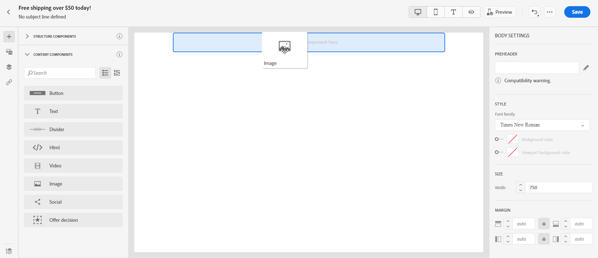
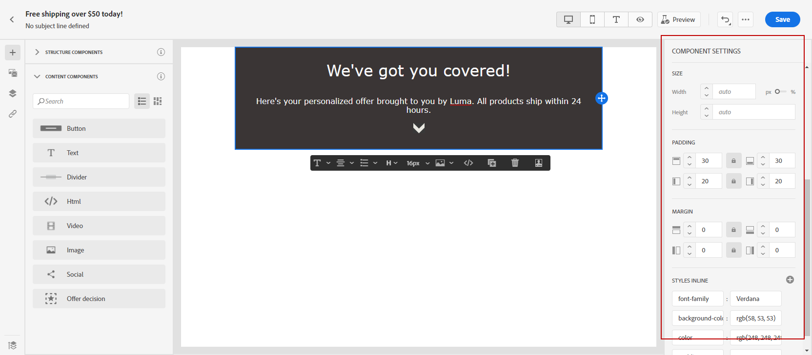

# Inizia da zero {#create-email-content}

>[!CONTEXTUALHELP]
>id="ac_structure_components_email"
>title="Informazioni sui componenti Struttura"
>abstract="I componenti struttura definiscono il layout del messaggio e-mail."

>[!CONTEXTUALHELP]
>id="ac_structure_components_landing_page"
>title="Informazioni sui componenti Struttura"
>abstract="I componenti struttura definiscono il layout della pagina di destinazione."

>[!CONTEXTUALHELP]
>id="ac_structure_components_fragment"
>title="Informazioni sui componenti Struttura"
>abstract="I componenti struttura definiscono il layout del frammento."

>[!CONTEXTUALHELP]
>id="ac_structure_components_template"
>title="Informazioni sui componenti Struttura"
>abstract="I componenti struttura definiscono il layout del modello."

>[!CONTEXTUALHELP]
>id="ac_edition_columns_email"
>title="Definizione delle colonne e-mail"
>abstract="E-mail Designer consente di definire facilmente il layout dell’e-mail definendo la struttura delle colonne."

>[!CONTEXTUALHELP]
>id="ac_edition_columns_landing_page"
>title="Definizione delle colonne della pagina di destinazione"
>abstract="E-mail Designer consente di definire facilmente il layout della pagina di destinazione definendo la struttura delle colonne."

>[!CONTEXTUALHELP]
>id="ac_edition_columns_fragment"
>title="Definizione delle colonne di un frammento"
>abstract="E-mail Designer consente di definire facilmente il layout del frammento definendo la struttura delle colonne."

>[!CONTEXTUALHELP]
>id="ac_edition_columns_template"
>title="Definizione delle colonne dei modelli"
>abstract="E-mail Designer consente di definire facilmente il layout del modello definendo la struttura delle colonne."

E-mail Designer consente di definire facilmente la struttura delle e-mail. Aggiungendo e spostando elementi strutturali con semplici azioni di trascinamento, puoi progettare la forma del messaggio e-mail in pochi secondi.

Per iniziare a creare il contenuto delle e-mail con e-mail designer, segui i passaggi seguenti:

1. Dalla home page di E-mail Designer, seleziona la **[!UICONTROL Progettazione da zero]** opzione .

   

1. Inizia a progettare il contenuto delle e-mail trascinandolo e rilasciandolo **[!UICONTROL Componenti struttura]** per definire il layout del messaggio e-mail.

   >[!NOTE]
   >
   >Tieni presente che una pila di colonne non è compatibile con tutti i programmi e-mail. Se non è supportato, le colonne non verranno sovrapposte.
   >
   >Una volta inseriti nell’e-mail, non puoi spostare né rimuovere i componenti a meno che non sia già presente un componente di contenuto o un frammento all’interno.

   

1. Aggiungi tutti **[!UICONTROL Componenti struttura]** se necessario.

   Seleziona la **[!UICONTROL colonna n:n]** per definire il numero di colonne desiderato (tra 3 e 10). È inoltre possibile definire la larghezza di ogni colonna spostando le frecce nella parte inferiore di ciascuna colonna.

   >[!NOTE]
   >
   >Le dimensioni di ogni colonna non possono essere inferiori al 10% della larghezza totale del componente struttura. Non è possibile rimuovere una colonna non vuota.

1. Da **[!UICONTROL Componenti contenuto]** a discesa, puoi aggiungere altrettanti **[!UICONTROL Componenti contenuto]** come necessario nel componente struttura. [Ulteriori informazioni sui componenti di contenuto](content-components.md).

   

1. Ogni componente può essere ulteriormente personalizzato con il **[!UICONTROL Impostazioni dei componenti]** sezione . Ad esempio, puoi modificare lo stile del testo, la spaziatura o il margine del componente. [Ulteriori informazioni su allineamento e spaziatura](adjusting-vertical-alignment-and-padding.md).

   

1. Da **[!UICONTROL Selettore risorse]**, puoi aggiungere direttamente le risorse memorizzate in **[!UICONTROL Libreria risorse]** alla tua e-mail. [Ulteriori informazioni sulla gestione delle risorse](assets-essentials.md).

   Fai doppio clic sulla cartella contenente le risorse e trascina e rilascia la risorsa da aggiungere all’e-mail.

   

1. Aggiungi campi di personalizzazione per personalizzare il contenuto dai dati dei profili. [Ulteriori informazioni sulla personalizzazione dei contenuti](../personalization/personalize.md).

   

1. In **[!UICONTROL Collegamenti]** nel riquadro a sinistra, controlla l’elenco di tutti gli URL del contenuto che verranno tracciati. È possibile modificare le **[!UICONTROL Tipo di tracciamento]**, **[!UICONTROL Etichetta]** e **[!UICONTROL Tag]** se necessario.

   

   >[!NOTE]
   >
   >Ulteriori informazioni sui collegamenti e il tracciamento dei messaggi in [questa pagina](message-tracking.md).

1. Se necessario, puoi passare all’editor di codice per personalizzare ulteriormente l’e-mail facendo clic su **[!UICONTROL Passa all’editor di codice]** dal menu avanzato. Per ulteriori informazioni sull&#39;editor di codice, consulta [questa pagina](code-content.md#).

   >[!NOTE]
   >
   >Dopo il passaggio all’editor di codice, non potrai utilizzare la finestra di progettazione visiva per questa e-mail.

   

1. Fai clic su **[!UICONTROL Mostra anteprima]** per controllare il rendering delle e-mail. È possibile scegliere la visualizzazione desktop o mobile.

   Per ulteriori informazioni su come visualizzare l’anteprima del messaggio e-mail, consulta [questa pagina](preview.md).

   

1. Quando l’e-mail è pronta, fai clic su **[!UICONTROL Salva e chiudi]**.

