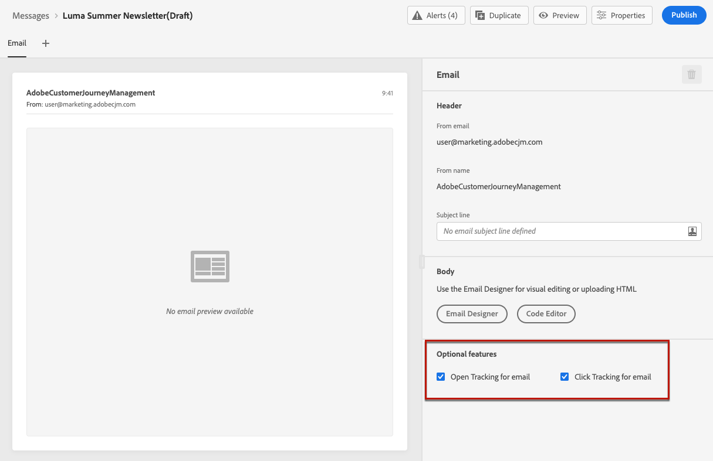
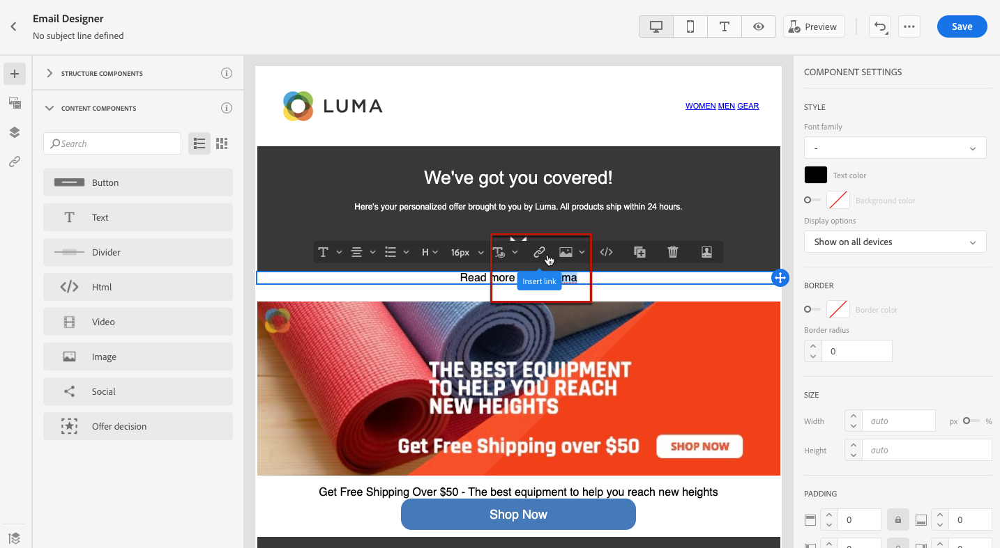
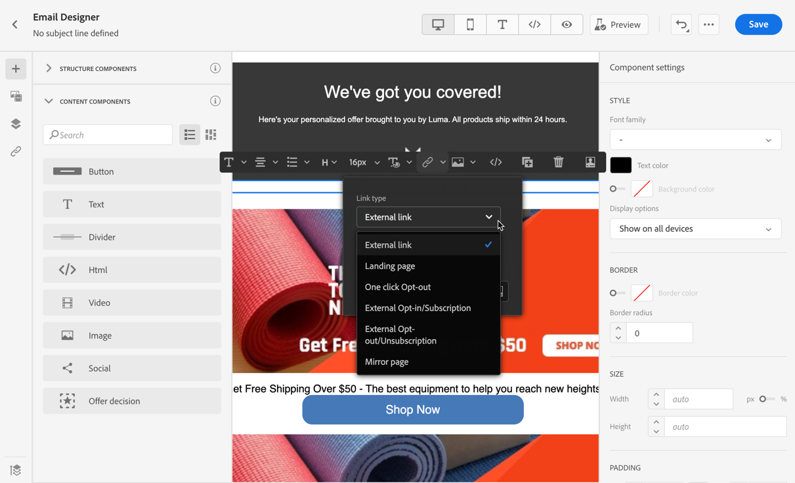
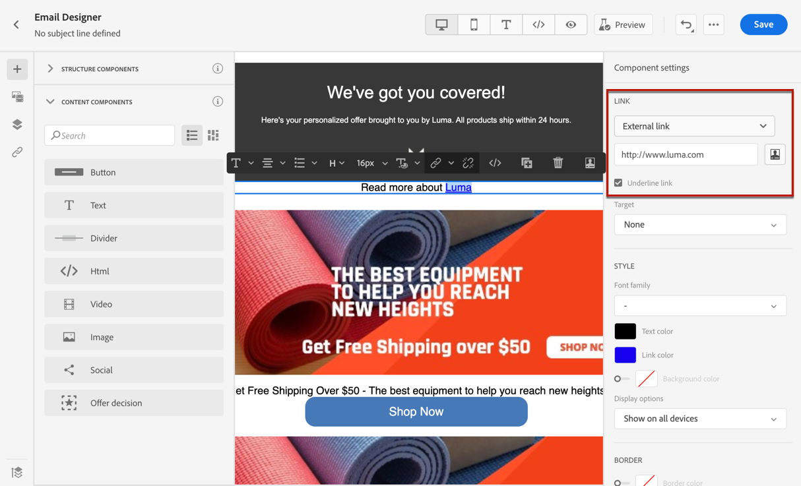

# Aggiungere link e tenere traccia dei messaggi {#tracking}

Utilizzo [!DNL Journey Optimizer] aggiungere collegamenti al contenuto e tenere traccia dei messaggi inviati per monitorare il comportamento dei destinatari.

## Abilita tracciamento {#enable-tracking}

Puoi abilitare il tracciamento a livello di messaggio e-mail controllando il **[!UICONTROL Open Tracking for email]** e/o **[!UICONTROL Click Tracking for email]** opzioni quando [creazione del messaggio](../messages/get-started-content.md).

>[!NOTE]
>
>Entrambe le opzioni sono abilitate per impostazione predefinita.

In questo modo puoi tenere traccia del comportamento dei destinatari attraverso:

* **[!UICONTROL Open Tracking for email]**: Messaggi aperti.
* **[!UICONTROL Click Tracking for email]**: Fai clic sui collegamenti in un’e-mail.

## Inserire collegamenti {#insert-links}

Durante la progettazione di un messaggio, puoi aggiungere collegamenti al contenuto.

>[!NOTE]
>
>Quando [tracciamento abilitato](#enable-tracking), vengono tracciati tutti i collegamenti inclusi nel contenuto del messaggio.

Per inserire collegamenti nel contenuto delle e-mail, segui la procedura seguente:

1. Seleziona un elemento e fai clic su **[!UICONTROL Insert link]** dalla barra degli strumenti contestuale.

   

1. Scegli il tipo di collegamento che desideri creare:

   * **[!UICONTROL External link]**: Inserisci un collegamento a un URL esterno.

   * **[!UICONTROL Landing page]**: Inserisci un collegamento a una pagina di destinazione. [Ulteriori informazioni](../landing-pages/get-started-lp.md)

   * **[!UICONTROL One click Opt-out]**: Inserisci un collegamento per consentire agli utenti di annullare rapidamente l’iscrizione alle tue comunicazioni senza dover confermare l’rinuncia. [Ulteriori informazioni](../messages/consent.md#one-click-opt-out).

   * **[!UICONTROL External Opt-in/Subscription]**: Inserisci un collegamento per accettare la ricezione di comunicazioni dal tuo marchio.

   * **[!UICONTROL External Opt-out/Unsubscription]**: Inserisci un collegamento per non ricevere comunicazioni dal tuo marchio. Ulteriori informazioni sulla gestione delle rinunce sono disponibili in [questa sezione](../messages/consent.md#opt-out-management).

   * **[!UICONTROL Mirror page]**: Inserisci un collegamento per visualizzare il contenuto dell’e-mail in un browser web. [Ulteriori informazioni](#mirror-page).

   

1. Puoi personalizzare i tuoi collegamenti. Ulteriori informazioni sugli URL personalizzati sono disponibili in [questa sezione](../personalization/personalization-syntax.md#perso-urls).

1. Salva le modifiche.

1. Una volta creato il collegamento, puoi comunque modificarlo dal **[!UICONTROL Component settings]** a destra.

   * Puoi modificare il collegamento e modificarne il tipo.
   * Puoi scegliere di sottolineare il collegamento o meno selezionando l’opzione corrispondente.

   

## Collegamento a una pagina speculare {#mirror-page}

La pagina speculare è una pagina HTML accessibile online tramite un browser web. Il contenuto è identico a quello dell’e-mail.

Per aggiungere un collegamento a una pagina speculare nell’e-mail, [inserire un collegamento](#insert-links) e seleziona **[!UICONTROL Mirror page]** come tipo di collegamento.

La pagina speculare viene creata automaticamente.

>[!NOTE]
>
>Non puoi modificare il collegamento generato automaticamente.

Una volta inviata l’e-mail, quando i destinatari fanno clic sul collegamento della pagina speculare, il contenuto dell’e-mail viene visualizzato nel browser Web predefinito.

>[!NOTE]
>
>In [prova](preview.md#send-proofs) inviato ai profili di test, il collegamento alla pagina speculare non è attivo. Viene attivato solo nei messaggi finali.

Il periodo di conservazione per una pagina speculare è di 60 giorni. Dopo tale ritardo, la pagina speculare non sarà più disponibile.

## Gestire il tracciamento {#manage-tracking}

La [E-mail Designer](create-email-content.md) consente di gestire gli URL tracciati, ad esempio modificando il tipo di tracciamento per ogni collegamento.

1. Fai clic sul pulsante **[!UICONTROL Links]** per visualizzare l’elenco di tutti gli URL del contenuto che verranno tracciati.

   Questo elenco consente di avere una visualizzazione centralizzata e di individuare ogni URL nel contenuto dell’e-mail.

1. Per modificare un collegamento, fai clic sull’icona a forma di matita corrispondente.

   

1. Puoi modificare la **[!UICONTROL Tracking Type]** se necessario:

   

   Per ogni URL tracciato, puoi impostare la modalità di tracciamento su uno dei seguenti valori:

   * **[!UICONTROL Tracked]**: Attiva il tracciamento su questo URL.
   * **[!UICONTROL Opt out]**: Considera questo URL come un URL di rinuncia o di annullamento dell’abbonamento.
   * **[!UICONTROL Mirror page]**: Considera questo URL come un URL della pagina speculare.
   * **[!UICONTROL Never]**: Non attiva mai il tracciamento di questo URL. <!--This information is saved: if the URL appears again in a future message, its tracking is automatically deactivated.-->

Il numero di messaggi aperti e il numero di collegamenti su cui è stato fatto clic sono elencati nella [Scheda Esecuzioni](../reports/message-monitoring.md).

Il reporting su aperture e clic è disponibile nella [Report dal vivo e-mail](../reports/email-live-report.md) e [Report globale e-mail](../reports/email-global-report.md).
