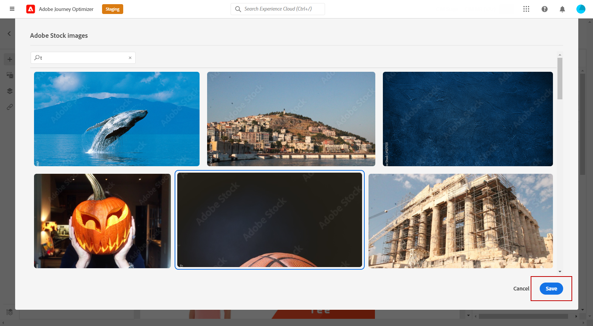

# Gestisci [!DNL Adobe Stock] immagini {#stock}

## Introduzione a [!DNL Adobe Stock] {#get-started-stock}

[!DNL Adobe Stock] consente di accedere a milioni di foto, video, illustrazioni e immagini vettoriali di alta qualità, curate e prive di royalty. È possibile scegliere di acquistare un pacchetto di crediti per la licenza delle risorse o acquistare solo una licenza Standard o Extended per la risorsa necessaria. Adobe Stock fornisce anche una raccolta gratuita di risorse.

Per ulteriori informazioni su [!DNL Adobe Stock], fare riferimento a [Guida introduttiva di Adobe Stock](https://helpx.adobe.com/stock/get-started.html).

Con [!DNL Adobe Journey Optimizer], puoi caricare le immagini nelle e-mail direttamente da [!DNL Adobe Stock] e aggiungilo alla cartella Risorse. La **[!UICONTROL Find Similar Image]** Questa opzione consente di trovare immagini che corrispondono al contenuto, al colore e alla composizione della risorsa utilizzata nella consegna.
[Ulteriori informazioni sulla progettazione delle e-mail](design-emails.md).

## Inserisci ed importa [!DNL Adobe Stock] immagini {#add-stock-image}

>[!NOTE]
>
> La **[!UICONTROL Find Adobe Stock photos]** Sarà disponibile solo per gli utenti con accesso a un profilo di prodotto AEM Assets Essentials. Per ulteriori informazioni, consulta [Documentazione essenziale delle risorse](https://experienceleague.adobe.com/docs/experience-manager-assets-essentials/help/get-started-admins/deploy-administer.html#add-users-to-essentials).

Dopo aver modificato e personalizzato il messaggio e-mail, puoi aggiungere immagini da [!DNL Adobe Stock] nel modello:

1. Trascinamento di un’immagine **[!UICONTROL Content components]** alla tua e-mail.

   

1. Dal menu **[!UICONTROL Component settings]**, seleziona **[!UICONTROL Find Adobe Stock photos]**.

   

1. Sfoglia la libreria o immetti il termine di ricerca nel campo . Seleziona l’immagine selezionata e fai clic su **[!UICONTROL Save]**.

   

1. Per concedere in licenza e scaricare l&#39;immagine, seleziona la tua immagine **[!UICONTROL Content components]** e fai clic su **[!UICONTROL License Adobe Stock image]**. Verrà eseguito il reindirizzamento al [!DNL Adobe Stock] sito web.

   >[!NOTE]
   > Se l&#39;immagine è già in possesso di una licenza, verrà rappresentata dalla  icona. In tal caso, puoi saltare al passaggio 7.

   

1. Da [!DNL Adobe Stock] sito web, dovrai acquistare la risorsa per poter scaricare l’immagine e rimuovere la filigrana.

   Questo acquisto dipenderà dal tuo piano o abbonamento Adobe Stock. Se disponi di più account Adobe Stock, verrai reindirizzato all’ultimo ID Stock utilizzato. In questo caso, accertati di aver effettuato l’accesso all’account corretto prima di concedere in licenza la risorsa.
Per ulteriori informazioni, consulta questa [pagina](https://stock.adobe.com/plans).

   >[!WARNING]
   > Se viene inviata un&#39;e-mail con un&#39;immagine senza licenza, l&#39;immagine manterrà il proprio modulo senza licenza con la filigrana.

   

1. Una volta completato l&#39;acquisto, puoi tornare all&#39;e-mail in [!DNL Adobe Journey Optimizer] e seleziona **[!UICONTROL Import stock image]** per importare l’immagine con licenza nelle risorse.

   

1. Seleziona la cartella in cui verrà memorizzata la risorsa. Per ulteriori informazioni su [!DNL Assets Essentials], fai riferimento a [page](assets-essentials.md#get-started-assets-essentials).

   

1. Dopo aver selezionato l&#39;immagine da [!DNL Adobe Stock], utilizza **[!UICONTROL Find similar Stock photos]** per individuare le risorse che corrispondono al contenuto, al colore e alla composizione di un’immagine.

   Tieni presente che questa opzione è disponibile per le immagini e le immagini Stock con licenza/senza licenza dalla cartella Risorse.

   

1. Possibilità di personalizzare ulteriormente l&#39;immagine con **[!UICONTROL Components settings]** menu. [Ulteriori informazioni sulle impostazioni dei componenti](content-components.md)

   

Una volta creato e personalizzato il messaggio, puoi pubblicarlo per renderlo disponibile per l’esecuzione. [Ulteriori informazioni](../messages/publish-manage-message.md)
