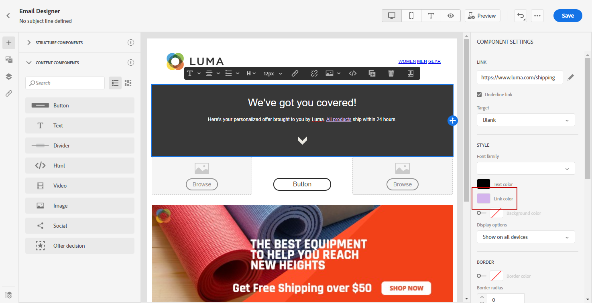

# Definisci uno stile per i collegamenti {#styling-links}

È possibile sottolineare un collegamento e selezionarne il colore e la destinazione in E-mail Designer.

1. In un testo **[!UICONTROL Content component]** dove viene inserito un collegamento, seleziona il collegamento.

1. In **[!UICONTROL Component settings]** menu, controllo **[!UICONTROL Underline link]** per sottolineare il testo dell’etichetta del collegamento.

   

1. Scegli in che modo il pubblico verrà reindirizzato con il **[!UICONTROL Target]** a discesa:

   * **[!UICONTROL None]**: apre il collegamento nello stesso frame in cui è stato fatto clic (impostazione predefinita).
   * **[!UICONTROL Blank]**: apre il collegamento in una nuova finestra o scheda.
   * **[!UICONTROL Self]**: apre il collegamento nello stesso frame in cui è stato fatto clic.
   * **[!UICONTROL Parent]**: apre il collegamento nel frame principale.
   * **[!UICONTROL Top]**: apre il collegamento nel corpo completo della finestra.

   

1. Per modificare il colore del collegamento, fai clic su **[!UICONTROL Link color]**.

   

1. Scegli il colore di cui hai bisogno.

1. Salva le modifiche.
