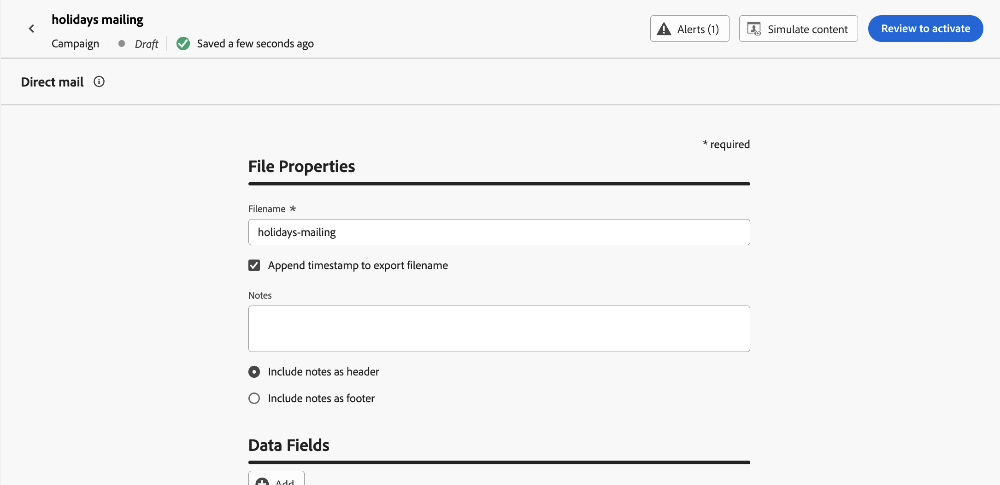
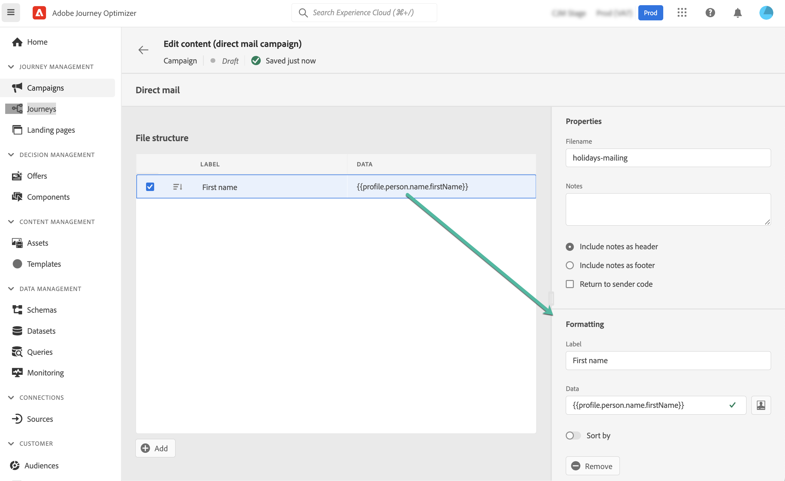

# Creare un messaggio direct mail {#create-direct}

>[!BEGINSHADEBOX]

**In questa pagina:** Aggiungi un messaggio di direct mailing a una campagna o a un percorso e configurane il file di estrazione in modo che il tuo provider di direct mailing disponga dei dati personalizzati necessari per inviare messaggi ai tuoi clienti.

>[!ENDSHADEBOX]

>[!CONTEXTUALHELP]
>id="ajo_direct_mail"
>title="Creazione di direct mail"
>abstract="Crea messaggi di direct mailing in campagne e percorsi pianificati e progetta i file di estrazione necessari ai provider di direct mail per inviare e-mail alla clientela."

>[!CONTEXTUALHELP]
>id="ajo_journey_direct_mail"
>title="Attività Fine"
>abstract="Direct mail è un canale offline che consente di personalizzare e generare l’estrazione dei file necessari ai provider di direct mail di terze parti per inviare e-mail ai clienti."

Per creare messaggi di direct mailing, crea una campagna pianificata o un percorso e configura il file di estrazione. Questo file è richiesto dai provider di direct mailing per inviare e-mail ai clienti.

>[!IMPORTANT]
>
>Prima di creare un messaggio di direct mailing, assicurati di aver configurato:
>
>1. Una [configurazione di indirizzamento file](../direct-mail/direct-mail-configuration.md#file-routing-configuration) che specifica il server in cui deve essere caricato e memorizzato il file di estrazione,
>1. [configurazione del messaggio di direct mailing](../direct-mail/direct-mail-configuration.md#direct-mail-surface) che farà riferimento alla configurazione di indirizzamento dei file.

## Aggiungere un messaggio direct mail {#create-dm-campaign}

>[!CONTEXTUALHELP]
>id="ajo_journey_action_direct_mail"
>title="Azione direct mail"
>abstract="Un’azione del canale direct mailing genera il contenuto della direct mailing per i profili che raggiungono questo passaggio del percorso. L’etichetta identifica l’attività nell’area di lavoro del percorso e l’azione fa riferimento a una configurazione di direct mailing che definisce il contenuto consegnato. La sezione **Ottimizzazione** può includere esperimenti di contenuto o regole di targeting, la sezione **Multilingue** può distribuire contenuto in più lingue e la sezione **Timeout o errore** può definire un percorso alternativo se l&#39;azione non riesce."
>additional-url="https://experienceleague.adobe.com/en/docs/journey-optimizer/using/orchestrate-journeys/about-journey-building/journey-action#add-action" text="Introduzione alle azioni dei canali"

Sfoglia le schede seguenti per scoprire come aggiungere un messaggio di direct mailing in una campagna o in un percorso.

>[!BEGINTABS]

>[!TAB Aggiungere un messaggio di direct mailing a un Percorso]

1. Apri il percorso, quindi trascina un&#39;attività di **[!UICONTROL Direct mail]** dalla sezione **Actions** della palette.

1. Fornisci informazioni di base sul messaggio (etichetta, descrizione, categoria), quindi scegli la configurazione del messaggio da utilizzare. Il campo **[!UICONTROL configuration]** è precompilato, per impostazione predefinita, con l&#39;ultima configurazione utilizzata per quel canale dall&#39;utente. Per ulteriori informazioni su come configurare un percorso, consultare [questa pagina](../building-journeys/journey-gs.md).

1. Configura il file di estrazione da inviare al provider di direct mailing. A tale scopo, fare clic sul pulsante **[!UICONTROL Modifica contenuto]**.

   

1. Regola le proprietà del file di estrazione, ad esempio il nome del file o le colonne da visualizzare. Per ulteriori informazioni su come configurare le proprietà del file di estrazione, consulta questa sezione: [Creare un messaggio di direct mailing](../direct-mail/create-direct-mail.md#extraction-file).

   

1. Una volta definito il contenuto del file di estrazione, visualizzalo in anteprima utilizzando **[!UICONTROL Simula contenuto]**. [Scopri come visualizzare in anteprima e testare il contenuto](../content-management/preview-test.md)

   {width="800" align="center"}

Quando il file di estrazione è pronto, completa la configurazione del [percorso](../building-journeys/journey-gs.md) per inviarlo.

>[!TAB Aggiungere un messaggio di direct mailing a una campagna]

1. Accedi al menu **[!UICONTROL Campagne]**, quindi fai clic su **[!UICONTROL Crea campagna]**.

1. Seleziona il tipo di campagna **Pianificato - Marketing**.

1. Nella sezione **[!UICONTROL Proprietà]**, modifica il **[!UICONTROL Titolo]** e la **[!UICONTROL Descrizione]** della tua campagna.

1. Per definire il pubblico di destinazione, fai clic sul pulsante **[!UICONTROL Seleziona pubblico]** e scegli uno dei tipi di pubblico di Adobe Experience Platform disponibili. [Ulteriori informazioni](../audience/about-audiences.md).

   >[!IMPORTANT]
   >
   >Per il momento, la selezione del pubblico è limitata a 3 milioni di profili. Questa limitazione può essere revocata su richiesta del rappresentante Adobe.

1. Nel campo **[!UICONTROL Spazio dei nomi identità]**, seleziona lo spazio dei nomi appropriato per identificare i singoli utenti all&#39;interno del pubblico scelto. [Ulteriori informazioni](../event/about-creating.md#select-the-namespace).

1. Nella sezione **[!UICONTROL Azioni]** scegliere **[!UICONTROL Direct mail]**.

1. Selezionare o creare una **[!UICONTROL configurazione direct mailing]** da utilizzare. [Scopri come creare una configurazione di direct mailing](direct-mail-configuration.md#direct-mail-surface).

   {width="800" align="center"}

   >[!AVAILABILITY]
   >
   >Direct Mail supporta la funzionalità **Holdout** ma non supporta attualmente **Trattamenti**. [Scopri come utilizzare gli esperimenti](../content-management/get-started-experiment.md)

1. Le campagne possono essere pianificate per una data specifica o impostate per essere ricorrenti a intervalli regolari. Scopri come configurare la **[!UICONTROL pianificazione]** della campagna in [questa sezione](../campaigns/campaign-schedule.md).

Ora puoi iniziare a configurare il file di estrazione da inviare al provider di direct mailing.

>[!ENDTABS]

## Configurare il file di estrazione {#extraction-file}

>[!CONTEXTUALHELP]
>id="ajo_direct_mail_data_fields"
>title="Campi dati"
>abstract="Aggiungi e configura le colonne e le informazioni da visualizzare nel file di estrazione richieste dai provider di direct mail per inviare e-mail alla clientela. Puoi aggiungere fino a 50 colonne."

>[!CONTEXTUALHELP]
>id="ajo_direct_mail_formatting"
>title="Formattazione del file di estrazione"
>abstract="Per ogni campo, utilizza l’editor di personalizzazione per specificare un’etichetta e le informazioni da visualizzare.    L’opzione <b>Ordina per</b> consente di utilizzare il campo selezionato per ordinare le colonne del file di estrazione."

Il file di estrazione è richiesto dai provider di direct mailing per inviare e-mail ai clienti. Per definire la configurazione del file di estrazione, effettua le seguenti operazioni:

1. Dalla schermata di configurazione della campagna o del percorso, fai clic sul pulsante **[!UICONTROL Modifica contenuto]** per configurare il contenuto del file di estrazione.

1. Per aggiungere i criteri di decisione al messaggio di direct mailing, seleziona una colonna nella sezione **[!UICONTROL Campi dati]** e apri l&#39;editor di personalizzazione utilizzando l&#39;icona . Passa al menu **[!UICONTROL Criteri di decisione]** per creare e inserire un criterio di decisione. Puoi quindi utilizzare gli attributi degli elementi di decisione come dati di colonna nel file di estrazione.

   >[!AVAILABILITY]
   >
   >Experience Decisioning nella direct mailing è una nuova funzionalità. In precedenza, i file di estrazione della direct mailing non potevano utilizzare il motore delle decisioni; ora puoi aggiungere criteri di decisione e includere gli attributi degli elementi di decisione come dati di colonna nell’esportazione.

   [Scopri come aggiungere un criterio di decisione nella direct mailing](../experience-decisioning/create-decision-policy.md#add). Per esempi e flussi di lavoro di decisioning batch (direct mailing personalizzati o esportazione in sistemi a valle), consulta [Decisioning batch nella direct mailing](../experience-decisioning/batch-decisioning-direct-mail.md).

1. Regola le proprietà del file di estrazione:

   1. Nel campo **[!UICONTROL Nome file]**, specifica un nome per il file di estrazione.

      >[!NOTE]
      >
      >Per impostazione predefinita, il file viene scritto nella directory principale sul server. Il campo **[!UICONTROL Nome file]** accetta anche il formato &quot;/your/path/here/Filename.csv&quot;, dove il percorso specificato è la directory di destinazione sul server selezionato. <!--TBC if for SFTP and Azure only, or for all servers including S3-->

   1. Se si desidera aggiungere una marca temporale automatica al nome file specificato, attivare l&#39;opzione **[!UICONTROL Aggiungi marca temporale per esportare il nome file]**.

   1. A volte potresti aver bisogno di aggiungere informazioni all’inizio o alla fine del file di estrazione. A questo scopo, utilizza il campo **[!UICONTROL Note]** e specifica se includere la nota come intestazione o piè di pagina.

      {width="800" align="center"}

1. Configura le colonne e le informazioni da visualizzare nel file di estrazione:

   1. Fai clic sul pulsante **[!UICONTROL Aggiungi]** per creare una nuova colonna.

   1. Il riquadro **[!UICONTROL Formattazione]** viene visualizzato sul lato destro e consente di impostare la colonna selezionata. Specificare un **[!UICONTROL etichetta]** per la colonna.

   1. Nel campo **[!UICONTROL Dati]**, seleziona gli attributi del profilo da visualizzare utilizzando l&#39;[editor di personalizzazione](../personalization/personalization-build-expressions.md).

   1. Per ordinare il file di estrazione utilizzando una colonna, selezionare la colonna e attivare l&#39;opzione **[!UICONTROL Ordina per]**. Accanto all&#39;etichetta della colonna nella sezione **[!UICONTROL Campi dati]** viene visualizzata l&#39;icona **[!UICONTROL Ordina per]**.

      {width="800" align="center"}

   1. Ripeti questi passaggi per aggiungere tutte le colonne necessarie per il file di estrazione. Puoi aggiungere fino a 50 colonne.

      Per modificare la posizione di una colonna, trascinarla nella posizione desiderata nella sezione **[!UICONTROL Campo dati]**. Per eliminare una colonna, selezionarla e fare clic sul pulsante **[!UICONTROL Rimuovi]** nel riquadro **[!UICONTROL Formattazione]**.

Ora puoi testare il messaggio direct mailing e inviarlo al pubblico. [Scopri come testare e inviare messaggi di direct mailing](test-send-direct-mail.md)

## Argomenti correlati {#related-topics}

* [Introduzione alle direct mail](get-started-direct-mail.md)
* [Configurare il canale di direct mailing](direct-mail-configuration.md)
* [Testare e inviare direct mailing](test-send-direct-mail.md)
* [Anteprima e verifica del contenuto](../content-management/preview-test.md)

Per domande frequenti sulla direct mailing, consulta [Introduzione alla direct mailing](get-started-direct-mail.md).
