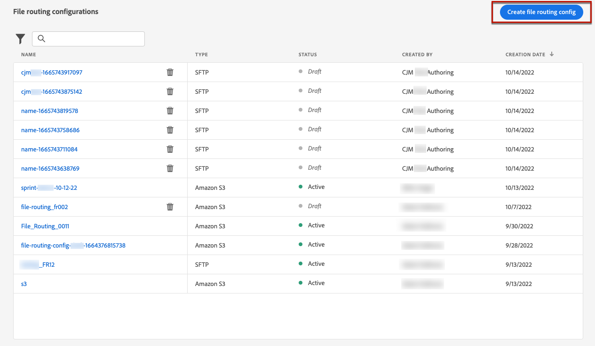
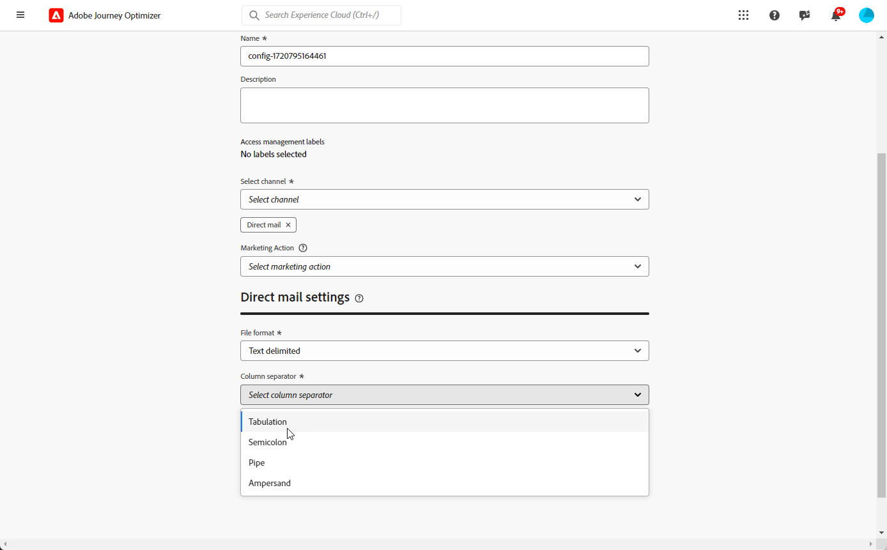
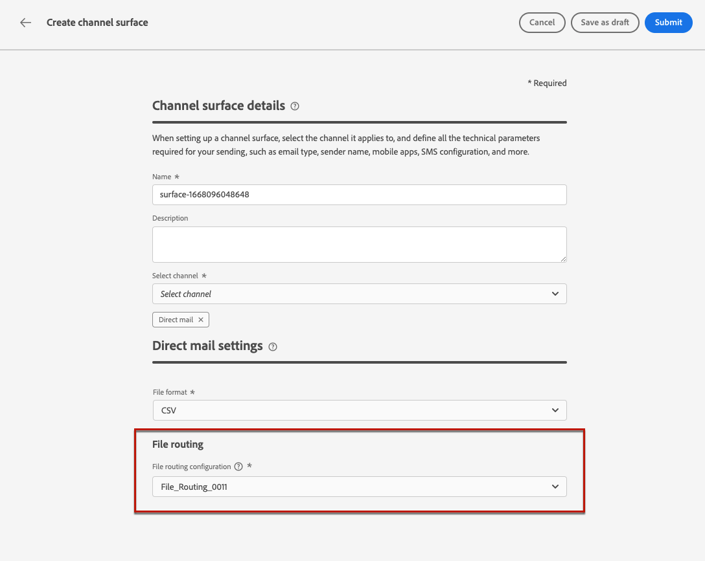

# Configurazione direct mail {#direct-mail-configuration}

[!DNL Journey Optimizer] consente di personalizzare e generare i file necessari ai provider di direct mailing per inviare messaggi ai clienti.

Quando [crei un messaggio di direct mailing](../direct-mail/create-direct-mail.md), definisci i dati del pubblico di destinazione, incluse le informazioni di contatto scelte (ad esempio l&#39;indirizzo postale). Un file contenente questi dati verrà quindi generato ed esportato automaticamente in un server, dove il provider di direct mailing sarà in grado di recuperarli e occuparsi dell’invio effettivo.

Prima di poter generare questo file, devi creare:

1. [configurazione di indirizzamento file](#file-routing-configuration) per specificare il server in cui verrà esportato il file e crittografare il file, se necessario.

   >[!CAUTION]
   >
   >Per creare una configurazione di indirizzamento dei file, è necessario disporre dell&#39;autorizzazione incorporata **[!DNL Manage file routing]**. [Ulteriori informazioni](../administration/ootb-product-profiles.md#content-library-manager).

1. [configurazione direct mailing](#direct-mail-configuration) che farà riferimento alla configurazione di indirizzamento dei file. Se non hai configurato alcuna opzione di indirizzamento dei file, non potrai creare una configurazione di direct mailing.

## Configurare l’indirizzamento dei file {#file-routing-configuration}

>[!CONTEXTUALHELP]
>id="ajo_dm_file_routing_details"
>title="Configurare l’indirizzamento dei file"
>abstract="Dopo aver creato un messaggio di direct mail, il file contenente i dati del pubblico di destinazione verrà generato ed esportato in un server. Devi specificare i dettagli del server in modo che il provider di direct mail possa accedere e utilizzare tale file per la consegna della direct mail."
>additional-url="https://experienceleague.adobe.com/docs/journey-optimizer/using/direct-mail/create-direct-mail.html?lang=it" text="Creare un messaggio direct mail"

>[!CONTEXTUALHELP]
>id="ajo_dm_file_routing_details_header"
>title="Configurare l’indirizzamento dei file"
>abstract="Devi definire dove esportare il file che verrà utilizzato dal provider di direct mail."

>[!CONTEXTUALHELP]
>id="ajo_dm_select_file_routing"
>title="Configurazione di indirizzamento dei file"
>abstract="Seleziona la configurazione di indirizzamento dei file desiderata, che definisce dove verrà esportato il file che verrà utilizzato dal provider di direct mail."

>[!CONTEXTUALHELP]
>id="ajo_dm_file_routing_type"
>title="Selezionare il tipo di server per il file"
>abstract="Scegli il tipo di server che desideri utilizzare per esportare i file di direct mail. Attualmente Journey Optimizer supporta solo Amazon S3 e SFTP."

>[!CONTEXTUALHELP]
>id="ajo_dm_file_routing_aws_region"
>title="Scegli l’area geografica di AWS"
>abstract="Seleziona l’area geografica del server AWS in cui desideri esportare i file di direct mail. In genere, è preferibile scegliere quella più vicina al luogo in cui si trova il provider di direct mail."

>[!NOTE]
>
>Al momento Amazon S3, SFTP e Azure sono supportati in [!DNL Journey Optimizer].

Per inviare un messaggio di direct mailing, [!DNL Journey Optimizer] genera ed esporta in un server il file contenente i dati del pubblico di destinazione.

È necessario specificare i dettagli del server in modo che il provider di direct mailing possa accedere al file e utilizzarlo per la consegna della posta.

Per configurare l’indirizzamento dei file, segui la procedura riportata di seguito.

>[!BEGINTABS]

>[!TAB Amazon S3]

1. Accedi al menu **[!UICONTROL Amministrazione]** > **[!UICONTROL Canali]** > **[!UICONTROL Impostazioni direct mailing]** > **[!UICONTROL Indirizzamento file]**, quindi fai clic su **[!UICONTROL Crea configurazione di indirizzamento]**.

   {width="800" align="center"}

1. Imposta un nome per la configurazione.

1. Selezionare **Amazon S3** come **[!UICONTROL tipo di server]** da utilizzare per esportare i file di direct mailing.

   {width="800" align="center"}

1. Inserisci i dettagli e le credenziali del server

   * **Nome bucket AWS**:Per sapere dove trovare il nome del bucket AWS, fai riferimento a [questa pagina](https://docs.aws.amazon.com/AmazonS3/latest/userguide/UsingBucket.html).

   * **Chiave di accesso AWS**: per sapere dove trovare l&#39;ID della chiave di accesso AWS, fai riferimento a [questa pagina](https://docs.aws.amazon.com/IAM/latest/UserGuide/security-creds.html#access-keys-and-secret-access-keys).

   * **Chiave segreta AWS**: per sapere dove trovare la chiave segreta AWS, consulta [questa pagina](https://aws.amazon.com/fr/blogs/security/wheres-my-secret-access-key/).

   * **Area geografica AWS**: scegliere l&#39;**[!UICONTROL Area geografica AWS]** in cui si troverà l&#39;infrastruttura server. Le aree geografiche di AWS sono aree geografiche che AWS utilizza per ospitare la propria infrastruttura cloud. Come pratica generale, è preferibile scegliere l’area più vicina alla posizione del provider di direct mailing.

   {width="800" align="center"}

1. Per crittografare il file, copia e incolla la chiave di crittografia nel campo **[!UICONTROL Chiave di crittografia PGP/GPG]**.

1. Seleziona **[!UICONTROL Invia]**. La configurazione di indirizzamento dei file è stata creata con lo stato **[!UICONTROL Attivo]**. Ora può essere utilizzato in una [configurazione direct mailing](#direct-mail-surface).

   Puoi anche selezionare **[!UICONTROL Salva come bozza]** per creare la configurazione di indirizzamento dei file, ma non potrai selezionarla in una configurazione finché non sarà **[!UICONTROL Attiva]**.

>[!TAB SFTP]

1. Accedi al menu **[!UICONTROL Amministrazione]** > **[!UICONTROL Canali]** > **[!UICONTROL Impostazioni direct mailing]** > **[!UICONTROL Indirizzamento file]**, quindi fai clic su **[!UICONTROL Crea configurazione di indirizzamento]**.

   {width="800" align="center"}

1. Imposta un nome per la configurazione.

1. Seleziona SFTP come **[!UICONTROL Tipo di server]** da utilizzare per esportare i file di direct mailing.

   {width="800" align="center"}

1. Compila i dettagli e le credenziali per il server:

   * **Account**: nome account utilizzato per connettersi al server SFTP.

   * **Indirizzo server**: &#x200B;URL del server SFTP.

   * **Porta**: numero porta di connessione FTP.

   * **Password**:&#x200B; password utilizzata per la connessione al server SFTP.

   

1. Per crittografare il file, copia e incolla la chiave di crittografia nel campo **[!UICONTROL Chiave di crittografia PGP/GPG]**.

1. Seleziona **[!UICONTROL Invia]**. La configurazione di indirizzamento dei file è stata creata con lo stato **[!UICONTROL Attivo]**. Ora può essere utilizzato in una [configurazione direct mailing](#direct-mail-surface).

   Puoi anche selezionare **[!UICONTROL Salva come bozza]** per creare la configurazione di indirizzamento dei file, ma non potrai selezionarla in una configurazione finché non sarà **[!UICONTROL Attiva]**.

>[!TAB Azure]

1. Accedi al menu **[!UICONTROL Amministrazione]** > **[!UICONTROL Canali]** > **[!UICONTROL Impostazioni direct mailing]** > **[!UICONTROL Indirizzamento file]**, quindi fai clic su **[!UICONTROL Crea configurazione di indirizzamento]**.

   {width="800" align="center"}

1. Imposta un nome per la configurazione.

1. Selezionare il tipo di server **[!UICONTROL Azure]** da utilizzare per esportare i file di direct mailing.

   {width="800" align="center"}

1. Compila i dettagli e le credenziali per il server:

   * **Stringa di connessione Azure**: per trovare la **stringa di connessione Azure**, fare riferimento a [questa pagina](https://learn.microsoft.com/en-us/azure/storage/common/storage-configure-connection-string#configure-a-connection-string-for-an-azure-storage-account).

     La **stringa di connessione Azure** deve seguire il formato seguente:

     `DefaultEndpointsProtocol=[http|https];AccountName=myAccountName;AccountKey=myAccountKey`

   * **Nome contenitore**: per trovare il **Nome contenitore**, consultare [questa pagina](https://learn.microsoft.com/en-us/azure/storage/blobs/blob-containers-portal).

     Il **nome contenitore** deve contenere solo il nome del contenitore senza barre. Per specificare un percorso all’interno del contenitore per il salvataggio del file, aggiorna il nome del file della campagna Direct Mail in modo da includere il percorso desiderato.

1. Per crittografare il file, copia e incolla la chiave di crittografia nel campo **[!UICONTROL Chiave di crittografia PGP/GPG]**.

1. Seleziona **[!UICONTROL Invia]**. La configurazione di indirizzamento dei file è stata creata con lo stato **[!UICONTROL Attivo]**. Ora può essere utilizzato in una [configurazione direct mailing](#direct-mail-surface).

   Puoi anche selezionare **[!UICONTROL Salva come bozza]** per creare la configurazione di indirizzamento dei file, ma non potrai selezionarla in una configurazione finché non sarà **[!UICONTROL Attiva]**.

>[!ENDTABS]

## Creare una configurazione di direct mailing {#direct-mail-surface}

>[!CONTEXTUALHELP]
>id="ajo_dm_surface_settings"
>title="Definire le impostazioni per direct mail"
>abstract="Una configurazione di direct mailing contiene le impostazioni per la formattazione del file che contiene i dati del pubblico target e verrà utilizzata dal provider di posta. È inoltre necessario definire la posizione in cui il file verrà esportato selezionando la configurazione di indirizzamento del file."
>additional-url="https://experienceleague.adobe.com/docs/journey-optimizer/using/direct-mail/direct-mail-configuration.html?lang=it#file-routing-configuration" text="Configurare l’indirizzamento dei file"

<!--
>[!CONTEXTUALHELP]
>id="ajo_dm_surface_sort"
>title="Define the sort order"
>abstract="If you select this option, the sort will be by profile ID, ascending or descending. If you unselect it, the sorting configuration defined when creating the direct mail message within a journey or a campaign."-->

>[!CONTEXTUALHELP]
>id="ajo_dm_surface_split"
>title="Definire la soglia di divisione dei file"
>abstract="Devi impostare il numero massimo di record per ogni file contenente i dati del pubblico. Puoi selezionare un numero qualsiasi compreso tra 1 e 200.000 record. Una volta raggiunta la soglia specificata, verrà creato un altro file per i record rimanenti."

Per poter inviare direct mailing con [!DNL Journey Optimizer], è necessario creare una configurazione di canale per definire le impostazioni per la formattazione del file che verrà utilizzato dal provider di posta.

Una configurazione di direct mailing deve includere anche la configurazione di indirizzamento dei file che definisce il server in cui verrà esportato il file di direct mailing.

1. Nella barra a sinistra, passa a **[!UICONTROL Amministrazione]** > **[!UICONTROL Canali]** e seleziona **[!UICONTROL Impostazioni generali]** > **[!UICONTROL Configurazioni canale]**. Fare clic sul pulsante **[!UICONTROL Crea configurazione canale]**. [Ulteriori informazioni](../configuration/channel-surfaces.md)

   

1. Immetti un nome e una descrizione (facoltativa) per la configurazione, quindi seleziona il canale da configurare.

   >[!NOTE]
   >
   > I nomi devono iniziare con una lettera (A-Z). Può contenere solo caratteri alfanumerici. È inoltre possibile utilizzare i caratteri di sottolineatura `_`, punto`.` e trattino `-`.

1. Per assegnare etichette di utilizzo dei dati personalizzate o di base alla configurazione, è possibile selezionare **[!UICONTROL Gestisci accesso]**. [Ulteriori informazioni sul controllo degli accessi a livello di oggetto](../administration/object-based-access.md).

1. Selezionare il canale **[!UICONTROL Direct mail]**.

   

1. Seleziona **[!UICONTROL Azione di marketing]** per associare i criteri di consenso ai messaggi utilizzando questa configurazione. Tutti i criteri di consenso associati all’azione di marketing vengono utilizzati per rispettare le preferenze dei clienti. [Ulteriori informazioni](../action/consent.md#surface-marketing-actions)

1. Definisci le impostazioni della direct mailing nella sezione dedicata della configurazione del canale.

   {width="800" align="center"}

   <!---->

1. Selezionare il formato del file: **[!UICONTROL CSV]** o **[!UICONTROL Testo delimitato]**.

1. Se si seleziona **[!UICONTROL Testo delimitato]**, definire il separatore di colonne desiderato: tabulazione, punto e virgola, barra verticale o e commerciale.

   

1. Selezionare la **[!UICONTROL configurazione di indirizzamento file]** tra quelle create. Questo definisce dove verrà esportato il file che il provider di direct mailing potrà utilizzare.

   >[!CAUTION]
   >
   >Se non hai configurato alcuna opzione di indirizzamento dei file, non potrai creare una configurazione di direct mailing. [Ulteriori informazioni](#file-routing-configuration)

   {width="800" align="center"}

   <!---->

1. Invia la configurazione di direct mailing.

Ora puoi [creare un messaggio di direct mailing](../direct-mail/create-direct-mail.md) all&#39;interno di una campagna. Una volta avviata la campagna, il file contenente i dati del pubblico di destinazione viene esportato automaticamente nel server definito. Il provider di direct mailing sarà quindi in grado di recuperare tale file e procedere con la consegna di direct mailing.

>[!NOTE]
>
>Le righe duplicate in cui tutti i valori nella riga sono uguali vengono rimosse automaticamente dal file.

<!--
    In the **[!UICONTROL Insertion]** section, you can choose to automatically remove duplicate rows.

    Define the maximum number of records (i.e. rows) for each file containing profile data. After the specified threshold is reached, another file will be created for the remaining records.

    

    For example, if there are 100,000 records in the file and the threshold limit is set to 60,000, the records will be split into two files. The first file will contain 60,000 rows, and the second file will contain the remaining 40,000 rows.

    >[!NOTE]
    >
    >NOTE You can set any number between 1 and 200,000 records, meaning each file must contain at least 1 row and no more than 200,000 rows.

-->