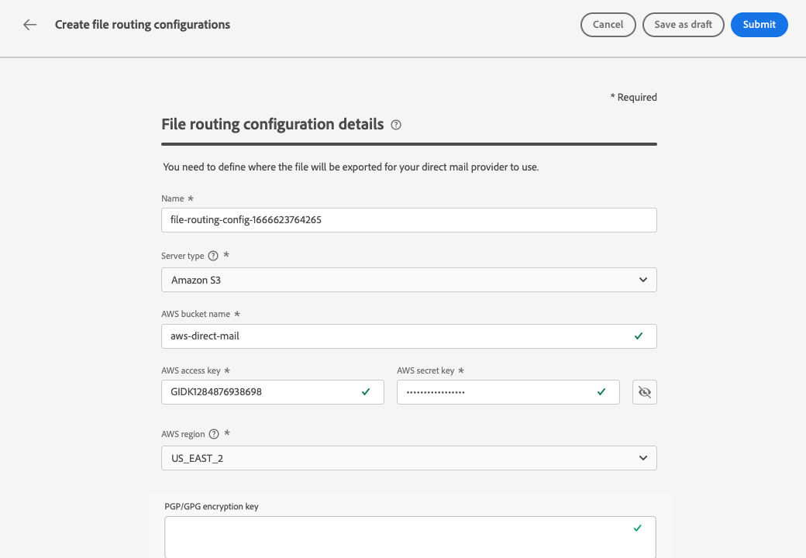

# Configurazione direct mail {#direct-mail-configuration}

[!DNL Journey Optimizer] ti consente di personalizzare e generare i file necessari ai provider di direct mailing per inviare e-mail ai clienti.

Quando [creazione di un messaggio di direct mailing](../direct-mail/create-direct-mail.md), puoi definire i dati del pubblico target, comprese le informazioni di contatto scelte (ad esempio l’indirizzo postale). Un file contenente questi dati verrà quindi generato ed esportato automaticamente in un server, dove il provider di direct mailing sarà in grado di recuperarli e occuparsi dell’invio effettivo.

Prima di poter generare questo file, devi creare:

1. A [configurazione di indirizzamento dei file](#file-routing-configuration) per specificare il server in cui verrà esportato il file e crittografarlo, se necessario.

   >[!CAUTION]
   >
   >Per creare una configurazione di indirizzamento dei file, è necessario disporre del **[!DNL Manage file routing]** autorizzazione incorporata. [Ulteriori informazioni](../administration/ootb-product-profiles.md#content-library-manager).

1. A [superficie direct mail](#direct-mail-surface) che farà riferimento alla configurazione di indirizzamento dei file. Se non hai configurato alcuna opzione di indirizzamento dei file, non potrai creare una superficie di direct mailing.

## Configurare l’indirizzamento dei file {#file-routing-configuration}

>[!CONTEXTUALHELP]
>id="ajo_dm_file_routing_details"
>title="Configurare l’indirizzamento dei file"
>abstract="Dopo aver creato un messaggio di direct mail, il file contenente i dati del pubblico di destinazione verrà generato ed esportato in un server. Devi specificare i dettagli del server in modo che il provider di direct mail possa accedere e utilizzare tale file per la consegna della direct mail."
>additional-url="https://experienceleague.adobe.com/docs/journey-optimizer/using/direct-mail/create-direct-mail.html?lang=it" text="Creare un messaggio direct mail"

>[!CONTEXTUALHELP]
>id="ajo_dm_file_routing_details_header"
>title="Configurare l’indirizzamento dei file"
>abstract="Devi definire dove esportare il file che verrà utilizzato dal provider di direct mail."

>[!CONTEXTUALHELP]
>id="ajo_dm_select_file_routing"
>title="Configurazione di indirizzamento dei file"
>abstract="Seleziona la configurazione di indirizzamento dei file desiderata, che definisce dove verrà esportato il file che verrà utilizzato dal provider di direct mail."

>[!CONTEXTUALHELP]
>id="ajo_dm_file_routing_type"
>title="Selezionare il tipo di server per il file"
>abstract="Scegli il tipo di server che desideri utilizzare per esportare i file di direct mail. Attualmente Journey Optimizer supporta solo Amazon S3 e SFTP."

>[!CONTEXTUALHELP]
>id="ajo_dm_file_routing_aws_region"
>title="Scegli l’area geografica di AWS"
>abstract="Seleziona l’area geografica del server AWS in cui desideri esportare i file di direct mail. In genere, è preferibile scegliere quella più vicina al luogo in cui si trova il provider di direct mail."

Per recapitare un messaggio di direct mailing: [!DNL Journey Optimizer] genera ed esporta in un server il file contenente i dati del pubblico di destinazione.

È necessario specificare i dettagli del server in modo che il provider di direct mailing possa accedere al file e utilizzarlo per la consegna della posta.

Per configurare l’indirizzamento dei file, segui la procedura riportata di seguito.

1. Accedere a **[!UICONTROL Amministrazione]** > **[!UICONTROL Canali]** > **[!UICONTROL Configurazione di indirizzamento dei file]** > **[!UICONTROL Indirizzamento file]** , quindi fai clic su **[!UICONTROL Crea configurazione di indirizzamento]**.

   {width="800" align="center"}

1. Imposta un nome per la configurazione.

1. Seleziona la **[!UICONTROL Tipo di server]** che desideri utilizzare per esportare i file di direct mailing.

   {width="800" align="center"}

   >[!NOTE]
   >
   >Attualmente Amazon S3, SFTP e Azure sono supportati in [!DNL Journey Optimizer].

1. Inserisci i dettagli e le credenziali del server, ad esempio indirizzo del server, chiave di accesso e così via.

   

1. Se hai selezionato **[!UICONTROL Amazon S3]**, scegli il **[!UICONTROL Area geografica AWS]** dove si trova l&#39;infrastruttura server.

   {width="800" align="center"}

   >[!NOTE]
   >
   >Le aree geografiche di AWS sono aree geografiche che AWS utilizza per ospitare la propria infrastruttura cloud. Come pratica generale, è preferibile scegliere l’area più vicina alla posizione del provider di direct mailing.

1. Per crittografare il file, copia e incolla la chiave di crittografia nel **[!UICONTROL Chiave di crittografia PGP/GPG]** campo.

1. Seleziona **[!UICONTROL Invia]**. La configurazione di indirizzamento dei file viene creata con **[!UICONTROL Attivo]** stato. È ora pronto per essere utilizzato in un [superficie direct mail](#direct-mail-surface).

   >[!NOTE]
   >
   >Puoi anche selezionare **[!UICONTROL Salva come bozza]** per creare la configurazione di indirizzamento dei file, ma non sarà possibile selezionarla in una superficie finché non viene **[!UICONTROL Attivo]**.

## Creare una superficie per direct mail {#direct-mail-surface}

>[!CONTEXTUALHELP]
>id="ajo_dm_surface_settings"
>title="Definire le impostazioni per direct mail"
>abstract="Una superficie per direct mail contiene le impostazioni per la formattazione del file che contiene i dati del pubblico e viene utilizzata dal provider e-mail. È inoltre necessario definire la posizione in cui il file verrà esportato selezionando la configurazione di indirizzamento del file."
>additional-url="https://experienceleague.adobe.com/docs/journey-optimizer/using/direct-mail/direct-mail-configuration.html?lang=it#file-routing-configuration" text="Configurare l’indirizzamento dei file"

<!--
>[!CONTEXTUALHELP]
>id="ajo_dm_surface_sort"
>title="Define the sort order"
>abstract="If you select this option, the sort will be by profile ID, ascending or descending. If you unselect it, the sorting configuration defined when creating the direct mail message within a journey or a campaign."-->

>[!CONTEXTUALHELP]
>id="ajo_dm_surface_split"
>title="Definire la soglia di divisione dei file"
>abstract="Devi impostare il numero massimo di record per ogni file contenente i dati del pubblico. Puoi selezionare un numero qualsiasi compreso tra 1 e 200.000 record. Una volta raggiunta la soglia specificata, verrà creato un altro file per i record rimanenti."

Essere in grado di consegnare direct mailing con [!DNL Journey Optimizer], è necessario creare una superficie di canale per definire le impostazioni per la formattazione del file che verrà utilizzato dal provider di posta.

Una superficie di direct mailing deve includere anche la configurazione di indirizzamento dei file che definisce il server in cui verrà esportato il file di direct mailing.

1. Create una superficie di canale. [Ulteriori informazioni](../configuration/channel-surfaces.md)

1. Seleziona la **[!UICONTROL Direct mail]** canale.

   {width="800" align="center"}

1. Definisci le impostazioni della direct mailing nella sezione dedicata della configurazione della superficie di canale.

   {width="800" align="center"}

   <!---->

1. Selezionare il formato del file: **[!UICONTROL CSV]** o **[!UICONTROL Testo delimitato]**.

1. Se si seleziona **[!UICONTROL Testo delimitato]**, definisci il separatore di colonne desiderato: tabulazione, punto e virgola, barra verticale o e commerciale.

   

1. Seleziona la **[!UICONTROL Configurazione di indirizzamento dei file]** tra quelli che hai creato. Questo definisce dove verrà esportato il file che il provider di direct mailing potrà utilizzare.

   >[!CAUTION]
   >
   >Se non hai configurato alcuna opzione di indirizzamento dei file, non potrai creare una superficie di direct mailing. [Ulteriori informazioni](#file-routing-configuration)

   {width="800" align="center"}

   <!---->

1. Invia la superficie della direct mailing.

Ora puoi [creare un messaggio di direct mailing](../direct-mail/create-direct-mail.md) all’interno di una campagna. Una volta avviata la campagna, il file contenente i dati del pubblico di destinazione viene esportato automaticamente nel server definito. Il provider di direct mailing sarà quindi in grado di recuperare tale file e procedere con la consegna di direct mailing.

>[!NOTE]
>
>Le righe duplicate in cui tutti i valori nella riga sono uguali vengono rimosse automaticamente dal file.

<!--
    In the **[!UICONTROL Insertion]** section, you can choose to automatically remove duplicate rows.

    Define the maximum number of records (i.e. rows) for each file containing profile data. After the specified threshold is reached, another file will be created for the remaining records.

    

    For example, if there are 100,000 records in the file and the threshold limit is set to 60,000, the records will be split into two files. The first file will contain 60,000 rows, and the second file will contain the remaining 40,000 rows.

    >[!NOTE]
    >
    >NOTE You can set any number between 1 and 200,000 records, meaning each file must contain at least 1 row and no more than 200,000 rows.

-->