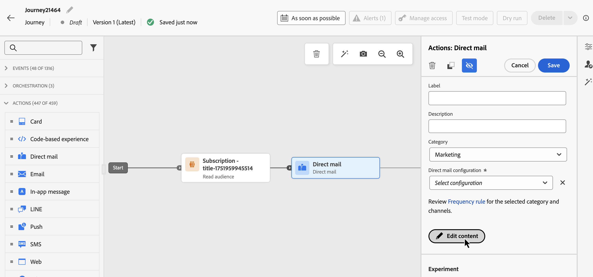

# Inviare messaggi di direct mailing con percorsi {#direct-mail-journeys}

>[!CONTEXTUALHELP]
>id="ajo_journey_direct_mail"
>title="Attività Fine"
>abstract="Direct mail è un canale offline che consente di personalizzare e generare l’estrazione dei file necessari ai provider di direct mail di terze parti per inviare e-mail ai clienti."

Direct mail è un canale offline che consente di personalizzare e generare l’estrazione dei file necessari ai provider di direct mail di terze parti per inviare e-mail ai clienti.

Durante la creazione di un messaggio di direct mailing, [!DNL Journey Optimizer] genera automaticamente un file contenente tutti i profili target e i dati selezionati, ad esempio gli indirizzi postali e gli attributi di profilo. Questo file viene inviato al server scelto in modo che sia accessibile dal provider di direct mail di terze parti scelto, che gestirà il processo di invio e-mail effettivo per te.

Sarà necessario collaborare con il provider di direct maili di terze parti scelto per ottenere, se applicabile, il consenso necessario dai clienti alla ricezione di posta da parte tua.

L’utilizzo dei servizi di posta è soggetto a termini e condizioni aggiuntivi da parte del provider di direct mailing di terze parti applicabile. Adobe non controlla i prodotti di terze parti né è responsabile per l’utilizzo di tali prodotti. Per eventuali problemi o richieste di assistenza relativi all’invio del messaggio di direct mailing, contatta il provider di direct mailing di terze parti scelto.

>[!NOTE]
>
>Questa pagina descrive la procedura per creare e inviare messaggi di direct mailing con percorsi. Per ulteriori informazioni sul canale direct mailing e su come creare campagne di direct mailing, consulta questa sezione: [Introduzione alla direct mailing](../direct-mail/get-started-direct-mail.md).

## Creare una configurazione di indirizzamento dei file

>[!CONTEXTUALHELP]
>id="ajo_dm_file_routing_frequency"
>title="Scegli l’area geografica di AWS"
>abstract="Se la configurazione di indirizzamento dei file verrà inviata utilizzando percorsi, è possibile specificare la frequenza con cui il file verrà inviato al server."

Prima di creare un messaggio di direct mailing, accertati di aver configurato una configurazione di indirizzamento dei file che specifica il server in cui il file di estrazione deve essere caricato e memorizzato. Per farlo, segui questi passaggi:

1. Accedi al menu **[!UICONTROL Amministrazione]** > **[!UICONTROL Canali]** > **[!UICONTROL Impostazioni direct mailing]** > **[!UICONTROL Indirizzamento file]**, quindi fai clic su **[!UICONTROL Crea configurazione indirizzamento file]**.

1. Definisci le proprietà di configurazione dell’indirizzamento dei file, come il nome e il tipo di server da utilizzare. Informazioni dettagliate su come impostare una configurazione di indirizzamento dei file sono disponibili nella sezione [Configurazione direct mailing](../direct-mail/direct-mail-configuration.md#file-routing-configuration).

   Se la configurazione di indirizzamento dei file verrà inviata utilizzando percorsi, è possibile specificare la frequenza con cui il file verrà inviato al server.

   

1. Fai clic su **[!UICONTROL Invia]** per confermare la creazione della configurazione di indirizzamento dei file. La configurazione è stata creata con lo stato **[!UICONTROL Attivo]**. Ora è pronto per essere referenziato in una configurazione di direct mailing.

## Creare una configurazione direct mailing {#direct-mail-surface}

Una configurazione di direct mailing contiene le impostazioni per la formattazione del file che contiene i dati del pubblico e viene utilizzata dal provider e-mail. È inoltre necessario definire la posizione in cui il file verrà esportato selezionando la configurazione di indirizzamento del file.

Informazioni dettagliate su come creare una configurazione di direct mail sono disponibili nella sezione [Configurazione di direct mail](../direct-mail/direct-mail-configuration.md#file-routing-configuration).

Quando la configurazione della direct mailing è pronta, puoi creare un’azione di aggiunta direct mailing al percorso.

## Aggiungere un&#39;azione Direct mailing al percorso

Per aggiungere un’azione direct mailing in un percorso, effettua le seguenti operazioni:

1. Apri il percorso, quindi trascina un&#39;attività di **[!UICONTROL Direct mail]** dalla sezione **Actions** della palette.

1. Fornisci informazioni di base sul messaggio (etichetta, descrizione, categoria), quindi scegli la configurazione del messaggio da utilizzare. Il campo **[!UICONTROL configuration]** è precompilato, per impostazione predefinita, con l&#39;ultima configurazione utilizzata per quel canale dall&#39;utente.

   Per ulteriori informazioni su come configurare un percorso, fare riferimento a [questa pagina](../building-journeys/journey-gs.md)

1. Ora puoi configurare il file di estrazione da inviare al provider di direct mailing. A tale scopo, fare clic sul pulsante **[!UICONTROL Modifica contenuto]**.

   

1. Regola le proprietà del file di estrazione, ad esempio il nome del file o le colonne da visualizzare. Per ulteriori informazioni su come configurare le proprietà del file di estrazione, consulta questa sezione. [Creare un messaggio di direct mailing](../direct-mail/create-direct-mail.md#extraction-file)

   

1. Una volta definito il contenuto del file di estrazione, puoi utilizzare i profili di test per visualizzarlo in anteprima. Se hai incluso contenuti personalizzati, puoi verificare come questi vengono visualizzati nel messaggio utilizzando i dati del profilo di test.

   A tale scopo, fare clic su **[!UICONTROL Simula contenuto]**, quindi aggiungere un profilo di test per verificare il rendering del file di estrazione utilizzando i dati del profilo di test.

   {width="800" align="center"}

   Informazioni dettagliate su come selezionare profili di test e visualizzare in anteprima il contenuto sono disponibili nella sezione [Gestione dei contenuti](../content-management/preview-test.md).

Quando il file di estrazione è pronto, completa la configurazione del [percorso](../building-journeys/journey-gs.md) per inviarlo.
