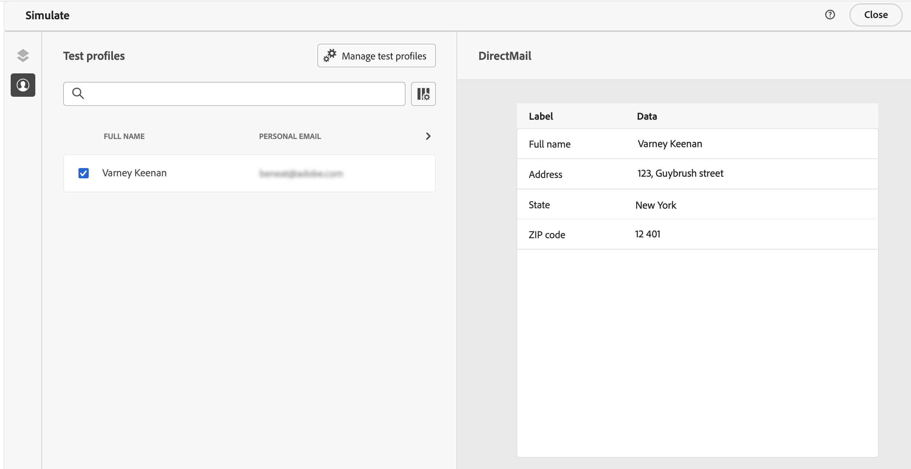
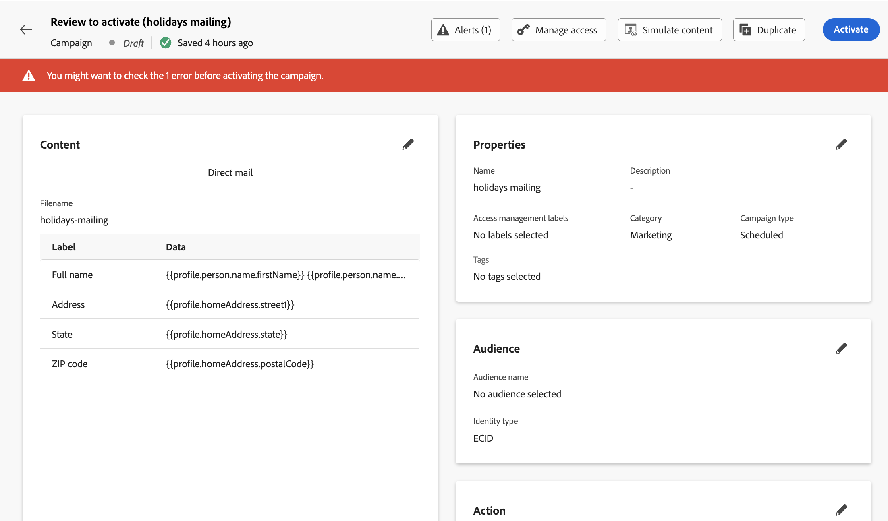

# Testare e inviare un messaggio di direct mail {#direct-mail-test-send}

## Anteprima del file di estrazione {#preview-dm}

Una volta definito il contenuto del file di estrazione, puoi utilizzare i profili di test per visualizzarlo in anteprima. Se hai incluso contenuti personalizzati, puoi verificare come questi vengono visualizzati nel messaggio utilizzando i dati del profilo di test.

A questo scopo, fai clic su **[!UICONTROL Simula contenuto]**, quindi aggiungi un profilo di test per verificare come viene eseguito il rendering del file di estrazione utilizzando i dati del profilo di test.

{width="800" align="center"}

Informazioni dettagliate su come selezionare profili di test e visualizzare in anteprima il contenuto sono disponibili nella sezione [Gestione dei contenuti](../content-management/preview-test.md).

Quando il contenuto del file è pronto per essere inviato, chiudere la schermata di simulazione e fare clic sul pulsante **[!UICONTROL Controlla per attivare]**.

## Convalidare e attivare la campagna di direct mailing {#dm-validate}

>[!IMPORTANT]
>
> Se la campagna è soggetta a una policy di approvazione, dovrai richiedere l’approvazione per poter inviare la tua campagna Direct Mail. [Ulteriori informazioni](../test-approve/gs-approval.md)

Prima di attivare la campagna di direct mailing, assicurati che la campagna e il file di estrazione siano configurati correttamente. A questo scopo, seleziona gli avvisi nella sezione superiore dell’editor. Alcuni sono semplici avvisi, altri possono impedirti di inviare il messaggio. Possono verificarsi due tipi di avvisi: avvisi ed errori.

* **Avvisi** fai riferimento a consigli e best practice. Ad esempio, se il messaggio SMS è vuoto, viene visualizzato un messaggio di avviso.

* **Gli errori** impediscono la pubblicazione della campagna, purché non vengano risolti. Ad esempio, un messaggio di errore ti avvisa quando manca la riga dell’oggetto.

{width="800" align="center"}

Quando la campagna di direct mailing è pronta, fai clic sul pulsante **[!UICONTROL Attiva]**. All&#39;avvio della campagna, il file di estrazione viene generato ed esportato automaticamente nel server specificato nella [configurazione di indirizzamento file](../direct-mail/direct-mail-configuration.md).

>[!NOTE]
>
>Per impostazione predefinita, il file esportato termina con una nuova riga. Questo garantisce la compatibilità con gli strumenti standard di elaborazione dei dati.

Una volta inviato, puoi misurare l’impatto della campagna di direct mailing all’interno dei rapporti della campagna. Per ulteriori informazioni sul reporting di direct mailing, consulta [questa sezione](../reports/campaign-global-report-cja-direct.md).

## Gestire il consenso per la direct mailing {#dm-consent-management}

In [!DNL Journey Optimizer], il consenso è gestito dallo [Schema di consenso](https://experienceleague.adobe.com/docs/experience-platform/xdm/field-groups/profile/consents.html?lang=it){target="_blank"} di Experience Platform. Per impostazione predefinita, il valore del campo di consenso è vuoto e viene trattato come consenso alla ricezione delle comunicazioni.

Se un profilo ha rinunciato alla ricezione di direct mailing, negli attributi di profilo di Experience Platform corrispondenti, il valore per `consents.marketing.postalMail.val` sarà `n` e il profilo corrispondente sarà escluso dalle consegne successive.

Per riattivarlo, è necessario ripristinare l&#39;attributo del profilo su `consents.marketing.postalMail.val` : `y`.

Per gestire gli attributi di un profilo, passa ad Experience Platform e accedi al profilo selezionando uno spazio dei nomi dell’identità e un valore di identità corrispondente. Per ulteriori informazioni, consulta la [documentazione di Experience Platform](https://experienceleague.adobe.com/docs/experience-platform/profile/ui/user-guide.html?lang=it#getting-started){target="_blank"}.

Ulteriori informazioni sulla gestione della rinuncia in Journey Optimizer in [questa sezione](../privacy/opt-out.md).
