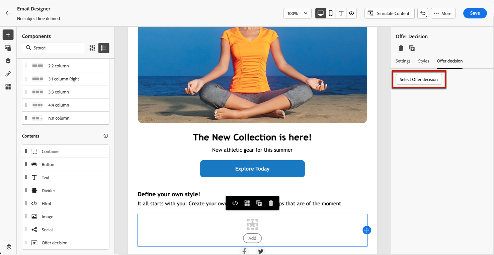

# Aggiungere offerte personalizzate {#deliver-personalized-offers}

In [!DNL Journey Optimizer] e-mail, puoi inserire decisioni che sfruttano il motore di gestione delle decisioni per scegliere l’offerta migliore da consegnare ai tuoi clienti.

Ad esempio, puoi aggiungere una decisione che visualizzerà nell’e-mail un’offerta di sconto speciale che varia a seconda del livello di fedeltà del destinatario.

Per ulteriori informazioni su come creare e gestire le offerte, consulta [questa sezione](../offers/get-started/starting-offer-decisioning.md).

Per **esempio completo** mostrando come configurare le offerte, utilizzale in una decisione e sfrutta questa decisione in un’e-mail, consulta [questa sezione](../offers/offers-e2e.md#insert-decision-in-email).

➡️ [Scopri come aggiungere le offerte come personalizzazione in questo video](#video-offers)

## Inserire una decisione in un messaggio e-mail {#insert-offers}

>[!CAUTION]
>
>Prima di iniziare, devi [definire una decisione di offerta](../offers/offer-activities/create-offer-activities.md).

Per inserire una decisione in un messaggio e-mail, segui la procedura seguente:

1. Crea l’e-mail, quindi apri E-mail Designer per configurarne il contenuto.

1. Aggiungi un **[!UICONTROL Offer decision]** componente di contenuto.

   

   Scopri come utilizzare i componenti di contenuto in [questa sezione](content-components.md).

1. La **[!UICONTROL Offer decision]** nella palette a destra. Fai clic su **[!UICONTROL Select Offer decision]**.

   

1. Nella finestra visualizzata, seleziona il posizionamento corrispondente alle offerte da visualizzare.

   [Posizionamenti](../offers/offer-library/creating-placements.md) sono contenitori utilizzati per mostrare le offerte. In questo esempio, utilizzeremo il posizionamento &quot;immagine principale dell’e-mail&quot;. Questo posizionamento è stato creato nella Libreria offerte per visualizzare le offerte di tipo immagine situate nella parte superiore dei messaggi.

1. Decisioni corrispondenti alla visualizzazione del posizionamento selezionato. Seleziona la decisione da utilizzare nel componente contenuto, quindi fai clic su **[!UICONTROL Add]**.

   >[!NOTE]
   >
   >Nell’elenco vengono visualizzate solo le decisioni compatibili con il posizionamento selezionato. In questo esempio, una sola attività di offerta corrisponde al posizionamento &quot;immagine superiore dell’e-mail&quot;.

   

La decisione viene ora aggiunta al componente .

Dopo aver salvato le modifiche, le offerte sono pronte per essere visualizzate nei profili rilevanti al momento dell’invio del messaggio come parte di un percorso.

>[!NOTE]
>
>Quando aggiorni un’offerta, un’offerta di fallback, una raccolta di offerte o una decisione di offerta a cui viene fatto riferimento direttamente o indirettamente nel messaggio, gli aggiornamenti vengono automaticamente rispecchiati nel messaggio corrispondente.

## Anteprima delle offerte in un messaggio e-mail {#preview-offers-in-email}

Puoi visualizzare in anteprima le diverse offerte che fanno parte della decisione aggiunta all’e-mail utilizzando **[!UICONTROL Offers]** o le frecce dei componenti di contenuto.

Per visualizzare le diverse offerte che fanno parte della decisione con un profilo cliente, segui la procedura seguente.

1. Fai clic su **[!UICONTROL Preview]**.

   

   >[!NOTE]
   >
   >Per visualizzare l’anteprima dei messaggi, devi disporre dei profili di test. Scopri come [creare profili di test](../segment/creating-test-profiles.md).

1. Per scegliere lo spazio dei nomi da utilizzare per identificare i profili di test, seleziona **[!UICONTROL Email]** dal **[!UICONTROL Identity namespace]** campo .

   >[!NOTE]
   >
   >In questo esempio, utilizzeremo il **E-mail** spazio dei nomi. Ulteriori informazioni sui namespace di identità di Adobe Experience Platform [in questa sezione](../segment/get-started-identity.md).

1. Nell’elenco dei namespace delle identità, seleziona **[!UICONTROL Email]** e fai clic su **[!UICONTROL Select]**.

1. In **[!UICONTROL Identity value]** immettere il valore per identificare il profilo di test. In questo esempio, immetti l’indirizzo e-mail di un profilo di test.

   <!--For example enter smith@adobe.com and click the **[!UICONTROL Add profile]** button.-->

1. Aggiungi altri profili in modo da poter testare diverse varianti del messaggio a seconda dei dati del profilo.

   

1. Fai clic sul pulsante **[!UICONTROL Preview]** per testare il messaggio.

1. Seleziona un profilo di test. Viene visualizzata l’offerta corrispondente al profilo selezionato (una donna).

   

1. Seleziona altri profili di test per visualizzare in anteprima il contenuto dell’e-mail per ogni variante del messaggio. Nel contenuto del messaggio, ora viene visualizzata l’offerta corrispondente al profilo di test selezionato (ora un uomo).

   

Ulteriori informazioni sui passaggi dettagliati per controllare l’anteprima del messaggio in [questa sezione](#preview-your-messages).

## Video introduttivo{#video-offers}

Scopri come aggiungere un componente di gestione delle decisioni ai messaggi in [!DNL Journey Optimizer].

>[!VIDEO](https://video.tv.adobe.com/v/334088?quality=12)

