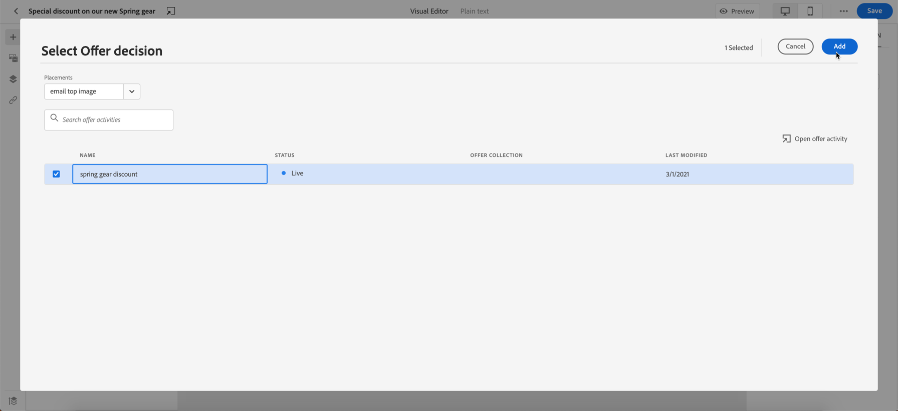
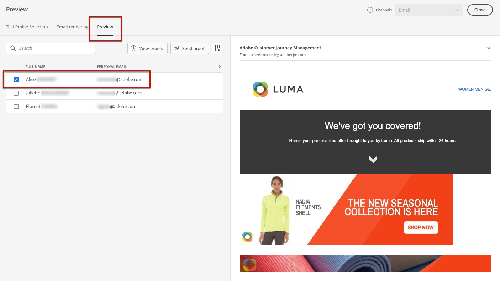

# Aggiungi offerte personalizzate {#deliver-personalized-offers}

Nelle e-mail di [!DNL Journey Optimizer] puoi inserire decisioni che sfrutteranno il motore di gestione delle decisioni per scegliere l&#39;offerta migliore da consegnare ai clienti.

Ad esempio, puoi aggiungere una decisione per visualizzare nell’e-mail un’offerta di sconto speciale che varia a seconda del livello di fedeltà del destinatario.

>[!IMPORTANT]
>
>Se vengono apportate modifiche a una decisione di offerta utilizzata in un messaggio di un percorso, devi annullare la pubblicazione del percorso e ripubblicarlo.  In questo modo le modifiche verranno incorporate nel messaggio del percorso e il messaggio sarà coerente con gli ultimi aggiornamenti.

* Per ulteriori informazioni su come creare e gestire le offerte, consulta [questa sezione](../offers/get-started/starting-offer-decisioning.md).
* Per un **esempio completo end-to-end** che mostra come configurare le offerte, utilizzarle in una decisione e sfruttare questa decisione in un messaggio e-mail, vedi [questa sezione](../offers/offers-e2e.md#insert-decision-in-email).

➡️ [Scopri come aggiungere offerte come personalizzazione in questo video](#video-offers)

## Inserire una decisione in un messaggio e-mail {#insert-offers}

>[!CAUTION]
>
>Prima di iniziare, devi [definire una decisione di offerta](../offers/offer-activities/create-offer-activities.md).

Per inserire una decisione in un messaggio e-mail, effettua le seguenti operazioni:

1. Crea l’e-mail, quindi apri E-mail Designer per configurarne il contenuto.

1. Aggiungi un componente di contenuto **[!UICONTROL Decisione offerta]**.

   

   Scopri come utilizzare i componenti di contenuto in [questa sezione](content-components.md).

1. La scheda **[!UICONTROL Decisione di offerta]** viene visualizzata nella palette a destra. Fai clic su **[!UICONTROL Seleziona decisione offerta]**:

   1. Nella finestra visualizzata, seleziona il posizionamento corrispondente alle offerte che desideri visualizzare.

      [I posizionamenti](../offers/offer-library/creating-placements.md) sono contenitori utilizzati per mostrare le offerte. In questo esempio, utilizzeremo il posizionamento &quot;e-mail immagine superiore&quot;. Questo posizionamento è stato creato nella Libreria di offerte per visualizzare le offerte di tipo immagine situate nella parte superiore dei messaggi.

   1. Vengono visualizzate le decisioni che corrispondono al posizionamento selezionato. Seleziona la decisione da utilizzare nel componente di contenuto, quindi fai clic su **[!UICONTROL Aggiungi]**.

      >[!NOTE]
      >
      >Nell’elenco vengono visualizzate solo le decisioni compatibili con il posizionamento selezionato. In questo esempio, solo un’attività di offerta corrisponde al posizionamento &quot;e-mail immagine superiore&quot;.

      

La decisione viene ora aggiunta al componente. Dopo aver salvato le modifiche, le offerte sono pronte per essere visualizzate ai profili rilevanti quando si invia il messaggio come parte di un percorso.

>[!NOTE]
>
>Quando aggiorni un’offerta, un’offerta di fallback, una raccolta di offerte o una decisione di offerta a cui viene fatto riferimento direttamente o indirettamente nel messaggio, gli aggiornamenti vengono automaticamente rispecchiati nel messaggio corrispondente.

## Anteprima delle offerte in un messaggio e-mail {#preview-offers-in-email}

Puoi visualizzare in anteprima le diverse offerte che fanno parte della decisione aggiunta all&#39;e-mail utilizzando la sezione **[!UICONTROL Offerta]** o le frecce dei componenti di contenuto.

Per visualizzare le diverse offerte che fanno parte della decisione con un profilo cliente, segui i passaggi indicati di seguito.

1. Seleziona i profili di test da utilizzare per visualizzare in anteprima l’offerta:

   1. Fai clic su **[!UICONTROL Simula contenuto]**, quindi seleziona **[!UICONTROL Simula contenuto (profili AEP)]** dal menu a discesa e scegli lo spazio dei nomi da utilizzare per identificare i profili di test dal campo **[!UICONTROL Spazio dei nomi identità]**. Per testare varianti di contenuto con dati di input di esempio o generazione automatica di IA, fai clic su **[!UICONTROL Simula contenuto]** direttamente. [Scopri come simulare varianti di contenuto](../test-approve/simulate-sample-input.md)

      >[!NOTE]
      >
      >In questo esempio viene utilizzato lo spazio dei nomi **E-mail**. Ulteriori informazioni sugli spazi dei nomi di identità di Adobe Experience Platform [in questa sezione](../audience/get-started-identity.md).

   1. Nel campo **[!UICONTROL Valore identità]** immettere il valore per identificare il profilo di test. In questo esempio, inserisci l’indirizzo e-mail di un profilo di test.

   <!--For example enter smith@adobe.com and click the **[!UICONTROL Add profile]** button.-->

   1. Aggiungi altri profili in modo da poter testare diverse varianti del messaggio a seconda dei dati del profilo.

      

1. Fai clic sulla scheda **[!UICONTROL Anteprima]** per verificare il messaggio, quindi seleziona un profilo di test. Viene visualizzata l’offerta corrispondente al profilo selezionato (una donna).

   

   Puoi selezionare altri profili di test per visualizzare in anteprima il contenuto dell’e-mail per ogni variante del messaggio. Nel contenuto del messaggio, ora viene visualizzata l’offerta corrispondente al profilo di test selezionato (ora uomo).

Ulteriori informazioni sui passaggi dettagliati per controllare l&#39;anteprima dei messaggi in [questa sezione](#preview-your-messages).

## Video introduttivo{#video-offers}

Scopri come aggiungere un componente di gestione delle decisioni ai messaggi in [!DNL Journey Optimizer].

>[!VIDEO](https://video.tv.adobe.com/v/3415689?captions=ita&quality=12)
