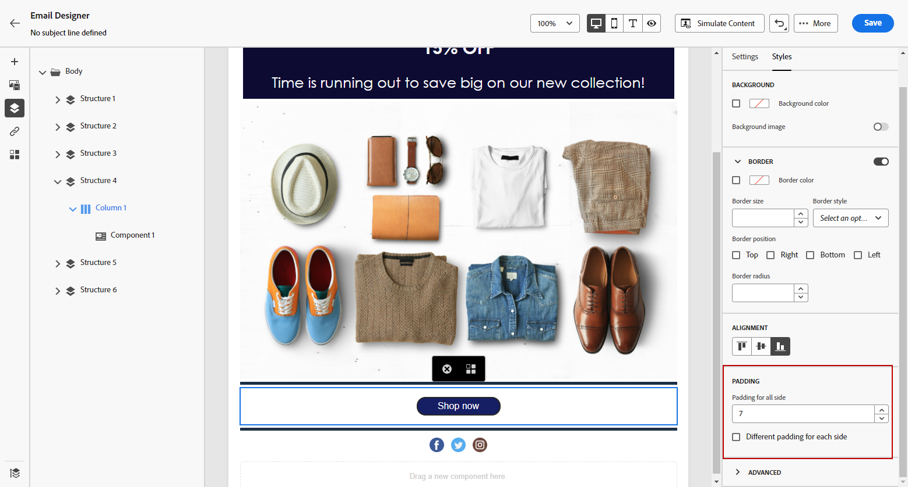

# Regolare l’allineamento verticale e la spaziatura {#alignment-and-padding}

In questo esempio regoleremo la spaziatura e l’allineamento verticale all’interno di un componente struttura composto da tre colonne.

1. Seleziona il componente struttura direttamente nel messaggio e-mail o utilizzando la **[!UICONTROL Struttura di navigazione]** disponibile nel menu a sinistra.

1. Dalla barra degli strumenti, fare clic su **[!UICONTROL Selezionare una colonna]** e scegliere quella che si desidera modificare. Puoi anche selezionarla dall’albero della struttura.

   I parametri modificabili per tale colonna vengono visualizzati nella scheda **[!UICONTROL Stili]**.

   

1. In **[!UICONTROL Allineamento]**, selezionare **[!UICONTROL Superiore]**, **[!UICONTROL Centro]** o **[!UICONTROL Inferiore]**.

   

1. In **[!UICONTROL Spaziatura interna]**, definire la spaziatura per tutti i lati.

   Selezionare **[!UICONTROL Spaziatura interna diversa per ogni lato]** per ottimizzare la spaziatura. Fai clic sull’icona del lucchetto per interrompere la sincronizzazione.

   

1. Procedi in modo simile per regolare l’allineamento e la spaziatura delle altre colonne.

1. Salva le modifiche.

>[!TIP]
>
>Durante la progettazione di contenuti e-mail per Gmail su dispositivi Android, accertati che le immagini e i divisori utilizzino la spaziatura interna delle colonne anziché margini fissi di grandi dimensioni. In Android, spesso Gmail esegue il rendering di immagini e margini di dimensioni eccessive in modo errato, causando un overflow del layout o una riduzione delle linee di divisione. Utilizza una larghezza immagine inferiore o utilizza la spaziatura interna basata su colonne per una visualizzazione coerente.
