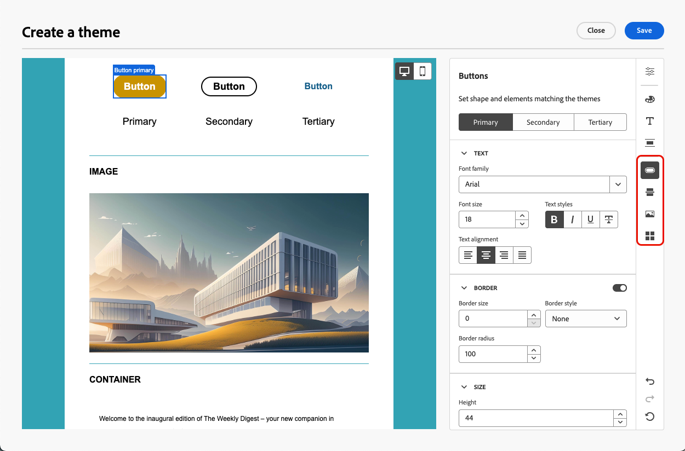
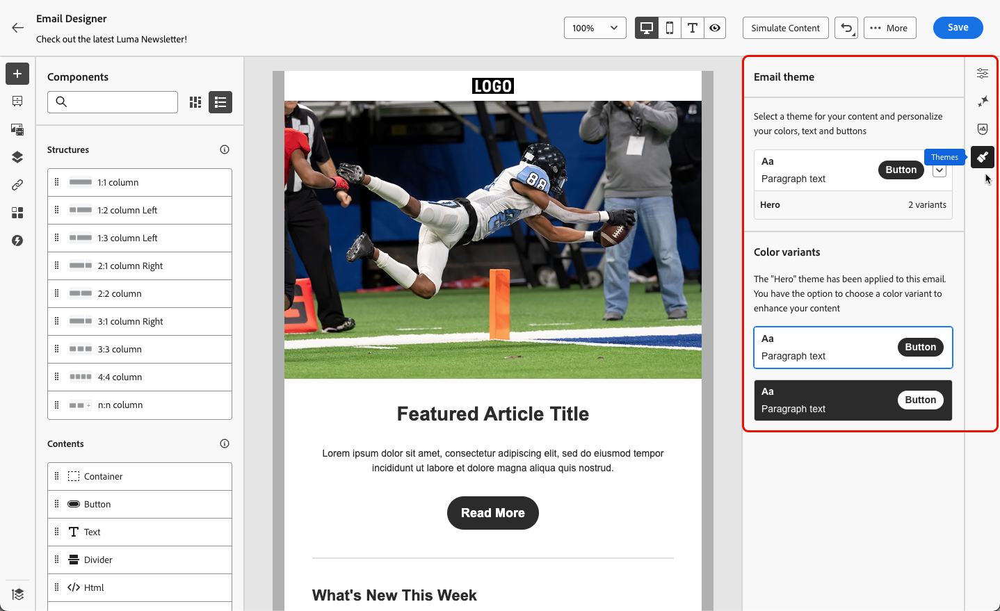
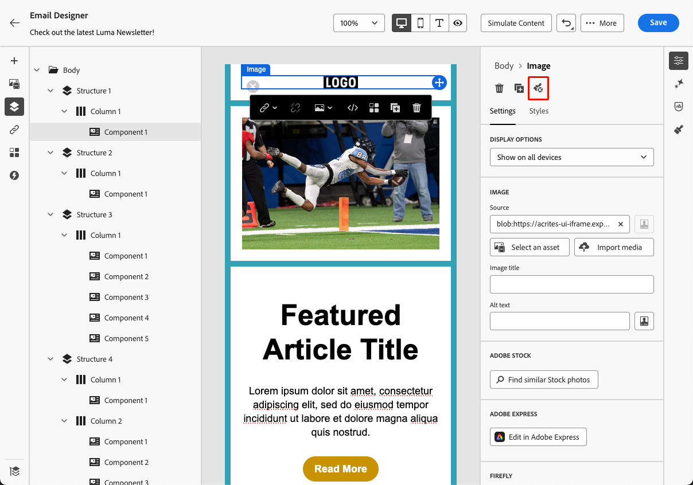

# Applicare temi al contenuto dell’e-mail {#apply-email-themes}

>[!CONTEXTUALHELP]
>id="ajo_use_theme"
>title="Applicare un tema all’e-mail"
>abstract="Seleziona un tema per l’e-mail per applicare rapidamente uno stile specifico che sia adatto al brand e alla progettazione."

>[!AVAILABILITY]
>
>Questa funzionalità è a disponibilità limitata. Per ottenere l’accesso, contatta il tuo rappresentante Adobe.

Con i temi, gli utenti non tecnici hanno la possibilità di creare contenuti riutilizzabili che si adattano a un marchio e a un linguaggio di progettazione specifici aggiungendo stili personalizzati sopra i modelli standard<!-- to achieve brand specific results-->.

Questa funzione consente agli addetti al marketing di sfruttare le e-mail visivamente accattivanti e coerenti con il brand in modo più rapido e con meno sforzo, fornendo al contempo opzioni di personalizzazione avanzate per esigenze di progettazione univoche.

## Guardrail e limitazioni {#themes-guardrails}

* Quando crei un’e-mail da zero, puoi scegliere di iniziare a creare i contenuti utilizzando un tema per applicare rapidamente uno stile specifico che si adatta al tuo marchio e design.

  Se scegli la modalità Stile manuale, non potrai applicare alcun tema a meno che non reimposti l’e-mail.

* [I frammenti](../content-management/fragments.md) non sono compatibili tra le modalità Usa temi e Stile manuale.

   * Per sfruttare un [frammento](../content-management/fragments.md) in un contenuto a tema, questo frammento deve essere stato creato utilizzando i temi. [Ulteriori informazioni](#leverage-themes-fragment)

   * Quando utilizzi un frammento nel contenuto dell’e-mail, accertati di applicare un tema definito per questo frammento. In caso contrario, potrebbero verificarsi problemi di visualizzazione, in particolare in Outlook 2021 e nelle versioni precedenti. [Ulteriori informazioni](#leverage-themes-fragment)

* Se utilizzi un contenuto creato in HTML, sarai in [modalità di compatibilità](existing-content.md) e non puoi applicare temi direttamente a questo contenuto.

   * Per applicare i temi, è innanzitutto necessario salvare il contenuto importato [come nuovo modello](../content-management/create-content-templates.md#save-as-template), quindi convertire il modello in un contenuto compatibile con i temi. Puoi quindi utilizzare questo modello per creare il contenuto delle e-mail. Scopri come convertire un modello creato con lo stile manuale in [questa sezione](#theme-convertor).

   * Puoi anche convertire i contenuti HTML importati. [Ulteriori informazioni](existing-content.md)

  <!--To fully leverage all the capabilities of the Email Designer, including themes, you must either create a new content in Use Themes mode, or convert your imported HTML content. [Learn more](existing-content.md)-->

<!--If you apply a theme to a content using a [fragment](../content-management/fragments.md) created with Manual Styling mode, the rendering may not be optimal.-->

## Creare un tema {#create-and-edit-themes}

Per definire un tema che puoi sfruttare nei contenuti delle e-mail future, segui i passaggi indicati di seguito.

1. Per iniziare, crea un nuovo [modello di contenuto](../content-management/create-content-templates.md).

1. Selezionare l&#39;opzione **[!UICONTROL Crea o modifica temi]**.

   

1. Seleziona un tema Adobe. In questo esempio, seleziona il **[!UICONTROL tema predefinito]** e fai clic su **[!UICONTROL Crea]**.

   

1. Puoi anche selezionare un modello personalizzato dalla scheda **[!UICONTROL I miei temi]** e fare clic su **[!UICONTROL Modifica]** per aggiornarlo.

   

1. Nella scheda **[!UICONTROL Impostazioni generali]**, inizia a definire il tema assegnandogli un nome specifico adatto al tuo marchio. Puoi regolare la larghezza predefinita del riquadro di visualizzazione per le e-mail ed esportare il tema corrente in [condividerlo tra sandbox](../configuration/copy-objects-to-sandbox.md).

   <!---->

1. Utilizza la barra a destra per spostarti tra le diverse schede e aggiornare le impostazioni di progettazione.

   

1. Dalla scheda **[!UICONTROL Colori]**:

   * Utilizza il pulsante **[!UICONTROL Modifica]** per impostare una **[!UICONTROL palette di colori]** con i colori predefiniti per il tuo marchio. Seleziona un **[!UICONTROL predefinito]** per creare rapidamente una combinazione di colori o regolare singolarmente ogni colore del tema. Puoi anche utilizzare una combinazione di entrambi.

     

   * Fai clic su **[!UICONTROL Aggiungi variante]** per creare più varianti di colore, ad esempio la modalità chiara e scura, in cui ogni variante del tema ha la propria palette di colori e controlli sfumatura.

     

   * Per ogni variante, fai clic sull&#39;icona **[!UICONTROL Modifica]** per modificare un singolo elemento. Puoi utilizzare la palette predefinita creata oppure qualsiasi colore personalizzato.

     

1. Nelle **[!UICONTROL Impostazioni testo]** è possibile impostare il tipo di carattere globale che si desidera utilizzare per l&#39;intero tema. Per un controllo più granulare, è inoltre possibile modificare ogni intestazione e tipo di paragrafo per regolare il carattere, le dimensioni, lo stile e così via.

   

1. Nella scheda **[!UICONTROL Spaziatura]** selezionare un singolo elemento dall&#39;elenco per disporlo correttamente tra i diversi componenti.

   <!---->

1. Utilizzando le altre schede a destra, è possibile gestire separatamente ogni elemento pulsante, divisore, formattazione immagine aggiuntiva e spaziatura layout griglia per questo tema.

   

1. Fai clic su **[!UICONTROL Salva]** per memorizzare questo tema per utilizzi futuri. Ora è visualizzato nella scheda **[!UICONTROL I miei temi]**.

<!--A little strange upon hitting Save, because once the theme is created, you need to hit Close to go back to Design your template screen, then click Cancel if you don't want to proceed with template creation.-->

## Applicare temi a un contenuto e-mail {#apply-themes-email}

Per applicare temi di stile predefiniti o personalizzati a un modello di contenuto o a un messaggio e-mail, effettua le seguenti operazioni.

1. In [!DNL Journey Optimizer], [aggiungi un&#39;azione e-mail](create-email.md) a un percorso o a una campagna, oppure crea un [modello di contenuto](../content-management/create-content-templates.md#create-template-from-scratch) per e-mail e [modifica il corpo dell&#39;e-mail](get-started-email-design.md#key-steps).

1. Puoi selezionare una delle seguenti azioni:

   * Seleziona un [modello e-mail](use-email-templates.md) predefinito per aprire E-mail Designer. A ogni modello viene automaticamente applicato un tema predefinito.

   * Progetta un [nuovo contenuto da zero](content-from-scratch.md) e seleziona **[!UICONTROL Usa temi]** per iniziare con un tema di stile predefinito.

     

     >[!CAUTION]
     >
     >Se si sceglie la modalità Stile manuale, non sarà possibile applicare alcun tema a meno che la progettazione non venga reimpostata.
     >
     >Per sfruttare un [frammento](../content-management/fragments.md) in un contenuto a tema, questo frammento deve essere stato creato utilizzando i temi. [Ulteriori informazioni](#leverage-themes-fragment)

1. Una volta nel Designer e-mail, fai clic sul pulsante **[!UICONTROL Temi]** nella barra a destra. Viene visualizzato il tema predefinito o il tema del modello. Per questo tema è possibile alternare tra le due varianti di colore.

   

1. Fare clic sulla freccia accanto al tema attualmente utilizzato. Viene visualizzato l’elenco dei temi personalizzati e Adobe disponibili.

   

1. Fai clic su **[!UICONTROL I miei temi]** e seleziona un tema creato.

   

1. Fai clic all’esterno dell’elenco a discesa. Il tema personalizzato appena selezionato applica automaticamente i relativi stili a tutti i componenti e-mail. Puoi cambiare le varianti di colore, se presenti.

1. Quando un tema è selezionato in un modello di contenuto, è possibile fare clic sul pulsante **[!UICONTROL Modifica tema]** per aggiornarlo. [Ulteriori informazioni](#create-and-edit-themes)

   {width="40%"}

   >[!NOTE]
   >
   >Questa opzione non è disponibile quando si utilizzano i temi nei contenuti delle e-mail.

1. Se sfrutti un tema utilizzando diverse varianti di colore, puoi scegliere una variante specifica per un dato componente struttura. Ciò ti consente di definire una variante di colore per l’intero contenuto e di utilizzare una variante diversa per una sola struttura specifica.

   >[!NOTE]
   >
   >Non è possibile eseguire questa azione sui componenti di contenuto.

   A questo scopo, seleziona un componente struttura, fai clic sull&#39;opzione **[!UICONTROL Usa variante tema specifica]** nella scheda **[!UICONTROL Stili]** a destra e applica la variante desiderata a tale struttura.

   

   In questo esempio, la prima variante di colore del tema corrente viene applicata all’intero contenuto dell’e-mail, ma la terza variante di colore viene applicata alla struttura selezionata. Puoi vedere che i colori di sfondo del corpo e del riquadro di visualizzazione per quella specifica struttura sono diversi dal resto del contenuto.

È possibile cambiare tema in qualsiasi momento. Il contenuto dell’e-mail rimane invariato, ma gli stili vengono aggiornati per riflettere il nuovo tema.

### Sblocco degli stili {#unlocking-styles}

Quando un componente è selezionato, puoi sbloccarne lo stile utilizzando l&#39;icona dedicata nella scheda **[!UICONTROL Stili]**.

{width="90%"}

Il tema selezionato viene ancora applicato a quel componente, ma è possibile ignorarne gli elementi di stile. Se si modificano i temi, il nuovo tema viene applicato solo agli elementi di stile che non sono stati ignorati.<!--can you revert this action?-->

Se ad esempio si sblocca un componente di testo, è possibile modificare <!--the font size from 11 to 14 and --> il colore del carattere da nero a rosso:

{width="80%" align="center" zoomable="yes"}

Se si modificano i temi, <!--the font size is still 14 and -->il colore del carattere rimane rosso per quel componente, ma il colore di sfondo per questo componente cambierà con il nuovo tema:

{width="80%"}

## Sfruttare i temi in un frammento {#leverage-themes-fragment}

Per sfruttare un frammento in un modello o in un messaggio e-mail con [temi applicati](#apply-themes-email), è necessario che il frammento sia stato creato utilizzando i temi. In caso contrario, non potrai utilizzare questo frammento nel contenuto a tema.

Per creare un frammento compatibile con i temi, effettua le seguenti operazioni.

1. In [!DNL Journey Optimizer], crea un frammento visivo e fai clic su **[!UICONTROL Crea]** per progettare il contenuto del frammento. [Scopri come](../content-management/create-fragments.md)

1. Seleziona **[!UICONTROL Usa temi]** per iniziare con un tema di stile predefinito.

   {width="100%"}

   >[!CAUTION]
   >
   >Se scegli la modalità Stile manuale, non potrai applicare alcun tema a meno che non reimposti la progettazione del frammento.

1. Una volta in E-mail Designer, puoi iniziare a creare il frammento.

1. Fai clic sul pulsante **[!UICONTROL Temi]** nella barra a destra. Viene visualizzato il tema predefinito. Puoi cambiare le diverse varianti di colore per questo tema.

   {width="100%" align="center" zoomable="yes"}

1. Puoi selezionare altri temi per visualizzare in anteprima il contenuto del frammento. A tale scopo, selezionare la freccia accanto al tema predefinito e fare clic su **[!UICONTROL Seleziona temi]**.

   {width="40%"}

1. Puoi spostarti tra le **[!UICONTROL schede Temi di Adobe]** e **[!UICONTROL Temi personali]** e selezionare fino a cinque temi compatibili (da entrambe le schede) per il frammento.

   {width=70%}

   >[!CAUTION]
   >
   >Quando utilizzi il frammento in un contenuto e-mail, assicurati di [applicare un tema](#apply-themes-email) definito per questo frammento. In caso contrario, potrebbero verificarsi problemi di visualizzazione, in particolare in Outlook 2021 e nelle versioni precedenti.

1. Fai clic su **[!UICONTROL Chiudi]**.

1. Selezionare nuovamente la freccia accanto al **[!UICONTROL tema predefinito]**. Ora puoi passare dai diversi temi appena selezionati all’anteprima di ogni rendering di stile.

   {width=90%}

1. Fai di nuovo clic su **[!UICONTROL Seleziona temi]** per aggiungere altri temi o modificare la selezione.

## Rendere un modello compatibile con i temi {#theme-convertor}

[!DNL Journey Optimizer] consente di convertire un modello creato con lo stile manuale in un contenuto compatibile con il tema. Ciò può essere particolarmente utile se sono stati creati modelli di contenuto prima dell&#39;introduzione dei temi in [!DNL Journey Optimizer] o se si sta importando contenuto esterno.

1. Apri un [modello di contenuto](../content-management/create-content-templates.md) per e-mail e modificane il contenuto tramite E-mail Designer.

1. Seleziona l&#39;icona **[!UICONTROL Temi]** nella barra a destra e fai clic sul pulsante **[!UICONTROL Genera tema da contenuto]**.

   {width=100%}

1. Viene visualizzata la finestra **[!UICONTROL Crea tema]**. [!DNL Journey Optimizer] rileva automaticamente gli elementi di stile e li consolida in un nuovo tema.

   {width=90%}

1. Immetti un nome per il tema.

1. Effettuate le regolazioni necessarie, esattamente come fate quando create un tema da zero, ad esempio aggiungendo una variante di colore, modificando i font e così via. [Scopri come](#create-and-edit-themes)

   {width=90%}

1. Fai clic su **[!UICONTROL Salva]** per memorizzare questo nuovo tema da riutilizzare. Ora puoi applicare questo tema ai contenuti, come qualsiasi altro tema. [Scopri come](#leverage-themes-fragment)