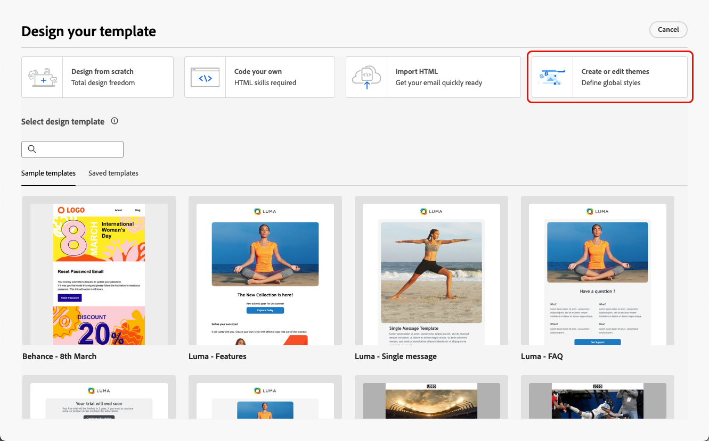
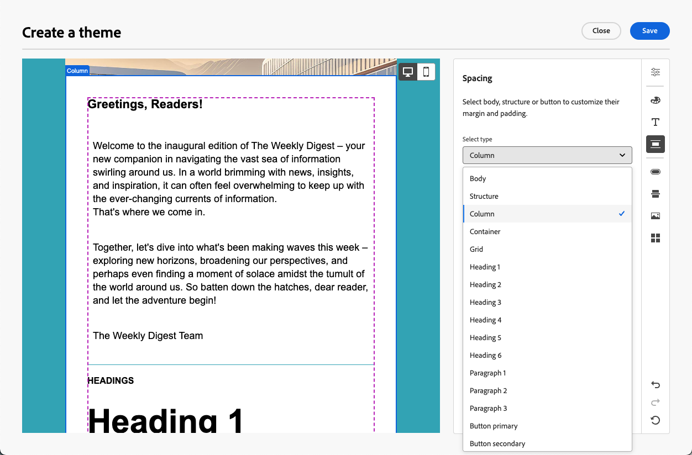

# Applicare temi al contenuto dell’e-mail {#apply-email-themes}

>[!CONTEXTUALHELP]
>id="ajo_use_theme"
>title="Applicare un tema all’e-mail"
>abstract="Seleziona un tema per l’e-mail per applicare rapidamente uno stile specifico che sia adatto al brand e alla progettazione."

<!--This documentation provides a comprehensive guide to using themes to streamline your email creation process. With the ability to define reusable themes and leverage pre-designed modules, marketers can create professional, brand-aligned emails faster and with less effort.-->

>[!AVAILABILITY]
>
>Questa funzionalità è disponibile attualmente in versione beta e solo per la clientela beta. Per partecipare al programma Beta, contatta il tuo rappresentante Adobe.

Con i temi, gli utenti non tecnici hanno la possibilità di creare contenuti riutilizzabili che si adattano a un marchio e a un linguaggio di progettazione specifici aggiungendo stili personalizzati sopra i modelli standard<!-- to achieve brand specific results-->.

Questa funzione consente agli addetti al marketing di sfruttare le e-mail visivamente accattivanti e coerenti con il brand in modo più rapido e con meno sforzo, fornendo al contempo opzioni di personalizzazione avanzate per esigenze di progettazione univoche.

<!--What is the Enhanced Email Authoring Experience?

This feature introduces two key components to simplify and enhance email creation:

* **Theme Management System**: A centralized system for creating, customizing, and applying reusable themes to emails. Themes ensure consistent styling across campaigns and eliminate the need for repetitive manual styling.

* **Modules**: Pre-designed, reusable content blocks that abstract common email elements (e.g., titles, descriptions, images, and links). Modules are built using customizable low-level components, offering flexibility while maintaining design standards.

Key Benefits:

- **Consistency**: Ensure all emails align with your brand's design guidelines.
- **Efficiency**: Save time by reusing themes and modules across campaigns.
- **Customization**: Add custom CSS and mobile-specific styles for advanced designs.
- **Scalability**: Eliminate repetitive styling tasks, enabling faster email creation.-->

## Guardrail e limitazioni {#themes-guardrails}

* Quando crei un’e-mail da zero, puoi scegliere di iniziare a creare i contenuti utilizzando un tema per applicare rapidamente uno stile specifico che si adatta al tuo marchio e design.

  Se scegli la modalità Stile manuale, non potrai applicare alcun tema a meno che non reimposti l’e-mail.

* [I frammenti](../content-management/fragments.md) non sono compatibili tra le modalità Usa temi e Stile manuale.

  Per poter utilizzare un frammento in un contenuto in cui è applicato un tema, è necessario creare il frammento in modalità Usa temi.

* Se utilizzi un contenuto creato in HTML, sarai in [modalità di compatibilità](existing-content.md) e non puoi applicare temi a questo contenuto.

  Per sfruttare appieno tutte le funzionalità di E-mail Designer, inclusi i temi, è necessario creare un nuovo contenuto in modalità Usa temi o convertire il contenuto HTML importato. [Ulteriori informazioni](existing-content.md)

<!--If using a content created in Manual Styling mode or HTML, you cannot apply themes to this content. You must create a new content in Use Themes mode.

If you apply a theme to a content using a [fragment](../content-management/fragments.md) created in Manual Styling mode, the rendering may not be optimal.-->

## Creare un tema {#create-and-edit-themes}

Per definire un tema che puoi sfruttare nei contenuti delle e-mail future, segui i passaggi indicati di seguito.

1. Per iniziare, crea un nuovo [modello di contenuto](../content-management/create-content-templates.md).

1. Selezionare l&#39;opzione **[!UICONTROL Crea o modifica temi]**.

   

1. Puoi selezionare il tema predefinito oppure utilizzare un modello Adobe o personalizzato. In questo esempio, selezionare il tema predefinito e fare clic su **[!UICONTROL Crea]**.

   

1. Nella scheda **[!UICONTROL Impostazioni generali]**, inizia a definire il tema assegnandogli un nome specifico per il tuo marchio. Puoi regolare la larghezza predefinita per le e-mail ed esportare il tema corrente in [condividerlo tra sandbox](../configuration/copy-objects-to-sandbox.md).

   <!---->

1. Utilizza la barra a destra per spostarti tra le diverse schede e aggiornare le impostazioni di progettazione.

   

1. Dalla scheda **[!UICONTROL Colori]**:

   * Utilizza il pulsante **[!UICONTROL Modifica]** per impostare una **[!UICONTROL palette di colori]** con i colori predefiniti per il tuo marchio. Seleziona un **[!UICONTROL predefinito]** per creare rapidamente una combinazione di colori o regolare singolarmente ogni colore del tema. Puoi anche utilizzare una combinazione di entrambi.

     

   * Fai clic su **[!UICONTROL Aggiungi variante]** per creare più varianti di colore, ad esempio la modalità chiara e scura, in cui ogni variante dispone di una propria palette di colori e controlli sfumatura.

     

   * Per ogni variante, fai clic sull’icona Modifica per modificare un singolo elemento. Puoi utilizzare la palette predefinita creata oppure qualsiasi colore personalizzato.

     

1. Nelle **[!UICONTROL Impostazioni testo]** è possibile impostare il tipo di carattere globale che si desidera utilizzare per l&#39;intero tema. Per un controllo più granulare, è inoltre possibile modificare ogni intestazione e tipo di paragrafo per regolare il carattere, le dimensioni, lo stile e così via.

   

1. Nella scheda **[!UICONTROL Spaziatura]** selezionare un singolo elemento dall&#39;elenco per disporlo correttamente tra i diversi componenti.

   <!---->

1. Utilizzando le altre schede a destra, è possibile gestire separatamente ogni elemento pulsante, divisore, formattazione immagine aggiuntiva e spaziatura layout griglia per questo tema.

   <!---->

1. Fai clic su **[!UICONTROL Salva]** per memorizzare questo tema per utilizzi futuri.

## Applicare temi a un’e-mail {#apply-themes}

Per applicare temi di stile predefiniti o personalizzati a un’e-mail, segui la procedura riportata di seguito.

1. In [!DNL Journey Optimizer], [aggiungi un&#39;azione e-mail](create-email.md) a un percorso o a una campagna e [modifica il corpo dell&#39;e-mail](get-started-email-design.md#key-steps).

1. Puoi selezionare una delle seguenti azioni:

   * Seleziona un [modello e-mail](use-email-templates.md) predefinito per aprire E-mail Designer. A ogni modello viene automaticamente applicato un tema predefinito.

   * Progetta un [nuovo contenuto da zero](content-from-scratch.md) e seleziona **[!UICONTROL Usa temi]** per iniziare con un tema di stile predefinito.

     

     >[!CAUTION]
     >
     >Se scegli la modalità Stile manuale, non potrai applicare alcun tema a meno che non reimposti l’e-mail.
     >
     >Per utilizzare un [frammento](../content-management/fragments.md) in modalità Usa temi, è necessario che il frammento sia stato creato utilizzando la modalità Usa temi.

1. Una volta nel Designer e-mail, fai clic sul pulsante **[!UICONTROL Temi]** nella barra a destra. Viene visualizzato il tema predefinito o il tema del modello. Per questo tema è possibile alternare tra le due varianti di colore.

   

1. Fare clic sulla freccia accanto al tema attualmente utilizzato. Viene visualizzato l’elenco dei temi personalizzati e Adobe disponibili.

   

1. Fai clic su **[!UICONTROL Temi personalizzati]** e seleziona il tema creato.

   

1. Fai clic all’esterno dell’elenco a discesa. Il tema personalizzato appena selezionato applica automaticamente i relativi stili a tutti i componenti e-mail. Puoi alternare tra le due varianti di colore.

1. Quando un componente è selezionato, è comunque possibile sbloccarne lo stile utilizzando l’icona dedicata.

   

È possibile cambiare tema in qualsiasi momento. Il contenuto dell’e-mail rimane invariato, ma gli stili vengono aggiornati per riflettere il nuovo tema.

<!--
>[!NOTE]
> - Themes apply styles globally. Ensure your theme is finalized before applying it to multiple emails.
> - Switching themes may override custom styles applied to individual components.

>[!CAUTION]
> - When using fragments, the email's theme will override the fragment's styles. A warning will be displayed in the editor if there is a conflict.

## Example Use Cases {#example-use-cases}

### 1. Creating a New Theme
- A marketer creates a theme with their brand's colors, fonts, and button styles.
- The theme is saved and reused across multiple email campaigns.

### 2. Switching Themes
- A marketer applies a holiday-themed design to an existing email by switching to a pre-designed holiday theme.-->
