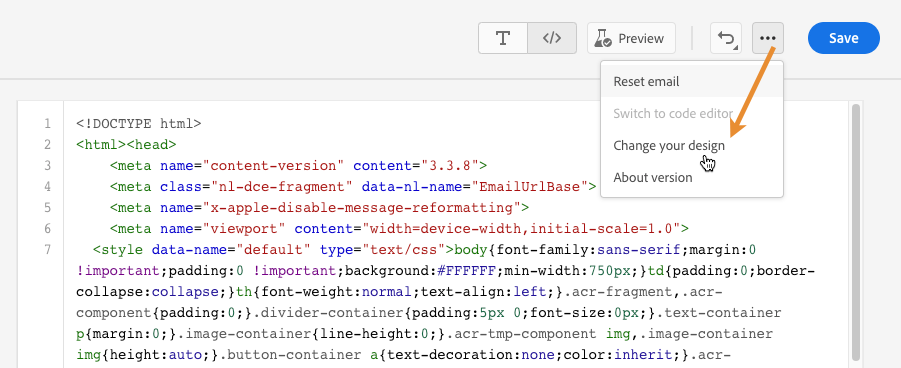

# Creare il codice del contenuto {#code-content}

Utilizza la modalità **[!UICONTROL Crea il codice]** per importare o creare il codice HTML non elaborato da usare come contenuto dell’e-mail. Questo metodo richiede competenze HTML.

➡️ [Scopri questa funzione nel video](#video)

>[!CAUTION]
>
> Impossibile fare riferimento alle immagini da [Adobe Experience Manager Assets](../integrations/assets.md) quando si utilizza questo metodo. Le immagini a cui si fa riferimento nel codice HTML devono essere memorizzate in una posizione pubblica.

1. Dalla home page di E-mail Designer, seleziona **[!UICONTROL Crea un codice personalizzato]**.

   

1. Immetti o incolla il codice HTML non elaborato.

1. Utilizza il riquadro a sinistra per sfruttare le funzionalità di personalizzazione di [!DNL Journey Optimizer]. [Ulteriori informazioni](../personalization/personalize.md)

   

   >[!NOTE]
   >
   >L’editor di personalizzazione in E-mail Designer presenta alcune limitazioni funzionali rispetto alle espressioni di percorso. [Ulteriori informazioni sulle limitazioni della funzione data/ora](#date-time-limitations)

1. Se desideri cancellare il contenuto e-mail e avviare l’e-mail da un nuovo design, **[!UICONTROL Cambia il design]** nel menu delle opzioni.

   

   >[!NOTE]
   >
   >Questa azione apre il modello selezionato in E-mail Designer. Da lì puoi completare il design dell’e-mail o tornare all’editor di codice utilizzando l’opzione **[!UICONTROL Passa all’editor di codice]**.

1. Fai clic sul pulsante **[!UICONTROL Anteprima]** per controllare la progettazione e la personalizzazione del messaggio utilizzando i profili di test. [Ulteriori informazioni](../content-management/preview-test.md)

   

1. Quando il codice è pronto, fai clic su **[!UICONTROL Salva]** quindi torna alla schermata di creazione del messaggio per finalizzarlo.

   

## Limitazioni della funzione data e ora {#date-time-limitations}

Quando si utilizza la personalizzazione nell&#39;editor di codice di E-mail Designer, la funzione `now()` non è disponibile per il calcolo dinamico delle date.

>[!IMPORTANT]
>
>La funzione `now()` è **non supportata** nel linguaggio di espressione di Email Builder. `now()` è disponibile in condizioni di percorso, ma non può essere utilizzato all&#39;interno del contenuto e-mail o nell&#39;editor di codice.

**Alternative disponibili:**

Utilizza le seguenti funzioni per lavorare con la data e l’ora correnti nella personalizzazione delle e-mail:

* **`getCurrentZonedDateTime()`** - Restituisce la data e l&#39;ora correnti con le informazioni sul fuso orario. Questa è l&#39;alternativa consigliata a `now()`.

  Esempio: `` restituisce `2024-12-06T17:22:02.281067+05:30[Asia/Kolkata]`

* **`currentTimeInMillis()`** - Restituisce il tempo corrente in millisecondi epoca.

  Esempio: ``

**Soluzioni consigliate:**

Se devi eseguire calcoli di date nel contenuto dell’e-mail:

* **Precalcola i campi data** - Calcola i valori data obbligatori nella pipeline dei dati o negli attributi del profilo prima di inviare l&#39;e-mail, quindi fai riferimento a tali valori precalcolati nella personalizzazione.

  Esempio: ``

* **Utilizza le funzioni di manipolazione data**. Utilizza [funzioni data/ora](../personalization/functions/dates.md) come `dayOfYear()` o `diffInDays()` con valori data dagli attributi del profilo.

  Esempio: ``

* **Usa attributi calcolati** - Crea [attributi calcolati](../audience/computed-attributes.md) che eseguono calcoli di data complessi, rendendo i risultati disponibili come attributi di profilo.

Ulteriori informazioni sulle [Funzioni data/ora nella personalizzazione](../personalization/functions/dates.md).
