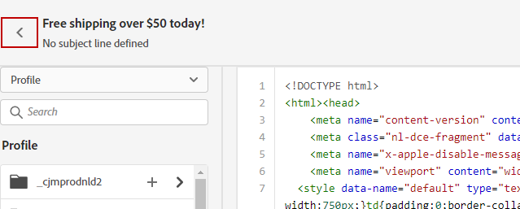

# Creare il codice del contenuto {#code-content}

Utilizza la modalità **[!UICONTROL Crea il codice]** per importare o creare il codice HTML non elaborato da usare come contenuto dell’e-mail. Questo metodo richiede competenze HTML.

➡️ [Scopri questa funzione nel video](#video)

>[!CAUTION]
>
> Impossibile fare riferimento alle immagini da [Adobe Experience Manager Assets](../integrations/assets.md) quando si utilizza questo metodo. Le immagini a cui si fa riferimento nel codice HTML devono essere memorizzate in una posizione pubblica.

1. Dalla home page di E-mail Designer, seleziona **[!UICONTROL Crea un codice personalizzato]**.

   

1. Immetti o incolla il codice HTML non elaborato.

1. Utilizza il riquadro a sinistra per sfruttare le funzionalità di personalizzazione di [!DNL Journey Optimizer]. [Ulteriori informazioni](../personalization/personalize.md)

   

1. Se desideri cancellare il contenuto e-mail e avviare l’e-mail da un nuovo design, **[!UICONTROL Cambia il design]** nel menu delle opzioni.

   

   >[!NOTE]
   >
   >Questa azione apre il modello selezionato in E-mail Designer. Da lì puoi completare il design dell’e-mail o tornare all’editor di codice utilizzando l’opzione **[!UICONTROL Passa all’editor di codice]**.

1. Fai clic sul pulsante **[!UICONTROL Anteprima]** per controllare la progettazione e la personalizzazione del messaggio utilizzando i profili di test. [Ulteriori informazioni](../content-management/preview-test.md)

   

1. Quando il codice è pronto, fai clic su **[!UICONTROL Salva]** quindi torna alla schermata di creazione del messaggio per finalizzarlo.

   
