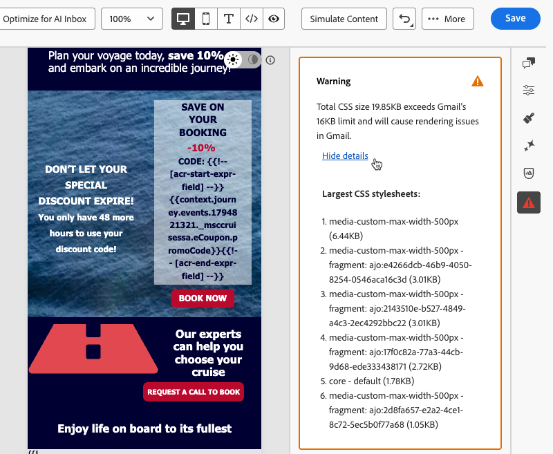

# Verifica del contenuto nel Designer e-mail {#content-check}

>[!CONTEXTUALHELP]
>id="ajo_email_content_check"
>title="Convalidare il contenuto dell’e-mail"
>abstract="I controlli del contenuto rilevano automaticamente i problemi HTML e CSS nell’e-mail prima dell’invio. Contrassegnano i tag non supportati, i div vuoti e i limiti di dimensione che possono interrompere il rendering in Gmail o Microsoft Outlook. I problemi emergono come errori, avvisi o avvisi informativi, con dettagli contestuali e correzioni con un solo clic, se disponibili."

[!DNL Journey Optimizer] include la convalida tecnica automatica direttamente nel Designer e-mail, che consente di individuare i problemi di HTML e CSS prima dell&#39;invio.

I risultati vengono visualizzati come errori, avvisi o avvisi informativi nel pannello di authoring, con dettagli contestuali e correzioni con un solo clic, se disponibili, in modo che i problemi possano essere risolti senza uscire da E-mail Designer.

## Accedere ai controlli del contenuto {#access-content-checks}

I controlli del contenuto sono sempre disponibili in E-mail Designer. Per visualizzarli, fai clic sull&#39;icona Problemi nella barra a destra per aprire il riquadro **[!UICONTROL Verifica contenuto]**, in cui sono elencati tutti i problemi rilevati.

>[!NOTE]
>
>Gli assegni vengono eseguiti automaticamente in base allo stato corrente dell’e-mail e dopo ogni modifica. [Ulteriori informazioni](#recalculation)

I controlli vengono visualizzati con tre livelli di gravità:

| Gravità | Colore | Descrizione |
|---|---|---|
| **Errore** | Rosso | Un problema critico che causerà errori di consegna o rendering. Risolvi prima dell’invio. |
| **Avvertenza** | Arancione | Un potenziale problema che può influenzare il rendering in client e-mail specifici. Consigliato per rivedere e risolvere. |
| **Info** | Blu | Avviso informativo relativo a una condizione che non blocca l’invio ma che può influire sulla gestibilità a lungo termine del contenuto. |

Se non vengono rilevati problemi, nel riquadro viene visualizzato **Nessun problema rilevato** e l&#39;icona corrispondente è verde.

A seconda del problema, puoi visualizzare più contesto, applicare una correzione con un solo clic o salvare l’e-mail per aggiornare il risultato di un controllo.

* Per alcuni problemi rilevati, puoi fare clic sul pulsante **[!UICONTROL Mostra dettagli]** per visualizzare più contesto. Fare clic su **[!UICONTROL Nascondi dettagli]** per comprimere.
  {width="80%"}
* Allo stesso modo, puoi fare clic sul pulsante **[!UICONTROL Mostra correzione]** e applicare una correzione con un solo clic, se disponibile. Se la correzione non può essere applicata automaticamente, viene visualizzato un messaggio e devi risolvere manualmente il problema.
  {width="80%"}

### Ricalcolo degli assegni {#recalculation}

La maggior parte dei controlli, come elementi di HTML non supportati, immersioni vuote e dimensioni del HTML, viene ricalcolata ogni volta che si modifica l’e-mail, in modo che rispecchi sempre il contenuto corrente.

Altri controlli, come le dimensioni CSS, vengono calcolati in base al contenuto serializzato, ovvero la versione dell’e-mail caricata o salvata, e non in base allo stato di modifica live nel Designer e-mail. In questo caso, il contenuto salvato può differire leggermente da quello visualizzato durante la modifica. Se si apportano modifiche senza salvare, viene visualizzata un&#39;etichetta **[!UICONTROL Stale check]** per indicare che il risultato potrebbe non essere più accurato. Salva l’e-mail per aggiornare il calcolo.

{width="100%"}

## Correggi i problemi rilevati {#fix-issues}

Nelle tabelle seguenti sono elencati tutti i messaggi possibili e l’azione consigliata per ciascuno di essi. Espandere la categoria corrispondente al messaggio visualizzato nel riquadro **[!UICONTROL Verifica contenuto]**.

+++ Elementi HTML non supportati

| Messaggio | Gravità | Cosa fare |
|---|---|---|
| Il contenuto contiene un tag `<script>`, che non è supportato in alcun sistema di posta elettronica. Rimuovilo per evitare problemi di consegna e rendering. | Errore | Individuare e rimuovere tutti i tag `<script>` dal contenuto di HTML. |
| Il contenuto contiene un tag `<base>`, che può causare problemi di risoluzione dei collegamenti e delle risorse nel Designer e-mail. Per risolvere il problema, è necessario rimuoverlo. | Errore | Rimuovi il tag `<base>` dal HTML. |
| Il contenuto contiene un tag meta di HTML con aggiornamento, che non è supportato in E-mail Designer. Rimuovilo per evitare comportamenti imprevisti. | Avvertenza | Rimuovi il tag meta refresh dal HTML. |
| Il contenuto contiene elementi div vuoti, che possono causare problemi di layout in Microsoft Outlook (MSO). Per risolvere questo problema, rimuovi i divs vuoti e utilizza invece la spaziatura degli elementi di pari livello. | Avvertenza | Elimina gli elementi `
` vuoti e regola la spaziatura o il margine sugli elementi circostanti per mantenere la spaziatura. |

+++

+++ Problemi CSS

| Messaggio | Gravità | Cosa fare |
|---|---|---|
| Le dimensioni totali dei file CSS superano il limite di 16 KB di Gmail e causano problemi di rendering in Gmail. | Errore | Utilizza **[!UICONTROL Applica correzione]** per rimuovere automaticamente le regole CSS inutilizzate o semplificare manualmente gli stili. |
| La dimensione totale dei file CSS è vicina al limite di 16 KB di Gmail e potrebbe causare problemi di rendering se vengono aggiunti altri file CSS. | Avvertenza | Utilizza **[!UICONTROL Applica correzione]** per rimuovere le regole CSS inutilizzate o ridurre gli stili prima di aggiungere altro contenuto. |
| La dimensione totale del CSS per questo frammento supera i 3 KB. La combinazione di questo con altri frammenti potrebbe causare il superamento del limite di 16 KB per il totale di CSS e-mail e causare problemi di rendering. | Avvertenza | Semplifica il CSS in questo frammento per mantenere i CSS e-mail combinati al di sotto di 16 KB. |
| Il contenuto contiene regole CSS non utilizzate. Questo potrebbe causare problemi di rendering in Gmail. | Avvertenza | Utilizza **[!UICONTROL Applica correzione]** per rimuovere automaticamente le regole CSS che fanno riferimento a elementi non più presenti nell&#39;e-mail. |

<!--
| Message | Severity | What to do |
|---|---|---|
| Your content has modifications to the system-generated default CSS. These changes may be overridden by future Email Designer updates. To preserve your styles, add them using the Custom CSS feature instead. | Info | Move your custom styles to [Custom CSS](custom-css.md) to ensure they are preserved across Email Designer updates. |
-->

+++

+++ Dimensioni HTML

| Messaggio | Gravità | Cosa fare |
|---|---|---|
| Le dimensioni stimate del HTML superano il limite di 100 KB di Gmail e causano problemi di rendering in Gmail. Le dimensioni effettive di HTML possono variare al momento dell’invio. | Errore | Riduzione del contenuto delle e-mail: rimuovi gli elementi non necessari, semplifica la struttura o suddivide il contenuto in più invii. |
| La dimensione stimata del HTML è vicina al limite di 100 KB di Gmail e potrebbe causare problemi di rendering se si aggiunge altro HTML. Le dimensioni effettive di HTML possono variare al momento dell’invio. | Avvertenza | Semplificare i contenuti prima di aggiungerne altri. Le e-mail che superano il limite Gmail verranno tagliate per i destinatari. |
| La dimensione stimata del HTML per questo frammento supera i 20 KB. La combinazione di questo con altri frammenti potrebbe causare il superamento del limite di 100 KB per il HTML e-mail totale e causare problemi di rendering. Le dimensioni effettive di HTML possono variare al momento dell’invio. | Avvertenza | Riduci il HTML in questo frammento per mantenere la dimensione e-mail combinata al di sotto del limite di 100 KB di Gmail. |

+++

## Informazioni sulle dimensioni di HTML e CSS {#size-estimation}

I valori delle dimensioni di HTML e CSS sono **stime calcolate al momento dell&#39;authoring** e possono differire dalle dimensioni effettive consegnate ai destinatari, ad esempio quando l&#39;e-mail utilizza blocchi condizionali (un solo ramo viene riprodotto per destinatario) o quando la minimizzazione di HTML è abilitata al momento dell&#39;invio.

Gli avvisi relativi alle dimensioni sono segnali proattivi che consentono di ottimizzare il contenuto prima dell’invio, non blocchi rigidi.
