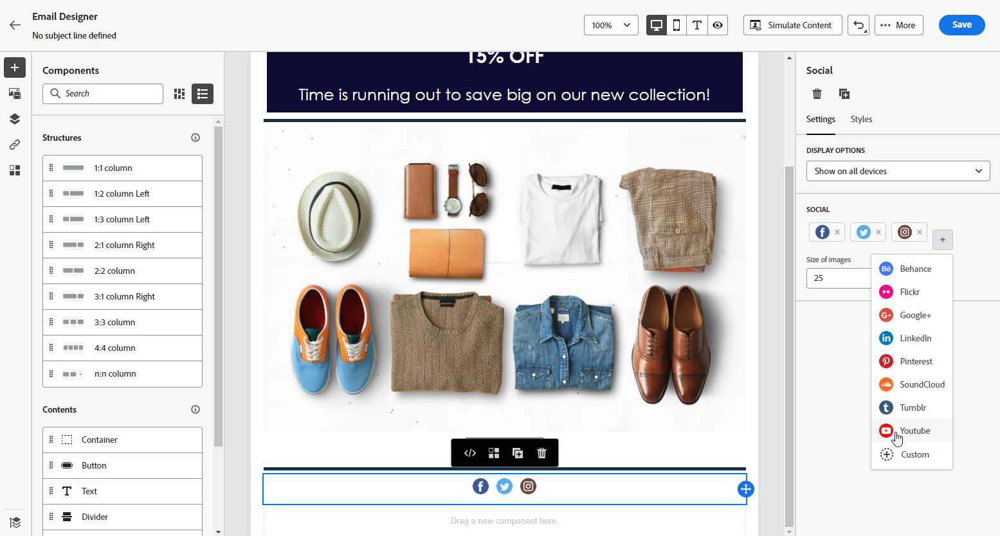

# Utilizzare i componenti di contenuto di E-mail Designer {#content-components}

>[!CONTEXTUALHELP]
>id="ac_content_components_email"
>title="Informazioni sui componenti per contenuti"
>abstract="I componenti per contenuti sono dei segnaposto di contenuto vuoti che possono essere utilizzati per creare il layout di un’e-mail."

>[!CONTEXTUALHELP]
>id="ac_content_components_landing_page"
>title="Informazioni sui componenti per contenuti"
>abstract="I componenti per contenuti sono dei segnaposto di contenuto vuoti che possono essere utilizzati per creare il layout di una pagina di destinazione."

>[!CONTEXTUALHELP]
>id="ac_content_components_fragment"
>title="Informazioni sui componenti per contenuti"
>abstract="I componenti per contenuti sono dei segnaposto di contenuto vuoti che possono essere utilizzati per creare il layout di un frammento."

>[!CONTEXTUALHELP]
>id="ac_content_components_template"
>title="Informazioni sui componenti per contenuti"
>abstract="I componenti per contenuti sono dei segnaposto di contenuto vuoti che possono essere utilizzati per creare il layout di un modello."

Quando crei il tuo contenuto e-mail, **[!UICONTROL Componenti contenuto]** ti consente di personalizzare ulteriormente l’e-mail con componenti non elaborati che puoi modificare una volta inseriti in un messaggio e-mail.

Puoi aggiungere tutti i componenti di contenuto necessari all’interno di uno o più componenti struttura, che definiscono il layout del messaggio e-mail.

## Aggiungere componenti per contenuti {#add-content-components}

Per aggiungere componenti per contenuti all’e-mail e modificarli in base alle tue esigenze, segui la procedura seguente.

1. In E-mail Designer, utilizza un contenuto esistente oppure trascina i **[!UICONTROL componenti struttura]** desiderati nel contenuto vuoto per definire il layout dell’e-mail. [Scopri come](content-from-scratch.md)

1. Per accedere alla sezione **[!UICONTROL Componenti contenuto]**, seleziona il pulsante corrispondente dal riquadro a sinistra di E-mail Designer.

   

1. Trascina i componenti per contenuti desiderati all’interno dei componenti struttura pertinenti.

   

   >[!NOTE]
   >
   >È possibile aggiungere più componenti in un singolo componente struttura e in ogni colonna di un componente struttura.

1. Regola gli attributi di stile per ciascun componente utilizzando il riquadro **[!UICONTROL Impostazioni componenti]** a destra. Ad esempio, puoi modificare lo stile del testo, la spaziatura o il margine di ciascun componente. [Ulteriori informazioni su allineamento e spaziatura](alignment-and-padding.md)

   

## Contenitore {#container}

Puoi aggiungere un contenitore semplice all’interno del quale puoi aggiungere un altro componente di contenuto. Questo consente di applicare al contenitore uno stile specifico diverso dal componente utilizzato al suo interno.

Ad esempio, aggiungi un componente **[!UICONTROL Contenitore]** e quindi un componente [Pulsante](#button) all’interno del contenitore. Puoi utilizzare uno sfondo specifico per il contenitore e un altro per il pulsante.

## Pulsante {#button}

Utilizza il componente **[!UICONTROL Pulsante]** per inserire uno o più pulsanti nell’e-mail e reindirizzare il pubblico dell’e-mail a un’altra pagina.

1. Da **[!UICONTROL Componenti contenuto]**, trascina il componente **[!UICONTROL Pulsante]** in un **[!UICONTROL Componente struttura]**.

1. Fai clic sul pulsante appena aggiunto per personalizzare il testo e per accedere alle **[!UICONTROL Impostazioni componenti]** nel riquadro a destra in E-mail Designer.

   

1. Nel campo **[!UICONTROL Collegamento]** aggiungi l’URL a cui l’utente dovrà passare quando farà clic sul pulsante.

1. Scegli in che modo il pubblico verrà reindirizzato con il **[!UICONTROL Target]** elenco a discesa:

   * **[!UICONTROL Nessuno]**: il collegamento viene aperto nello stesso frame in cui è stato fatto clic (impostazione predefinita).
   * **[!UICONTROL Vuoto]**: il collegamento viene aperto in una nuova finestra o scheda.
   * **[!UICONTROL Stesso]**: il collegamento viene aperto nello stesso frame in cui è stato fatto clic.
   * **[!UICONTROL Principale]**: il collegamento viene aperto nel frame principale.
   * **[!UICONTROL Superiore]**: il collegamento viene aperto nel corpo completo della finestra.

   

1. Puoi personalizzare ulteriormente il pulsante modificando gli attributi di stile, ad esempio **[!UICONTROL Bordo]**, **[!UICONTROL Dimensione]**, **[!UICONTROL Margine]**, ecc. dal riquadro **[!UICONTROL Impostazioni componenti]**.

## Testo {#text}

Utilizza il componente **[!UICONTROL Testo]** per inserire testo nell’e-mail e regolarne lo stile (bordo, dimensione, spaziatura, ecc.) utilizzando il riquadro **[!UICONTROL Impostazioni componenti]**.

1. Da **[!UICONTROL Componenti contenuto]**, trascina e rilascia la **[!UICONTROL Testo]** in un **[!UICONTROL Componente struttura]**.

1. Fai clic sul componente appena aggiunto per personalizzare il testo e avere accesso al **[!UICONTROL Impostazioni dei componenti]** nel riquadro a destra di E-mail Designer.

1. Modifica il testo con le seguenti opzioni disponibili nella barra degli strumenti:

   

   * **[!UICONTROL Modifica stile di testo]**: applica al testo lo stile grassetto, corsivo, sottolineato o barrato.
   * **Modifica l’allineamento**: applica al testo l’allineamento a sinistra, a destra, centrato o giustificato.
   * **[!UICONTROL Crea elenco]**: aggiungi al testo un elenco puntato o numerato.
   * **[!UICONTROL Imposta il titolo]**: aggiungi al testo fino a sei livelli di titolo.
   * **Dimensione font**: seleziona la dimensione del font in pixel.
   * **[!UICONTROL Modifica immagine]**: aggiungi un’immagine o una risorsa al componente testo. [Ulteriori informazioni sulla gestione delle risorse](assets-essentials.md)
   * **[!UICONTROL Mostra il codice sorgente]**: visualizza il codice sorgente del testo. Non può essere modificato.
   * **[!UICONTROL Duplica]**: aggiungi una copia del componente di testo.
   * **[!UICONTROL Elimina]**: elimina dal messaggio e-mail il componente di testo selezionato.
   * **[!UICONTROL Aggiungi personalizzazione]**: aggiungi campi di personalizzazione per personalizzare il contenuto in base ai dati dei profili. [Ulteriori informazioni sulla personalizzazione dei contenuti](../personalization/personalize.md)
   * **[!UICONTROL Abilita contenuto condizionale]**: aggiungi contenuto condizionale per adattare il contenuto del componente ai profili target. [Ulteriori informazioni sul contenuto dinamico](../personalization/get-started-dynamic-content.md)

1. Regola gli altri attributi di stile quali colore del testo, famiglia di font, bordo, spaziatura, margine, ecc. dal riquadro **[!UICONTROL Impostazioni componenti]**.

## Divisore {#divider}

Utilizza il componente **[!UICONTROL Divisore]** per inserire una linea di divisione utile per organizzare il layout e il contenuto dell’e-mail.

È possibile regolare gli attributi di stile, ad esempio il colore, lo stile e lo spessore della linea, dal riquadro **[!UICONTROL Impostazioni componenti]**.

## HTML {#HTML}

Utilizza il componente **[!UICONTROL HTML]** per copiare e incollare le diverse parti di un codice HTML esistente. Questo consente di creare componenti modulari HTML a forma libera in modo da riutilizzare dei contenuti esterni.

1. Da **[!UICONTROL Componenti contenuto]**, trascina il componente **[!UICONTROL HTML]** in un **[!UICONTROL componente struttura]**.

1. Fai clic sul componente appena aggiunto, quindi seleziona **[!UICONTROL Mostra il codice sorgente]** dalla barra degli strumenti contestuale per aggiungere il codice HTML.

   

1. Copia e incolla il codice HTML che desideri aggiungere all’e-mail e fai clic su **[!UICONTROL Salva]**.

   

>[!NOTE]
>
>Per rendere semplicemente un contenuto esterno conforme a E-mail Designer, Adobe consiglia di creare un messaggio da zero e di copiare il contenuto dell’e-mail esistente nei componenti.

## Immagine {#image}

Utilizza la **[!UICONTROL Immagine]** per inserire un file immagine dal computer nel contenuto dell’e-mail.

1. Da **[!UICONTROL Componenti contenuto]**, trascina e rilascia la **[!UICONTROL Immagine]** in un **[!UICONTROL Componente struttura]**.

1. Fai clic su **[!UICONTROL Sfoglia]** per scegliere un file di immagine dalle risorse.

   Per saperne di più [!DNL Assets Essentials], fare riferimento a [Documentazione di Adobe Experience Manager Assets Essentials](https://experienceleague.adobe.com/docs/experience-manager-assets-essentials/help/introduction.html){target="_blank"}.

1. Fai clic sul componente appena aggiunto e imposta le proprietà dell’immagine utilizzando il riquadro **[!UICONTROL Impostazioni componenti]**:

   * **[!UICONTROL Titolo immagine]** consente di definire il titolo da assegnare all’immagine.
   * **[!UICONTROL Testo Alt]** consente di definire la didascalia collegata all’immagine. Questo corrisponde all’attributo HTML “alt”.

   

1. Regola gli altri attributi di stile quali margine, bordo, ecc. oppure aggiungendo un collegamento per reindirizzare il pubblico a un altro contenuto, dal riquadro **[!UICONTROL Impostazioni componenti]**.

## Social {#social}

Utilizza il componente **[!UICONTROL Social]** per inserire nel contenuto dell’e-mail dei collegamenti a pagine social media.

1. Da **[!UICONTROL Componenti contenuto]**, trascina il componente **[!UICONTROL Social]** in un **[!UICONTROL componente struttura]**.

1. Fai clic sul componente appena aggiunto.

1. Nel campo **[!UICONTROL Social]** del riquadro **[!UICONTROL Impostazioni componenti]** scegli i social media da aggiungere o rimuovere.

   

1. Scegli la dimensione delle icone attraverso il campo dedicato.

1. Fai clic su ciascuna delle icone dei social media per configurare le **[!UICONTROL URL]** a cui verrà reindirizzato il pubblico.

   

1. Se necessario, puoi anche modificare le icone di ciascuno dei social media mediante il campo **[!UICONTROL Immagine]**.

1. Regola gli altri attributi quali stile, margine, bordo, ecc. dal riquadro **[!UICONTROL Impostazioni componenti]**.

## Decisione di offerta {#offer-decision}

Utilizza la **[!UICONTROL Decisione di offerta]** per inserire offerte nei messaggi. La [gestione delle decisioni](../offers/get-started/starting-offer-decisioning.md) engine sceglierà l&#39;offerta migliore da consegnare ai tuoi clienti.

Scopri come aggiungere offerte personalizzate a un’e-mail in [questa sezione](add-offers-email.md).

