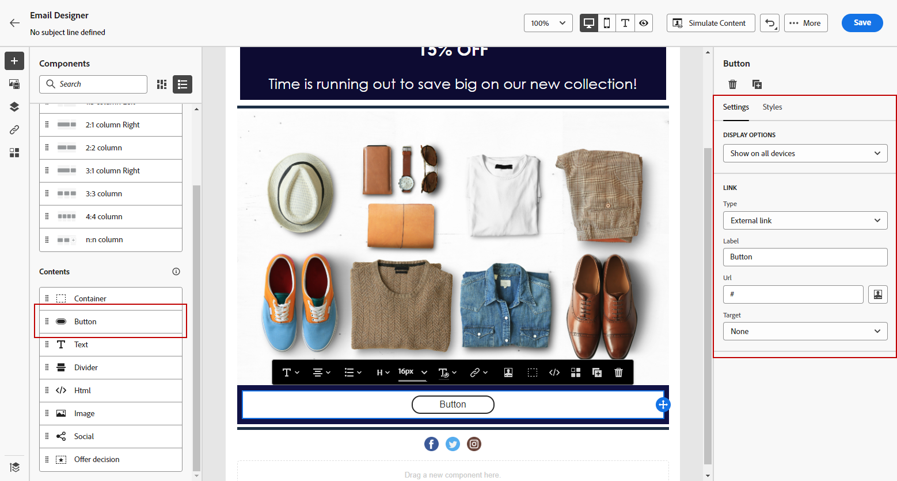

# Utilizzare i componenti di contenuto di E-mail designer {#content-components}

>[!CONTEXTUALHELP]
>id="ac_content_components_email"
>title="Informazioni sui componenti per contenuti"
>abstract="I componenti per contenuti sono dei segnaposto di contenuto vuoti che possono essere utilizzati per creare il layout di un’e-mail."

>[!CONTEXTUALHELP]
>id="ac_content_components_landing_page"
>title="Informazioni sui componenti per contenuti"
>abstract="I componenti dei contenuti sono dei segnaposto di contenuto vuoti che possono essere utilizzati per creare il layout di una pagina di destinazione."

>[!CONTEXTUALHELP]
>id="ac_content_components_fragment"
>title="Informazioni sui componenti per contenuti"
>abstract="I componenti per contenuti sono dei segnaposto di contenuto vuoti che possono essere utilizzati per creare il layout di un frammento."

>[!CONTEXTUALHELP]
>id="ac_content_components_template"
>title="Informazioni sui componenti per contenuti"
>abstract="I componenti per contenuti sono dei segnaposto di contenuto vuoti che possono essere utilizzati per creare il layout di un modello."

Durante la creazione del contenuto dell&#39;e-mail, **[!UICONTROL Componenti contenuto]** ti consente di personalizzare ulteriormente l&#39;e-mail con componenti non elaborati che puoi modificare una volta inseriti in un messaggio e-mail.

Puoi aggiungere tutti i componenti di contenuto necessari all’interno di uno o più componenti struttura, che definiscono il layout dell’e-mail.

>[!NOTE]
>
>Il [European Accessibility Act](https://eur-lex.europa.eu/legal-content/EN/TXT/?uri=CELEX%3A32019L0882){target="_blank"} stabilisce che tutte le comunicazioni digitali devono essere accessibili. Segui le linee guida specifiche elencate in [questa pagina](accessible-content.md) quando utilizzi i componenti di contenuto per progettare e-mail in [!DNL Journey Optimizer], ad esempio utilizzando font accessibili e formati leggibili e fornendo testo alternativo per le immagini.

## Aggiungere componenti per contenuti {#add-content-components}

Per aggiungere componenti per contenuti all’e-mail e modificarli in base alle tue esigenze, segui la procedura seguente.

1. In E-mail Designer, utilizza un contenuto esistente oppure trascina i **[!UICONTROL componenti struttura]** desiderati nel contenuto vuoto per definire il layout dell’e-mail. [Scopri come](content-from-scratch.md)

1. Per accedere alla sezione **[!UICONTROL Componenti contenuto]**, seleziona il pulsante corrispondente dal riquadro a sinistra di E-mail Designer.

   

1. Trascina i componenti per contenuti desiderati all’interno dei componenti struttura pertinenti.

   

   >[!NOTE]
   >
   >È possibile aggiungere più componenti in un singolo componente struttura e in ogni colonna di un componente struttura.

1. Regola gli attributi e lo stile di ogni componente utilizzando le schede **[!UICONTROL Impostazioni]** e **[!UICONTROL Stile]** a destra. Ad esempio, puoi modificare lo stile del testo, la spaziatura o il margine di ciascun componente. [Ulteriori informazioni su allineamento e spaziatura](alignment-and-padding.md)

   

1. Dal menu avanzato del **[!UICONTROL componente contenuto]**, puoi eliminare o duplicare facilmente qualsiasi componente contenuto in base alle esigenze.

   

## Contenitore {#container}

Per applicare uno stile specifico a un gruppo di componenti di contenuto, puoi aggiungere un componente **[!UICONTROL Contenitore]** e quindi i componenti di contenuto desiderati al suo interno. Questo consente di applicare uno stile distinto al contenitore, che sarà diverso dallo stile applicato ai componenti di contenuto all’interno.

Ad esempio, aggiungi un componente **[!UICONTROL Contenitore]** e quindi un componente [Pulsante](#button) all’interno del contenitore. Puoi utilizzare uno sfondo specifico per il contenitore e un altro per il pulsante.

## Pulsante {#button}

Utilizza il componente **[!UICONTROL Pulsante]** per inserire uno o più pulsanti nell’e-mail e reindirizzare il pubblico dell’e-mail a un’altra pagina.

1. Da **[!UICONTROL Componenti contenuto]**, trascina il componente **[!UICONTROL Pulsante]** in un **[!UICONTROL Componente struttura]**.

1. Fai clic sul pulsante appena aggiunto per personalizzare il testo e accedere alle schede **[!UICONTROL Impostazioni]** e **[!UICONTROL Stili]** nel riquadro a destra di E-mail Designer.

   

1. Dal menu **[!UICONTROL Collegamento]**, aggiungi l&#39;URL a cui desideri reindirizzare quando fai clic sul pulsante.

1. Scegli come verrà reindirizzato il pubblico con l&#39;elenco a discesa **[!UICONTROL Target]**:

   * **[!UICONTROL Nessuno]**: il collegamento viene aperto nello stesso frame in cui è stato fatto clic (impostazione predefinita).
   * **[!UICONTROL Vuoto]**: il collegamento viene aperto in una nuova finestra o scheda.
   * **[!UICONTROL Stesso]**: il collegamento viene aperto nello stesso frame in cui è stato fatto clic.
   * **[!UICONTROL Principale]**: il collegamento viene aperto nel frame principale.
   * **[!UICONTROL Superiore]**: il collegamento viene aperto nel corpo completo della finestra.

   

1. Puoi personalizzare ulteriormente il pulsante modificando gli attributi di stile, ad esempio **[!UICONTROL Bordo]**, **[!UICONTROL Dimensione]**, **[!UICONTROL Margine]**, ecc. dal riquadro **[!UICONTROL Impostazioni componenti]**.

## Testo {#text}

Utilizza il componente **[!UICONTROL Testo]** per inserire testo nell&#39;e-mail e modificare lo stile (bordo, dimensione, spaziatura interna, ecc.) utilizzando la scheda **[!UICONTROL Stili]**.

1. Da **[!UICONTROL Componenti contenuto]**, trascinare e rilasciare il componente **[!UICONTROL Testo]** in un **[!UICONTROL Componente struttura]**.

1. Fai clic sul componente appena aggiunto per personalizzare il testo e accedere alle schede **[!UICONTROL Impostazioni]** e **[!UICONTROL Stili]** nel riquadro a destra di E-mail Designer.

1. Modifica il testo con le seguenti opzioni disponibili nella barra degli strumenti:

   

   * **[!UICONTROL Modifica stile di testo]**: applica al testo lo stile grassetto, corsivo, sottolineato o barrato.
   * **Modifica l’allineamento**: applica al testo l’allineamento a sinistra, a destra, centrato o giustificato.
   * **[!UICONTROL Crea elenco]**: aggiungi al testo un elenco puntato o numerato.
   * **[!UICONTROL Imposta il titolo]**: aggiungi al testo fino a sei livelli di titolo.
   * **Dimensione font**: seleziona la dimensione del font in pixel.
   * **[!UICONTROL Cambia il colore del carattere]**: scegli il colore del carattere.
   * **[!UICONTROL Inserisci collegamento]**: aggiungi qualsiasi tipo di collegamento al contenuto.
   * **[!UICONTROL Modifica immagine]**: aggiungi un&#39;immagine o una risorsa al componente testo. [Ulteriori informazioni sulla gestione delle risorse](../integrations/assets.md)
   * **[!UICONTROL Cambia il colore del carattere]**: scegli il colore del carattere.
   * **[!UICONTROL Aggiungi personalizzazione]**: aggiungi campi di personalizzazione per personalizzare il contenuto dai dati dei profili. [Ulteriori informazioni sulla personalizzazione dei contenuti](../personalization/personalize.md)
   * **[!UICONTROL Mostra il codice sorgente]**: visualizza il codice sorgente del testo. Non può essere modificato.
   * **[!UICONTROL Abilita contenuto condizionale]**: aggiungi contenuto condizionale per adattare il contenuto del componente ai profili target. [Ulteriori informazioni sui contenuti dinamici](../personalization/get-started-dynamic-content.md)
   * **[!UICONTROL Duplica]**: aggiungi una copia del componente di testo.
   * **[!UICONTROL Elimina]**: elimina dal messaggio e-mail il componente di testo selezionato.

1. Regola gli altri attributi di stile quali colore del testo, famiglia di font, bordo, spaziatura, margine, ecc. dalla scheda **[!UICONTROL Stili]**.

   

## Divisore {#divider}

Utilizza il componente **[!UICONTROL Divisore]** per inserire una linea di divisione utile per organizzare il layout e il contenuto dell’e-mail.

È possibile regolare gli attributi di stile, ad esempio il colore, lo stile e lo spessore della linea, dalle schede **[!UICONTROL Impostazioni]** e **[!UICONTROL Stili]**.

## HTML {#HTML}

Utilizza il componente **[!UICONTROL HTML]** per copiare e incollare le diverse parti di un codice HTML esistente. Questo consente di creare componenti modulari HTML a forma libera in modo da riutilizzare dei contenuti esterni.

1. Da **[!UICONTROL Componenti contenuto]**, trascina il componente **[!UICONTROL HTML]** in un **[!UICONTROL componente struttura]**.

1. Fai clic sul componente appena aggiunto, quindi seleziona **[!UICONTROL Mostra il codice sorgente]** dalla barra degli strumenti contestuale per aggiungere il codice HTML.

   

1. Copia e incolla il codice HTML che desideri aggiungere alla tua e-mail e fai clic su **[!UICONTROL Salva]**.

   

>[!NOTE]
>
>Per rendere semplicemente un contenuto esterno conforme a E-mail Designer, Adobe consiglia di creare un messaggio da zero e di copiare il contenuto dell’e-mail esistente nei componenti.

## Immagine {#image}

Utilizza il componente **[!UICONTROL Immagine]** per inserire un file immagine dal computer nel contenuto dell&#39;e-mail.

1. Da **[!UICONTROL Componenti contenuto]**, trascinare e rilasciare il componente **[!UICONTROL Immagine]** in un **[!UICONTROL Componente struttura]**.

   

1. Dalla scheda **[!UICONTROL Impostazioni]**, fai clic su **[!UICONTROL Sfoglia]** per scegliere un file di immagine dalle risorse oppure su **[!UICONTROL Importa file multimediali]** per caricare una risorsa in Adobe Experience Manager Assets.

   Per ulteriori informazioni su [!DNL Adobe Experience Manager Assets], consulta la [documentazione di Adobe Experience Manager Assets](https://experienceleague.adobe.com/docs/experience-manager-assets-essentials/help/introduction.html){target="_blank"}.

   >[!NOTE]
   >
   > Per garantire che i collegamenti rimangano attivi ed evitare problemi di scadenza, ti consigliamo di utilizzare Adobe Assets invece di fare affidamento su un URL di origine per le immagini.

1. Puoi anche eseguire ricerche direttamente in Adobe Stock con l&#39;opzione **[!UICONTROL Trova foto Adobe Stock]**.

1. Fai clic sul componente appena aggiunto e imposta le proprietà dell’immagine:

   * **[!UICONTROL Titolo immagine]** consente di definire il titolo da assegnare all’immagine.
   * **[!UICONTROL Testo Alt]** consente di definire la didascalia collegata all’immagine. Corrisponde all’attributo alt HTML. [Ulteriori informazioni](../email/accessible-content.md#alt-text)

   

1. Puoi anche scegliere di **[!UICONTROL Trovare foto Stock simili]**. [Ulteriori informazioni](../integrations/stock.md)

1. Dalla scheda **[!UICONTROL Stili]**, regola gli altri attributi di stile come margine, bordo e così via. oppure aggiungendo un collegamento per reindirizzare il pubblico a un altro contenuto, dal riquadro **[!UICONTROL Impostazioni componenti]**.

## Social {#social}

Utilizza il componente **[!UICONTROL Social]** per inserire nel contenuto dell’e-mail dei collegamenti a pagine social media.

1. Da **[!UICONTROL Componenti contenuto]**, trascina il componente **[!UICONTROL Social]** in un **[!UICONTROL componente struttura]**.

1. Seleziona il componente appena aggiunto.

1. Nel campo **[!UICONTROL Social]** della scheda **[!UICONTROL Impostazioni]**, scegli i social media da aggiungere o rimuovere.

   

1. Scegli le dimensioni delle icone nel campo dedicato.

1. Fai clic su ciascuna delle icone dei social media per configurare l&#39;**[!UICONTROL URL]** a cui verrà reindirizzato il pubblico.

   

1. Se necessario, puoi anche cambiare le icone di ciascuno dei social media dal tuo Assets.

1. Regola gli altri attributi quali stile, margine, bordo, ecc. dalla scheda **[!UICONTROL Stili]**.

## Decisione sull’offerta {#offer-decision}

Utilizza il componente **[!UICONTROL Decisione offerta]** per inserire le offerte nei messaggi. Il motore [decision management](../offers/get-started/starting-offer-decisioning.md) sceglierà l&#39;offerta migliore da consegnare ai tuoi clienti.

1. Da **[!UICONTROL Componenti contenuto]**, trascina e rilascia il componente **[!UICONTROL Decisione offerta]** in un **[!UICONTROL Componente struttura]**.

1. Fai clic su **[!UICONTROL Aggiungi]** per selezionare la **[!UICONTROL decisione di offerta]**.

   

1. Dall&#39;elenco a discesa, seleziona i **[!UICONTROL posizionamenti]**.  Quindi, seleziona la **[!UICONTROL Decisione di offerta]** da aggiungere al contenuto e fai clic su **[!UICONTROL Aggiungi]**.

   

1. Dalla scheda **[!UICONTROL Decisione offerta]**, puoi visualizzare in anteprima o modificare l&#39;offerta inserita.

Scopri come aggiungere offerte personalizzate in un messaggio e-mail in [questa sezione](add-offers-email.md).

>[!IMPORTANT]
>
>Se vengono apportate modifiche a una decisione di offerta utilizzata in un messaggio di un percorso, devi annullare la pubblicazione del percorso e ripubblicarlo.  In questo modo le modifiche verranno incorporate nel messaggio del percorso e il messaggio sarà coerente con gli ultimi aggiornamenti.
