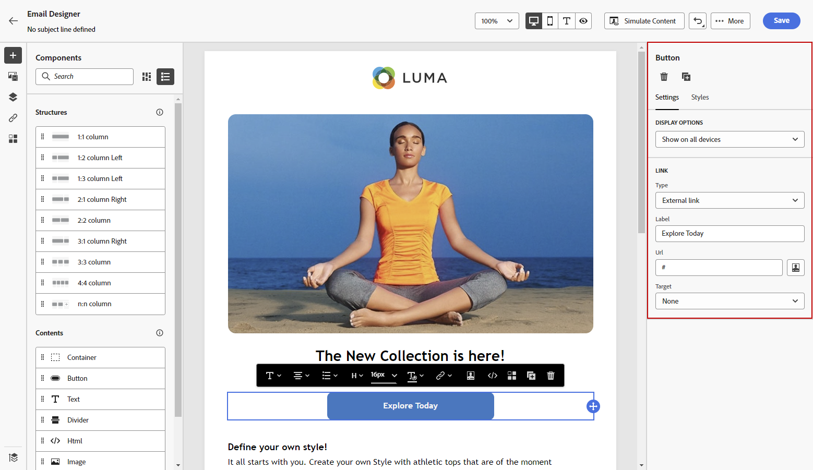
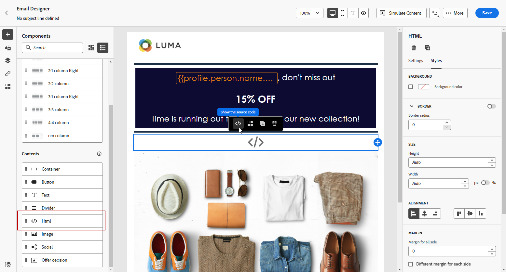
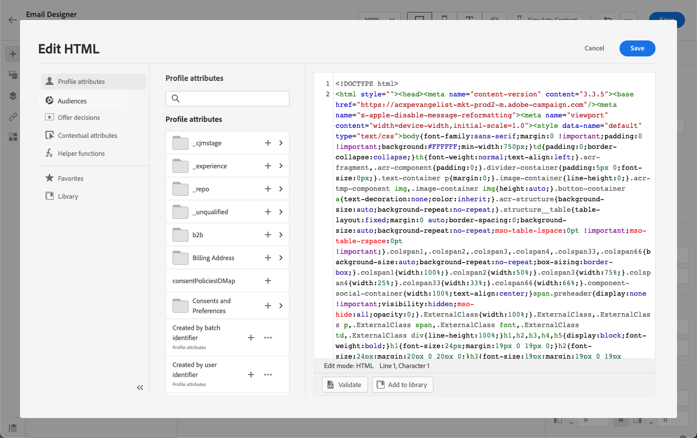

# Utilizzare i componenti di contenuto di E-mail Designer {#content-components}

>[!CONTEXTUALHELP]
>id="ac_content_components_email"
>title="Informazioni sui componenti Contenuto"
>abstract="I componenti contenuto sono segnaposto di contenuto vuoti che possono essere utilizzati per creare il layout di un’e-mail."

>[!CONTEXTUALHELP]
>id="ac_content_components_landing_page"
>title="Informazioni sui componenti Contenuto"
>abstract="I componenti contenuto sono segnaposto di contenuto vuoti che possono essere utilizzati per creare il layout di una pagina di destinazione."

>[!CONTEXTUALHELP]
>id="ac_content_components_fragment"
>title="Informazioni sui componenti Contenuto"
>abstract="I componenti contenuto sono segnaposto di contenuto vuoti che è possibile utilizzare per creare il layout di un frammento."

>[!CONTEXTUALHELP]
>id="ac_content_components_template"
>title="Informazioni sui componenti Contenuto"
>abstract="I componenti contenuto sono segnaposto di contenuto vuoti che è possibile utilizzare per creare il layout di un modello."

Quando crei il tuo contenuto e-mail, **[!UICONTROL Componenti contenuto]** ti consente di personalizzare ulteriormente l’e-mail con componenti non elaborati che puoi modificare una volta inseriti in un messaggio e-mail.

Puoi aggiungere tutti i componenti di contenuto necessari all’interno di uno o più componenti struttura, che definiscono il layout del messaggio e-mail.

## Aggiungi componenti di contenuto {#add-content-components}

Per aggiungere componenti di contenuto all’e-mail e modificarli in base alle tue esigenze, segui la procedura seguente.

1. In E-mail Designer, utilizza un contenuto esistente o trascina e rilascia **[!UICONTROL Componenti struttura]** nel contenuto vuoto per definire il layout dell’e-mail. [Scopri come](content-from-scratch.md)

1. Per accedere al **[!UICONTROL Componenti contenuto]** selezionare il pulsante corrispondente dal riquadro a sinistra di E-mail Designer.

   

1. Trascina e rilascia i componenti di contenuto desiderati all’interno dei componenti struttura pertinenti.

   

   >[!NOTE]
   >
   >È possibile aggiungere più componenti in un singolo componente struttura e in ogni colonna di un componente struttura.

1. Regolare gli attributi di stile per ciascun componente utilizzando **[!UICONTROL Impostazioni dei componenti]** a destra. Ad esempio, puoi modificare lo stile del testo, la spaziatura o il margine di ciascun componente. [Ulteriori informazioni su allineamento e spaziatura](alignment-and-padding.md)

   

## Contenitore {#container}

Puoi aggiungere un contenitore semplice all’interno del quale puoi aggiungere un altro componente di contenuto. Questo consente di applicare al contenitore uno stile specifico diverso dal componente utilizzato al suo interno.

Ad esempio, aggiungi un **[!UICONTROL Contenitore]** e quindi aggiungi un [Pulsante](#button) all’interno del contenitore. Puoi utilizzare uno sfondo specifico per il contenitore e un altro per il pulsante.

## Pulsante {#button}

Utilizza la **[!UICONTROL Pulsante]** per inserire uno o più pulsanti nell’e-mail e reindirizzare il pubblico dell’e-mail a un’altra pagina.

1. Da **[!UICONTROL Componenti contenuto]**, trascina e rilascia la **[!UICONTROL Pulsante]** in un **[!UICONTROL Componente struttura]**.

1. Fai clic sul pulsante appena aggiunto per personalizzare il testo e avere accesso al **[!UICONTROL Impostazioni dei componenti]** nel riquadro a destra di E-mail Designer.

   

1. In **[!UICONTROL Collegamento]** aggiungi l’URL a cui desideri reindirizzare quando fai clic sul pulsante .

1. Scegli in che modo il pubblico verrà reindirizzato con il **[!UICONTROL Target]** elenco a discesa:

   * **[!UICONTROL Nessuno]**: apre il collegamento nello stesso frame in cui è stato fatto clic (impostazione predefinita).
   * **[!UICONTROL Vuoto]**: apre il collegamento in una nuova finestra o scheda.
   * **[!UICONTROL Self]**: apre il collegamento nello stesso frame in cui è stato fatto clic.
   * **[!UICONTROL Elemento padre]**: apre il collegamento nel frame principale.
   * **[!UICONTROL Top]**: apre il collegamento nel corpo completo della finestra.

   

1. Puoi personalizzare ulteriormente il pulsante modificando gli attributi di stile, ad esempio **[!UICONTROL Bordo]**, **[!UICONTROL Dimensione]**, **[!UICONTROL Margine]**, ecc. dal **[!UICONTROL Impostazioni dei componenti]** riquadro.

## Testo {#text}

Utilizza la **[!UICONTROL Testo]** per inserire testo nell’e-mail e regolare lo stile (bordo, dimensione, spaziatura, ecc.) utilizzando **[!UICONTROL Impostazioni dei componenti]** riquadro.

1. Da **[!UICONTROL Componenti contenuto]**, trascina e rilascia la **[!UICONTROL Testo]** in un **[!UICONTROL Componente struttura]**.

1. Fai clic sul componente appena aggiunto per personalizzare il testo e avere accesso al **[!UICONTROL Impostazioni dei componenti]** nel riquadro a destra di E-mail Designer.

1. Modifica il testo con le seguenti opzioni disponibili nella barra degli strumenti:

   

   * **[!UICONTROL Modificare lo stile del testo]**: applicare al testo in grassetto, corsivo, sottolineato o barrato.
   * **Modificare l’allineamento**: scegliere tra allineamento a sinistra, a destra, al centro o giustificato per il testo.
   * **[!UICONTROL Crea elenco]**: aggiungere al testo un elenco puntato o un elenco di numeri.
   * **[!UICONTROL Imposta intestazione]**: aggiungi fino a sei livelli di intestazione al testo.
   * **Dimensione font**: selezionare la dimensione del font del testo in pixel.
   * **[!UICONTROL Modifica immagine]**: aggiungi un’immagine o una risorsa al componente testo. [Ulteriori informazioni sulla gestione delle risorse](assets-essentials.md)
   * **[!UICONTROL Mostra il codice sorgente]**: visualizza il codice sorgente del testo. Non può essere modificato.
   * **[!UICONTROL Duplica]**: aggiungi una copia del componente testo.
   * **[!UICONTROL Elimina]**: elimina il componente di testo selezionato dal messaggio e-mail.
   * **[!UICONTROL Aggiungi personalizzazione]**: aggiungi campi di personalizzazione per personalizzare il contenuto dai dati dei profili. [Ulteriori informazioni sulla personalizzazione dei contenuti](../personalization/personalize.md)
   * **[!UICONTROL Abilitare il contenuto condizionale]**: aggiungi contenuto condizionale per adattare il contenuto del componente ai profili target. [Ulteriori informazioni sul contenuto dinamico](../personalization/get-started-dynamic-content.md)

1. Regolare gli altri attributi di stile quali colore del testo, famiglia di font, bordo, spaziatura, margine, ecc. dal **[!UICONTROL Impostazioni dei componenti]** riquadro.

## Divider {#divider}

Utilizza la **[!UICONTROL Divider]** per inserire una linea di divisione per organizzare il layout e il contenuto dell’e-mail.

È possibile regolare gli attributi di stile, ad esempio il colore della linea, lo stile e l’altezza dalla **[!UICONTROL Impostazioni dei componenti]** riquadro.

## HTML {#HTML}

Utilizza la **[!UICONTROL HTML]** per copiare e incollare le diverse parti di HTML esistenti. Questo consente di creare componenti modulari HTML gratuiti per riutilizzare alcuni contenuti esterni.

1. Da **[!UICONTROL Componenti contenuto]**, trascina e rilascia la **[!UICONTROL HTML]** in un **[!UICONTROL Componente struttura]**.

1. Fai clic sul componente appena aggiunto, quindi seleziona **[!UICONTROL Mostra il codice sorgente]** dalla barra degli strumenti contestuale per aggiungere il tuo HTML.

   

1. Copia e incolla il codice HTML che desideri aggiungere all’e-mail e fai clic su **[!UICONTROL Salva]**.

   

>[!NOTE]
>
>Per rendere semplicemente un contenuto esterno conforme a E-mail Designer, Adobe consiglia di creare un messaggio da zero e di copiare il contenuto dell’e-mail esistente nei componenti.

## Immagine {#image}

Utilizza la **[!UICONTROL Immagine]** per inserire un file immagine dal computer nel contenuto dell’e-mail.

1. Da **[!UICONTROL Componenti contenuto]**, trascina e rilascia la **[!UICONTROL Immagine]** in un **[!UICONTROL Componente struttura]**.

1. Fai clic su **[!UICONTROL Sfoglia]** per scegliere un file di immagine dalle risorse.

   Per saperne di più [!DNL Assets Essentials], fare riferimento a [Documentazione di Adobe Experience Manager Assets Essentials](https://experienceleague.adobe.com/docs/experience-manager-assets-essentials/help/introduction.html){target=&quot;_blank&quot;}.

1. Fai clic sul componente appena aggiunto e imposta le proprietà dell’immagine utilizzando **[!UICONTROL Impostazioni dei componenti]** riquadro:

   * **[!UICONTROL Titolo immagine]** consente di definire un titolo per l’immagine.
   * **[!UICONTROL Testo alternativo]** consente di definire la didascalia collegata all’immagine. Questo corrisponde all’attributo alt HTML.

   

1. Regolare gli altri attributi di stile quali margine, bordo, ecc. o aggiungendo un collegamento per reindirizzare il pubblico a un altro contenuto dalla pagina **[!UICONTROL Impostazioni dei componenti]** riquadro.

## Video {#Video}

>[!CONTEXTUALHELP]
>id="ac_edition_video_email"
>title="Impostazioni video"
>abstract="Utilizza questo componente per inserire un video nel messaggio e-mail. I video non funzionano su tutti i client e-mail. È consigliabile impostare un’immagine di fallback."

>[!CONTEXTUALHELP]
>id="ac_edition_video_landing_page"
>title="Impostazioni video"
>abstract="Utilizza questo componente per inserire un video nella pagina di destinazione. I video non funzionano su tutti i client di messaggi. È consigliabile impostare un’immagine di fallback."

>[!CONTEXTUALHELP]
>id="ac_edition_video_fragment"
>title="Impostazioni video"
>abstract="Utilizza questo componente per inserire un video nel frammento. I video non funzionano su tutti i client di messaggi. È consigliabile impostare un’immagine di fallback."

>[!CONTEXTUALHELP]
>id="ac_edition_video_template"
>title="Impostazioni video"
>abstract="Utilizza questo componente per inserire un video nel modello. I video non funzionano su tutti i client di messaggi. È consigliabile impostare un’immagine di fallback."

Utilizza la **[!UICONTROL Video]** per inserire un video nel contenuto dell’e-mail tramite un collegamento URL.

1. Da **[!UICONTROL Componenti contenuto]**, trascina e rilascia la **[!UICONTROL Video]** in un **[!UICONTROL Componente struttura]**.

   

1. Fai clic sul componente appena aggiunto.

1. In **[!UICONTROL Collegamento video]** campo **[!UICONTROL Impostazioni dei componenti]** aggiungi l’URL del video.

   

1. Puoi aggiungere una **[!UICONTROL Immagine poster]** al video per specificare un&#39;immagine da visualizzare fino a quando il pubblico non fa clic sul pulsante di riproduzione.

1. Regolare gli altri attributi di stile quali stile, margine, bordo, ecc. dal **[!UICONTROL Impostazioni dei componenti]** riquadro.

## Social {#social}

Utilizza la **[!UICONTROL Social]** per inserire i collegamenti alle pagine dei social media nel contenuto dell’e-mail.

1. Da **[!UICONTROL Componenti contenuto]**, trascina e rilascia la **[!UICONTROL Social]** in un **[!UICONTROL Componente struttura]**.

1. Fai clic sul componente appena aggiunto.

1. In **[!UICONTROL Social]** campo **[!UICONTROL Impostazioni dei componenti]** scegliere i social media da aggiungere o rimuovere.

   

1. Scegli la dimensione delle icone attraverso il campo dedicato.

1. Fai clic su ciascuna delle icone dei social media per configurare le **[!UICONTROL URL]** a cui verrà reindirizzato il pubblico.

   

1. Puoi anche modificare le icone di ciascuno dei tuoi social media, se necessario, in **[!UICONTROL Immagine]** campo .

1. Regolare gli altri attributi di stile quali stile, margine, bordo, ecc. dal **[!UICONTROL Impostazioni dei componenti]** riquadro.

## Decisione di offerta {#offer-decision}

Utilizza la **[!UICONTROL Decisione di offerta]** per inserire offerte nei messaggi. La [gestione delle decisioni](../offers/get-started/starting-offer-decisioning.md) engine sceglierà l&#39;offerta migliore da consegnare ai tuoi clienti.

Scopri come aggiungere offerte personalizzate a un’e-mail in [questa sezione](add-offers-email.md).

