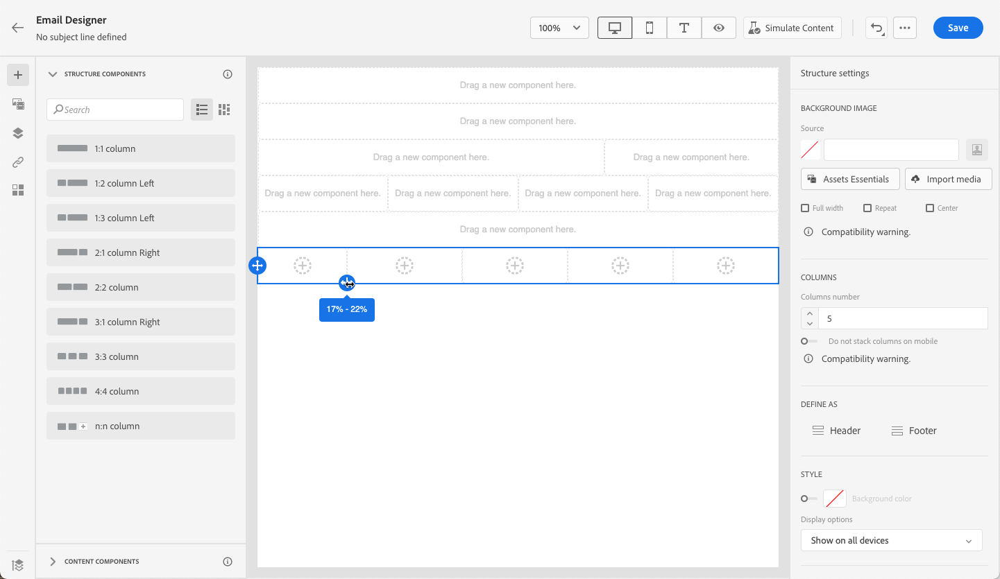

# Inizia da zero {#content-from-scratch}

>[!CONTEXTUALHELP]
>id="ac_structure_components_email"
>title="Informazioni sui componenti Struttura"
>abstract="I componenti struttura definiscono il layout del messaggio e-mail."

>[!CONTEXTUALHELP]
>id="ac_structure_components_landing_page"
>title="Informazioni sui componenti Struttura"
>abstract="I componenti struttura definiscono il layout della pagina di destinazione."

>[!CONTEXTUALHELP]
>id="ac_structure_components_fragment"
>title="Informazioni sui componenti Struttura"
>abstract="I componenti struttura definiscono il layout del frammento."

>[!CONTEXTUALHELP]
>id="ac_structure_components_template"
>title="Informazioni sui componenti Struttura"
>abstract="I componenti struttura definiscono il layout del modello."

>[!CONTEXTUALHELP]
>id="ac_edition_columns_email"
>title="Definizione delle colonne e-mail"
>abstract="E-mail Designer consente di definire facilmente il layout dell’e-mail definendo la struttura delle colonne."

>[!CONTEXTUALHELP]
>id="ac_edition_columns_landing_page"
>title="Definizione delle colonne della pagina di destinazione"
>abstract="E-mail Designer consente di definire facilmente il layout della pagina di destinazione definendo la struttura delle colonne."

>[!CONTEXTUALHELP]
>id="ac_edition_columns_fragment"
>title="Definizione delle colonne di un frammento"
>abstract="E-mail Designer consente di definire facilmente il layout del frammento definendo la struttura delle colonne."

>[!CONTEXTUALHELP]
>id="ac_edition_columns_template"
>title="Definizione delle colonne dei modelli"
>abstract="E-mail Designer consente di definire facilmente il layout del modello definendo la struttura delle colonne."

E-mail Designer consente di definire facilmente la struttura delle e-mail. Aggiungendo e spostando elementi strutturali con semplici azioni di trascinamento, puoi progettare la forma del messaggio e-mail in pochi secondi.

Per iniziare a creare il contenuto delle e-mail, segui i passaggi seguenti:

1. Dalla home page di E-mail Designer, seleziona la **[!UICONTROL Progettazione da zero]** opzione .

   

1. Inizia a progettare il contenuto delle e-mail trascinandolo e rilasciandolo **[!UICONTROL Componenti struttura]** nell’area di lavoro per definire il layout del messaggio e-mail.

   >[!NOTE]
   >
   >L’impilamento delle colonne non è compatibile con tutti i programmi e-mail. Se non è supportato, le colonne non verranno sovrapposte.

   <!--Once placed in the email, you cannot move nor remove your components unless there is already a content component or a fragment placed inside. This is not true in AJO - TBC?-->

1. Aggiungi tutti **[!UICONTROL Componenti struttura]** in base alle esigenze e modifica le impostazioni nel riquadro dedicato a destra.

   

   Seleziona la **[!UICONTROL colonna n:n]** per definire il numero di colonne desiderato (tra 3 e 10). È inoltre possibile definire la larghezza di ogni colonna spostando le frecce nella parte inferiore di ciascuna colonna.

   

   >[!NOTE]
   >
   >Le dimensioni di ogni colonna non possono essere inferiori al 10% della larghezza totale del componente struttura. Non è possibile rimuovere una colonna non vuota.

1. Espandi la **[!UICONTROL Componenti contenuto]** e aggiungi tutti gli elementi necessari in uno o più componenti struttura. [Ulteriori informazioni sui componenti di contenuto](content-components.md)

1. Ogni componente può essere ulteriormente personalizzato utilizzando **[!UICONTROL Impostazioni dei componenti]** a destra. Ad esempio, puoi modificare lo stile del testo, la spaziatura o il margine di ciascun componente. [Ulteriori informazioni su allineamento e spaziatura](alignment-and-padding.md)

   

1. Da **[!UICONTROL Selettore risorse]**, puoi selezionare direttamente le risorse memorizzate in **[!UICONTROL Libreria risorse]**. [Ulteriori informazioni sulla gestione delle risorse](assets-essentials.md)

   Fai doppio clic sulla cartella contenente le risorse. Trascinali e rilasciali in un componente struttura.

   

1. Inserisci campi di personalizzazione per personalizzare il contenuto delle e-mail dai dati dei profili. [Ulteriori informazioni sulla personalizzazione dei contenuti](../personalization/personalize.md)

   

1. Aggiungi il contenuto dinamico per adattare il contenuto ai profili di destinazione in base a regole condizionali. [Introduzione ai contenuti dinamici](../personalization/get-started-dynamic-content.md)

   

1. Fai clic sul pulsante **[!UICONTROL Collegamenti]** scheda dal riquadro a sinistra per visualizzare tutti gli URL del contenuto che verranno tracciati. È possibile modificare le **[!UICONTROL Tipo di tracciamento]** o **[!UICONTROL Etichetta]** e aggiungere **[!UICONTROL Tag]** se necessario. [Ulteriori informazioni sui collegamenti e il tracciamento dei messaggi](message-tracking.md)

   

1. Se necessario, puoi personalizzare ulteriormente l’e-mail facendo clic su **[!UICONTROL Passa all’editor di codice]** dal menu avanzato. [Ulteriori informazioni sull&#39;editor di codice](code-content.md)

   

   >[!CAUTION]
   >
   >Dopo il passaggio all’editor di codice, non potrai tornare alla finestra di progettazione visiva per questa e-mail.

1. Quando il contenuto è pronto, fai clic su **[!UICONTROL Simulazione del contenuto]** per controllare il rendering delle e-mail. È possibile scegliere la visualizzazione desktop o mobile. [Ulteriori informazioni sull’anteprima del messaggio e-mail](preview.md)

   

1. Quando l’e-mail è pronta, fai clic su **[!UICONTROL Salva]**.

