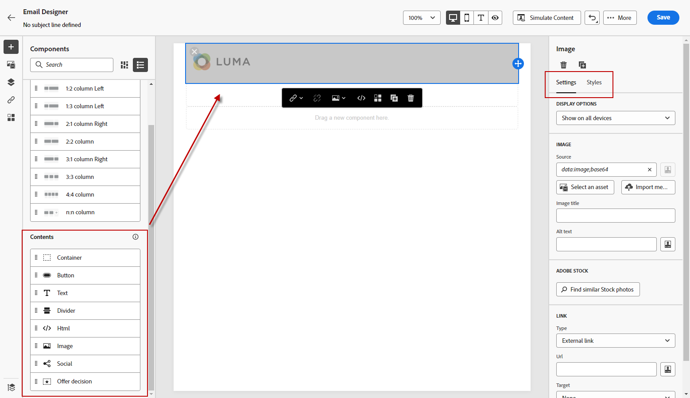
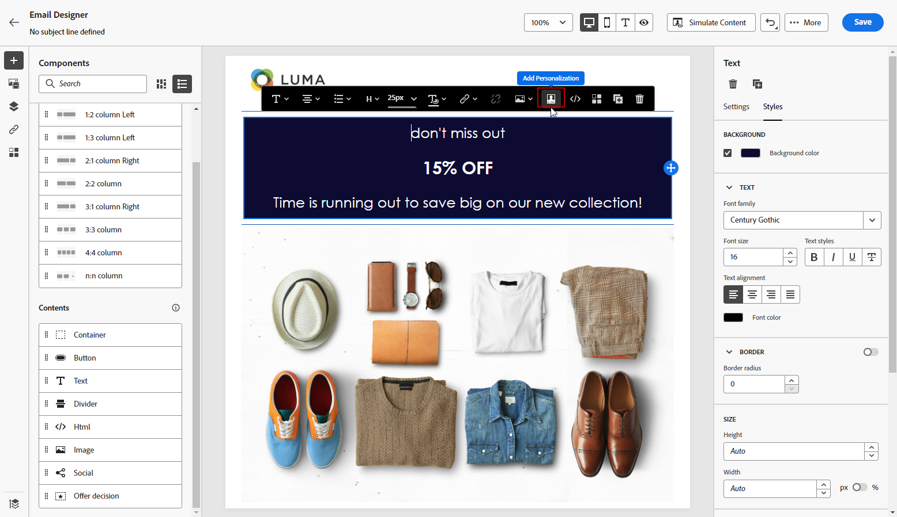
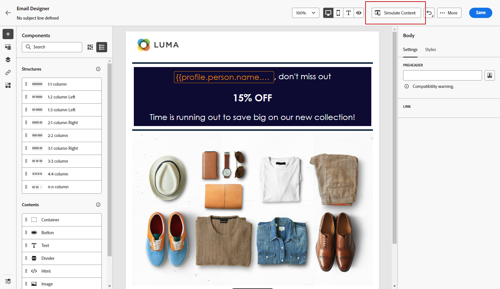

# Progettare contenuti da zero con E-mail Designer {#content-from-scratch}

>[!CONTEXTUALHELP]
>id="ac_structure_components_email"
>title="Aggiungere i componenti Struttura"
>abstract="I componenti della struttura definiscono il layout del messaggio e-mail. Per iniziare a progettare il contenuto delle e-mail, trascina un componente **Struttura** nell’area di lavoro."

>[!CONTEXTUALHELP]
>id="ac_structure_components_landing_page"
>title="Aggiungere i componenti Struttura"
>abstract="I componenti della struttura definiscono il layout della pagina di destinazione. Per iniziare a progettare il contenuto della pagina di destinazione, trascina un componente **Struttura** nell’area di lavoro."

>[!CONTEXTUALHELP]
>id="ac_structure_components_fragment"
>title="Aggiungere i componenti Struttura"
>abstract="I componenti della struttura definiscono il layout del frammento. Per iniziare a progettare il contenuto del frammento, trascina un componente **Struttura** nell’area di lavoro."

>[!CONTEXTUALHELP]
>id="ac_structure_components_template"
>title="Aggiungere i componenti Struttura"
>abstract="I componenti della struttura definiscono il layout del modello. Per iniziare a progettare il contenuto del modello, trascina un componente **Struttura** nell’area di lavoro."

>[!CONTEXTUALHELP]
>id="ac_edition_columns_email"
>title="Definire le colonne di un’e-mail"
>abstract="E-mail designer consente di definire facilmente il layout delle e-mail definendone la struttura a colonne."

>[!CONTEXTUALHELP]
>id="ac_edition_columns_landing_page"
>title="Definire le colonne di una pagina di destinazione"
>abstract="Designer consente di definire facilmente il layout della pagina di destinazione definendone la struttura a colonne."

>[!CONTEXTUALHELP]
>id="ac_edition_columns_fragment"
>title="Definire le colonne di un frammento"
>abstract="Designer consente di definire facilmente il layout del frammento definendone la struttura a colonne."

>[!CONTEXTUALHELP]
>id="ac_edition_columns_template"
>title="Definire le colonne di un modello"
>abstract="Designer consente di definire facilmente il layout del modello definendone la struttura a colonne."

Utilizza il Designer e-mail di [!DNL Adobe Journey Optimizer] per definire facilmente la struttura del contenuto. Aggiungendo e spostando elementi strutturali con semplici azioni di trascinamento della selezione, è possibile progettare la forma del contenuto in pochi secondi.

>[!NOTE]
>
>La direttiva [European Accessibility Act](https://eur-lex.europa.eu/legal-content/IT/TXT/?uri=CELEX%3A32019L0882){target="_blank"} stabilisce che tutte le comunicazioni digitali devono essere accessibili. Durante la progettazione del contenuto in [, assicurati di seguire le linee guida specifiche elencate in ](accessible-content.md)questa pagina[!DNL Journey Optimizer].

Per iniziare a creare i contenuti, segui i passaggi seguenti:

1. Dalla home page di Designer, selezionare l&#39;opzione **[!UICONTROL Progetta da zero]**.

   

1. Accelera la creazione di e-mail con l&#39;Assistente AI e genera contenuti e-mail completi con testo e immagini utilizzando l&#39;[Assistente AI per la generazione di contenuti completi](../content-management/generative-full-content.md).

1. Inizia a progettare il contenuto trascinando **[!UICONTROL Strutture]** nell&#39;area di lavoro per definire il layout dell&#39;e-mail.

   >[!NOTE]
   >
   >L’utilizzo di colonne sovrapposte non è compatibile con tutti i programmi e-mail. Quando non è supportato, le colonne non vengono impilate.

   <!--Once placed in the email, you cannot move nor remove your components unless there is already a content component or a fragment placed inside. This is not true in AJO - TBC?-->

1. Aggiungi tutte le **[!UICONTROL Strutture]** necessarie e modificane le impostazioni nel riquadro dedicato a destra.

   

   Seleziona il componente **[!UICONTROL n:n column]** per definire il numero di colonne desiderato (tra 3 e 10). Per definire la larghezza di ogni colonna, sposta le frecce nella parte inferiore di ciascuna colonna.

   >[!NOTE]
   >
   >Le dimensioni di ogni colonna non possono essere inferiori al 10% della larghezza totale del componente struttura. Non è possibile rimuovere una colonna non vuota.

1. Espandi la sezione **[!UICONTROL Contents]** e aggiungi tutti gli elementi necessari in uno o più componenti della struttura. [Ulteriori informazioni sui componenti contenuto](content-components.md)

1. Ogni componente può essere ulteriormente personalizzato utilizzando le schede **[!UICONTROL Impostazioni]** o **[!UICONTROL Stile]** nel menu di destra. Ad esempio, puoi modificare lo stile del testo, la spaziatura o il margine di ciascun componente. [Ulteriori informazioni su allineamento e spaziatura](alignment-and-padding.md)

   

1. Dal **[!UICONTROL selettore risorse]**, puoi selezionare direttamente le risorse archiviate nella **[!UICONTROL libreria Assets]**. [Ulteriori informazioni sulla gestione delle risorse](../integrations/assets.md)

   Fai doppio clic sulla cartella che contiene le risorse. Trascinali e rilasciali in un componente struttura.

   

1. Inserisci campi di personalizzazione per personalizzare il contenuto da attributi di profili, iscrizioni di pubblico, attributi contestuali e altro ancora. [Ulteriori informazioni sulla personalizzazione dei contenuti](../personalization/personalize.md)

   

1. Fai clic su **[!UICONTROL Abilita contenuto condizione]** per aggiungere contenuto dinamico e adattare il contenuto ai profili target in base alle regole condizionali. [Introduzione ai contenuti dinamici](../personalization/get-started-dynamic-content.md)

   

1. Fai clic sulla scheda **[!UICONTROL Collegamenti]** nel riquadro a sinistra per visualizzare tutti gli URL del contenuto che saranno tracciati. Puoi modificare il **[!UICONTROL Tipo di tracciamento]** o **[!UICONTROL Etichetta]** e aggiungere **[!UICONTROL Tag]** se necessario. [Ulteriori informazioni su collegamenti e monitoraggio](message-tracking.md)

   

1. Se necessario, puoi personalizzare ulteriormente l’e-mail facendo clic su **[!UICONTROL Passa all’editor di codice]** nel menu avanzato. Questo consente di modificare il codice sorgente dell’e-mail, ad esempio per aggiungere tag di tracciamento o HTML personalizzati. [Ulteriori informazioni sull’editor di codice](code-content.md)

   >[!CAUTION]
   >
   >Dopo il passaggio all’editor di codice, per l’e-mail corrente non è possibile tornare al designer visivo.

1. Quando il contenuto è pronto, fai clic sul pulsante **[!UICONTROL Simula contenuto]** per verificare il rendering. È possibile scegliere la visualizzazione su desktop o dispositivo mobile. Informazioni dettagliate su come selezionare profili di test e visualizzare in anteprima il contenuto sono disponibili nella sezione [Gestione dei contenuti](../content-management/preview-test.md).

   

1. Quando il contenuto è pronto, fai clic su **[!UICONTROL Salva]**.
