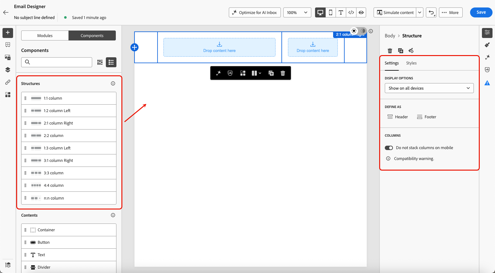

# Progettare contenuti da zero con E-mail Designer {#content-from-scratch}

>[!BEGINSHADEBOX]

**In questa pagina:** scopri come progettare contenuti e-mail da zero in Adobe Journey Optimizer Email Designer aggiungendo strutture e componenti di contenuto, quindi personalizzando e visualizzando in anteprima il tuo indirizzo e-mail.

>[!ENDSHADEBOX]

>[!CONTEXTUALHELP]
>id="ac_structure_components_email"
>title="Aggiungere i componenti Struttura"
>abstract="I componenti della struttura definiscono il layout del messaggio e-mail. Per iniziare a progettare il contenuto delle e-mail, trascina un componente **Struttura** nell’area di lavoro."

>[!CONTEXTUALHELP]
>id="ac_structure_components_landing_page"
>title="Aggiungere i componenti Struttura"
>abstract="I componenti della struttura definiscono il layout della pagina di destinazione. Per iniziare a progettare il contenuto della pagina di destinazione, trascina un componente **Struttura** nell’area di lavoro."

>[!CONTEXTUALHELP]
>id="ac_structure_components_fragment"
>title="Aggiungere i componenti Struttura"
>abstract="I componenti della struttura definiscono il layout del frammento. Per iniziare a progettare il contenuto del frammento, trascina un componente **Struttura** nell’area di lavoro."

>[!CONTEXTUALHELP]
>id="ac_structure_components_template"
>title="Aggiungere i componenti Struttura"
>abstract="I componenti della struttura definiscono il layout del modello. Per iniziare a progettare il contenuto del modello, trascina un componente **Struttura** nell’area di lavoro."

>[!CONTEXTUALHELP]
>id="ac_edition_columns_email"
>title="Definire le colonne di un’e-mail"
>abstract="E-mail designer consente di definire facilmente il layout delle e-mail definendone la struttura a colonne."

>[!CONTEXTUALHELP]
>id="ac_edition_columns_landing_page"
>title="Definire le colonne di una pagina di destinazione"
>abstract="Designer consente di definire facilmente il layout della pagina di destinazione definendone la struttura a colonne."

>[!CONTEXTUALHELP]
>id="ac_edition_columns_fragment"
>title="Definire le colonne di un frammento"
>abstract="Designer consente di definire facilmente il layout del frammento definendone la struttura a colonne."

>[!CONTEXTUALHELP]
>id="ac_edition_columns_template"
>title="Definire le colonne di un modello"
>abstract="Designer consente di definire facilmente il layout del modello definendone la struttura a colonne."

Utilizza il Designer e-mail di [!DNL Adobe Journey Optimizer] per definire facilmente la struttura del contenuto. Aggiungendo e spostando elementi strutturali con semplici azioni di trascinamento della selezione, è possibile progettare la forma del contenuto in pochi secondi.

>[!NOTE]
>
>La direttiva [European Accessibility Act](https://eur-lex.europa.eu/legal-content/IT/TXT/?uri=CELEX%3A32019L0882){target="_blank"} stabilisce che tutte le comunicazioni digitali devono essere accessibili. Durante la progettazione del contenuto in [!DNL Journey Optimizer], assicurati di seguire le linee guida specifiche elencate in [questa pagina](accessible-content.md).

Per iniziare a creare i contenuti, segui i passaggi seguenti:

1. Dalla home page di Designer, selezionare l&#39;opzione **[!UICONTROL Progetta da zero]**.

   

1. Per iniziare rapidamente, utilizza **[!UICONTROL Moduli]**, blocchi di contenuto predefiniti pronti all&#39;uso come intestazioni, sezioni principali e piè di pagina, per velocizzare la creazione di e-mail e mantenere visivamente coerenti le tue campagne. [Ulteriori informazioni sui moduli](email-modules.md)

   

1. In caso contrario, puoi progettare il contenuto trascinando **[!UICONTROL Strutture]** nell&#39;area di lavoro per definire il layout dell&#39;e-mail.

   >[!TIP]
   >
   >In alternativa, accelera la creazione di e-mail con Genera contenuto per generare contenuti e-mail completi, inclusi testo e immagini, utilizzando [Genera contenuto completo con IA](../content-management/generative-full-content.md). Puoi quindi passare all’anteprima e alla convalida del contenuto.

1. Aggiungi tutte le **[!UICONTROL Strutture]** necessarie e modificane le impostazioni nel riquadro dedicato a destra.

   

   >[!NOTE]
   >
   >Su schermi stretti (ad esempio dispositivi mobili), le colonne si sovrappongono verticalmente per impostazione predefinita per migliorarne la leggibilità. Alcuni client di posta elettronica non supportano questo comportamento, nel qual caso le colonne rimangono affiancate. È inoltre possibile disattivarlo utilizzando l&#39;interruttore **[!UICONTROL Non impilare colonne su dispositivi mobili]** nella scheda **[!UICONTROL Impostazioni]**.

1. La maggior parte delle strutture (**[!UICONTROL 1:1 colonna]**, **[!UICONTROL 2:2 colonna]**, **[!UICONTROL 1:2 colonna sinistra]** e così via) sono predefiniti fissi. Selezionare il componente **[!UICONTROL n:n column]** per definire un numero qualsiasi di colonne desiderato (tra 3 e 10).

   

   Puoi aumentare il numero di **[!UICONTROL colonne]** di una struttura esistente in qualsiasi momento dalla scheda **[!UICONTROL Impostazioni]**, anche dopo avervi aggiunto il contenuto. Il contenuto esistente viene mantenuto invece di essere perso.

   Puoi anche regolare la larghezza di ogni colonna direttamente nell&#39;area di lavoro o modificando le percentuali nella scheda **[!UICONTROL Impostazioni]**.

   >[!NOTE]
   >
   >Le dimensioni di ogni colonna non possono essere inferiori al 10% della larghezza totale del componente struttura. Non è possibile rimuovere una colonna non vuota.

1. Dalla sezione **[!UICONTROL Contents]**, aggiungi tutti gli elementi necessari in uno o più componenti della struttura. [Ulteriori informazioni sui componenti contenuto](content-components.md)

1. Ogni componente può essere ulteriormente personalizzato utilizzando le schede **[!UICONTROL Impostazioni]** o **[!UICONTROL Stile]** nel menu di destra. Ad esempio, puoi modificare lo stile del testo, la spaziatura o il margine di ciascun componente. [Ulteriori informazioni su allineamento e spaziatura](alignment-and-padding.md)

   

1. Dal **[!UICONTROL selettore risorse]**, puoi selezionare direttamente le risorse archiviate nella **[!UICONTROL libreria Assets]**. [Ulteriori informazioni sulla gestione delle risorse](../integrations/assets.md)

   Fai doppio clic sulla cartella che contiene le risorse. Trascinali e rilasciali in un componente struttura.

   

1. Inserisci campi di personalizzazione per personalizzare il contenuto da attributi di profili, iscrizioni di pubblico, attributi contestuali e altro ancora. [Ulteriori informazioni sulla personalizzazione dei contenuti](../personalization/personalize.md)

   

1. Fai clic su **[!UICONTROL Abilita contenuto condizione]** per aggiungere contenuto dinamico e adattare il contenuto ai profili target in base alle regole condizionali. [Introduzione ai contenuti dinamici](../personalization/get-started-dynamic-content.md)

   

1. Fai clic sulla scheda **[!UICONTROL Collegamenti]** nel riquadro a sinistra per visualizzare tutti gli URL del contenuto che saranno tracciati. Puoi modificare il **[!UICONTROL Tipo di tracciamento]** o **[!UICONTROL Etichetta]** e aggiungere **[!UICONTROL Tag]** se necessario. [Ulteriori informazioni su collegamenti e monitoraggio](message-tracking.md)

   

1. Se necessario, puoi personalizzare ulteriormente l’e-mail facendo clic su **[!UICONTROL Passa all’editor di codice]** nel menu avanzato. Questo consente di modificare il codice sorgente dell’e-mail, ad esempio per aggiungere tag di tracciamento o HTML personalizzati. [Ulteriori informazioni sull’editor di codice](code-content.md)

   >[!CAUTION]
   >
   >Dopo il passaggio all’editor di codice, per l’e-mail corrente non è possibile tornare al designer visivo.

1. Una volta che il contenuto è pronto, utilizza uno dei metodi di simulazione per controllare il rendering. È possibile scegliere la visualizzazione su desktop o dispositivo mobile. Informazioni dettagliate sono disponibili nella sezione [Gestione dei contenuti](../content-management/preview-test.md).

   

1. Puoi anche convalidare la qualità dei contenuti per valutarne la leggibilità, l’efficacia e la coerenza. [Ulteriori informazioni sulla convalida della qualità dei contenuti](../content-management/brands-score.md#validate-quality)

1. Quando il contenuto è pronto, fai clic su **[!UICONTROL Salva]**.

{{$include /help/_includes/do-not-localize/email/ai-augmented-content-from-scratch.md}}
