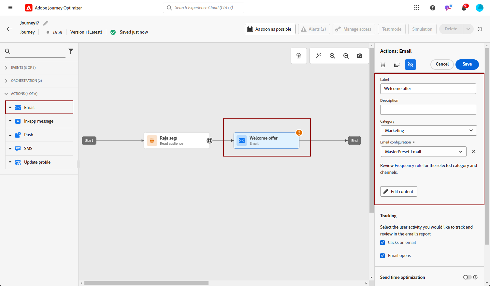
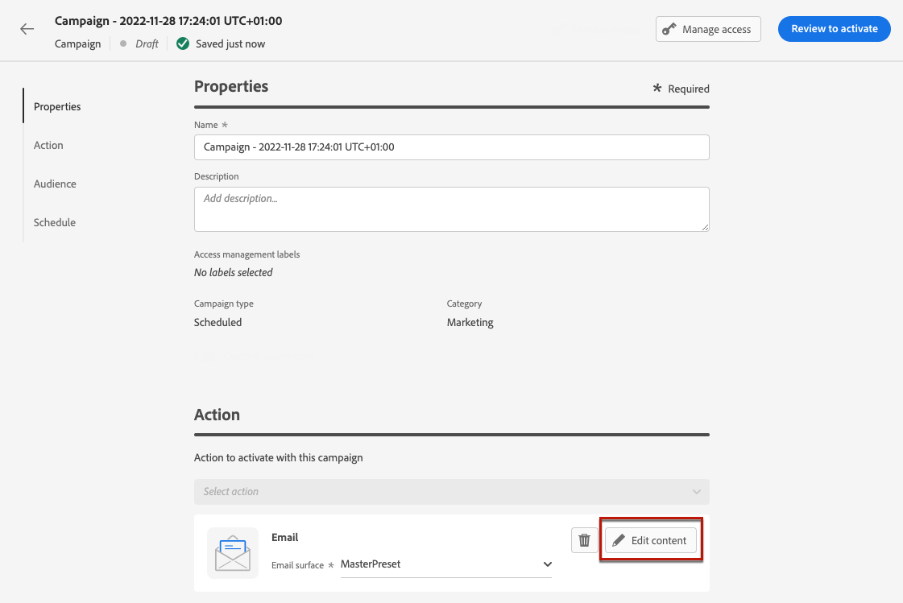
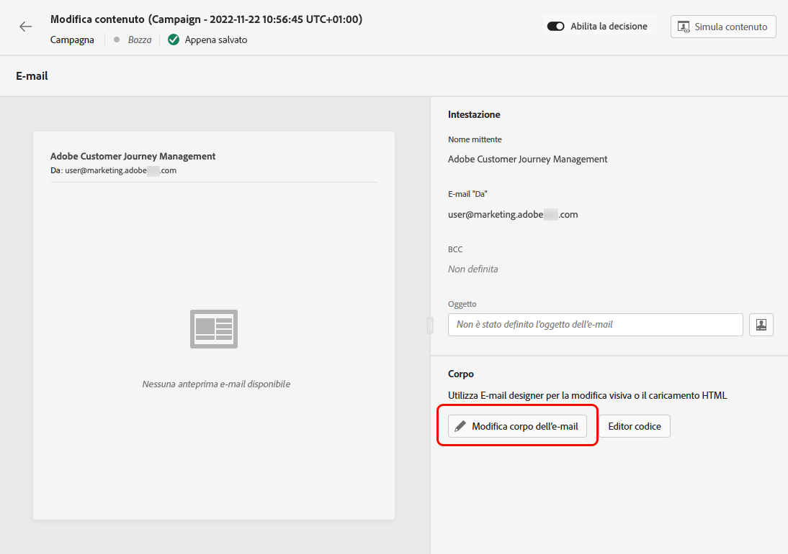
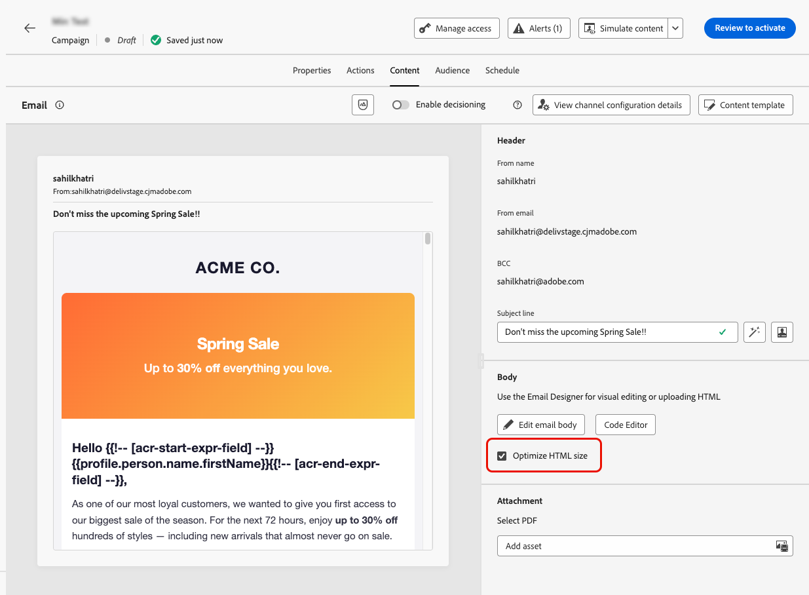
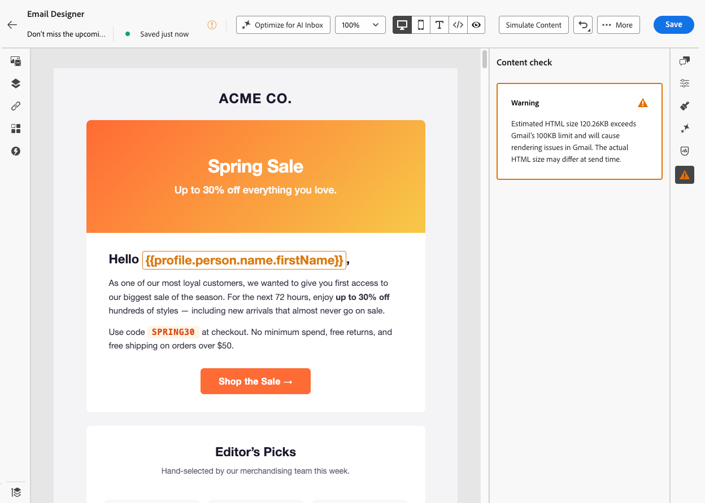
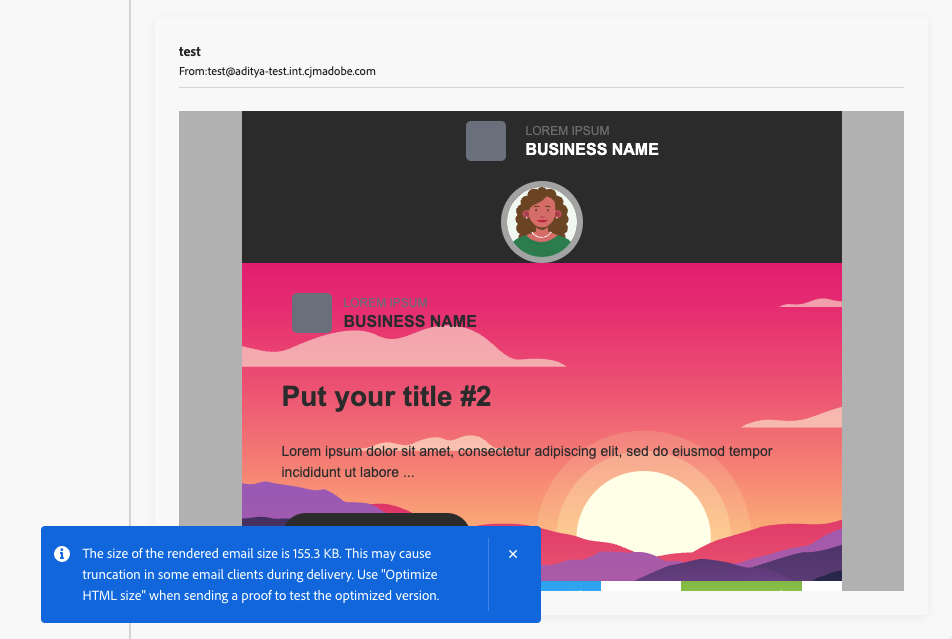

# Creare un messaggio e-mail {#create-email}

>[!BEGINSHADEBOX]

**In questa pagina:** scopri come aggiungere un&#39;azione e-mail a un percorso o a una campagna in Adobe Journey Optimizer, definirne l&#39;oggetto e il contenuto, controllare gli avvisi e visualizzare l&#39;anteprima prima dell&#39;invio.

>[!ENDSHADEBOX]

>[!CONTEXTUALHELP]
>id="ajo_message_email"
>title="Creazione di e-mail"
>abstract="Definisci la riga dell&#39;oggetto dell’e-mail e apri E-mail Designer per creare il contenuto dell’e-mail."

## Aggiungi un&#39;azione e-mail {#email-action}

>[!CONTEXTUALHELP]
>id="ajo_journey_action_email"
>title="Azione e-mail"
>abstract="Un’azione del canale e-mail invia un’e-mail ai profili quando raggiungono questo passaggio del percorso. L’etichetta identifica l’attività nell’area di lavoro del percorso e l’azione fa riferimento a una configurazione e-mail che definisce il contenuto consegnato. La sezione **Ottimizzazione** può includere esperimenti di contenuto o regole di targeting, la sezione **Multilingue** può distribuire contenuto in più lingue e la sezione **Timeout o errore** può definire un percorso alternativo se l&#39;azione non riesce."
>additional-url="https://experienceleague.adobe.com/en/docs/journey-optimizer/using/orchestrate-journeys/about-journey-building/journey-action#add-action" text="Introduzione alle azioni dei canali"

Per creare un messaggio e-mail in [!DNL Journey Optimizer], aggiungi un&#39;azione **[!UICONTROL E-mail]** a un percorso o a una campagna. Quindi segui i passaggi seguenti, a seconda del tuo caso.

>[!BEGINTABS]

>[!TAB Aggiungi un&#39;e-mail a un percorso]

1. Apri il percorso, quindi trascina e rilascia un&#39;attività **[!UICONTROL Action]** dalla sezione **[!UICONTROL Actions]** della palette. Ulteriori informazioni sull&#39;[attività Azione](../building-journeys/journey-action.md).

   >[!IMPORTANT]
   >
   >Le attività dei canali nativi legacy (e-mail, push, SMS, in-app, web, esperienza basata su codice e scheda di contenuto) sono diventate obsolete a partire dalla versione di marzo 2026. I percorsi esistenti che utilizzano queste attività continuano a funzionare senza alcuna modifica e non è richiesta alcuna migrazione.

1. Seleziona **[!UICONTROL E-mail]** come tipo di azione.

   

1. Immetti un **[!UICONTROL Label]** per identificare l&#39;azione nell&#39;area di lavoro del percorso.

1. Fai clic sul pulsante **[!UICONTROL Configura azione]**.

1. Sei indirizzato alla scheda **[!UICONTROL Azioni]**. Da qui, seleziona o crea la configurazione e-mail da utilizzare. [Ulteriori informazioni](email-settings.md)

   

1. Inoltre:

   * Puoi applicare le regole di limitazione all&#39;azione e-mail selezionando un set di regole nell&#39;elenco a discesa **[!UICONTROL Regole aziendali]**. [Ulteriori informazioni](../conflict-prioritization/channel-capping.md)

   * È possibile utilizzare l&#39;opzione **[!DNL Send time optimization]** per prevedere il momento migliore per inviare il messaggio in modo da massimizzare il coinvolgimento in base alle percentuali storiche di apertura e clic. [Scopri come](../building-journeys/send-time-optimization.md)

1. Seleziona il pulsante **[!UICONTROL Modifica contenuto]** e crea il contenuto come desiderato utilizzando E-mail Designer. [Ulteriori informazioni](#define-email-content)

1. Torna all’area di lavoro del percorso. Se necessario, completa il flusso di percorso trascinando altre azioni o eventi. [Ulteriori informazioni](../building-journeys/about-journey-activities.md)

Per ulteriori informazioni su come creare, configurare e pubblicare un percorso, fare riferimento a [questa pagina](../building-journeys/journey-gs.md).

>[!TAB Aggiungere un messaggio e-mail a una campagna]

1. [Crea una campagna](../campaigns/create-campaign.md) e seleziona **[!UICONTROL Invia e-mail]** come azione.

1. Completa i passaggi per creare una campagna e-mail, ad esempio le proprietà della campagna, [pubblico](../audience/about-audiences.md) e [pianificazione](../campaigns/campaign-schedule.md).

   

1. Seleziona l&#39;azione **[!UICONTROL E-mail]**.

1. Seleziona o crea la configurazione e-mail. [Ulteriori informazioni](email-settings.md)

   

<!--
From the **[!UICONTROL Action]** section, specify if you want to track how your recipients react to your delivery: you can track email opens, and/or clicks on links and buttons in your email.

-->
Per ulteriori informazioni su come creare, configurare e attivare una campagna, consulta [questa pagina](../campaigns/get-started-with-campaigns.md).

>[!ENDTABS]

## Importare il contenuto dell’e-mail {#define-email-content}

<!-- update the quarry component with right ID value-->

>[!CONTEXTUALHELP]
>id="test_id"
>title="Configurare il contenuto dell’e-mail"
>abstract="Crea il contenuto dell’e-mail. Definisci l’oggetto, quindi usa E-mail Designer per creare e personalizzare il corpo dell’e-mail."

Dopo aver aggiunto l’azione e-mail al percorso o alla campagna, è necessario definire il contenuto dell’e-mail, inclusi l’oggetto, le informazioni sul mittente e il corpo dell’e-mail tramite E-mail Designer. Segui questi passaggi:

1. Dalla schermata di configurazione del percorso o della campagna, fai clic sul pulsante **[!UICONTROL Modifica contenuto]** per configurare il contenuto dell&#39;e-mail. [Ulteriori informazioni](get-started-email-design.md)

   

1. Attiva **[!UICONTROL Abilita decisioning]** se desideri aggiungere criteri di decisione nel messaggio e-mail.

   I criteri di decisione sono contenitori per le offerte che sfruttano il motore di decisione per restituire in modo dinamico il contenuto migliore da consegnare per ogni membro del pubblico. [Scopri come aggiungere un criterio di decisione in un messaggio e-mail](../experience-decisioning/create-decision.md#create-decision)

   

   >[!AVAILABILITY]
   >
   >Per il momento, la creazione di criteri di decisione nelle e-mail è disponibile in Disponibilità limitata. Per ottenere l’accesso, contatta il rappresentante Adobe.

1. Nella sezione **[!UICONTROL Intestazione]**, controlla i campi **[!UICONTROL Da nome]**, **[!UICONTROL Da e-mail]** e **[!UICONTROL Ccn]**. Sono configurati nella configurazione e-mail selezionata. [Ulteriori informazioni](email-settings.md) <!--check if same for journey-->

   

1. Aggiungi un oggetto per il messaggio. Per configurare e personalizzare l&#39;oggetto con l&#39;editor di personalizzazione, fare clic sull&#39;icona **[!UICONTROL Apri finestra di dialogo per personalizzazione]**. [Ulteriori informazioni](../personalization/personalization-build-expressions.md)

   >[!NOTE]
   >
   >L’oggetto è obbligatorio. Non deve includere interruzioni di riga.

1. Fai clic sul pulsante **[!UICONTROL Modifica corpo dell&#39;e-mail]** per accedere al Designer e-mail e iniziare a creare il contenuto. [Ulteriori informazioni](get-started-email-design.md)

   

1. Se ti trovi in una campagna, puoi anche fare clic sul pulsante **[!UICONTROL Editor di codice]** per scrivere il codice del tuo contenuto in HTML semplice utilizzando la finestra popup visualizzata.

   

   >[!NOTE]
   >
   >Se hai già creato o importato contenuti tramite E-mail Designer, questi verranno visualizzati in HTML.

1. Se necessario, abilita l&#39;opzione **[!UICONTROL Ottimizza dimensioni HTML]** per ridurre le dimensioni del HTML e-mail durante il processo di pubblicazione. [Ulteriori informazioni](#optimize-html-size)

## Controllare gli avvisi {#check-email-alerts}

Durante la progettazione dei messaggi, gli avvisi vengono visualizzati nell’interfaccia (in alto a destra dello schermo) quando mancano le impostazioni chiave.

>[!NOTE]
>
>Se questo pulsante non è visualizzato, non è stato rilevato alcun avviso.

Le impostazioni e gli elementi controllati dal sistema sono elencati di seguito. Troverai anche informazioni su come adattare la configurazione per risolvere i problemi corrispondenti.

Possono verificarsi due tipi di avvisi:

* **Avvisi** fai riferimento a consigli e best practice, ad esempio:

   * **[!UICONTROL Il collegamento di rinuncia non è presente nel corpo dell&#39;e-mail]**: è consigliabile aggiungere un collegamento di annullamento all&#39;abbonamento nel corpo dell&#39;e-mail. Scopri come configurarlo in [questa sezione](../privacy/opt-out.md#opt-out-decision-management).

     >[!NOTE]
     >
     >I messaggi e-mail di tipo marketing devono includere un collegamento di rinuncia, che non è invece necessario per i messaggi transazionali. La categoria del messaggio (**[!UICONTROL Marketing]** o **[!UICONTROL Transazionale]**) è definita al livello [configurazione canale](email-settings.md#email-type) e durante la [creazione del messaggio](#create-email-journey-campaign) da un percorso o una campagna.

   * **[!UICONTROL La versione testuale di HTML è vuota]**: non dimenticare di definire una versione testuale del corpo dell&#39;e-mail, in quanto verrà utilizzata quando non sarà possibile visualizzare il contenuto di HTML. Scopri come creare la versione del testo in [questa sezione](text-version-email.md).

   * **[!UICONTROL Nel corpo dell&#39;e-mail è presente un collegamento vuoto]**: verifica che tutti i collegamenti presenti nell&#39;e-mail siano corretti. Scopri come gestire contenuti e collegamenti in [questa sezione](content-from-scratch.md).

   * **[!UICONTROL La dimensione dell&#39;e-mail ha superato il limite di 100 KB]**: per una consegna ottimale, assicurati che la dimensione dell&#39;e-mail non superi i 100 KB. Per ridurre le dimensioni del HTML, utilizzare l&#39;opzione **[!UICONTROL Ottimizza dimensioni HTML]**. [Ulteriori informazioni](#optimize-html-size)

* **Gli errori** impediscono di testare o attivare il percorso o la campagna finché non vengono risolti, ad esempio:

   * **[!UICONTROL Manca la riga dell&#39;oggetto]**: la riga dell&#39;oggetto dell&#39;e-mail è obbligatoria. Scopri come definirlo e personalizzarlo in [questa sezione](create-email.md).

  <!--HTML is empty when Amp HTML is present-->

   * **[!UICONTROL La versione e-mail del messaggio è vuota]**: questo errore viene visualizzato quando il contenuto dell&#39;e-mail non è stato configurato. Scopri come progettare contenuti e-mail in [questa sezione](get-started-email-design.md).

   * **[!UICONTROL la configurazione non esiste]**: non puoi utilizzare il messaggio se la configurazione selezionata viene eliminata dopo la creazione del messaggio. Se si verifica questo errore, selezionare un&#39;altra configurazione nel messaggio **[!UICONTROL Proprietà]**. Ulteriori informazioni sulle configurazioni dei canali in [questa sezione](../configuration/channel-surfaces.md).

>[!CAUTION]
>
>Per poter testare o attivare il percorso o la campagna tramite l&#39;e-mail, è necessario risolvere tutti gli avvisi di **errore**.

## Ottimizzare le dimensioni del HTML e-mail {#optimize-html-size}

>[!CONTEXTUALHELP]
>id="ajo_email_minification"
>title="Riduci dimensioni HTML"
>abstract="Abilita questa opzione per comprimere il HTML e-mail durante la pubblicazione rimuovendo spazi vuoti, rientri e commenti non essenziali non necessari. Questo aiuta a evitare il clipping delle e-mail in client come Gmail, che tronca i messaggi di oltre 100 KB. Tieni presente che quando utilizzi e-mail multilingue, questa opzione è abilitata per impostazione predefinita per tutte le lingue."

[!DNL Journey Optimizer] consente di comprimere la versione di e-mail HTML durante il processo di pubblicazione rimuovendo spazi vuoti, rientri e commenti non essenziali. Le dimensioni ridotte di HTML consentono di:

* Evita **il ritaglio e-mail**. Alcuni client, ad esempio Gmail, troncano i messaggi di dimensioni superiori a ~100 KB, impedendo ai destinatari di visualizzare l&#39;intero contenuto.
* Migliora il **tempo di caricamento e-mail** nella casella in entrata del destinatario.
* Migliora il recapito messaggi **1} e riduci l&#39;utilizzo della larghezza di banda.**

Questa ottimizzazione non viene applicata automaticamente. Abilitarla manualmente nella schermata [Modifica contenuto](#define-email-content).

>[!IMPORTANT]
>
> La riduzione della dimensione del HTML viene applicata solo al momento della pubblicazione.

L’ottimizzazione è sicura per il client e-mail:

* Mantiene i commenti condizionali di MSO/Outlook.
* Non altera il contenuto effettivo, le immagini o i video.

>[!NOTE]
>
>La riduzione delle dimensioni dell’e-mail dipende dalla struttura HTML originale dell’e-mail. Se il contenuto è già compatto o il payload dell’e-mail è molto grande, la riduzione può essere minima e non impedire completamente il clipping in tutti i casi.

Puoi verificare l’impatto dell’ottimizzazione delle dimensioni di HTML prima di pubblicarlo al momento dell’invio delle bozze. [Ulteriori informazioni](#optimize-html-proof)

### Ottimizzare le dimensioni del HTML nelle e-mail multilingue {#optimize-html-multilingual}

Quando si utilizzano [varianti di e-mail multilingue](../content-management/multilingual-gs.md), l&#39;impostazione **[!UICONTROL Ottimizza dimensioni HTML]** viene tracciata a livello di e-mail, non in base alle impostazioni locali.

Pertanto, l’abilitazione di questa impostazione su una qualsiasi lingua la applica a tutte le lingue dell’e-mail al momento della pubblicazione, anche alle lingue in cui la casella di controllo viene ancora deselezionata nell’interfaccia utente. Non è necessario ripetere l&#39;azione per ciascuna lingua.

Per disabilitare l&#39;ottimizzazione delle dimensioni di HTML, è necessario deselezionare **[!UICONTROL Ottimizza dimensioni HTML]** in tutte le impostazioni locali. Se questa opzione è abilitata anche in una sola lingua, è sufficiente che l’ottimizzazione sia applicata a tutte le lingue.

>[!NOTE]
>
>Se si sta eseguendo un [esperimento sui contenuti](../content-management/content-experiment.md), l&#39;impostazione **[!UICONTROL Ottimizza dimensioni HTML]** viene gestita in modo indipendente per ogni trattamento, in quanto ogni trattamento è considerato un messaggio separato.

## Controllare e inviare l’e-mail

Una volta definito il contenuto del messaggio, puoi visualizzarne l’anteprima utilizzando uno dei seguenti metodi di simulazione:

* Fai clic su **[!UICONTROL Simula contenuto]** per testare le varianti di contenuto con dati di input di esempio o con generazione automatica di IA. [Scopri come simulare varianti di contenuto](../test-approve/simulate-sample-input.md)
* Fai clic su **[!UICONTROL Simula contenuto]**, quindi seleziona **[!UICONTROL Simula contenuto (profili AEP)]** dal menu a discesa per visualizzare in anteprima i profili di test, inviare bozze e controllare il rendering delle e-mail.

Puoi anche convalidare la qualità dei contenuti per valutarne la leggibilità, l’efficacia e la coerenza. [Ulteriori informazioni sulla convalida della qualità dei contenuti](../content-management/brands-score.md#validate-quality)

Informazioni dettagliate su come selezionare profili di test e visualizzare in anteprima il contenuto sono disponibili nella sezione [Gestione dei contenuti](../content-management/preview-test.md).

Quando l&#39;e-mail è pronta, completa la configurazione del [percorso](../building-journeys/journey-gs.md) o [campagna](../campaigns/create-campaign.md) e attivala per inviare il messaggio.

>[!NOTE]
>
>Per tenere traccia del comportamento dei destinatari tramite aperture e/o interazioni e-mail, assicurati che le opzioni dedicate nella sezione **[!UICONTROL Tracciamento]** siano abilitate nella [attività e-mail](../building-journeys/journey-action.md) del percorso o nella [campagna](../campaigns/create-campaign.md) e-mail.<!--to move?-->

### Test ottimizzazione dimensioni HTML {#optimize-html-proof}

Se hai abilitato l&#39;opzione [Ottimizzazione dimensioni HTML](#optimize-html-size), puoi valutarne l&#39;impatto prima di pubblicarla durante l&#39;invio delle bozze. Segui i passaggi seguenti.

1. In E-mail Designer, fai clic sull’icona Problemi nella barra a destra. Se la dimensione dell’e-mail sottoposta a rendering supera i 100 KB, viene visualizzato un messaggio per avvisarti che ciò potrebbe causare il troncamento in alcuni client e-mail. <!--Learn more about content checks in [this section](#check-email-alerts).-->

   

1. Fare clic su **[!UICONTROL Simula contenuto]**.

   <!---->

1. Per verificare la versione ottimizzata, fare clic sul pulsante **[!UICONTROL Invia bozza]** e selezionare l&#39;opzione **[!UICONTROL Ottimizza dimensioni HTML]**. Verrà inviata una bozza con le dimensioni HTML ridotte ai destinatari del test.

   

   >[!NOTE]
   >
   >Questa impostazione è indipendente dall’editor e-mail: la bozza riflette qualsiasi elemento selezionato nella bozza, indipendentemente dal fatto che l’opzione sia abilitata o disabilitata nell’e-mail stessa.

1. Selezionare i destinatari del test e fare clic sul pulsante **[!UICONTROL Invia bozza]**. Ulteriori informazioni sull&#39;invio di bozze in [questa sezione](../content-management/proofs.md).
1. Una volta inviato, torna alla schermata **[!UICONTROL Simula]** e fai clic sul pulsante **[!UICONTROL Visualizza bozza]**.
1. Fai clic sull’icona Info accanto allo stato della bozza. I dettagli di ottimizzazione vengono visualizzati in una finestra pop-up, che include le dimensioni originali del HTML, le dimensioni ottimizzate del HTML e la percentuale di riduzione delle dimensioni.

   

   Utilizza queste informazioni per convalidare l’output ottimizzato e confermare che l’e-mail rimanga entro la soglia consigliata di 100 KB prima della pubblicazione.

<!--
## Define your email content {#email-content}

Use [!DNL Journey Optimizer] Email Designer to [design your email from scratch](../email/content-from-scratch.md). If you have an existing content, you can [import it in the Email Designer](../email/existing-content.md), or [code your own content](../email/code-content.md) in [!DNL Journey Optimizer]. 

[!DNL Journey Optimizer] comes with a set of [built-in templates](email-templates.md) to help you start. Any email can also be saved as a template.

Use [!DNL Journey Optimizer] personalization editor to personalize your messages with profiles' data. For more on personalization, refer to [this section](../personalization/personalize.md).

Adapt the content of your messages to the targeted profiles by using [!DNL Journey Optimizer] dynamic content capabilities. [Get started with dynamic content](../personalization/get-started-dynamic-content.md)

## Email tracking {#email-tracking}

If you want to track the behavior of your recipients through openings and/or clicks on links, enable the following options: **[!UICONTROL Email opens]** and **[!UICONTROL Click on email]**. 

Learn more about tracking in [this section](message-tracking.md).

## Validate your email content {#email-content-validate}

Control the rendering of your email, and check personalization settings with test profiles, using the preview section on the left-hand side. For more on this, refer to [this section](preview.md).

You must also check alerts in the upper section of the editor.  Some of them are simple warnings, but others can prevent you from using the message. 
-->

