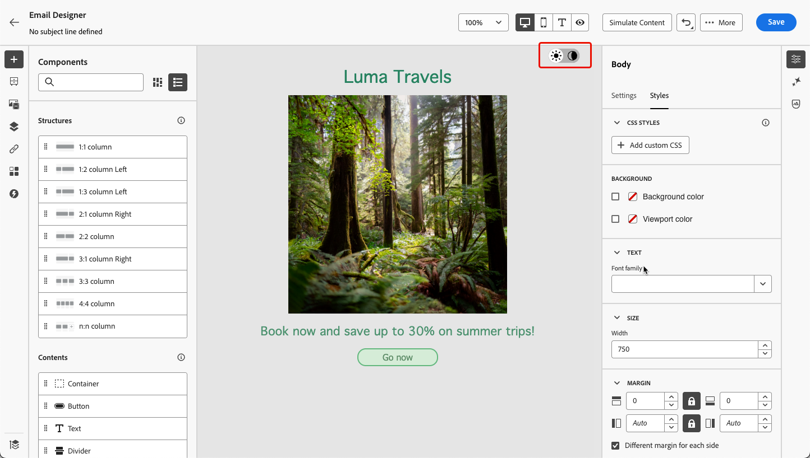
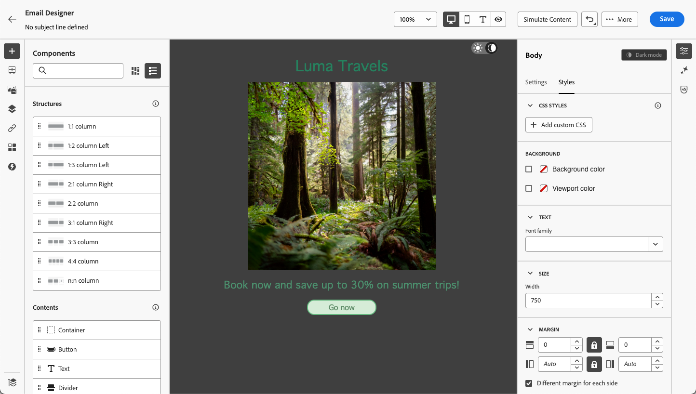

# Gestire i contenuti in modalità scura {#dark-mode}

>[!CONTEXTUALHELP]
>id="ac_edition_darkmode"
>title="Passare alla modalità scura"
>abstract="Passa realla modalità scura dove è possibile visualizzare in anteprima il rendering e definire impostazioni personalizzate specifiche.  Attenzione: il rendering finale dipende dal client e-mail del destinatario. Non tutti i client e-mail supportano la modalità scura personalizzata."

>[!CONTEXTUALHELP]
>id="ac_edition_darkmode_image"
>title="Utilizzare un’immagine specifica per la modalità scura"
>abstract="È possibile selezionare un’altra immagine da visualizzare quando è attiva la modalità scura.  Attenzione: l’aggiunta di un’immagine specifica per la modalità scura non garantisce il corretto rendering in tutti i client e-mail. Non tutti i client e-mail supportano la modalità scura personalizzata."

>[!CONTEXTUALHELP]
>id="ac_edition_darkmode_preview"
>title="Passare alla modalità scura"
>abstract="Passare alla modalità scura per visualizzare in anteprima il rendering nei client e-mail che la supportano.  Attenzione: il rendering finale dipende dal client e-mail del destinatario. Non tutti i client e-mail supportano la modalità scura personalizzata."

>[!AVAILABILITY]
>
>Questa funzionalità è disponibile attualmente in versione beta e solo per la clientela beta. Per partecipare al programma Beta, contatta il tuo rappresentante Adobe.

Durante la progettazione delle e-mail, [!DNL Journey Optimizer] [Invia e-mail a Designer](get-started-email-design.md) ti consente di passare alla **[!UICONTROL modalità scura]** in cui puoi definire impostazioni personalizzate specifiche. Quando la modalità scura è attiva, i client e-mail di supporto visualizzano le impostazioni definite per questa modalità.

>[!WARNING]
>
>Il rendering finale della modalità scura dipende dal client e-mail del destinatario.
>
>Non tutti i client e-mail supportano la modalità scura personalizzata. <!--[See the list](#non-supporting-email-clients)-->Inoltre, alcuni client di posta elettronica applicano solo la propria modalità scura predefinita per tutte le e-mail ricevute. In questo caso, non è possibile eseguire il rendering delle impostazioni personalizzate definite nel Designer e-mail.

Un elenco dei client di posta elettronica che supportano la modalità scura è presentato in [questa sezione](#supporting-email-clients).

## Cos’è la modalità scura? {#what-is-dark-mode}

La modalità scura consente ai client e-mail e alle app supportati di visualizzare e-mail con sfondi più scuri e colori più chiari per testo, pulsanti e altri elementi dell’interfaccia utente. Consente di ridurre l&#39;affaticamento degli occhi, di risparmiare la durata della batteria e di migliorare la leggibilità in ambienti scarsamente illuminati, per un&#39;esperienza di visualizzazione più confortevole.

<!--Dark Mode uses a dark color palette with light text and UI elements to reduce eye strain, save battery life, and improve readability in low-light environments.-->

Come tendenza crescente tra i principali sistemi operativi e app (Apple Mail, Gmail, Outlook, Twitter, Slack), è diventato un elemento importante nella progettazione moderna delle e-mail per garantire che il contenuto rimanga leggibile e visivamente attraente per tutti gli utenti.

Tuttavia, non è possibile garantire che l’aspetto dell’e-mail sia esattamente lo stesso in modalità scura su tutti i dispositivi. Alcune modifiche visive possono essere causate anche dall’app e-mail o dal dispositivo che sovrascrive la progettazione originale.

In effetti, il modo in cui la modalità scura viene applicata dai client e-mail può variare come segue<!--between different devices and apps-->:

* Non tutti i client e-mail supportano questa funzione.

  >[!NOTE]
  >
  >Un elenco dei client di posta elettronica che non supportano la modalità scura è presentato in [questa sezione](#non-supporting-email-clients).

* Alcuni client e-mail regolano automaticamente colori, sfondi e immagini. In questo caso, se definisci impostazioni personalizzate in E-mail Designer, probabilmente non verrà eseguito il rendering di tali impostazioni.

* Altri client di posta elettronica offrono l&#39;opzione di eseguire il rendering della modalità scura personalizzata (ad esempio con il metodo `@media (prefers-color-scheme: dark)`). In questo caso, devono essere visualizzate le impostazioni specifiche definite nel Designer e-mail. Scopri come definire le impostazioni personalizzate della modalità scura nel Designer e-mail in [questa sezione](#define-custom-dark-mode).

## Modalità scura in E-mail designer {#dark-mode-email-designer}

Quando si tratta della modalità scura in E-mail Designer, ci sono due aspetti da considerare:

* Puoi ottenere un’anteprima di come verrà riprodotto il rendering della modalità scura predefinita nella maggior parte dei client e-mail che supportano. [Ulteriori informazioni](#preview-dark-mode)

<!--
    >[!CAUTION]
    >
    >The final rendering may vary according to the recipient's email client. To see the exact rendering for each email client, use the [Email rendering](../content-management/rendering.md) option.-->

* Se desideri ignorare le impostazioni predefinite di supporto dei client e-mail, puoi definire impostazioni personalizzate in modalità scura da applicare all’e-mail che stai modificando. [Ulteriori informazioni](#define-custom-dark-mode)

<!--
    >[!WARNING]
    >
    >Not all email clients support custom dark mode. Some email clients only apply their own default dark mode for all emails that are received. In this case, the custom settings that you defined in the Email Designer cannot be rendered. [Learn more](#guardrails)-->

### Anteprima modalità scura predefinita {#preview-dark-mode}

Per accedere alla modalità scura in E-mail Designer e visualizzare un’anteprima delle impostazioni predefinite della modalità scura, segui la procedura riportata di seguito.

1. Dalla home page di E-mail Designer, seleziona l&#39;opzione **[!UICONTROL Progetta da zero]**. [Ulteriori informazioni](content-from-scratch.md)

<!--Should work with templates and themes, NOT for LP and fragments - but TBC with eng.
    >[!NOTE]
    >
    >Currently you may not be able to switch to dark mode if you select an [email template](use-email-templates.md) or if you apply a [theme](apply-email-themes.md).-->

1. Aggiungi [strutture](content-from-scratch.md) e [componenti contenuto](content-components.md) al contenuto.

1. In alto a destra nell&#39;area di lavoro centrale, passa alla modalità **[!UICONTROL Scuro]**.

   

1. Viene visualizzata l&#39;anteprima predefinita in modalità scura.

   

Per impostazione predefinita, l’anteprima in modalità scura di E-mail Designer applica la combinazione di colori &quot;inversione completa dei colori&quot; a tutti gli elementi eccetto immagini e icone.

Significa che rileva aree con elementi chiari e scuri e le inverte, in modo che gli sfondi chiari diventino testo scuro e chiaro, mentre gli sfondi scuri diventino chiari e il testo chiaro diventi scuro.

>[!CAUTION]
>
>Il rendering finale può variare a seconda del client e-mail del destinatario. Per visualizzare una simulazione che si avvicina il più possibile al risultato finale per ogni client e-mail, utilizza l&#39;opzione [Rendering e-mail](../content-management/rendering.md).

<!--This is custom dark mode:

  

Here you can see that we have applied a different background, defined another image and change the color of the text and button.-->

### Definire la modalità scura personalizzata {#define-custom-dark-mode}

Dopo il passaggio alla **[!UICONTROL modalità scura]**, puoi scegliere di modificare elementi di stile specifici del contenuto che verranno visualizzati solo quando la modalità scura è abilitata nel client e-mail del destinatario, purché supporti tale funzione.

>[!WARNING]
>
>Non tutti i client e-mail supportano la modalità scura. Inoltre, alcuni client e-mail applicano soltanto la propria modalità scura predefinita per tutte le e-mail ricevute. In entrambi i casi, non è possibile eseguire il rendering delle impostazioni personalizzate definite in E-mail designer.

Per sfruttare lo stile personalizzato della modalità scura di E-mail Designer, Journey Optimizer utilizza <!-- `@media (prefers-color-scheme: dark)` method--> Query CSS `@media (prefers-color-scheme: dark)` che rileva se il client e-mail dell&#39;utente è impostato sulla modalità scura e applica la struttura a tema scuro definita nell&#39;e-mail.

Per definire le impostazioni personalizzate della modalità scura, effettua le seguenti operazioni.

1. Accertati di passare all&#39;anteprima della **[!UICONTROL modalità scura]** nel Designer e-mail. [Scopri come](#preview-dark-mode)

1. Modifica gli attributi dei colori di stile come testo, sfondi, pulsante e così via.

1. Non è possibile modificare i colori delle immagini e delle icone, ma è possibile definire risorse specifiche solo per la modalità scura. A questo scopo, seleziona un’immagine. Passa alla **[!UICONTROL modalità scura]** utilizzando l&#39;interruttore dedicato nel riquadro **[!UICONTROL Impostazioni]** e seleziona un&#39;altra risorsa.

   

   <!---->

1. In qualsiasi momento puoi **[!UICONTROL Passare alla visualizzazione live]** per verificare come il contenuto potrebbe essere riprodotto su dispositivi di varie dimensioni. Da questa vista, seleziona l’opzione Modalità scura nella parte superiore dello schermo per visualizzare in anteprima la versione in modalità scura del contenuto tra i diversi dispositivi.

   {width="80%" align="center"}

   >[!CAUTION]
   >
   >La visualizzazione live è un’anteprima generica progettata per confrontare l’aspetto del rendering tra le varie dimensioni dei dispositivi. Il rendering finale può variare a seconda del client e-mail del destinatario.

1. Dopo aver apportato le modifiche desiderate per la modalità scura, fare clic su **[!UICONTROL Simula contenuto]**.

   

1. Seleziona **[!UICONTROL Rendering e-mail]** e collegati al tuo account Litmus. Puoi vedere il rendering finale in modalità scura per vari client e-mail. Ulteriori informazioni sul [rendering di e-mail](../content-management/rendering.md).

   >[!WARNING]
   >
   >Anche se la simulazione si avvicina molto al modo in cui le e-mail appariranno in modalità scura, il rendering effettivo potrebbe variare a causa delle variazioni nei provider di servizi e-mail o nelle impostazioni a livello di dispositivo.

## Best practice {#best-practices}

Poiché l&#39;adozione della modalità scura aumenta tra i principali client e-mail, è essenziale considerare il rendering delle e-mail in ambienti chiari e scuri, indipendentemente dal fatto che si utilizzi la [modalità scura personalizzata](#define-custom-dark-mode) o meno.

La modalità scura può alterare i colori, gli sfondi e le immagini, a volte ignorando le scelte di progettazione. Per garantire coerenza visiva, accessibilità e integrità del brand, segui le best practice elencate di seguito.

**Ottimizza immagini e logo**

* Evitare le immagini con sfondi bianchi o chiari codificati.

* Salvare logo e icone come file PNG con sfondi trasparenti per evitare la presenza di caselle bianche visibili in modalità scura.

* Se la trasparenza non è un&#39;opzione, posizionate le immagini su uno sfondo a tinta unita nel progetto per evitare scomode inversioni di colore.

**Guarda gli sfondi**

* Assicurati un contrasto sufficiente tra il testo e i colori di sfondo per garantire leggibilità sia nelle modalità chiara che in quelle scure.

* Evita di utilizzare solo i colori di sfondo per i contenuti critici. Alcuni client ignorano i colori di sfondo in modalità scura, quindi assicurati che le informazioni chiave siano ancora visibili.

**Progettare contenuti accessibili in modalità scura**

<!--KEEP dark mode accessibility best practices IN ONE SINGLE LOCATION - for now listed on this page.
If needed, it can be moved to the Design accessible content page:
The best practices for designing accesible content in dark mode are listed in [this section](accessible-content.md#dark-mode).-->

* Utilizza combinazioni di colori facili da distinguere per le persone con daltonismo.

* Utilizza una palette di mezzitoni per garantire il contrasto sia contro gli sfondi chiari che scuri.

* Utilizza combinazioni di colori accessibili con contrasto elevato per migliorare la leggibilità e soddisfare gli standard delle linee guida per l’accessibilità dei contenuti web (WCAG). Utilizza strumenti come Verifica contrasto di WebAIM per verificare il contrasto dei colori.

* Evita i font sottili in quanto possono influire sulla leggibilità. Se il tuo marchio richiede un font sottile, grassetto in modalità scura.

* Salta il bianco puro sul nero puro in quanto può causare affaticamento degli occhi e potrebbe essere automaticamente invertito da alcuni client e-mail.

* Se la modalità scura non è supportata, fornisci uno stile di fallback accessibile.

**Verifica le e-mail in ambiente in modalità scura**

* Utilizza l&#39;[anteprima in modalità scura](#preview-dark-mode) di E-mail Designer che utilizza combinazioni di colori invertite per individuare in anticipo i problemi.

* Utilizza l&#39;opzione [Rendering di e-mail](../content-management/rendering.md) che sfrutta Litmus per simulare le progettazioni tra i principali client e-mail (Apple Mail, Gmail, Outlook) e vedere come si comportano i colori e le immagini in modalità scura.

<!--**Inline critical styles**

Inline CSS helps maintain more control over styling, as some clients strip external styles in dark mode.-->

## Client e-mail che supportano la modalità scura {#supporting-email-clients}

Di seguito è riportato un elenco dei principali client e-mail che supportano la modalità scura.

>[!NOTE]
>
>Alcune versioni di questi client e-mail non supportano la modalità scura, quindi vengono anche presentate in questa tabella per maggiore chiarezza.

| Client e-mail che supportano la modalità scura | Versioni compatibili | *Versioni non supportate* |
|---------|----------|---------|
| Apple Mail macOS | 12,4, 16,0 | *10,3* |
| Apple Mail iOS | 13,0, 16,1 | *12,2* |
| MacOS di Outlook | 2019, 16,70, 16,80 | N/D |
| Outlook.com | 07/2019, 12/2022 | N/D |
| IOS di Outlook | 01/2020, 12/2022 | N/D |
| Android di Outlook | 03/2023 | *2020-01, 2022-12* |
| E-mail Samsung (Android) | 6,1 | *6.0* |
| Mozilla Thunderbird (macOS) | 68,4 | *60,8, 78,5, 91,13* |
| Fastmail (posta sul desktop) | 12/2022 | *2021-07* |
| EHI (posta sul desktop) | 06/2020 | *2022-12* |
| Webmail desktop arancione | 08/2019, 03/2021, 12/2022, 04/2024 | N/D |
| IOS arancione | 12-2022, 04-2024 | *2020-01* |
| Android arancione | 04/2024 | *2020-01, 2022-12* |
| LaPoste.net | 08/2021, 12/2022 | N/D |
| SFR Desktop Webmail | 08/2019, 12/2022 | N/D |
| GMX (iOs e Android) | 06/2022 | N/D |
| 1&amp;1 (posta sul desktop e Android) | 06/2022 | N/D |
| WEB.DE (iOs e Android) | 06/2022 | N/D |
| Free.fr | 12/2022 | N/D |

>[!WARNING]
>
>Il rendering finale in modalità scura dipende da ciascun client e-mail, pertanto i risultati possono variare da un client all’altro.

<!--
* Check out the list of [email clients supporting dark mode](https://www.caniemail.com/search/?s=dark){target="_blank"}

* Learn more on Dark mode in this [Litmus blog post](https://www.litmus.com/blog/the-ultimate-guide-to-dark-mode-for-email-marketers){target="_blank"}
-->

## Client e-mail che non supportano la modalità scura {#non-supporting-email-clients}

Alcuni client e-mail consentono agli utenti di passare dalla propria interfaccia alla modalità scura, ma questa impostazione non influisce sulla visualizzazione delle e-mail di HTML. Indipendentemente dal fatto che l’interfaccia sia in modalità chiara o scura, l’e-mail riprodurrà lo stesso risultato. Di seguito è riportato un elenco dei client:

| Client e-mail che non supportano la modalità scura |
|---------|
| Gmail (Posta sul desktop, iOS, Android, Posta sul web mobile) |
| Windows Outlook |
| Outlook Windows Mail |
| Yahoo!Posta |
| AOL |
| ProtonMail |
| SFR IOS |
| SFR ANDROID |
| Webmail desktop GMX |
| Mail.ru |
| Web.DE Desktop Webmail |
| T-online.de |
