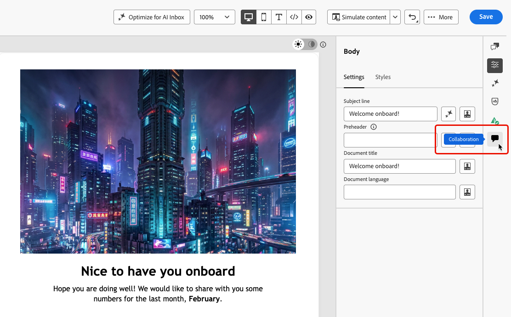
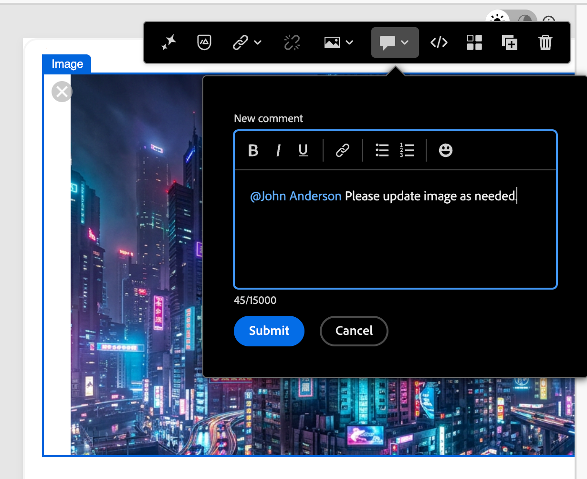
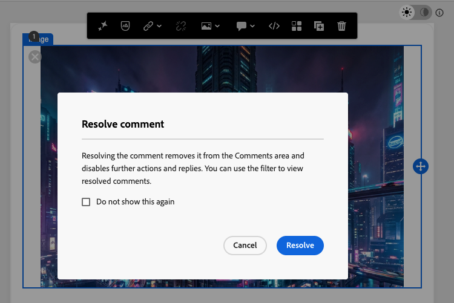

# Collaborare al contenuto delle e-mail in E-mail Designer {#email-collaboration}

>[!CONTEXTUALHELP]
>id="ajo_email_collaboration"
>title="Collaborare alle e-mail"
>abstract="Puoi aggiungere commenti, revisori di tag e tenere traccia del feedback direttamente in E-mail Designer, senza uscire dall’esperienza di authoring."

E-mail Designer include strumenti di collaborazione per la creazione di commenti e la risoluzione dei problemi, in modo che i team di marketing possano esaminare, discutere e finalizzare i contenuti delle e-mail direttamente in [!DNL Journey Optimizer]. Invece di condividere le bozze su strumenti esterni (come chat, thread e-mail o fogli di calcolo), gli utenti possono commentare, suggerire modifiche e risolvere i commenti all’interno di E-mail Designer. Utilizza questi strumenti per semplificare il flusso di lavoro, ridurre gli errori e garantire l’allineamento delle parti interessate prima di lanciare l’e-mail.

* **Feedback centralizzato**: raccogli e tieni traccia di tutti i feedback in un&#39;unica posizione.
* **Revisioni più veloci** - I collaboratori possono esaminare la copia e-mail e le risorse all&#39;interno dell&#39;ambiente di authoring.
* **Maggiore precisione** - Riduce il rischio di comunicazioni errate mantenendo tutte le modifiche collegate all&#39;e-mail stessa.
* **Trasparenza** - Tutti i commenti e le risoluzioni rimangono registrati, rendendo chiari i cambiamenti suggeriti e implementati.
* **Collaboration nel contesto** - Controlla la copia del corpo dell&#39;e-mail, le immagini e gli elementi call-to-action (CTA) all&#39;interno del layout.

<!--Check if like some other collaboration workflows, specific permission is required to use the collaboration tools in the Email Designer.-->

## Visualizzare strumenti di collaborazione e commenti {#access-collaboration}

Durante la creazione, la modifica o la revisione del contenuto nel Designer e-mail, puoi accedere al pannello **[!UICONTROL Collaboration]** per aggiungere o gestire commenti per il contenuto dell&#39;e-mail.

Fai clic sull&#39;icona **[!UICONTROL Collaboration]** nell&#39;area di navigazione a destra.

{width="90%"}

## Flusso di lavoro di Collaboration {#collaboration-workflow}

Puoi utilizzare gli strumenti di collaborazione per seguire un flusso di lavoro dei contenuti standard:

1. **Invita** i tuoi collaboratori e revisori.
1. **Revisori** aggiungono commenti.
1. Leggi i commenti, **aggiungi risposte** per discutere i commenti e apportare le modifiche necessarie.
1. **I revisori o gli autori** risolvono i commenti.

### Best practice per l’utilizzo degli strumenti di collaborazione {#best-practices}

* Utilizza l&#39;assegnazione tag **@** in modo che il feedback raggiunga rapidamente il membro del team corretto.
* Raggruppa i feedback correlati in un singolo thread di commenti invece di più note sparse.
* Risolvi sempre i commenti non appena vengono indirizzati, per mantenere un flusso di lavoro pulito.
* Salva una versione finale approvata a scopo di conformità/audit.

## Invita collaboratori e revisori {#invite-collaborators}

Puoi invitare collaboratori e revisori a fornire feedback sul contenuto delle e-mail o aggiungere qualsiasi commento rilevante per il flusso di lavoro di progettazione delle e-mail. Segui i passaggi seguenti.

1. Seleziona il corpo dell’e-mail per inserire un commento generale sul contenuto dell’e-mail.
1. Fai clic sull&#39;icona **[!UICONTROL Collaboration]** nell&#39;area di navigazione a destra.
1. Nella parte superiore del pannello a destra, inserisci il testo dell’invito agli utenti per collaborare e fornire feedback.
1. Utilizza il simbolo **@** per indirizzare gli utenti e inviarli una notifica. Questi utenti ricevono notifiche e-mail e interne al prodotto [!DNL Pulse].

   Quando si immettono le prime lettere del nome dopo il simbolo, un elenco a comparsa visualizza i nomi utente corrispondenti. Puoi immettere più lettere nel nome per migliorare i risultati.

   {width="90%"}

1. Seleziona il nome da aggiungere per la notifica. Aggiungere tutti i collaboratori o revisori che si desidera includere nell&#39;invito.

   {width="90%"}

1. Fai clic su **[!UICONTROL Invia]**.

Ogni nuovo commento avvia un thread in cui i collaboratori possono utilizzare **[!UICONTROL Reply]** per continuare la discussione. Ogni commento/thread associato a un elemento di progettazione viene numerato in modo da poter identificare facilmente l&#39;elemento in cui viene applicato.

### Commenti dei componenti {#component-comments}

1. Seleziona una struttura o un componente di contenuto.
1. Nella barra degli strumenti fare clic sullo strumento **[!UICONTROL Collaboration]**.

   {width="80%"}

1. Immettere il commento nel campo di testo.
1. Fai clic su **[!UICONTROL Invia]**.

I collaboratori possono fare clic sull&#39;icona del pin numerato nell&#39;area di lavoro dell&#39;e-mail per visualizzare il commento.

## Rispondi a un commento {#reply-to-comment}

Per ogni commento è possibile utilizzare la funzione **[!UICONTROL Rispondi]** per continuare una discussione o rispondere a una domanda.

Fai clic su **[!UICONTROL Rispondi]** nella parte inferiore del commento e immetti il testo per la risposta. Per includere nella risposta un preventivo del commento corrente, fare clic sull&#39;icona **[!UICONTROL Altro menu]** (...) e scegliere **[!UICONTROL Risposta preventivo]**.

{width="100%"}

## Risolvi commenti {#resolve-comments}

In qualità di autore o designer, valuta il feedback dei revisori e determina quali modifiche desideri apportare. Quando le modifiche sono state completate e la richiesta è stata soddisfatta, fare clic sull&#39;icona **[!UICONTROL Altro menu]** (...) e scegliere **[!UICONTROL Risolvi]**.

{width="100%"}

Una volta risolto, il commento/thread è nascosto dalla vista principale ma è accessibile tramite le opzioni di filtro.

## Gestisci commenti {#manage-comments}

Gestisci i commenti e i thread per valutare lo stato della tua collaborazione.

### Inserisci un commento {#place-comment}

Se un commento non è associato a un elemento nell’area di lavoro e-mail, puoi fissarlo a un elemento in base alle esigenze. Fare clic sull&#39;icona **[!UICONTROL Altro menu]** (...) e scegliere **[!UICONTROL Inserisci commento]**. Quindi, seleziona il componente Progettazione nell’area di lavoro.

{width="60%"}

### Rimuovere o eliminare commenti {#remove-delete-comments}

Per pulire il registro dei commenti, rimuoverli ed eliminarli. Fai clic sull&#39;icona **[!UICONTROL Altro menu]** (...) e scegli **[!UICONTROL Rimuovi commento]** o **[!UICONTROL Elimina]**.

* Quando si rimuove un commento, questo viene separato dall&#39;elemento di progettazione (selezionato al momento della creazione del commento). Il commento fa ancora parte del record del commento per l’e-mail.
* Quando si elimina un commento, questo viene eliminato definitivamente dal record.

### Commenti risolti {#resolved-comments}

Per impostazione predefinita, i commenti risolti sono nascosti nel pannello **[!UICONTROL Collaboration]**. È possibile visualizzare i commenti risolti in qualsiasi momento cancellando il filtro. Fai clic sull&#39;icona **[!UICONTROL Filtro]** e deseleziona la casella di controllo **[!UICONTROL Nascondi commenti risolti]**.

{width="60%"}

I commenti risolti includono l&#39;icona **[!UICONTROL Non risolvere]**. Se si stabilisce che un commento o un thread non è stato risolto e sono necessarie ulteriori modifiche, fare clic sull&#39;icona per rimuovere la designazione **[!UICONTROL Risolto]**.

{width="60%"}
