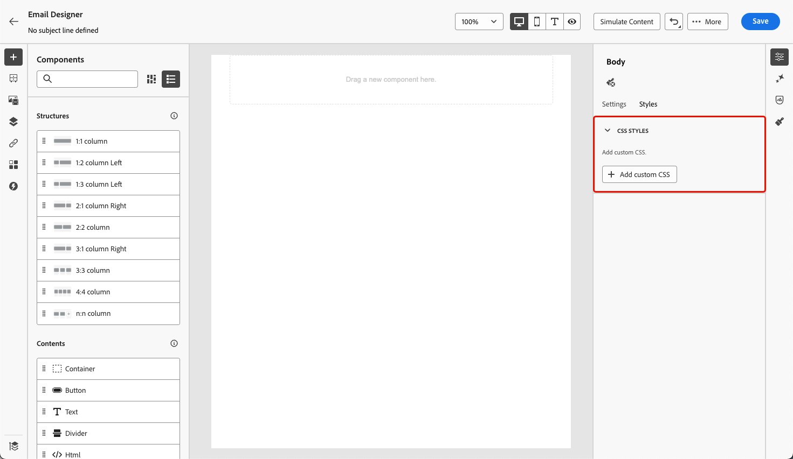

# Aggiungere metadati al contenuto dell’e-mail {#email-metadata}

>[!CONTEXTUALHELP]
>id="ac_edition_css"
>title="Aggiungi CSS personalizzato"
>abstract="xxx."

Durante la progettazione delle e-mail, puoi aggiungere CSS personalizzati direttamente all&#39;interno di [!DNL Journey Optimizer] [E-mail Designer](get-started-email-design.md).

Nell’area di testo Aggiungi CSS personalizzato è prevista una stringa CSS valida.



Condizioni di disponibilità

La funzione Aggiungi CSS personalizzato è disponibile solo quando nell’editor è definito un contenuto. Per visualizzare la sezione Aggiungi CSS personalizzato, l’utente deve aggiungere contenuto nell’editor. Se l’utente rimuove tutto il contenuto, la sezione scompare e il css personalizzato non viene applicato. Se l’utente torna a aggiungere contenuti, la sezione sarà disponibile e verrà applicato il css personalizzato.

**Esempi di input CSS non validi**

Impossibile salvare un file CSS non valido. Se il file CSS non è valido, verrà visualizzato un avviso popup rosso per indicare che il file CSS non può essere salvato.

`<style>` non è accettato


```
<style type="text/css">
  .acr-Form {
    width: 100%;
    padding: 20px 100px;
    border-spacing: 0px 8px;
    box-sizing: border-box;
    margin: 0;
  }
</style>
```


parentesi graffa mancante non valida

```
body {
 background: red; 
```
