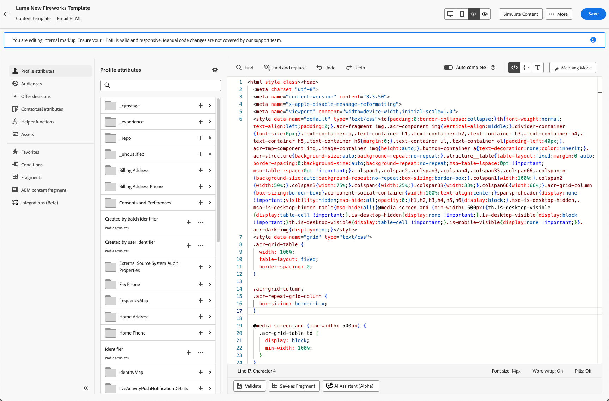

# Modificare i contenuti delle e-mail con l’editor HTML avanzato {#email-expert-mode}

>[!AVAILABILITY]
>
>Questa funzionalità è in disponibilità limitata. Per ottenere l’accesso, contatta il rappresentante Adobe.

L&#39;**editor avanzato di HTML** è una modalità esperta che consente di visualizzare e modificare l&#39;origine non elaborata di HTML del **contenuto e-mail** direttamente nel [!DNL Journey Optimizer] [Designer e-mail](get-started-email-design.md), indipendentemente dal fatto che si stia [progettando un messaggio e-mail](content-from-scratch.md) per un percorso, una campagna o modificando un [modello di contenuto e-mail](../content-management/create-content-templates.md).

Questa funzionalità consente di inserire espressioni avanzate, ad esempio condizioni, direttamente nell’origine. Quando si torna alla visualizzazione visiva (desktop), il contenuto viene nuovamente sottoposto a rendering in modo da poter verificare l&#39;aspetto e continuare a modificare in entrambe le visualizzazioni.

## Guardrail {#guardrails}

Quando utilizzi l’editor HTML avanzato, i seguenti guardrail proteggono la compatibilità dei contenuti e impostano le aspettative.

* L&#39;editor HTML avanzato **non convalida** il codice. Non controlla gli errori di sintassi o i layout interrotti. Rivedi attentamente i contenuti prima di salvarli.

* I futuri aggiornamenti del sistema potrebbero sovrascrivere le modifiche apportate al markup predefinito. **È possibile che le modifiche non persistano**.

* Il team di supporto [!DNL Adobe] **non è in grado di risolvere i problemi** causati da codice personalizzato e modifiche manuali. Conserva un backup del contenuto nel caso sia necessario ripristinarlo.

* Non è possibile simulare contenuti nella vista HTML avanzata. Passa alla vista Desktop per visualizzare in anteprima il contenuto.

* Per garantire la compatibilità del contenuto, **non è possibile salvare** nella visualizzazione avanzata di HTML. Tornare alla vista Desktop quando si è pronti a salvare le modifiche.

>[!WARNING]
>
>L&#39;editor HTML avanzato non è uguale alla modalità **[!UICONTROL Crea un codice personalizzato]** in E-mail Designer. In modalità [!UICONTROL Crea il codice per te], non puoi tornare all&#39;editor visivo; una volta scelto quel percorso, puoi continuare a modificare solo il codice. L’editor HTML avanzato, invece, consente di passare dalla visualizzazione HTML alla visualizzazione desktop (visiva) in qualsiasi momento. [Ulteriori informazioni sull’editor di codice](code-content.md)

## Passa alla visualizzazione avanzata di HTML {#switch-to-html-view}

Per aprire l’editor HTML avanzato e modificare l’origine HTML, segui la procedura riportata di seguito.

1. Aprire l&#39;e-mail o il modello che si desidera modificare nel Designer di posta elettronica, ad esempio [creare o modificare un&#39;e-mail](create-email.md) da un percorso o da una campagna, oppure aprire un [modello di contenuto e-mail](../content-management/create-content-templates.md) e modificarne il corpo nel [Designer di posta elettronica](get-started-email-design.md).

1. Fai clic sul pulsante **[!UICONTROL HTML]** nell&#39;angolo in alto a destra dello schermo.

   

1. La prima volta che apri l’editor di HTML avanzato, viene visualizzato un messaggio di avviso. Rivederlo attentamente e fare clic su **[!UICONTROL OK]** per continuare. [Ulteriori informazioni](#guardrails)

   {zoomable="yes"}

   >[!NOTE]
   >
   >Questo avviso viene visualizzato solo la prima volta che apri l’editor HTML avanzato e viene ripristinato ogni mese.

1. Viene visualizzato l’editor HTML avanzato.

   

1. Aggiungi le modifiche desiderate al contenuto dell’e-mail.

   >[!WARNING]
   >
   >Assicurarsi di immettere il codice HTML e CSS corretto poiché non esiste alcun processo di convalida della sintassi e [!DNL Adobe] non fornisce alcun supporto. [Ulteriori informazioni](#guardrails)

1. La simulazione e il salvataggio dei contenuti non sono disponibili nella visualizzazione HTML avanzata per motivi di compatibilità. Torna alla vista Desktop per visualizzare in anteprima il contenuto e salvare le modifiche.

   {zoomable="yes"}

   >[!NOTE]
   >
   >Le modifiche apportate vengono mantenute quando si passa da una visualizzazione all&#39;altra.

<!--
    {zoomable="yes"}
-->

## Argomenti correlati

* [Creare il codice del contenuto e-mail](code-content.md)
* [Creare modelli di contenuto](../content-management/create-content-templates.md)
* [Guida introduttiva a E-mail Designer](get-started-email-design.md)
