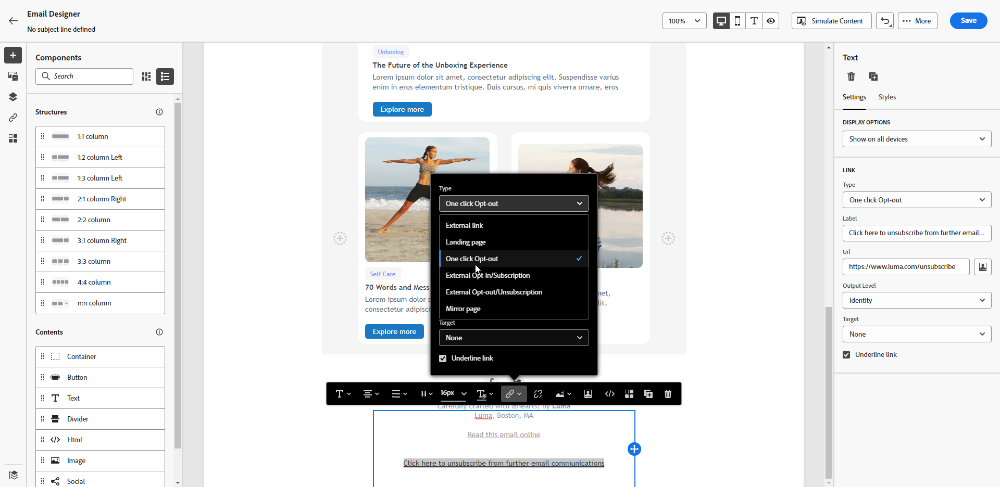

# Gestione della rinuncia e-mail {#email-opt-out}

Quando invii messaggi da percorsi o campagne, devi sempre assicurarti che i clienti abbiano la possibilità di annullare l’iscrizione in modo da non ricevere più comunicazioni. Una volta annullata l’iscrizione, i profili vengono rimossi automaticamente dal pubblico dei messaggi di marketing futuri.  [Ulteriori informazioni sulla gestione della privacy e della rinuncia](../privacy/opt-out.md)

>[!NOTE]
>
>Tutti i messaggi di marketing devono includere un collegamento di rinuncia. Questo non è necessario per i messaggi transazionali. La categoria del messaggio - **[!UICONTROL Marketing]** o **[!UICONTROL Transazionale]** - è definito in corrispondenza di [superficie di canale](../configuration/channel-surfaces.md#email-type) e durante la creazione del messaggio.

Per inserire un collegamento di annullamento all’abbonamento nel contenuto dell’e-mail, puoi:

* Aggiungi un URL con un solo clic per annullare l’iscrizione nell’intestazione dell’e-mail. Abilitazione di **[!UICONTROL Intestazione annullamento iscrizione a mailing list]** a livello di superficie di canale, aggiunge un collegamento di rinuncia nell’intestazione e-mail. [Ulteriori informazioni sulla rinuncia nell’intestazione dell’e-mail](#unsubscribe-header)

* Abilita **collegamento di rinuncia con un clic** per l’e-mail.  [Scopri come aggiungere un collegamento di rinuncia con un solo clic](#one-click-opt-out)

* Inserisci un **collegamento a una pagina di destinazione**. [Scopri come aggiungere una pagina di destinazione di rinuncia](#opt-out-external-lp)

## Rinuncia in un unico passaggio {#opt-out-one-step}

### URL per annullamento iscrizione con un solo clic nell’intestazione dell’e-mail {#unsubscribe-header}

<!--Do not modify - Legal Review Done -->

>[!CONTEXTUALHELP]
>id="ajo_admin_preset_unsubscribe"
>title="Aggiungi l’URL per annullare l’iscrizione nell’intestazione dell’e-mail"
>abstract="Abilita List-Unsubscribe Header per aggiungere un URL per l’annullamento dell’iscrizione nell’intestazione dell’e-mail. Per impostare un URL per l’annullamento dell’iscrizione, inserisci un collegamento di rinuncia con un solo clic nel contenuto dell’e-mail."
>additional-url="https://experienceleague.adobe.com/docs/journey-optimizer/using/privacy/consent/opt-out.html?lang=it#one-click-opt-out" text="Rinuncia con un clic"

L’URL per l’annullamento dell’iscrizione a un elenco con un solo clic è un collegamento o un pulsante che consente di annullare l’iscrizione visualizzato accanto alle informazioni sul mittente dell’e-mail e che consente ai destinatari di annullare immediatamente l’iscrizione alle mailing list con un solo clic. In Adobe Journey Optimizer, quando **Abilita annullamento sottoscrizione elenco** l’opzione è attivata, l’intestazione e-mail include sia un mailto che un URL per impostazione predefinita che i destinatari possono utilizzare per annullare l’iscrizione alla mailing list.

Il [Abilita annullamento sottoscrizione elenco](email-settings.md#list-unsubscribe) l’opzione deve essere attivata a livello della superficie di canale, in modo che le e-mail che utilizzano questa superficie includano l’URL per l’annullamento dell’iscrizione con un solo clic nell’intestazione dell’e-mail.

>[!NOTE]
>
>Per visualizzare l’URL con un solo clic per l’annullamento dell’iscrizione nell’intestazione dell’e-mail, il client e-mail dei destinatari deve supportare questa funzione.


Ad esempio, l’URL per l’annullamento dell’iscrizione con un solo clic mostra un collegamento di annullamento dell’iscrizione simile a questo in Gmail:


Con Adobe Journey Optimizer, puoi configurare le impostazioni della superficie e-mail con un URL di annullamento dell’iscrizione con un solo clic e un indirizzo e-mail nell’intestazione dell’e-mail oppure con un URL di rinuncia con un solo clic nel corpo dell’e-mail: quando un destinatario fa clic sul collegamento di rinuncia con un solo clic, la richiesta di annullamento dell’iscrizione del destinatario viene elaborata di conseguenza.

>[!AVAILABILITY]
>
>L’intestazione dell’URL per l’annullamento dell’iscrizione con un solo clic sarà disponibile in Adobe Journey Optimizer a partire dal 3 giugno 2024.
>

A seconda del client e-mail e del [impostazioni annullamento iscrizione superficie e-mail](email-settings.md#list-unsubscribe), facendo clic sul collegamento per annullare l’iscrizione nell’intestazione dell’e-mail si possono verificare i seguenti effetti:

* Quando **Invia a (annulla iscrizione)** la funzione è abilitata, la richiesta di annullamento dell’abbonamento viene inviata all’indirizzo predefinito di annullamento dell’abbonamento in base al sottodominio da te creato.
* Quando **URL per annullamento iscrizione con un solo clic** La funzione è abilitata da te oppure, se hai inserito un URL di annullamento dell’abbonamento nel contenuto del corpo dell’e-mail, il destinatario viene direttamente escluso, a livello di canale o a livello di ID (a seconda di come è configurato il consenso), quando il destinatario fa clic sull’URL di annullamento dell’abbonamento con un clic, basato sul sottodominio da te creato.

In entrambi i casi, il profilo corrispondente per il destinatario viene immediatamente escluso e questa scelta viene aggiornata in Experienci Platform. Per ulteriori informazioni, consulta [Documentazione di Experienci Platform](https://experienceleague.adobe.com/docs/experience-platform/profile/ui/user-guide.html?lang=it#getting-started){target="_blank"}.

Se hai attivato l’opzione Abilita-in per quanto riguarda l’intestazione Annulla iscrizione elenco, ti consigliamo di includere entrambi i metodi - Invia a e l’URL con un solo clic e Annulla iscrizione. Non tutti i client e-mail supportano il metodo HTTP. Con la funzione di annullamento dell’iscrizione all’elenco Invia a, fornita come funzionalità disponibile per la selezione di un’alternativa, la reputazione del mittente può essere protetta meglio e tutti i destinatari possono probabilmente avere accesso all’utilizzo della funzionalità di annullamento dell’iscrizione. [Ulteriori informazioni](email-settings.md#list-unsubscribe)


### Rinuncia con un clic dal contenuto dell’e-mail {#one-click-opt-out}

Per impostare un URL personalizzato per l’annullamento dell’iscrizione, inserisci un collegamento di rinuncia con un solo clic nel contenuto del messaggio e-mail e immetti l’URL desiderato, come descritto di seguito:

1. Accedi al contenuto delle e-mail e [inserire un collegamento](../email/message-tracking.md#insert-links).
1. Seleziona **[!UICONTROL Rinuncia con un clic]** come tipo di collegamento.

   

1. Immetti l’URL della pagina di destinazione a cui l’utente viene reindirizzato una volta annullata l’iscrizione. Questa pagina contiene una conferma del successo della rinuncia.

   >[!NOTE]
   >
   >Se hai attivato **[!UICONTROL Annullamento iscrizione mailing list]** opzione in corrispondenza di [livello di superficie di canale](email-settings.md#list-unsubscribe) e deseleziona l’opzione predefinita URL rinuncia con un solo clic, questo URL viene utilizzato quando gli utenti fanno clic sul collegamento di annullamento dell’iscrizione nell’intestazione dell’e-mail. [Ulteriori informazioni](#unsubscribe-header)

   

   Puoi personalizzare i tuoi collegamenti. Ulteriori informazioni sugli URL personalizzati sono disponibili in [questa sezione](../personalization/personalization-syntax.md).

1. Seleziona la modalità di applicazione della rinuncia: a livello di canale, identità o iscrizione.

   

   * **[!UICONTROL Canale]**: la rinuncia si applica ai messaggi futuri inviati alla destinazione del profilo (ad esempio l’indirizzo e-mail) per il canale corrente. Se a un profilo sono associate più destinazioni, la rinuncia viene applicata a tutte le destinazioni (ad esempio gli indirizzi e-mail) nel profilo di quel canale.
   * **[!UICONTROL Identità]**: la rinuncia viene applicata ai messaggi futuri inviati alla destinazione specifica (ad esempio l’indirizzo e-mail) utilizzata per il messaggio corrente.
   * **[!UICONTROL Iscrizione]**: la rinuncia viene applicata ai messaggi futuri associati a un elenco iscrizioni specifico. Questa opzione può essere selezionata solo se il messaggio corrente è associato a un elenco di abbonamenti.

1. Salva le modifiche.


## Rinuncia in due fasi {#opt-out-external-lp}

Il meccanismo di rinuncia standard si basa su due passaggi: l’abbonato fa clic sul collegamento di rinuncia in un’e-mail, quindi viene reindirizzato a una pagina di destinazione di rinuncia per confermare l’annullamento dell’abbonamento.

Per implementare questa modalità di annullamento dell’abbonamento, devi creare e pubblicare una pagina di destinazione di rinuncia e aggiungere un collegamento di annullamento dell’abbonamento nei messaggi e-mail, con un collegamento alla pagina di destinazione. Questi passaggi sono descritti di seguito.


### Prerequisiti {#prereq-lp}

Per impostare un meccanismo di rinuncia in due fasi, devi creare pagine di destinazione di annullamento dell’abbonamento personalizzate. La prima pagina di destinazione sarà collegata al messaggio e deve contenere un pulsante di invito all’azione. Quando l’utente fa clic sul pulsante, dovrebbe essere visualizzato un messaggio di conferma.

Scopri come creare una pagina di destinazione in Adobe Journey Optimizer per gestire gli annullamenti degli abbonamenti in [questa pagina](../landing-pages/lp-use-cases.md#opt-out).

Puoi anche utilizzare una pagina di destinazione esterna. In tal caso, configura l’API per inviare le informazioni a Adobe Journey Optimizer quando un destinatario ha annullato l’abbonamento.

+++ Scopri come implementare una chiamata API di rinuncia

Per consentire ai destinatari di rinunciare selezionando la preferenza dalla pagina di destinazione, devi implementare una **Chiamata API per abbonamento** da a [Adobe Developer](https://developer.adobe.com){target="_blank"} per aggiornare le preferenze dei profili corrispondenti.

La chiamata POST è la seguente:

Endpoint: https://platform.adobe.io/journey/imp/consent/preferences

Parametri query:

* **parametri**: contiene il payload crittografato
* **pid**: ID profilo crittografato

Questi tre parametri verranno inclusi nell’URL della pagina di destinazione di terze parti inviato al destinatario:


Requisiti dell’intestazione:

* x-api-key
* x-gw-ims-org-id
* x-sandbox-name
* autorizzazione (token utente dal tuo account tecnico)

Corpo della richiesta:

```
{
   "marketing": [
       {
            "type": "email",           
            "choice": "no",          
            "scope": "channel"       
        }
    ],
 
}
```

[!DNL Journey Optimizer] utilizza questi parametri per aggiornare la scelta del profilo corrispondente tramite [Adobe Developer](https://developer.adobe.com){target="_blank"} Chiamata API.

+++


### Aggiungere un collegamento per annullare l’iscrizione {#add-unsubscribe-link}

Devi innanzitutto aggiungere a un messaggio un collegamento che consenta di annullare l’iscrizione. Per farlo, segui la procedura indicata di seguito:

1. Creare un messaggio e [inserire un collegamento](../email/message-tracking.md#insert-links) utilizzando la barra degli strumenti contestuale.

   

1. Seleziona la **[!UICONTROL Pagina di destinazione]** dal **[!UICONTROL Tipo]** e seleziona la pagina di destinazione di rinuncia nella sezione **[!UICONTROL Pagina di destinazione]** campo.

   Se utilizzi una pagina di destinazione esterna, seleziona **[!UICONTROL Rinuncia/Annullamento iscrizione esterno]** dal **[!UICONTROL Tipo]** elenco a discesa.

   

   Nel campo **[!UICONTROL Collegamento]**, incolla il collegamento alla pagina di destinazione delle terze parti.

   

1. Fai clic su **[!UICONTROL Salva]**.


### Inviare il messaggio con il collegamento per annullare l’iscrizione {#send-message-unsubscribe-link}

Una volta configurato il collegamento che apre la pagina di destinazione in cui sarà possibile per annullare l’iscrizione, puoi creare e inviare il messaggio.

1. Configura il messaggio con un collegamento di annullamento dell’abbonamento e invialo ai tuoi abbonati.

1. Una volta ricevuto il messaggio, se il destinatario fa clic sul collegamento per annullare l’iscrizione, viene visualizzata la pagina di destinazione.

   

1. Se il destinatario invia il modulo, in questo caso premendo il tasto **[!UICONTROL Annulla iscrizione]** nella pagina di destinazione: i dati del profilo vengono aggiornati tramite la chiamata API.

1. Il destinatario che ha scelto l’opt-out viene quindi reindirizzato a una schermata con un messaggio di conferma che indica che la rinuncia è avvenuta con successo.

   

   L’utente non riceverà più comunicazioni dal tuo marchio, a meno che non acconsenta nuovamente.

1. Per verificare che la scelta del profilo corrispondente sia stata aggiornata, passa ad Experience Platform e accedi al profilo selezionando uno spazio dei nomi delle identità e un valore di identità corrispondente. Per ulteriori informazioni, consulta [Documentazione di Experienci Platform](https://experienceleague.adobe.com/docs/experience-platform/profile/ui/user-guide.html?lang=it#getting-started){target="_blank"}.

   

   Nella scheda **[!UICONTROL Attributi]**, puoi vedere che il valore di **[!UICONTROL scelta]** è diventato **[!UICONTROL no]**.

