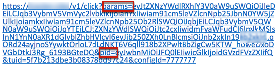
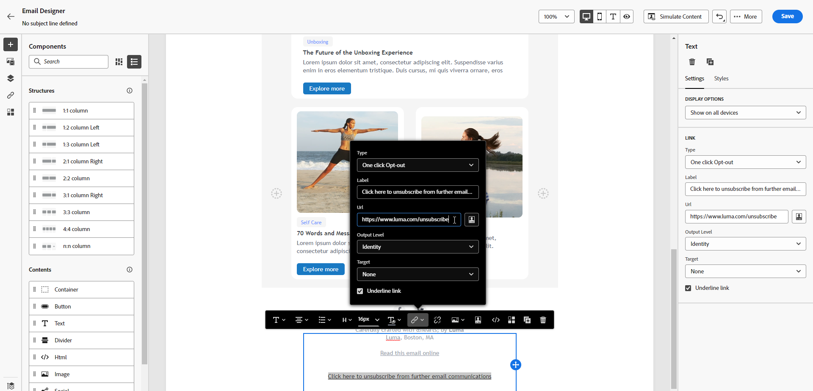

# Gestione della rinuncia e-mail {#email-opt-out}

Per consentire ai destinatari di annullare l’iscrizione alla ricezione delle comunicazioni e-mail, è necessario includere sempre un **scollegare** in ogni e-mail inviata ai destinatari. [Ulteriori informazioni sulla privacy e la gestione delle rinunce](../privacy/opt-out.md)

A questo scopo, puoi:

* Inserisci un **collegamento a una pagina di destinazione esterna** in un messaggio e-mail per consentire agli utenti di annullare l’iscrizione alla ricezione di comunicazioni dal tuo marchio. [Scopri come aggiungere un collegamento di rinuncia esterno](#opt-out-external-lp)

* Aggiungi un **collegamento di rinuncia con un clic** nel contenuto dell’e-mail. Questo collegamento consente ai destinatari di annullare rapidamente l’iscrizione alle comunicazioni senza essere reindirizzati a una pagina di destinazione in cui devono confermare la scelta, il che velocizza il processo di annullamento dell’abbonamento. [Scopri come aggiungere un collegamento di rinuncia con un solo clic](#one-click-opt-out)

Inoltre, se **[!UICONTROL List-Unsubscribe]** è abilitata a livello di superficie del canale, le e-mail corrispondenti inviate con Journey Optimizer includeranno un collegamento di annullamento all’abbonamento nell’intestazione dell’e-mail. [Ulteriori informazioni sulla rinuncia nell’intestazione dell’e-mail](#unsubscribe-header)

>[!NOTE]
>
>I messaggi e-mail di tipo marketing devono includere un collegamento di rinuncia, che non è necessario per i messaggi transazionali. La categoria del messaggio (**[!UICONTROL Marketing]** o **[!UICONTROL Transactional]**) è definita nella [superficie del canale](../configuration/channel-surfaces.md#email-type) (ad esempio predefinito per messaggi) e durante la creazione del messaggio.

## Rinuncia esterna {#opt-out-external-lp}

### Aggiungi un collegamento per annullare l’abbonamento {#add-unsubscribe-link}

Devi innanzitutto aggiungere un collegamento per l’annullamento dell’abbonamento a un messaggio. A questo scopo, segui i passaggi seguenti:

1. Crea la tua pagina di destinazione di annullamento dell’abbonamento.

1. Ospitalo sul sistema di terze parti a tua scelta.

1. Crea un messaggio in un percorso.

1. Selezionare il testo nel contenuto e [inserire un collegamento](../email/message-tracking.md#insert-links) mediante la barra degli strumenti contestuale.

   

1. Seleziona **[!UICONTROL External Opt-out/Unsubscription]** dal **[!UICONTROL Link type]** elenco a discesa.

   

1. In **[!UICONTROL Link]** incolla il collegamento alla pagina di destinazione di terze parti.

   

1. Fai clic su **[!UICONTROL Save]**.

### Implementare una chiamata API per la rinuncia {#opt-out-api}

Per fare in modo che i destinatari rinunciino quando inviano la loro scelta dalla pagina di destinazione, devi implementare un **Chiamata API per abbonamento** attraverso [Sviluppatore Adobe](https://developer.adobe.com){target=&quot;_blank&quot;} per aggiornare le preferenze dei profili corrispondenti.

Questa chiamata POST è la seguente:

Endpoint: platform.adobe.io/journey/imp/consent/preferences

Parametri query:

* **params**: contiene il payload crittografato
* **sig**: signature
* **pid**: ID profilo crittografato

Questi tre parametri verranno inclusi nell’URL della pagina di destinazione di terze parti inviato al destinatario:



Requisiti dell’intestazione:

* x-api-key
* x-gw-ims-org-id
* x-sandbox-name
* autorizzazione (token utente dal tuo account tecnico)

Corpo della richiesta:

```
{
   "marketing": [
       {
            "type": "email",           
            "choice": "no",          
            "scope": "channel"       
        }
    ],
 
}
```

[!DNL Journey Optimizer] utilizzerà questi parametri per aggiornare la scelta del profilo corrispondente tramite [Sviluppatore Adobe](https://developer.adobe.com)Chiamata API {target=&quot;_blank&quot;}.

### Invia il messaggio con il collegamento di annullamento dell’abbonamento {#send-message-unsubscribe-link}

Una volta configurato il collegamento di annullamento all’abbonamento alla pagina di destinazione e implementato la chiamata API , il messaggio è pronto per essere inviato.

1. Invia il messaggio incluso il collegamento tramite un [viaggio](../building-journeys/journey.md).

1. Una volta ricevuto il messaggio, se il destinatario fa clic sul collegamento di annullamento dell’abbonamento, viene visualizzata la pagina di destinazione.

   

1. Se il destinatario invia il modulo (qui, premendo il pulsante **Annulla sottoscrizione** nella pagina di destinazione), i dati del profilo vengono aggiornati tramite [Chiamata API](#opt-out-api).

1. Il destinatario con rinuncia viene quindi reindirizzato a una schermata di messaggio di conferma che indica che la rinuncia è avvenuta con successo.

   

   Di conseguenza, questo utente non riceverà comunicazioni dal tuo marchio a meno che non abbia effettuato nuovamente l’abbonamento.

1. Per verificare che la scelta del profilo corrispondente sia stata aggiornata, passa a Experience Platform e accedi al profilo selezionando uno spazio dei nomi di identità e un valore di identità corrispondente. Ulteriori informazioni nel [Documentazione di Experience Platform](https://experienceleague.adobe.com/docs/experience-platform/profile/ui/user-guide.html#getting-started){target=&quot;_blank&quot;}.

   

   In **[!UICONTROL Attributes]** è possibile visualizzare il valore per **[!UICONTROL choice]** è stato modificato in **[!UICONTROL no]**.

## Rinuncia con un clic {#one-click-opt-out}

Per aggiungere un collegamento di rinuncia all’e-mail, segui la procedura seguente.

1. [Inserire un collegamento](../email/message-tracking.md#insert-links) e seleziona **[!UICONTROL One click Opt-out]** come tipo di collegamento.

   

1. Seleziona la modalità di applicazione della rinuncia: a livello di canale, identità o abbonamento.

   

   * **[!UICONTROL Channel]**: La rinuncia si applica ai messaggi futuri inviati alla destinazione del profilo (ad esempio l’indirizzo e-mail) per il canale corrente. Se più destinazioni sono associate a un profilo, la rinuncia si applica a tutte le destinazioni (ad esempio gli indirizzi e-mail) nel profilo di quel canale.
   * **[!UICONTROL Identity]**: La rinuncia si applica ai messaggi futuri inviati alla destinazione specifica (ad esempio l’indirizzo e-mail) utilizzata per il messaggio corrente.
   * **[!UICONTROL Subscription]**: La rinuncia si applica ai messaggi futuri associati a un elenco di sottoscrizione specifico. Questa opzione può essere selezionata solo se il messaggio corrente è associato a un elenco di sottoscrizioni.

1. Immetti l’URL della pagina di destinazione in cui l’utente verrà reindirizzato una volta annullato l’abbonamento. Questa pagina è disponibile solo per confermare che la rinuncia è stata eseguita correttamente.

   >[!NOTE]
   >
   >Se hai attivato la **Annulla sottoscrizione elenco** a livello della superficie del canale, questo URL verrà utilizzato anche quando gli utenti fanno clic sul collegamento di annullamento dell’abbonamento nell’intestazione dell’e-mail. [Ulteriori informazioni](#unsubscribe-header)

   

   Puoi personalizzare i tuoi collegamenti. Ulteriori informazioni sugli URL personalizzati in [questa sezione](../personalization/personalization-syntax.md).

1. Salva le modifiche.

Una volta inviato il messaggio tramite un [viaggio](../building-journeys/journey.md), se un destinatario fa clic sul collegamento di rinuncia, il suo profilo viene immediatamente escluso.

## Annulla abbonamento nell’intestazione dell’e-mail {#unsubscribe-header}

>[!CONTEXTUALHELP]
>id="ajo_admin_preset_unsubscribe"
>title="Aggiungi un collegamento per annullare l’abbonamento all’intestazione dell’e-mail"
>abstract="Abilita Annulla sottoscrizione a elenco per aggiungere un collegamento di annullamento all’abbonamento all’intestazione dell’e-mail. Per impostare un URL per l’annullamento della sottoscrizione, inserisci un collegamento per la rinuncia con un solo clic nel contenuto dell’e-mail."
>additional-url="https://experienceleague.adobe.com/docs/journey-optimizer/using/privacy/consent/opt-out.html#one-click-opt-out" text="Rinuncia con un clic"

Se la [Opzione Annulla sottoscrizione elenco](../configuration/channel-surfaces.md#list-unsubscribe) è abilitato a livello di superficie del canale, le e-mail corrispondenti inviate con [!DNL Journey Optimizer] includerà un collegamento di annullamento all’abbonamento nell’intestazione dell’e-mail.

Ad esempio, il collegamento per l’annullamento dell’abbonamento verrà visualizzato in Gmail in questo modo:


>[!NOTE]
>
>Per visualizzare il collegamento di annullamento all’abbonamento nell’intestazione dell’e-mail, il client e-mail dei destinatari deve supportare questa funzione.

L’indirizzo predefinito per l’annullamento della sottoscrizione è **[!UICONTROL Mailto (unsubscribe)]** indirizzo visualizzato nella superficie del canale corrispondente. [Ulteriori informazioni](../configuration/channel-surfaces.md#list-unsubscribe).

Per impostare un URL personalizzato per l’annullamento della sottoscrizione, inserisci un collegamento per la rinuncia con un solo clic nel contenuto del messaggio e-mail e immetti l’URL desiderato. [Ulteriori informazioni](#one-click-opt-out)

A seconda del client e-mail, facendo clic sul collegamento per annullare l’abbonamento dall’intestazione possono avere i seguenti impatti:

* La richiesta di annullamento dell’abbonamento viene inviata all’indirizzo predefinito di annullamento dell’abbonamento.

* Il destinatario viene indirizzato all’URL della pagina di destinazione specificato al momento dell’aggiunta del collegamento di rinuncia al messaggio.

   >[!NOTE]
   >
   >Se non aggiungi un collegamento di rinuncia con un solo clic al contenuto del messaggio, non verrà visualizzata alcuna pagina di destinazione.

* Il profilo corrispondente viene immediatamente escluso e questa scelta viene aggiornata in Experience Platform. Ulteriori informazioni nel [Documentazione di Experience Platform](https://experienceleague.adobe.com/docs/experience-platform/profile/ui/user-guide.html#getting-started){target=&quot;_blank&quot;}.
