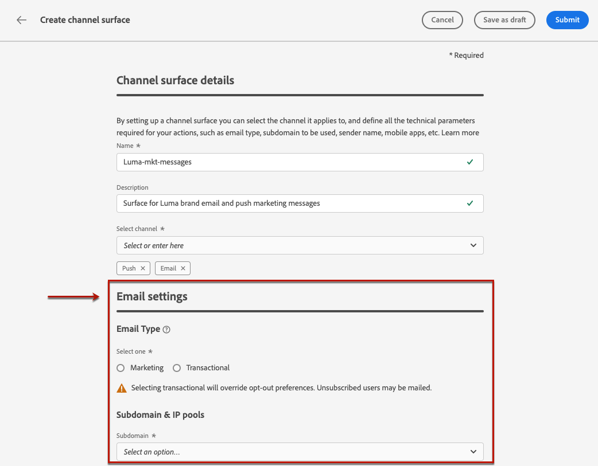
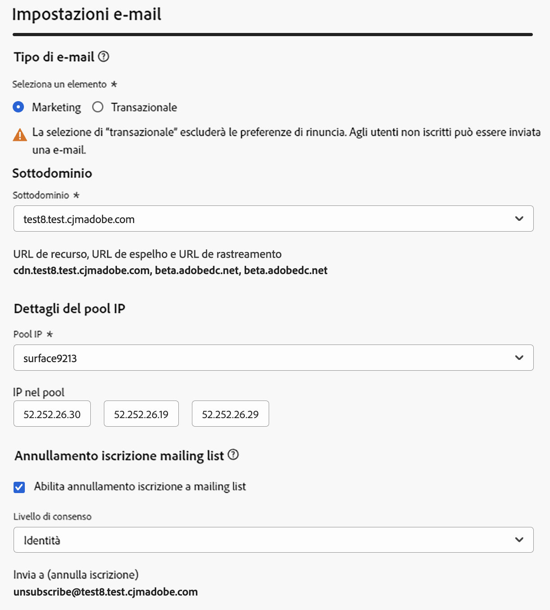

# Configurare le impostazioni e-mail {#email-settings}

Per iniziare a creare un’e-mail, devi impostare superfici di canale e-mail che definiscano tutti i parametri tecnici richiesti per i messaggi. [Scopri come creare le superfici](../configuration/channel-surfaces.md)

Definisci le impostazioni e-mail nella sezione dedicata della configurazione della superficie di canale.

La configurazione della superficie e-mail viene selezionata per l’invio di comunicazioni seguendo la logica seguente:

* Per i percorsi batch, non si applica all’esecuzione batch già avviata prima della configurazione della superficie e-mail. Le modifiche verranno rilevate alla successiva ricorrenza o alla nuova esecuzione.

* Per i messaggi transazionali, la modifica viene selezionata immediatamente per la comunicazione successiva (fino a cinque minuti di ritardo).

>[!NOTE]
>
>Le impostazioni aggiornate della superficie e-mail verranno rilevate automaticamente nei percorsi o nelle campagne in cui viene utilizzata la superficie.

## Tipo di e-mail {#email-type}

>[!CONTEXTUALHELP]
>id="ajo_admin_presets_emailtype"
>title="Definire la categoria dell’e-mail"
>abstract="Seleziona il tipo di e-mail da inviare quando utilizzi questa superficie: Marketing per e-mail promozionali, che richiedono il consenso dell’utente, oppure Transazionale per e-mail non commerciali, che possono essere inviate anche a profili non iscritti in contesti specifici."

In **TIPO DI E-MAIL** , seleziona il tipo di messaggio che verrà inviato con la superficie: **[!UICONTROL Marketing]** o **[!UICONTROL Transazionale]**.

* Scegli **Marketing** e-mail promozionale, ad esempio promozioni settimanali per un negozio al dettaglio. Questi messaggi richiedono il consenso dell’utente.

* Scegli **Transazionale** per e-mail non commerciali, ad esempio conferma di un ordine, notifiche di reimpostazione della password o informazioni di consegna. Queste e-mail possono essere inviate a profili che **annullato abbonamento** dalle comunicazioni di marketing. Questi messaggi possono essere inviati solo in contesti specifici.

Quando crei un messaggio, devi scegliere una superficie di canale valida che corrisponda alla categoria selezionata per l’e-mail.

## Sottodominio e pool IP {#subdomains-and-ip-pools}

In **Sottodominio e pool IP** sezione, è necessario:

1. Seleziona il sottodominio da utilizzare per inviare le e-mail. [Ulteriori informazioni](../configuration/about-subdomain-delegation.md)

1. Selezionare il pool IP da associare alla superficie. [Ulteriori informazioni](../configuration/ip-pools.md)

Impossibile procedere con la creazione della superficie mentre il pool IP selezionato si trova in [edizione](../configuration/ip-pools.md#edit-ip-pool) (**[!UICONTROL Elaborazione]** stato) e non è mai stata associata al sottodominio selezionato. In caso contrario, verrà comunque utilizzata la versione meno recente dell’associazione pool IP/sottodominio. In questo caso, salva la superficie come sformo e riprova una volta che il pool IP ha **[!UICONTROL Completato]** stato.

>[!NOTE]
>
>Per gli ambienti non di produzione, Adobe non crea sottodomini di test predefiniti né concede l’accesso a un pool IP di invio condiviso. È necessario [delegare i propri sottodomini](../configuration/delegate-subdomain.md) e utilizza gli IP del pool assegnato alla tua organizzazione.

Dopo aver selezionato un pool IP, le informazioni PTR sono visibili quando si passa il puntatore del mouse sugli indirizzi IP visualizzati sotto l&#39;elenco a discesa del pool IP. [Ulteriori informazioni sui record PTR](../configuration/ptr-records.md)

>[!NOTE]
>
>Se non è configurato alcun record PTR, contatta il rappresentante del tuo Adobe.

## Annullamento iscrizione mailing list {#list-unsubscribe}

Su [selezione di un sottodominio](#subdomains-and-ip-pools) dall&#39;elenco, **[!UICONTROL Abilita annullamento sottoscrizione elenco]** viene visualizzata l&#39;opzione.

L’opzione è abilitata per impostazione predefinita.

Se lo lasci abilitato, nell’intestazione dell’e-mail verrà automaticamente incluso un collegamento per annullare l’abbonamento, ad esempio:

Se disattivi questa opzione, nell’intestazione dell’e-mail non verrà visualizzato alcun collegamento per annullare l’abbonamento.

Il collegamento per annullare l’abbonamento è costituito da due elementi:

* Un **indirizzo e-mail per annullare l’iscrizione**, a cui vengono inviate tutte le richieste di annullamento dell’abbonamento.

  In entrata [!DNL Journey Optimizer], l’indirizzo e-mail predefinito per l’annullamento dell’iscrizione è **[!UICONTROL Invia a (annulla iscrizione)]** indirizzo visualizzato nella superficie di canale, in base al [sottodominio selezionato](#subdomains-and-ip-pools).

  

* Il **URL per annullamento iscrizione**: URL della pagina di destinazione a cui l’utente verrà reindirizzato una volta annullato l’abbonamento.

  Se aggiungi un [collegamento di rinuncia con un clic](../privacy/opt-out.md#one-click-opt-out) a un messaggio creato utilizzando questa superficie, l’URL per l’annullamento dell’iscrizione sarà l’URL definito per il collegamento di rinuncia con un clic.

  

  >[!NOTE]
  >
  >Se non aggiungi un collegamento di rinuncia con un solo clic nel contenuto del messaggio, non verrà visualizzata alcuna pagina di destinazione.

Ulteriori informazioni sull’aggiunta di un collegamento di annullamento dell’iscrizione all’intestazione nei messaggi in [questa sezione](../privacy/opt-out.md#unsubscribe-header).

<!--Select the **[!UICONTROL Custom List-Unsubscribe]** option to enter your own Unsubscribe URL and/or your own Unsubscribe email address.(to add later)-->

## Parametri intestazione {#email-header}

In **[!UICONTROL Parametri intestazione]** , inserisci i nomi dei mittenti e gli indirizzi e-mail associati al tipo di e-mail inviate utilizzando tale superficie.

* **[!UICONTROL Nome mittente]**: nome del mittente, ad esempio il nome del brand.

* **[!UICONTROL E-mail mittente]**: indirizzo e-mail da utilizzare per le comunicazioni.

* **[!UICONTROL Rispondi a (nome)]**: nome che verrà utilizzato quando il destinatario farà clic su **Rispondi** nel software client di posta elettronica.

* **[!UICONTROL Rispondi a (e-mail)]**: l’indirizzo e-mail che verrà utilizzato quando il destinatario farà clic su **Rispondi** nel software client di posta elettronica. [Ulteriori informazioni](#reply-to-email)

* **[!UICONTROL E-mail di errore]**: su questo indirizzo vengono ricevuti tutti gli errori generati dagli ISP dopo alcuni giorni di recapito della posta (mancati recapiti asincroni).

>[!CAUTION]
>
>Il **[!UICONTROL E-mail mittente]** e **[!UICONTROL E-mail di errore]** gli indirizzi devono utilizzare l&#39;indirizzo selezionato [sottodominio delegato](../configuration/about-subdomain-delegation.md). Ad esempio, se il sottodominio delegato è *marketing.luma.com*, è possibile utilizzare *contact@marketing.luma.com* e *error@marketing.luma.com*.

>[!NOTE]
>
>Gli indirizzi devono iniziare con una lettera (A-Z) e possono contenere solo caratteri alfanumerici. È inoltre possibile utilizzare il carattere di sottolineatura `_`, punto`.` e trattino `-` caratteri.

### Rispondi a e-mail {#reply-to-email}

Quando definisci **[!UICONTROL Rispondi a (e-mail)]** indirizzo, puoi specificare qualsiasi indirizzo e-mail purché sia valido, nel formato corretto e senza errori di battitura.

Per garantire una corretta gestione delle risposte, segui le raccomandazioni seguenti:

* La casella in entrata utilizzata per le risposte riceverà tutte le e-mail di risposta, incluse le notifiche fuori sede e le risposte di richiesta di verifica, pertanto assicurati di disporre di un processo manuale o automatico per elaborare le e-mail che verranno inviate a questa casella in entrata.

* Assicurati che la casella in entrata dedicata disponga di una capacità di ricezione sufficiente per ricevere tutte le e-mail di risposta inviate utilizzando la superficie e-mail. Se la casella in entrata restituisce mancati recapiti, è possibile che alcune risposte dei clienti non vengano ricevute.

* Le risposte devono essere elaborate tenendo presenti gli obblighi in materia di privacy e conformità, in quanto possono contenere informazioni personali (PII, personally identifiable information).

* Non contrassegnare i messaggi come spam nella casella in entrata delle risposte, in quanto ciò influirà su tutte le altre risposte inviate a questo indirizzo.

Inoltre, quando definisci il **[!UICONTROL Rispondi a (e-mail)]** indirizzo, assicurati di utilizzare un sottodominio con una configurazione del record MX valida, altrimenti l’elaborazione della superficie e-mail non riuscirà.

Se ricevi un errore durante l’invio della superficie e-mail, significa che il record MX non è configurato per il sottodominio dell’indirizzo inserito. Contatta l’amministratore per configurare il record MX corrispondente o utilizza un altro indirizzo con una configurazione di record MX valida.

>[!NOTE]
>
>Se il sottodominio dell&#39;indirizzo immesso è un dominio [completamente delegato](../configuration/delegate-subdomain.md#full-subdomain-delegation) ad Adobe, contatta il tuo account executive di Adobe.

### Inoltra e-mail {#forward-email}

Se desideri inoltrare a un indirizzo e-mail specifico, tutte le e-mail ricevute da [!DNL Journey Optimizer] per il sottodominio delegato, contatta l’Adobe dell’Assistenza clienti. Dovrai fornire:

* L’indirizzo e-mail di inoltro desiderato. Il dominio dell’indirizzo e-mail di inoltro non può corrispondere ad alcun sottodominio delegato ad Adobe.
* Nome della sandbox.
* Il nome della superficie per la quale verrà utilizzato l’indirizzo e-mail di inoltro.
* L&#39;attuale **[!UICONTROL Rispondi a (e-mail)]** indirizzo impostato a livello della superficie di canale.

>[!NOTE]
>
>Può essere presente un solo indirizzo e-mail di inoltro per sottodominio. Di conseguenza, se più superfici utilizzano lo stesso sottodominio, è necessario utilizzare lo stesso indirizzo e-mail di inoltro per tutte le superfici.

L’indirizzo e-mail di inoltro verrà impostato da Adobe. Questa operazione può richiedere da 3 a 4 giorni.

## E-mail Ccn {#bcc-email}

Puoi inviare una copia identica (o una copia per conoscenza nascosta) delle e-mail inviate da [!DNL Journey Optimizer] in una casella in entrata Ccn in cui verranno archiviati per scopi di conformità o archiviazione.

Per eseguire questa operazione, abilita **[!UICONTROL E-mail Ccn]** feature opzionale a livello della superficie di canale. [Ulteriori informazioni](../configuration/archiving-support.md#bcc-email)

Inoltre, quando definisci il **[!UICONTROL E-mail Ccn]** indirizzo, assicurati di utilizzare un sottodominio con una configurazione del record MX valida, altrimenti l’elaborazione della superficie e-mail non riuscirà.

Se ricevi un errore durante l’invio della superficie e-mail, significa che il record MX non è configurato per il sottodominio dell’indirizzo inserito. Contatta l’amministratore per configurare il record MX corrispondente o utilizza un altro indirizzo con una configurazione di record MX valida.

## Invio a indirizzi e-mail soppressi {#send-to-suppressed-email-addresses}

>[!CONTEXTUALHELP]
>id="ajo_surface_suppressed_addresses"
>title="Sostituire la precedenza dell’elenco di soppressione"
>abstract="Puoi decidere di inviare messaggi transazionali ai profili anche se i loro indirizzi e-mail sono presenti nell’elenco di soppressione di Adobe Journey Optimizer a causa di un reclamo spam. Questa opzione è disabilitata per impostazione predefinita."
>additional-url="https://experienceleague.adobe.com/docs/journey-optimizer/using/configuration/monitor-reputation/manage-suppression-list.html?lang=it" text="Gestire l’elenco di soppressione"

>[!IMPORTANT]
>
>Questa opzione è disponibile solo se è stata selezionata l&#39;opzione **[!UICONTROL Transazionale]** tipo di e-mail. [Ulteriori informazioni](#email-type)

In entrata [!DNL Journey Optimizer], tutti gli indirizzi e-mail contrassegnati come mancati recapiti permanenti, mancati recapiti non permanenti e segnalazioni di spam vengono raccolti automaticamente nel [elenco di soppressione](../configuration/manage-suppression-list.md) ed è escluso dall’invio in un percorso o una campagna.

Tuttavia, puoi decidere di continuare a inviare messaggi del **transazionale** digita nei profili anche se i loro indirizzi e-mail sono presenti nell’elenco di soppressione a causa di un reclamo spam da parte dell’utente.

In effetti, i messaggi transazionali generalmente contengono informazioni utili e attese, come una conferma di un ordine o una notifica di reimpostazione della password. Pertanto, anche se hanno segnalato uno dei tuoi messaggi di marketing come spam, nella maggior parte dei casi desideri che i tuoi clienti ricevano questo tipo di e-mail non commerciale.

Per includere gli indirizzi e-mail soppressi a causa di un reclamo spam nel pubblico dei messaggi transazionali, seleziona l’opzione corrispondente dalla **[!UICONTROL Invia a indirizzi e-mail soppressi]** sezione.

>[!NOTE]
>
>Questa opzione è disabilitata per impostazione predefinita.

Come best practice per la consegna dei messaggi, questa opzione è disabilitata per impostazione predefinita per garantire che i clienti che hanno rinunciato non vengano contattati. Tuttavia, puoi modificare questa opzione predefinita, che ti consente quindi di inviare messaggi transazionali ai clienti.

Una volta abilitata questa opzione, anche se un cliente ha contrassegnato l’e-mail di marketing come spam, potrà ricevere i messaggi transazionali utilizzando la superficie corrente. Assicurati sempre di gestire le preferenze di rinuncia in conformità alle best practice per la consegna dei messaggi.

## Elenco seed {#seed-list}

>[!CONTEXTUALHELP]
>id="ajo_surface_seed_list"
>title="Aggiungere un elenco seed"
>abstract="Seleziona l’elenco seed desiderato per aggiungere automaticamente indirizzi interni specifici ai tipi di pubblico. Questi indirizzi seed verranno inclusi al momento dell’esecuzione della consegna e riceveranno una copia esatta del messaggio a scopo di garanzia."
>additional-url="https://experienceleague.adobe.com/docs/journey-optimizer/using/configuration/seed-lists.html#use-seed-list?lang=it" text="Cosa sono gli elenchi seed?"
>additional-url="https://experienceleague.adobe.com/docs/journey-optimizer/using/configuration/seed-lists.html?lang=it#create-seed-list" text="Creare un elenco seed"

Un elenco seed in [!DNL Journey Optimizer] consente di includere automaticamente indirizzi e-mail seed specifici nelle consegne. [Ulteriori informazioni](../configuration/seed-lists.md)

>[!CAUTION]
>
>Attualmente questa funzione si applica solo al canale e-mail.

Seleziona l’elenco che ti interessa nel **[!UICONTROL Elenco seed]** sezione. Scopri come creare un elenco di seed in [questa sezione](../configuration/seed-lists.md#create-seed-list).

>[!NOTE]
>
>È possibile selezionare un solo elenco di seed alla volta.

Quando la superficie corrente viene utilizzata in una campagna o in un percorso, gli indirizzi e-mail nell’elenco di seed selezionato vengono inclusi al momento dell’esecuzione della consegna, il che significa che riceveranno una copia della consegna a scopo di garanzia.

Scopri come utilizzare l’elenco di seed in una campagna o in un percorso di [questa sezione](../configuration/seed-lists.md#use-seed-list).

## Parametri per nuovi tentativi e-mail {#email-retry}

>[!CONTEXTUALHELP]
>id="ajo_admin_presets_retryperiod"
>title="Regolare il periodo di tempo per i tentativi"
>abstract="Quando la consegna di un’e-mail ha esito negativo a causa di un errore temporaneo di mancato recapito dei messaggi, vengono eseguiti nuovi tentativi per 3,5 giorni (84 ore). Puoi regolare questo periodo di tempo predefinito per i tentativi in base alle tue esigenze."
>additional-url="https://experienceleague.adobe.com/docs/journey-optimizer/using/configuration/monitor-reputation/retries.html?lang=it" text="Informazioni sui tentativi"

È possibile configurare **Parametri per nuovi tentativi e-mail**.

Per impostazione predefinita, il [periodo di tempo di un nuovo tentativo](../configuration/retries.md#retry-duration) è impostato su 84 ore, ma è possibile regolarlo per soddisfare al meglio le proprie esigenze.

È necessario immettere un valore intero (in ore o minuti) compreso nel seguente intervallo:

* Per le e-mail di marketing, il periodo minimo di nuovi tentativi è di 6 ore.
* Per le e-mail transazionali, il periodo minimo di nuovi tentativi è di 10 minuti.
* Per entrambi i tipi di e-mail, il periodo massimo di nuovi tentativi è di 84 ore (o 5040 minuti).

Ulteriori informazioni sui nuovi tentativi in [questa sezione](../configuration/retries.md).

## Tracciamento URL {#url-tracking}

>[!CONTEXTUALHELP]
>id="ajo_admin_preset_utm"
>title="Definire i parametri di tracciamento degli URL"
>abstract="Usa questa sezione per aggiungere automaticamente i parametri di tracciamento agli URL presenti nel contenuto dell’e-mail. Questa funzione è facoltativa."

>[!CONTEXTUALHELP]
>id="ajo_admin_preset_url_preview"
>title="Anteprima dei parametri di tracciamento degli URL"
>abstract="Verifica il modo in cui i parametri di tracciamento verranno aggiunti agli URL presenti nel contenuto dell’e-mail."

È possibile utilizzare **[!UICONTROL Parametri di tracciamento URL]** per misurare l’efficacia delle tue attività di marketing su tutti i canali. Questa funzione è facoltativa.

I parametri definiti in questa sezione verranno aggiunti alla fine degli URL inclusi nel contenuto del messaggio e-mail. Puoi quindi acquisire questi parametri negli strumenti di analisi web come Adobe Analytics o Google Analytics e creare vari rapporti sulle prestazioni.

Puoi aggiungere fino a 10 parametri di tracciamento utilizzando **[!UICONTROL Aggiungi nuovo parametro]** pulsante.

Per configurare un parametro di tracciamento URL, puoi immettere direttamente i valori desiderati nel **[!UICONTROL Nome]** e **[!UICONTROL Valore]** campi.

Puoi anche modificarli **[!UICONTROL Valore]** campo utilizzando [Editor espressioni](../personalization/personalization-build-expressions.md). Fai clic sull’icona dell’edizione per aprire l’editor. Da qui, puoi selezionare gli attributi contestuali disponibili e/o modificare direttamente il testo.

I seguenti valori predefiniti sono disponibili tramite l’editor espressioni:

* **ID azione sorgente**: ID dell’azione E-mail aggiunta al percorso o alla campagna.

* **Nome azione sorgente**: nome dell’azione E-mail aggiunta al percorso o alla campagna.

* **ID sorgente**: ID del percorso o della campagna con cui è stata inviata l’e-mail.

* **Nome origine**: nome del percorso o della campagna con cui è stata inviata l’e-mail.

* **ID versione sorgente**: ID del percorso o della versione della campagna con cui è stata inviata l’e-mail.

* **ID offerta**: ID dell’offerta utilizzata nell’e-mail.

>[!NOTE]
>
>È possibile combinare la digitazione di valori di testo e l’utilizzo di attributi contestuali dall’editor espressioni. Ogni **[!UICONTROL Valore]** può contenere un numero di caratteri fino al limite di 5 KB.

<!--You can drag and drop the parameters to reorder them.-->

Di seguito sono riportati alcuni esempi di URL compatibili con Adobe Analytics e Google Analytics.

* URL compatibile con Adobe Analytics: `www.YourLandingURL.com?cid=email_AJO_{{context.system.source.id}}_image_{{context.system.source.name}}`

* Google Analytics URL compatibile: `www.YourLandingURL.com?utm_medium=email&utm_source=AJO&utm_campaign={{context.system.source.id}}&utm_content=image`

Puoi visualizzare in anteprima dinamica l’URL di tracciamento risultante. Ogni volta che aggiungi, modifichi o rimuovi un parametro, l’anteprima viene aggiornata automaticamente.

>[!NOTE]
>
>Puoi anche aggiungere parametri di tracciamento dinamici e personalizzati ai collegamenti presenti nel contenuto dell’e-mail, ma ciò non è possibile a livello di superficie. È necessario eseguire questa operazione quando crei il messaggio utilizzando e-mail designer. [Ulteriori informazioni](message-tracking.md#url-tracking)
