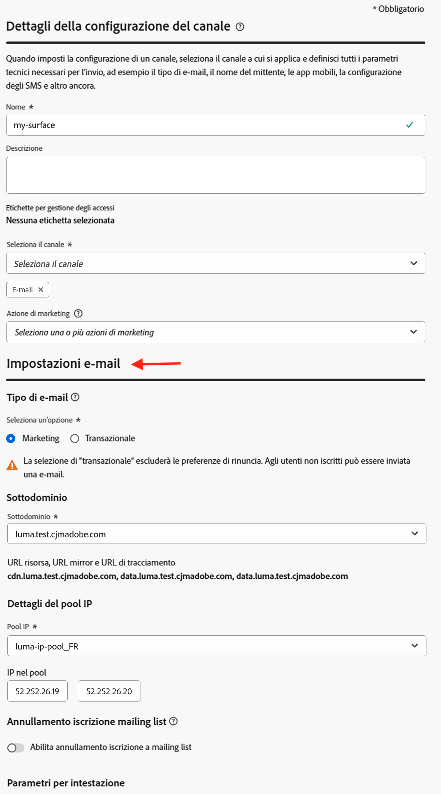
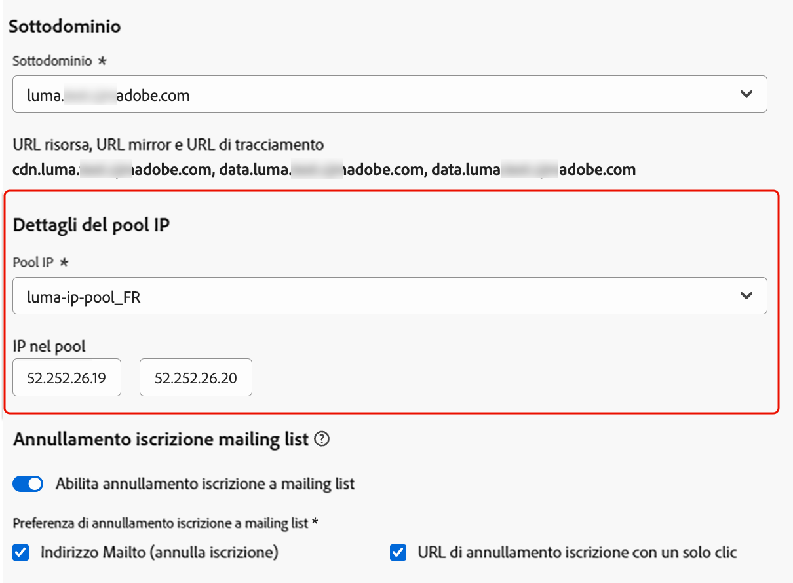
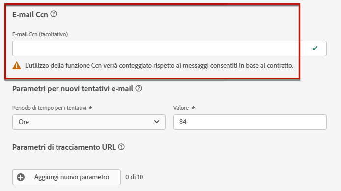
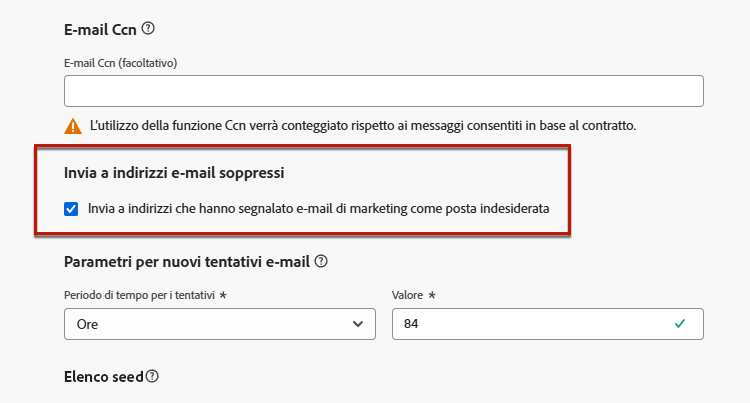
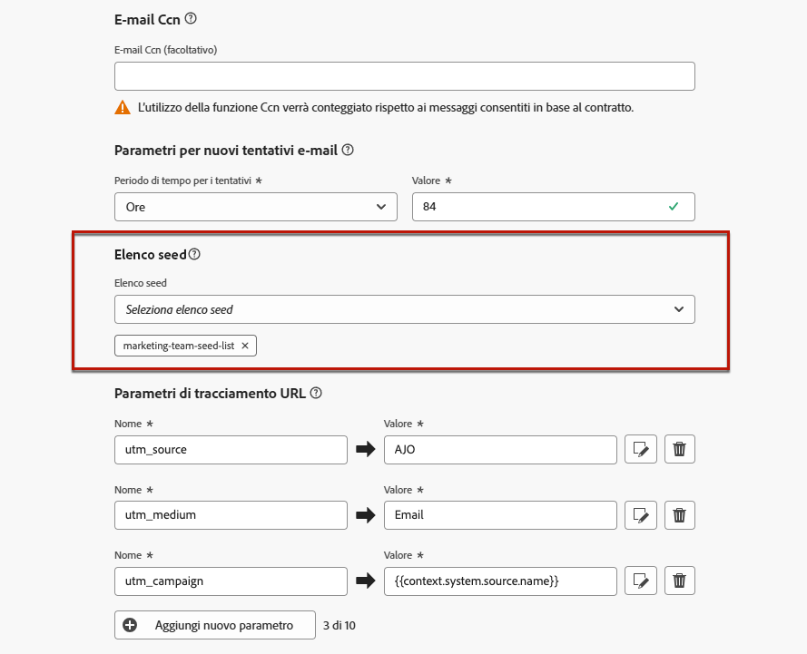
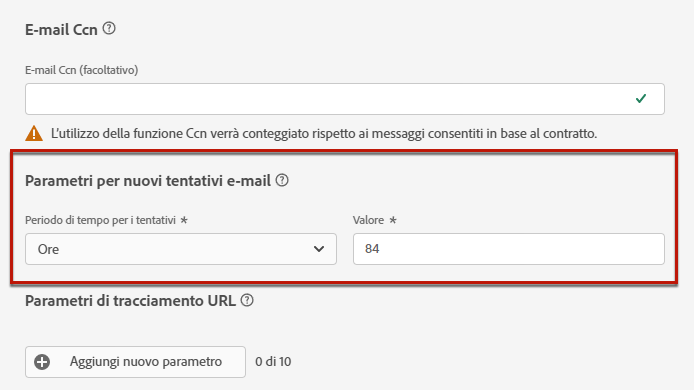
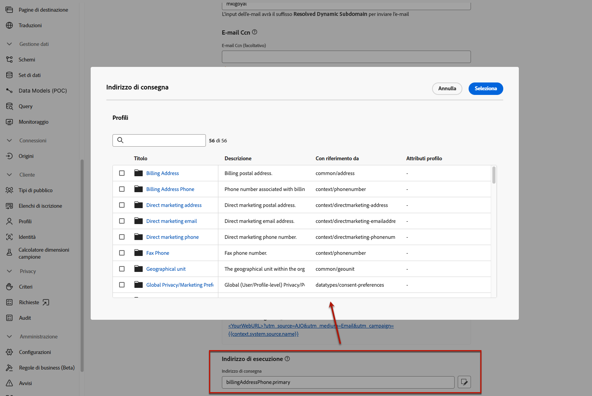

# Configurare le impostazioni e-mail {#email-settings}

Per iniziare a creare un’e-mail, è necessario impostare le configurazioni del canale e-mail che definiscono tutti i parametri tecnici richiesti per i messaggi. [Scopri come creare le configurazioni](../configuration/channel-surfaces.md)

>[!NOTE]
>
>Per preservare la reputazione e migliorare la recapitabilità dei messaggi, imposta i sottodomini da utilizzare per l’invio di e-mail prima di creare una configurazione e-mail. [Ulteriori informazioni](../configuration/about-subdomain-delegation.md)
>
>Prima di creare una configurazione del canale e-mail, devi aver creato almeno un pool IP. [Ulteriori informazioni](../configuration/ip-pools.md)

Definisci le impostazioni e-mail nella sezione dedicata della configurazione dei canali, come descritto di seguito.

{width="50%" align="left"}

La configurazione e-mail viene rilevata per l’invio di comunicazioni seguendo la logica seguente:

* Per i percorsi batch, questa non viene applicata all’esecuzione batch già avviata prima della configurazione della superficie e-mail. La modifica viene rilevata alla successiva ricorrenza o alla nuova esecuzione.

* Per i messaggi transazionali, la modifica viene rilevata immediatamente per la comunicazione successiva (con ritardo massimo di cinque minuti).

>[!NOTE]
>
>Le impostazioni di configurazione e-mail aggiornate vengono rilevate automaticamente nei percorsi o nelle campagne in cui viene utilizzata la configurazione.

## Tipo di e-mail {#email-type}

>[!CONTEXTUALHELP]
>id="ajo_admin_presets_emailtype"
>title="Definire il tipo di e-mail"
>abstract="Seleziona il tipo di e-mail da inviare quando utilizzi questa configurazione: marketing per e-mail promozionali, che richiedono il consenso dell’utente, oppure transazionale per e-mail non commerciali, che possono essere inviate anche a profili non iscritti in contesti specifici."

Nella sezione **Tipo di e-mail**, seleziona il tipo di messaggio per la configurazione: **[!UICONTROL Marketing]** o **[!UICONTROL Transazionale]**.

* Seleziona **Marketing** per le e-mail promozionali, ad esempio le promozioni settimanali per un negozio di vendita al dettaglio. Questi messaggi richiedono il consenso dell’utente.

* Seleziona **Transazionale** per e-mail non commerciali, come ad esempio la conferma di un ordine, le notifiche di reimpostazione della password o le informazioni di consegna. Queste e-mail possono essere inviate ai profili che hanno **annullato l’iscrizione** alle comunicazioni di marketing. Questi messaggi possono essere inviati solo in contesti specifici.

Quando crei un messaggio, devi scegliere una configurazione dei canali valida che corrisponda alla categoria selezionata per l’e-mail.

## Sottodominio {#subdomains}

Seleziona il sottodominio da utilizzare per inviare le e-mail.

>[!NOTE]
>
>Per un maggiore controllo sulle impostazioni e-mail, puoi definire sottodomini dinamici. [Ulteriori informazioni](../email/surface-personalization.md#dynamic-subdomains)

Per preservare la reputazione del dominio, velocizza il processo di preparazione IP e migliora la recapitabilità, delega i sottodomini di invio ad Adobe. [Ulteriori informazioni](../configuration/about-subdomain-delegation.md)

## Dettagli del pool IP {#ip-pools}

Seleziona il pool IP da associare alla configurazione. [Ulteriori informazioni](../configuration/ip-pools.md)

{width="50%" align="left"}

Non è possibile procedere con la creazione della configurazione mentre il pool IP selezionato è in corso di [modifica](../configuration/ip-pools.md#edit-ip-pool) (stato **[!UICONTROL In elaborazione]**) e non è mai stato associato al sottodominio selezionato. In caso contrario, verrà comunque utilizzata la versione meno recente dell’associazione pool IP/sottodominio. In questo caso, salva la configurazione come bozza e riprova una volta che il pool IP avrà lo stato **[!UICONTROL Completato]**.

>[!NOTE]
>
>Per gli ambienti non di produzione, Adobe non crea sottodomini di test preconfigurati né concede l’accesso a un pool IP di invio condiviso. È necessario [delegare i tuoi sottodomini](../configuration/delegate-subdomain.md) e utilizzare gli IP del pool assegnato alla tua organizzazione.

Dopo aver selezionato un pool IP, le informazioni PTR sono visibili quando si passa il puntatore sugli indirizzi IP visualizzati sotto l’elenco a discesa del pool IP. [Ulteriori informazioni sui record PTR](../configuration/ptr-records.md)

>[!NOTE]
>
>Se non è stato configurato alcun record PTR, contatta il tuo rappresentante Adobe.

## Annullamento iscrizione a mailing list {#list-unsubscribe}

Quando selezioni un sottodominio dall’elenco, viene visualizzata l’opzione **[!UICONTROL Abilita annullamento iscrizione a mailing list]**. Per impostazione predefinita, questa opzione è abilitata.

Consente di includere un URL per l’annullamento dell’iscrizione con un solo clic nell’intestazione dell’e-mail. [Ulteriori informazioni](list-unsubscribe.md)

## Parametri per intestazione {#email-header}

Nella sezione **[!UICONTROL Parametri intestazione]**, immetti il nome del mittente e gli indirizzi e-mail associati al tipo di e-mail inviate con tale configurazione. [Ulteriori informazioni](header-parameters.md)

## E-mail Ccn {#bcc-email}

È possibile inviare una copia identica (o copia carbone nascosta) delle e-mail inviate da [!DNL Journey Optimizer] a una casella in entrata Ccn in cui verranno archiviate per scopi di conformità o archiviazione.

Per eseguire questa operazione, abilita la funzione facoltativa **[!UICONTROL E-mail Ccn]** a livello di configurazione dei canali. [Ulteriori informazioni](../configuration/archiving-support.md#bcc-email)

Inoltre, quando definisci l’indirizzo **[!UICONTROL E-mail Ccn]**, assicurati di utilizzare un sottodominio con una configurazione del record MX valida, altrimenti l’elaborazione della configurazione e-mail non andrà a buon fine.

Se ricevi un errore durante l’invio della configurazione e-mail, significa che il record MX non è configurato per il sottodominio dell’indirizzo inserito. Contatta l’amministratore per configurare il record MX corrispondente o utilizza un altro indirizzo con una configurazione di record MX valida.

## Invio a indirizzi e-mail soppressi {#send-to-suppressed-email-addresses}

>[!CONTEXTUALHELP]
>id="ajo_surface_suppressed_addresses"
>title="Sostituire la precedenza dell’elenco di soppressione"
>abstract="Puoi decidere di inviare messaggi transazionali ai profili anche se i loro indirizzi e-mail sono presenti nell’elenco di soppressione di Adobe Journey Optimizer a causa di un reclamo spam. Questa opzione è disabilitata per impostazione predefinita."
>additional-url="https://experienceleague.adobe.com/docs/journey-optimizer/using/configuration/monitor-reputation/manage-suppression-list.html?lang=it" text="Gestire l’elenco di soppressione"

>[!IMPORTANT]
>
>Questa opzione è disponibile solo se hai selezionato il tipo di e-mail **[!UICONTROL Transazionale]**. [Ulteriori informazioni](#email-type)

In [!DNL Journey Optimizer], tutti gli indirizzi e-mail contrassegnati come mancati recapiti permanenti, mancati recapiti non permanenti e reclami spam, vengono raccolti automaticamente nell’[elenco di soppressione](../configuration/manage-suppression-list.md) ed esclusi dall’invio in un percorso o in una campagna.

Tuttavia, puoi decidere di continuare a inviare messaggi di tipo **transazionale** ai profili anche se i relativi indirizzi e-mail sono presenti nell’elenco di soppressione a causa di un reclamo spam da parte dell’utente.

In effetti, i messaggi transazionali generalmente contengono informazioni utili e previste, come la conferma di un ordine o la notifica per reimpostare la password. Pertanto, anche se uno dei tuoi messaggi di marketing è stato segnalato come spam, nella maggior parte dei casi desideri che la clientela riceva questo tipo di e-mail non commerciale.

Per includere gli indirizzi e-mail soppressi a causa di un reclamo spam nel pubblico dei messaggi transazionali, seleziona l’opzione corrispondente dalla sezione **[!UICONTROL Invia a indirizzi e-mail soppressi]**.

>[!NOTE]
>
>Questa opzione è disabilitata per impostazione predefinita.

Come best practice per la recapitabilità, questa opzione è disabilitata per impostazione predefinita, per garantire che la clientela che ha effettuato la rinuncia non venga contattata. Tuttavia, puoi modificare questa opzione predefinita, in modo da poter inviare messaggi transazionali alla tua clientela.

Una volta abilitata questa opzione, anche se un cliente ha contrassegnato l’e-mail di marketing come spam, potrà comunque ricevere i messaggi transazionali utilizzando la configurazione attuale. Assicurati sempre di gestire le preferenze di rinuncia in conformità alle best practice per la recapitabilità.

## Elenco seed {#seed-list}

>[!CONTEXTUALHELP]
>id="ajo_surface_seed_list"
>title="Aggiungere un elenco seed"
>abstract="Seleziona l’elenco seed desiderato per aggiungere automaticamente indirizzi interni specifici ai tipi di pubblico. Questi indirizzi seed verranno inclusi al momento dell’esecuzione della consegna e riceveranno una copia esatta del messaggio a scopo di garanzia."
>additional-url="https://experienceleague.adobe.com/docs/journey-optimizer/using/configuration/seed-lists.html?lang=it#use-seed-list" text="Cosa sono gli elenchi seed?"

Un elenco seed in [!DNL Journey Optimizer] consente di includere automaticamente indirizzi seed e-mail specifici nelle consegne. [Ulteriori informazioni](../configuration/seed-lists.md)

>[!CAUTION]
>
>Attualmente questa funzione si applica solo al canale e-mail.

Nella sezione **[!UICONTROL Elenco seed]** seleziona l’elenco pertinente. Scopri come creare un elenco seed in [in questa sezione](../configuration/seed-lists.md#create-seed-list).

{width="80%"}

>[!NOTE]
>
>È possibile selezionare un solo elenco seed alla volta.

Quando la configurazione attuale viene utilizzata in una campagna o in un percorso, gli indirizzi e-mail nell’elenco seed selezionato vengono inclusi al momento dell’esecuzione della consegna, il che significa che riceveranno una copia della consegna a scopo di garanzia.

Scopri come utilizzare l’elenco seed in una campagna o in un percorso in [questa sezione](../configuration/seed-lists.md#use-seed-list).

## Parametri di ripetizione delle e-mail {#email-retry}

>[!CONTEXTUALHELP]
>id="ajo_admin_presets_retryperiod"
>title="Regolare il periodo di tempo per i tentativi"
>abstract="Quando la consegna di un’e-mail ha esito negativo a causa di un errore temporaneo di mancato recapito dei messaggi, vengono eseguiti nuovi tentativi per 3,5 giorni (84 ore). Puoi regolare questo periodo di tempo predefinito per i tentativi in base alle tue esigenze."
>additional-url="https://experienceleague.adobe.com/docs/journey-optimizer/using/configuration/monitor-reputation/retries.html?lang=it" text="Informazioni sui tentativi"

È possibile configurare i **Parametri per nuovi tentativi e-mail**.

Per impostazione predefinita, il [periodo di tempo per i nuovi tentativi](../configuration/retries.md#retry-duration) è impostato su 84 ore, ma puoi regolare tale impostazione per adattarla meglio alle tue esigenze.

È necessario immettere un valore intero (in ore o minuti) compreso nel seguente intervallo:

* Per le e-mail di marketing, il periodo minimo di nuovi tentativi è di 6 ore.
* Per le e-mail transazionali, il periodo minimo di nuovi tentativi è di 10 minuti.
* Per entrambi i tipi di e-mail, il periodo massimo di nuovi tentativi è di 84 ore (o 5040 minuti).

Ulteriori informazioni sui nuovi tentativi sono disponibili in [questa sezione](../configuration/retries.md).

## Tracciamento URL {#url-tracking}

Puoi utilizzare **[!UICONTROL Parametri di tracciamento URL]** per misurare l’efficacia delle tue attività di marketing su tutti i canali. [Ulteriori informazioni](url-tracking.md)

## Indirizzo di esecuzione {#execution-address}

Quando esegui il targeting di un profilo, nel database potrebbero essere disponibili diversi indirizzi e-mail (indirizzo e-mail professionale, indirizzo e-mail personale, ecc.).

In tal caso, [!DNL Journey Optimizer] utilizza l’indirizzo specificato nei **[!UICONTROL campi di esecuzione]** a livello di sandbox per determinare quale indirizzo e-mail utilizzare dal servizio profilo con priorità. [Ulteriori informazioni](../configuration/primary-email-addresses.md)

>[!NOTE]
>
>Per verificare i campi attualmente utilizzati per impostazione predefinita, accedi al menu **[!UICONTROL Amministrazione]** > **[!UICONTROL Canali]** > **[!UICONTROL Impostazioni generali]** > **[!UICONTROL Campi di esecuzione]**.

Tuttavia, puoi modificare questo campo di esecuzione predefinito a livello di configurazione dei canali e-mail. Puoi quindi applicare questa impostazione a campagne o percorsi specifici.

A questo scopo, modifica il campo **[!UICONTROL Indirizzo di consegna]** e seleziona un elemento dall’elenco dei campi XDM di tipo e-mail disponibili. [Ulteriori informazioni](../configuration/primary-email-addresses.md#override-execution-address-channel-config)

