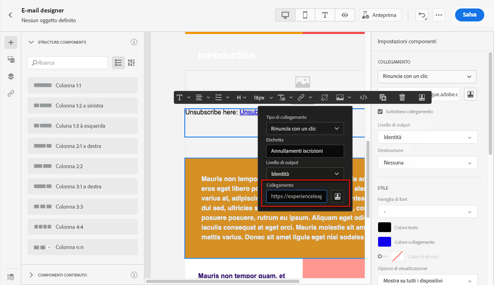
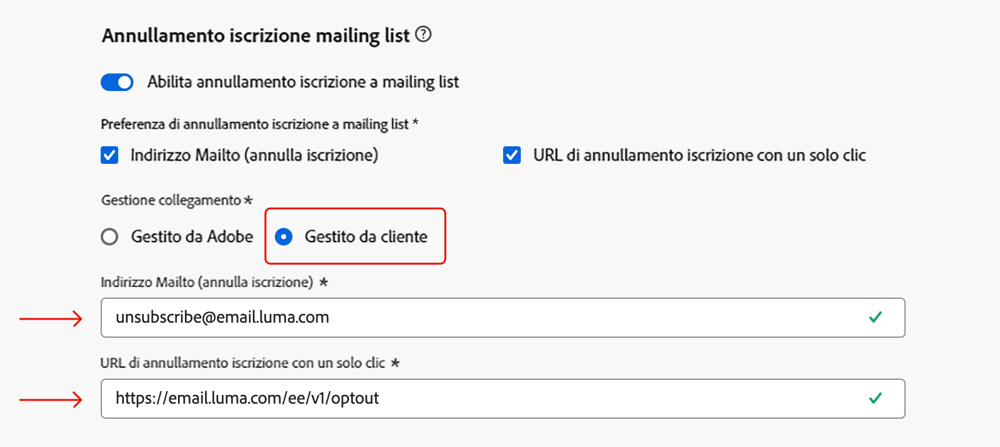
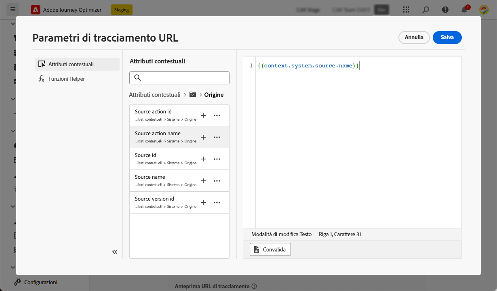

# Configurare le impostazioni e-mail {#email-settings}

Per iniziare a creare un’e-mail, è necessario impostare le configurazioni del canale e-mail che definiscono tutti i parametri tecnici richiesti per i messaggi. [Scopri come creare le configurazioni](../configuration/channel-surfaces.md)

>[!NOTE]
>
>Per preservare la reputazione e migliorare la recapitabilità dei messaggi, imposta i sottodomini da utilizzare per l’invio di e-mail prima di creare una configurazione e-mail. [Ulteriori informazioni](../configuration/about-subdomain-delegation.md)

Definisci le impostazioni e-mail nella sezione dedicata della configurazione dei canali, come descritto di seguito.

{width="50%" align="left"}

La configurazione e-mail viene rilevata per l’invio di comunicazioni seguendo la logica seguente:

* Per i percorsi batch, questa non viene applicata all’esecuzione batch già avviata prima della configurazione della superficie e-mail. Le modifiche vengono rilevate alla successiva ricorrenza o alla nuova esecuzione.

* Per i messaggi transazionali, la modifica viene rilevata immediatamente per la comunicazione successiva (fino a cinque minuti di ritardo).

>[!NOTE]
>
>Le impostazioni di configurazione e-mail aggiornate vengono rilevate automaticamente nei percorsi o nelle campagne in cui viene utilizzata la configurazione.

## Tipo di e-mail {#email-type}

>[!CONTEXTUALHELP]
>id="ajo_admin_presets_emailtype"
>title="Definire il tipo di e-mail"
>abstract="Seleziona il tipo di e-mail da inviare quando utilizzi questa configurazione: marketing per e-mail promozionali, che richiedono il consenso dell’utente, oppure transazionale per e-mail non commerciali, che possono essere inviate anche a profili non iscritti in contesti specifici."

Nella sezione **Tipo di e-mail**, seleziona il tipo di messaggio per la configurazione: **[!UICONTROL Marketing]** o **[!UICONTROL Transazionale]**.

* Seleziona **Marketing** per le e-mail promozionali, ad esempio le promozioni settimanali per un negozio di vendita al dettaglio. Questi messaggi richiedono il consenso dell’utente.

* Seleziona **Transazionale** per e-mail non commerciali, come ad esempio la conferma di un ordine, le notifiche di reimpostazione della password o le informazioni di consegna. Queste e-mail possono essere inviate ai profili che hanno **annullato l’iscrizione** alle comunicazioni di marketing. Questi messaggi possono essere inviati solo in contesti specifici.

Quando crei un messaggio, devi scegliere una configurazione dei canali valida che corrisponda alla categoria selezionata per l’e-mail.

## Sottodominio {#subdomains}

Seleziona il sottodominio da utilizzare per inviare le e-mail.

>[!NOTE]
>
>Per un maggiore controllo sulle impostazioni e-mail, puoi definire sottodomini dinamici. [Ulteriori informazioni](../email/surface-personalization.md#dynamic-subdomains)

Per preservare la reputazione del dominio, velocizza il processo di preparazione IP e migliora la recapitabilità, delega i sottodomini di invio ad Adobe. [Ulteriori informazioni](../configuration/about-subdomain-delegation.md)

## Dettagli del pool IP {#ip-pools}

Seleziona il pool IP da associare alla configurazione. [Ulteriori informazioni](../configuration/ip-pools.md)

{width="50%" align="left"}

Non è possibile procedere con la creazione della configurazione mentre il pool IP selezionato è in corso di [modifica](../configuration/ip-pools.md#edit-ip-pool) (stato **[!UICONTROL In elaborazione]**) e non è mai stato associato al sottodominio selezionato. In caso contrario, verrà comunque utilizzata la versione meno recente dell’associazione pool IP/sottodominio. In questo caso, salva la configurazione come bozza e riprova una volta che il pool IP avrà lo stato **[!UICONTROL Completato]**.

>[!NOTE]
>
>Per gli ambienti non di produzione, Adobe non crea sottodomini di test preconfigurati né concede l’accesso a un pool IP di invio condiviso. È necessario [delegare i tuoi sottodomini](../configuration/delegate-subdomain.md) e utilizzare gli IP del pool assegnato alla tua organizzazione.

Dopo aver selezionato un pool IP, le informazioni PTR sono visibili quando si passa il puntatore del mouse sugli indirizzi IP visualizzati sotto l’elenco a discesa del pool IP. [Ulteriori informazioni sui record PTR](../configuration/ptr-records.md)

>[!NOTE]
>
>Se non è stato configurato alcun record PTR, contatta il tuo rappresentante Adobe.

## Annullamento iscrizione a mailing list{#list-unsubscribe}

>[!CONTEXTUALHELP]
>id="ajo_email_config_unsubscribe_custom"
>title="Definire la modalità di gestione dei dati di annullamento dell’abbonamento"
>abstract="**Adobe gestito**: i dati di consenso sono gestiti dall&#39;utente all&#39;interno dell&#39;Adobe. **Gestione clienti**: i dati di consenso vengono gestiti dall&#39;utente in un sistema esterno e la sincronizzazione dei dati di consenso non viene aggiornata nell&#39;Adobe a meno che non sia stata avviata dall&#39;utente."

<!--Do not modify - Legal Review Done -->

Quando [selezioni un sottodominio](#subdomains-and-ip-pools) dall’elenco, viene visualizzata l’opzione **[!UICONTROL Abilita annullamento iscrizione a mailing list]**.

Questa opzione è abilitata per impostazione predefinita per includere un URL di annullamento iscrizione con un solo clic nell’intestazione dell’e-mail, ad esempio:

>[!NOTE]
>
>Se disabiliti questa opzione, nell’intestazione dell’e-mail non viene visualizzato alcun URL di annullamento iscrizione con un solo clic.

Puoi selezionare il livello di consenso dall’elenco a discesa **[!UICONTROL Livello di consenso]**. Può essere specifico per il canale o per l’identità del profilo. In base a questa impostazione, quando un utente annulla l’iscrizione utilizzando l’URL di annullamento iscrizione alla mailing list nell’intestazione di un’e-mail, il consenso viene aggiornato in Adobe Journey Optimizer a livello di canale o di ID.

L’intestazione Annulla iscrizione alla mailing list offre due funzioni che sono abilitate per impostazione predefinita, a meno che non venga deselezionata una o entrambe le funzioni:

{width="80%"}

<!--{width="80%"}-->

* Un indirizzo **Invia a (annulla iscrizione)**, che è l’indirizzo di destinazione a cui vengono indirizzate le richieste di annullamento iscrizione per l’elaborazione automatica.

  In Journey Optimizer, l’indirizzo e-mail per l’annullamento dell’iscrizione è l’indirizzo predefinito **Invia a (annulla iscrizione)** visualizzato nella configurazione dei canali, in base al [sottodominio selezionato](#subdomains-and-ip-pools).

* L’**URL per l’annullamento dell’iscrizione con un clic**, che per impostazione predefinita è l’intestazione per l’annullamento dell’iscrizione generato con URL di rinuncia con un solo clic, in base al sottodominio impostato e configurato nelle impostazioni di configurazione dei canali.

<!--
    >[!AVAILABILITY]
    >
    >One-click Unsubscribe URL Header will be available in Adobe Journey Optimizer starting June 3, 2024.
    >
-->

Le funzioni **[!UICONTROL Invia a (annulla iscrizione)]** e **[!UICONTROL URL di annullamento iscrizione con un solo clic]** sono facoltative.

Se non desideri utilizzare l’URL predefinito di annullamento iscrizione con un solo clic generato, puoi deselezionare la funzione. Nello scenario in cui l’opzione **[!UICONTROL Abilita annullamento di iscrizione a mailing list]** sia attivata e la funzione **[!UICONTROL URL di annullamento iscrizione con un solo clic]** sia deselezionata, se viene aggiunto un [collegamento di rinuncia con un solo clic](../email/email-opt-out.md#one-click-opt-out) a un messaggio creato utilizzando questa configurazione, l’intestazione Annullamento iscrizione alla mailing list rileva tale collegamento, inserito nel corpo dell’e-mail, e lo utilizza come valore dell’URL di annullamento iscrizione con un solo clic.

>[!NOTE]
>
>Se non aggiungi un collegamento di rinuncia con un solo clic nel contenuto del messaggio e l’**[!UICONTROL URL di annullamento iscrizione con un solo clic]** predefinito è deselezionato nelle impostazioni di configurazione dei canali, nessun URL verrà trasferito nell’intestazione dell’e-mail come parte dell’intestazione per l’annullamento dell’iscrizione alla mailing list.

Ulteriori informazioni sulla gestione delle funzionalità di annullamento dell’iscrizione nei messaggi sono disponibili in [questa sezione](../email/email-opt-out.md#unsubscribe-header).

<!--{width="80%"}-->

## Parametri per intestazione {#email-header}

Nella sezione **[!UICONTROL Parametri intestazione]**, immetti i nomi del mittente e gli indirizzi e-mail associati al tipo di e-mail inviate utilizzando tale configurazione.

>[!NOTE]
>
>Per un maggiore controllo sulle impostazioni e-mail, puoi personalizzare i parametri dell’intestazione. [Ulteriori informazioni](../email/surface-personalization.md#personalize-header)

* **[!UICONTROL Dal nome]**: il nome del mittente, ad esempio il nome del tuo brand.
* **[!UICONTROL Dal prefisso e-mail]**: l’indirizzo e-mail che desideri utilizzare per le comunicazioni.
* **[!UICONTROL Rispondi a nome]**: il nome che verrà utilizzato quando il destinatario farà clic sul pulsante **Rispondi** nel software di client e-mail.
* **[!UICONTROL Rispondi a e-mail]**: l’indirizzo e-mail che verrà utilizzato quando il destinatario farà clic sul pulsante **Rispondi** nel software di client e-mail. [Ulteriori informazioni](#reply-to-email)
* **[!UICONTROL Prefisso e-mail di errore]**: tutti gli errori generati dagli ISP dopo alcuni giorni dalla consegna della mail (mancati recapiti asincroni) vengono ricevuti su questo indirizzo. Su questo indirizzo vengono inoltre ricevute le notifiche fuori sede e le risposte alle richieste di verifica.

  Se desideri ricevere le notifiche fuori sede e le risposte di richiesta di verifica su un indirizzo e-mail specifico non delegato ad Adobe, è necessario impostare un [processo di inoltro](#forward-email). In tal caso, assicurati di disporre di una soluzione manuale o automatizzata pronta per elaborare le e-mail che verranno inviate a questa casella in entrata.

>[!NOTE]
>
>Gli indirizzi **[!UICONTROL Da prefisso e-mail]** e **[!UICONTROL Prefisso e-mail di errore]** utilizzano il [sottodominio delegato](../configuration/about-subdomain-delegation.md) corrente selezionato per inviare l’e-mail. Ad esempio, se il sottodominio delegato è *marketing.luma.com*:
>* Immetti *contatto* come **[!UICONTROL Da prefisso e-mail]**: l’e-mail del mittente è *contatto@marketing.luma.com*.
>* Immetti *errore* come **[!UICONTROL Prefisso e-mail di errore]**: l’indirizzo di errore è *errore@marketing.luma.com*.

{width="80%"}

>[!NOTE]
>
>Gli indirizzi devono iniziare con una lettera (A-Z) e possono contenere solo caratteri alfanumerici. È inoltre possibile utilizzare i caratteri trattino basso `_`, punto `.` e trattino `-`.

### Rispondi all’e-mail {#reply-to-email}

Quando definisci l’indirizzo per **[!UICONTROL Rispondi all’e-mail]**, puoi specificare qualsiasi indirizzo e-mail a condizione che sia valido, nel formato corretto e senza errori di battitura.

La casella in entrata utilizzata per le risposte riceverà tutte le e-mail di risposta, ad eccezione delle notifiche fuori sede e delle risposte di richiesta di verifica, ricevute all’indirizzo **E-mail di errore**.

Per garantire una corretta gestione delle risposte, segui i consigli seguenti:

* Assicurati che la casella in entrata dedicata disponga di una capacità di ricezione sufficiente per ricevere tutte le e-mail di risposta inviate utilizzando la configurazione e-mail. Se la casella in entrata restituisce mancati recapiti, alcune risposte da parte della clientela potrebbero non essere ricevute.

* Le risposte devono essere elaborate tenendo presenti gli obblighi di privacy e conformità, in quanto possono contenere informazioni di identificazione personale (PII).

* Non contrassegnare i messaggi come spam nella casella in entrata delle risposte, in quanto ciò influirà su tutte le altre risposte inviate a questo indirizzo.

Inoltre, quando definisci l’indirizzo per **[!UICONTROL Rispondi all’e-mail]**, assicurati di utilizzare un sottodominio con una configurazione di record MX valida, altrimenti l’elaborazione della configurazione e-mail non andrà a buon fine.

Se ricevi un errore durante l’invio della configurazione e-mail, significa che il record MX non è configurato per il sottodominio dell’indirizzo inserito. Contatta l’amministratore per configurare il record MX corrispondente o utilizza un altro indirizzo con una configurazione di record MX valida.

>[!NOTE]
>
>Se il sottodominio dell’indirizzo immesso è un dominio [completamente delegato](../configuration/delegate-subdomain.md#full-subdomain-delegation) ad Adobe, contatta il responsabile dell’account Adobe.

### Inoltra l’e-mail {#forward-email}

Per inoltrare a un indirizzo e-mail specifico tutte le e-mail ricevute da [!DNL Journey Optimizer] per il sottodominio delegato, contatta l’Assistenza clienti di Adobe.

>[!NOTE]
>
>Se il sottodominio utilizzato per l’indirizzo **[!UICONTROL Rispondi all’e-mail]** non è delegato ad Adobe, l’inoltro per tale indirizzo non può funzionare.

Dovrai fornire:

* L’indirizzo e-mail di inoltro desiderato. Il dominio dell’indirizzo e-mail di inoltro non può corrispondere ad alcun sottodominio delegato ad Adobe.
* Nome della tua sandbox.
* Il nome della configurazione o il sottodominio per cui verrà utilizzato l’indirizzo e-mail di inoltro.
  <!--* The current **[!UICONTROL Reply to (email)]** address or **[!UICONTROL Error email]** address set at the channel configuration level.-->

>[!NOTE]
>
>Può essere presente un solo indirizzo e-mail di inoltro per sottodominio. Di conseguenza, se più configurazioni utilizzano lo stesso sottodominio, è necessario utilizzare lo stesso indirizzo e-mail di inoltro per tutte.

L’indirizzo e-mail di inoltro è configurato da Adobe. Questa operazione può richiedere da 3 a 4 giorni.

Al termine, tutti i messaggi ricevuti agli indirizzi **[!UICONTROL Rispondi all’e-mail]** e **E-mail di errore**, così come tutte le e-mail inviate agli indirizzi **Da e-mail**, vengono inoltrati all’indirizzo e-mail specifico fornito.

>[!NOTE]
>
>Per impostazione predefinita, se l’inoltro non è abilitato, le e-mail inviate direttamente all’indirizzo **Da e-mail** saranno eliminate.

## E-mail Ccn {#bcc-email}

È possibile inviare una copia identica (o copia carbone nascosta) delle e-mail inviate da [!DNL Journey Optimizer] a una casella in entrata Ccn in cui verranno archiviate per scopi di conformità o archiviazione.

Per eseguire questa operazione, abilita la funzione facoltativa **[!UICONTROL E-mail Ccn]** a livello di configurazione dei canali. [Ulteriori informazioni](../configuration/archiving-support.md#bcc-email)

Inoltre, quando definisci l’indirizzo **[!UICONTROL E-mail Ccn]**, assicurati di utilizzare un sottodominio con una configurazione del record MX valida, altrimenti l’elaborazione della configurazione e-mail non andrà a buon fine.

Se ricevi un errore durante l’invio della configurazione e-mail, significa che il record MX non è configurato per il sottodominio dell’indirizzo inserito. Contatta l’amministratore per configurare il record MX corrispondente o utilizza un altro indirizzo con una configurazione di record MX valida.

## Invio a indirizzi e-mail soppressi {#send-to-suppressed-email-addresses}

>[!CONTEXTUALHELP]
>id="ajo_surface_suppressed_addresses"
>title="Sostituire la precedenza dell’elenco di soppressione"
>abstract="Puoi decidere di inviare messaggi transazionali ai profili anche se i loro indirizzi e-mail sono presenti nell’elenco di soppressione di Adobe Journey Optimizer a causa di un reclamo spam. Questa opzione è disabilitata per impostazione predefinita."
>additional-url="https://experienceleague.adobe.com/docs/journey-optimizer/using/configuration/monitor-reputation/manage-suppression-list.html?lang=it" text="Gestire l’elenco di soppressione"

>[!IMPORTANT]
>
>Questa opzione è disponibile solo se hai selezionato il tipo di e-mail **[!UICONTROL Transazionale]**. [Ulteriori informazioni](#email-type)

In [!DNL Journey Optimizer], tutti gli indirizzi e-mail contrassegnati come mancati recapiti permanenti, mancati recapiti non permanenti e reclami spam, vengono raccolti automaticamente nell’[elenco di soppressione](../configuration/manage-suppression-list.md) ed esclusi dall’invio in un percorso o in una campagna.

Tuttavia, puoi decidere di continuare a inviare messaggi di tipo **transazionale** ai profili anche se i relativi indirizzi e-mail sono presenti nell’elenco di soppressione a causa di un reclamo spam da parte dell’utente.

In effetti, i messaggi transazionali generalmente contengono informazioni utili e previste, come una conferma di un ordine o una notifica di reimpostazione della password. Pertanto, anche se uno dei tuoi messaggi di marketing è stato segnalato come spam, nella maggior parte dei casi desideri che la clientela riceva questo tipo di e-mail non commerciale.

Per includere gli indirizzi e-mail soppressi a causa di un reclamo spam nel pubblico dei messaggi transazionali, seleziona l’opzione corrispondente dalla sezione **[!UICONTROL Invia a indirizzi e-mail soppressi]**.

>[!NOTE]
>
>Questa opzione è disabilitata per impostazione predefinita.

Come best practice per la recapitabilità, questa opzione è disabilitata per impostazione predefinita, per garantire che la clientela che ha effettuato la rinuncia non venga contattata. Tuttavia, puoi modificare questa opzione predefinita, che ti consente quindi di inviare messaggi transazionali alla tua clientela.

Una volta abilitata questa opzione, anche se un cliente ha contrassegnato l’e-mail di marketing come spam, potrà ricevere i messaggi transazionali utilizzando la configurazione attuale. Assicurati sempre di gestire le preferenze di rinuncia in conformità alle best practice per la recapitabilità.

## Elenco seed {#seed-list}

>[!CONTEXTUALHELP]
>id="ajo_surface_seed_list"
>title="Aggiungere un elenco seed"
>abstract="Seleziona l’elenco seed desiderato per aggiungere automaticamente indirizzi interni specifici ai tipi di pubblico. Questi indirizzi seed verranno inclusi al momento dell’esecuzione della consegna e riceveranno una copia esatta del messaggio a scopo di garanzia."
>additional-url="https://experienceleague.adobe.com/docs/journey-optimizer/using/configuration/seed-lists.html?lang=it#use-seed-list" text="Cosa sono gli elenchi seed?"

Un elenco seed in [!DNL Journey Optimizer] consente di includere automaticamente indirizzi seed e-mail specifici nelle consegne. [Ulteriori informazioni](../configuration/seed-lists.md)

>[!CAUTION]
>
>Attualmente questa funzione si applica solo al canale e-mail.

Nella sezione **[!UICONTROL Elenco seed]** seleziona l’elenco pertinente. Scopri come creare un elenco seed in [in questa sezione](../configuration/seed-lists.md#create-seed-list).

{width="80%"}

>[!NOTE]
>
>È possibile selezionare un solo elenco seed alla volta.

Quando la configurazione attuale viene utilizzata in una campagna o in un percorso, gli indirizzi e-mail nell’elenco seed selezionato vengono inclusi al momento dell’esecuzione della consegna, il che significa che riceveranno una copia della consegna a scopo di garanzia.

Scopri come utilizzare l’elenco seed in una campagna o in un percorso in [questa sezione](../configuration/seed-lists.md#use-seed-list).

## Parametri di ripetizione delle e-mail {#email-retry}

>[!CONTEXTUALHELP]
>id="ajo_admin_presets_retryperiod"
>title="Regolare il periodo di tempo per i tentativi"
>abstract="Quando la consegna di un’e-mail ha esito negativo a causa di un errore temporaneo di mancato recapito dei messaggi, vengono eseguiti nuovi tentativi per 3,5 giorni (84 ore). Puoi regolare questo periodo di tempo predefinito per i tentativi in base alle tue esigenze."
>additional-url="https://experienceleague.adobe.com/docs/journey-optimizer/using/configuration/monitor-reputation/retries.html?lang=it" text="Informazioni sui tentativi"

È possibile configurare i **Parametri per nuovi tentativi e-mail**.

Per impostazione predefinita, il [periodo di tempo per i nuovi tentativi](../configuration/retries.md#retry-duration) è impostato su 84 ore, ma puoi regolare tale impostazione per adattarla meglio alle tue esigenze.

È necessario immettere un valore intero (in ore o minuti) compreso nel seguente intervallo:

* Per le e-mail di marketing, il periodo minimo di nuovi tentativi è di 6 ore.
* Per le e-mail transazionali, il periodo minimo di nuovi tentativi è di 10 minuti.
* Per entrambi i tipi di e-mail, il periodo massimo di nuovi tentativi è di 84 ore (o 5040 minuti).

Ulteriori informazioni sui nuovi tentativi sono disponibili in [questa sezione](../configuration/retries.md).

## Tracciamento URL {#url-tracking}

>[!CONTEXTUALHELP]
>id="ajo_admin_preset_utm"
>title="Definire i parametri di tracciamento degli URL"
>abstract="Usa questa sezione per aggiungere automaticamente i parametri di tracciamento agli URL presenti nel contenuto dell’e-mail. Questa funzione è facoltativa."

>[!CONTEXTUALHELP]
>id="ajo_admin_preset_url_preview"
>title="Anteprima dei parametri di tracciamento degli URL"
>abstract="Verifica il modo in cui i parametri di tracciamento verranno aggiunti agli URL presenti nel contenuto dell’e-mail."

Puoi utilizzare **[!UICONTROL Parametri di tracciamento URL]** per misurare l’efficacia delle tue attività di marketing su tutti i canali. Questa funzione è facoltativa.

I parametri definiti in questa sezione verranno aggiunti alla fine degli URL inclusi nel contenuto del messaggio e-mail. Puoi quindi acquisire questi parametri negli strumenti di analisi web come Adobe Analytics o Google Analytics e creare vari rapporti sulle prestazioni.

Puoi aggiungere fino a 10 parametri di tracciamento utilizzando il pulsante **[!UICONTROL Aggiungi nuovo parametro]**.

{width="80%"}

Per configurare un parametro di tracciamento URL, puoi immettere direttamente i valori desiderati nei campi **[!UICONTROL Nome]** e **[!UICONTROL Valore]**.

Puoi anche modificare ogni campo **[!UICONTROL Valore]** utilizzando l’[editor di personalizzazione](../personalization/personalization-build-expressions.md). Fai clic sull’icona di modifica per aprire l’editor. Da qui, puoi selezionare gli attributi contestuali disponibili e/o modificare direttamente il testo.

I seguenti valori predefiniti sono disponibili tramite l’editor di personalizzazione:

* **ID azione di origine**: ID dell’azione e-mail aggiunta al percorso o alla campagna.

* **Nome azione di origine**: nome dell’azione e-mail aggiunta al percorso o alla campagna.

* **ID di origine**: ID del percorso o della campagna con cui è stata inviata l’e-mail.

* **Nome di origine**: nome del percorso o della campagna con cui è stata inviata l’e-mail.

* **ID versione di origine**: ID della versione del percorso o della campagna con cui è stata inviata l’e-mail.

* **ID offerta**: ID dell’offerta utilizzato nell’e-mail.

>[!NOTE]
>
>Puoi combinare la digitazione di valori di testo e l’utilizzo di attributi contestuali dall’editor di personalizzazione. Ogni campo **[!UICONTROL Valore]** può contenere un numero di caratteri fino al limite di 5 KB.

<!--You can drag and drop the parameters to reorder them.-->

Di seguito sono riportati alcuni esempi di URL compatibili con Adobe Analytics e Google Analytics.

* URL compatibile con Adobe Analytics: `www.YourLandingURL.com?cid=email_AJO_{{context.system.source.id}}_image_{{context.system.source.name}}`

* URL compatibile con Google Analytics: `www.YourLandingURL.com?utm_medium=email&utm_source=AJO&utm_campaign={{context.system.source.id}}&utm_content=image`

Puoi visualizzare in anteprima in modo dinamico l’URL di tracciamento risultante. Ogni volta che aggiungi, modifichi o rimuovi un parametro, l’anteprima viene aggiornata automaticamente.

>[!NOTE]
>
>Puoi anche aggiungere parametri di tracciamento dinamici personalizzati ai collegamenti presenti nel contenuto dell’e-mail, ma ciò non è possibile a livello di configurazione. È necessario eseguire questa operazione quando crei il messaggio utilizzando l’E-mail designer. [Ulteriori informazioni](message-tracking.md#url-tracking)

## Indirizzo di esecuzione {#execution-address}

>[!CONTEXTUALHELP]
>id="ajo_email_config_execution_address"
>title="Sovrascrivere l’indirizzo di esecuzione predefinito da utilizzare"
>abstract="Quando nel database sono disponibili diversi indirizzi e-mail (personali, professionali, ecc.), puoi scegliere a quale assegnare la priorità per l’invio. L’indirizzo principale è definito a livello di sandbox, ma in questo caso puoi sovrascrivere l’impostazione predefinita per questa configurazione e-mail specifica."

Quando esegui il targeting di un profilo, nel database potrebbero essere disponibili diversi indirizzi e-mail (indirizzo e-mail professionale, indirizzo e-mail personale, ecc.).

In tal caso, [!DNL Journey Optimizer] utilizza l’indirizzo specificato nei **[!UICONTROL campi di esecuzione]** a livello di sandbox per determinare quale indirizzo e-mail utilizzare dal servizio profilo con priorità. [Ulteriori informazioni](../configuration/primary-email-addresses.md)

>[!NOTE]
>
>Per verificare i campi attualmente utilizzati per impostazione predefinita, accedi al menu **[!UICONTROL Amministrazione]** > **[!UICONTROL Canali]** > **[!UICONTROL Impostazioni generali]** > **[!UICONTROL Campi di esecuzione]**.

Tuttavia, puoi modificare questo campo di esecuzione predefinito a livello di configurazione dei canali e-mail. Puoi quindi applicare questa impostazione a campagne o percorsi specifici.

A questo scopo, modifica il campo **[!UICONTROL Indirizzo di consegna]** e seleziona un elemento dall’elenco dei campi XDM di tipo e-mail disponibili.

Il campo di esecuzione viene aggiornato e quindi utilizzato come indirizzo principale. Sovrascrive l’impostazione generale a livello di sandbox.
